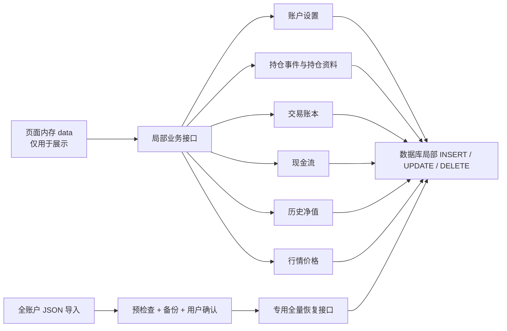

# `saveData` 全量保存优化整改方案

> 文档日期：2026-08-03  
> 适用范围：持仓管理、交易管理、现金流、历史净值、行情刷新、账户设置及全账户数据导入  
> 文档性质：基于当前代码的架构优化方案，不包含业务代码修改

## 一、现状与结论

当前前端 `saveData()` 会把整个账户数据打包，通过以下接口一次性提交：

```text
PUT /api/data/:account
```

提交内容包括：

- 持仓 `positions`
- 交易 `trades`
- 历史净值 `navHistory`
- 现金流 `cashFlows`
- 账户设置、汇率、税费等附属信息

服务端收到数据后，会根据版本号判断允许写入的数据集，然后对允许写入的业务表执行：

```text
DELETE 账户全部旧数据
→ INSERT 页面提交的全部新数据
```

当前代码已经增加事务、账户版本号和数据集版本号，可以降低部分并发覆盖风险，但没有解决全量保存本身的结构问题。

整改结论：

> `saveData` 应降级为仅供明确的全账户导入或恢复功能使用。日常操作必须改为局部业务接口，用户修改什么，服务器就只保存什么。

## 二、现有问题

### 2.1 修改范围和保存范围不一致

用户可能只修改一个税费设置、刷新一次行情或新增一条现金流，但前端会发送整个账户，服务端可能重写四张业务表。

这会扩大一次普通操作的影响范围。

### 2.2 存在旧页面覆盖新数据的风险

虽然当前已有版本号保护，但页面内存仍然保存了一份完整账户快照。如果某个调用入口没有正确同步版本号，或者后续新增功能漏接版本保护，旧页面仍可能提交过期数据。

### 2.3 数据量越大，保存成本越高

一次小修改的写入量与账户全部历史数据量有关：

```text
单次操作成本 = 全部持仓 + 全部交易 + 全部净值 + 全部现金流
```

交易和净值历史持续增长后，全量删除重建会造成明显的数据库写入放大、锁等待和接口延迟。

### 2.4 自动重试会重复执行大范围操作

前端当前最多自动重试三次。对于普通局部写入，重试通常是安全的；但对全量删除重建来说，每次重试都可能再次执行大范围写入。

### 2.5 页面内存和服务器同时承担事实来源

当前页面先修改完整 `data`，再把它当作账户最终状态提交给服务器。服务器难以判断用户本次真正修改了什么，只能被动接受整个快照。

这会造成前端状态与数据库业务事实重复。

## 三、目标架构



核心原则：

1. 用户修改什么，服务器只保存什么。
2. 交易、持仓、现金和净值继续使用服务端统一业务规则。
3. 页面中的 `data` 是展示缓存，不是可直接覆盖数据库的最终事实。
4. 全量替换只能出现在明确的账户恢复流程中。

## 四、接口拆分方案

| 业务操作 | 推荐接口 | 数据库行为 |
|---|---|---|
| 修改账户设置、税费、汇率 | `PATCH /accounts/:name/settings` | 只更新 `accounts` |
| 新增、修改交易 | 继续使用现有账本交易接口 | 写入单笔交易并重算相关持仓和现金 |
| 删除交易 | 继续使用现有账本删除接口 | 删除单笔交易并重算受影响数据 |
| 新增持仓、调整数量、清仓 | 继续使用 `position-events` | 写入 `open/adjust` 事件 |
| 修改持仓名称、分类、备注 | `PATCH /positions/:id/meta` | 只更新指定持仓资料 |
| 批量刷新当前行情 | `PATCH /positions/prices` | 只批量更新 `positions.price` |
| 新增现金流 | `POST /ledger/cash-flows` | 插入一条现金流并返回最新现金 |
| 删除现金流 | 继续使用现有现金流删除接口 | 删除一条并重算受影响净值 |
| 新增或覆盖某日净值 | `PUT /nav/:date` | 单日 UPSERT |
| 删除某日净值 | `DELETE /nav/:date` | 删除指定日期记录 |
| 批量导入历史净值 | `POST /nav/import` | 校验后批量 UPSERT |
| 保存每日行情 | 继续使用现有 `daily-prices` 接口 | 按日期和证券增量 UPSERT |
| 全账户 JSON 恢复 | `POST /accounts/:name/restore` | 备份、预览、确认后全量替换 |

不建议把现有接口简单改成一个新的万能 `PATCH` JSON 接口。万能接口仍然无法清晰表达具体业务操作，只是把旧问题换了一个名字。

## 五、现有调用入口整改

### 5.1 行情与快速持仓入口

涉及文件：`public/shared/core-quote.js`

当前场景包括：

- 行情刷新后调用 `saveData()`；
- 快速添加持仓直接修改 `data.positions`；
- 粘贴导入持仓直接批量修改 `data.positions`；
- 保存“每日价格已处理”之类页面状态时调用 `saveData()`。

整改方案：

- 行情刷新只调用批量价格更新接口；
- 快速添加持仓必须生成 `open` 事件；
- 已有持仓数量调整必须生成 `adjust` 事件；
- 粘贴导入改为批量持仓事件接口；
- 纯页面状态不进入业务数据库，必要时保存在浏览器本地缓存。

### 5.2 现金流与自动净值

涉及文件：`public/shared/core-returns.js`

整改方案：

- 新增现金流改为 `POST /ledger/cash-flows`；
- 现金由服务器按账户账本重新计算；
- 记录当天净值改为 `PUT /nav/:date`；
- 服务器返回最新现金流、现金、净值和版本号，前端只合并相关字段。

### 5.3 手工净值管理

涉及文件：`public/shared/core-account.js`

整改方案：

- 新增或编辑净值改为单日 UPSERT；
- 删除净值改为按日期删除；
- 不再因为修改一条净值而重写持仓、交易和现金流。

### 5.4 持仓资料与账户设置

涉及文件：`public/shared/core-trade.js`

整改方案：

- 数量变化继续使用 `open/adjust`；
- 名称、类型、细类、备注使用持仓资料 PATCH 接口；
- 现金显示类型等账户偏好使用设置接口；
- 税费设置使用账户设置接口；
- 不再通过全量保存写入上述内容。

### 5.5 历史净值批量导入

涉及文件：`public/shared/core-earnings.js`

整改方案：

1. 保留导入前净值备份；
2. 前端解析后提交批量净值记录；
3. 服务端校验日期、重复项和覆盖策略；
4. 服务端在一个事务中批量 UPSERT；
5. 只提升 `nav_version`；
6. 返回最新净值数据。

### 5.6 全账户 JSON 导入

现有全账户 JSON 导入不能继续直接执行 `data = imported; saveData()`。

建议改为独立恢复流程：

1. 上传文件；
2. 服务端解析并校验；
3. 展示将新增、修改、删除的数据数量；
4. 自动备份当前账户；
5. 用户二次确认；
6. 服务端在单事务中执行恢复；
7. 记录操作日志和恢复批次号；
8. 前端重新加载账户数据。

## 六、前端状态更新方式

局部接口成功后，服务器返回本次操作影响的数据和最新版本号，前端只更新对应部分。

示例：新增现金流。

```text
前端提交一条现金流
→ 服务端插入现金流并重算现金
→ 返回最新现金流、现金和版本号
→ 前端只更新 data.cashFlows、data.cash 和版本号
```

禁止继续使用：

```text
新增一条现金流
→ 发送整个账户
→ 删除并重建四张业务表
```

并发冲突时，只重新加载受影响的数据集。例如现金流冲突只重新加载现金流和现金，不必刷新整个账户。

## 七、分阶段实施方案

### 阶段一：立即缩小全量保存影响范围

给现有保存接口增加必填参数：

```json
{
  "changedDatasets": ["navHistory"]
}
```

服务端规则：

- 只允许写入明确声明的数据集；
- 没有声明时直接拒绝；
- 禁止继续使用“未提供版本或修改范围就默认允许全部写入”的兼容逻辑；
- 记录每次全量保存实际写入的数据集。

该阶段是临时止损方案。它能快速缩小影响范围，但被修改的数据集内部仍然是删除重建。

### 阶段二：替换局部业务接口

建议按以下顺序执行：

1. 账户设置和税费设置；
2. 现金流新增；
3. 单日净值增删改；
4. 持仓资料修改；
5. 行情价格批量更新；
6. 快速持仓添加和粘贴导入；
7. 历史净值批量导入。

交易和持仓事件接口已经存在，应直接复用，不重新设计第二套业务规则。

### 阶段三：下线日常 `saveData`

完成局部接口替换后：

- 删除普通页面中的 `saveData()` 调用；
- 删除 `_saveInFlight`、`_savePending` 全量保存队列；
- 普通页面禁止调用 `PUT /api/data/:account`；
- 旧接口返回 `410 Gone`，提示客户端升级；
- 全量替换仅保留在明确的账户恢复接口中。

## 八、服务端实现要求

### 8.1 局部写入

日常接口只能使用：

- 单条或批量 `INSERT`；
- 指定 ID 或日期的 `UPDATE`；
- 指定 ID 或日期的 `DELETE`；
- 明确唯一键的 UPSERT。

禁止日常接口使用：

```text
DELETE WHERE account = 当前账户
→ 重建该账户整张数据集
```

### 8.2 并发保护

- 交易和持仓事件继续使用账户级数据库锁；
- 其他资源使用各自的数据集版本号或 `If-Match`；
- 版本冲突返回 `409`；
- 客户端不能对 `409` 自动覆盖重试。

### 8.3 幂等保护

新增类接口应支持 `request_id` 或 `idempotency_key`。

同一个请求重复提交时：

- 不产生重复交易；
- 不产生重复现金流；
- 不重复生成持仓事件；
- 返回第一次请求的处理结果。

### 8.4 返回服务器事实

所有修改接口应返回：

- 修改后的记录；
- 相关派生数据；
- 最新账户版本；
- 最新数据集版本；
- 必要时返回受影响日期。

前端以服务器返回值更新页面，不在本地重复实现一套账本计算。

## 九、测试要求

必须补充以下自动化测试：

1. 修改税费设置后，四张业务表内容和行数不变；
2. 刷新行情后，不写交易、现金流和历史净值；
3. 新增现金流时，只新增一条现金流；
4. 修改某日净值时，只更新该日期；
5. 删除某日净值时，不影响其他日期；
6. 快速添加持仓生成 `open` 事件；
7. 粘贴导入已有持仓生成 `adjust` 事件；
8. 交易与净值同时操作时互不覆盖；
9. 同一个新增请求重复提交时不产生重复数据；
10. 全账户恢复失败时全部回滚；
11. 旧页面调用全量保存接口时被明确拒绝；
12. 日常业务接口中不存在整账户 `DELETE + INSERT`。

## 十、验收标准

- [ ] 修改账户设置，只更新 `accounts`。
- [ ] 刷新行情，只更新相关持仓价格和每日价格。
- [ ] 新增现金流，只插入一条现金流并重算现金。
- [ ] 新增或编辑净值，只写指定日期。
- [ ] 交易、持仓、现金流和净值并发操作互不覆盖。
- [ ] 重复提交同一请求不产生重复数据。
- [ ] 快速添加和粘贴导入持仓全部生成 `open/adjust` 事件。
- [ ] 普通页面代码中不存在 `saveData()` 调用。
- [ ] `PUT /api/data/:account` 不再承担日常保存。
- [ ] `DELETE 全账户数据 + INSERT 全账户数据` 只存在于明确的账户恢复流程。
- [ ] 全账户恢复执行前有校验、预览、备份和用户确认。
- [ ] 完整自动化测试和账户一致性审计全部通过。

## 十一、最终建议

不要一次性重构整个持仓页面。

推荐路线：

```text
先通过 changedDatasets 缩小影响范围
→ 再逐个替换局部接口
→ 最后关闭日常 saveData
→ 全量覆盖仅保留给明确的账户恢复功能
```

这样可以在控制修改范围的前提下，逐步消除全量覆盖、误删数据、写入放大和并发冲突风险。
