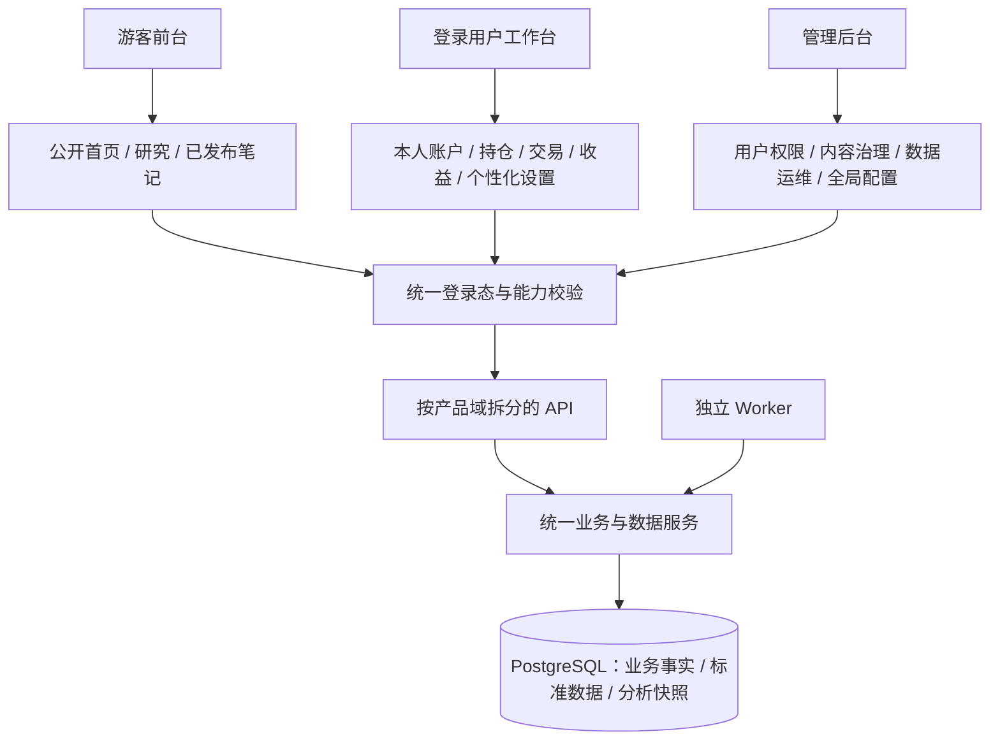

# 存在小站产品功能架构分析与研发整改执行报告

> 核对日期：2026-08-04  
> 核对方式：静态检查当前代码、页面、接口、权限中间件、数据链路和现有架构文档。按要求未启动服务、未打开浏览器、未做视觉测试。本报告判断的是产品功能架构，不评价具体页面像素效果。
> 文档状态：研发执行版；在原产品分析结论上补充任务拆分、文件落点、测试、验收和回滚要求。
> **历史报告**：本文记录 2026-08-04 的研发状态；当前部署和运行口径以 `docs/生产部署流程.md`、`docs/技术架构.md` 和 `AGENTS.md` 为准。

## 一、结论

项目的功能基础已经比较完整，持仓、收益、交易、股债研究、打新、市场周期、投资笔记和管理后台都有真实实现；后端也已经形成路由、服务、任务、数据库分层。

当前主要问题不是“缺功能”，而是功能持续增加后，仍沿用早期单页结构和两级权限模型，形成了三个明显矛盾：

1. **产品定位不够聚焦**：系统底层以“多账户持仓管理”为核心，首页和一级导航却更像“投资内容与研究门户”。
2. **权限规则分散且不一致**：页面入口、前端判断和后端接口分别维护权限，已经出现游客进入方式不同、禁用账号旧会话仍可使用等问题。
3. **前台、后台、运行后台边界混杂**：部分管理员操作放在前台，管理后台又没有前台入口；Web 请求和定时任务默认共用一个进程；账户写入仍处于“局部账本接口 + 全量快照保存”并存阶段。

综合判断：**可以继续使用，不建议推倒重写；但应先修权限闭环，再重排导航，最后收敛前后端数据链路。**

## 二、当前产品结构盘点

### 2.1 前台功能

- 一级导航共 7 项：投资笔记、股债分析、股市周期、打新日历、持仓管理、可转债、版本记录。
- 首页同时展示最新文章、股票/可转债周期、持仓、打新和可转债风险。
- 持仓管理内部结构较清晰：总览、持仓、收益、交易，并带多账户切换和仓位对比。
- 股债分析支持股票三表、个股分析和可转债个券分析。
- 可转债另有安全性、周期、估值三个子模块。
- 个人中心通过头像进入；仓位对比通过持仓页进入；两者不占一级导航。

### 2.2 管理后台

后台现有 8 个入口：概览、用户、券商、定时任务、全局参数、休市日历、操作审计、投资笔记管理；AI 模型配置放在全局参数内部。

后台接口整体通过统一管理员中间件保护，这是当前权限设计中做得较好的部分。但前台没有管理员专属入口，管理员只能自行知道并访问 `/admin.html`。

### 2.3 当前角色

系统实际不是单纯两级角色，而是以下四种状态：

| 身份 | 当前能力 |
|---|---|
| 游客 | 首页、已发布文章、市场周期及部分研究数据读取 |
| 普通用户 | 游客能力 + 本人账户、持仓、交易、收益、自选、评论和个人设置 |
| 获得写作权限的用户 | 普通用户 + 创建和维护本人投资笔记 |
| 管理员 | 全部前台能力 + 用户、内容、券商、任务、模型、全局参数及部分数据刷新 |

其中“写作权限”使用独立字段实现，说明现有 `admin/user` 两级角色已经不能完整表达真实业务权限。

## 三、UI 功能排布问题

### 3.1 一级导航按“功能来源”堆叠，没有按用户任务分组（P1）

当前一级导航有 7 项，且同时混合：内容、研究工具、个人资产、专业专题和系统信息。主要问题：

- “持仓管理”是系统最强的私有核心能力，却排在第五位。
- “版本记录”与核心业务并列，占用了一级入口。
- 首页没有独立导航，只能点击站点名称返回。
- 游客、普通用户和管理员看到的一级入口基本相同，没有体现身份差异。

建议一级导航收敛为：

| 一级入口 | 二级内容 |
|---|---|
| 首页 | 用户身份对应的工作台摘要 |
| 我的资产 | 总览、持仓、交易、收益、账户、仓位对比；未登录时显示登录引导 |
| 研究工具 | 股票分析、可转债、市场周期、打新日历 |
| 投资笔记 | 文章浏览、我的文章、写作 |
| 头像菜单 | 个人中心；管理员额外显示“管理后台”；版本记录移入此处或页脚 |

### 3.2 可转债功能被拆到两个一级入口（P1）

“股债分析”里有可转债个券分析，“可转债”里又有安全性、周期和估值。用户需要先理解系统内部实现，才能判断应该去哪个入口。

建议将可转债能力合并到“研究工具 → 可转债”，内部按“个券分析 / 安全性 / 周期 / 估值”分组；“股债分析”改名为“股票分析”或直接作为研究工具的股票子页。

### 3.3 首页定位与核心产品能力冲突（P1）

首页首屏重点是最新文章和市场周期，个人持仓只是“常用工具”中的一张卡。若产品核心是个人资产管理，这会弱化登录用户最关心的总资产、当日变化、风险和待处理事项。

建议首页按身份变化：

- 游客：首页以公开文章和研究工具为主。
- 登录用户：首页首先展示本人资产摘要、近期交易/净值异常、待处理数据，再展示研究与内容。

### 3.4 存在无效操作入口（P1）

交易历史仍显示“清空记录”按钮，但点击后只提示“不支持清空全部交易”，服务端也明确禁止该操作。这个按钮不具备产品价值，会让用户误以为系统故障。

建议直接删除该按钮；如确有重建需求，提供明确的“账户数据重建”受控流程，不复用“清空记录”概念。

### 3.5 管理员缺少前台入口，管理员功能又散落在前台（P1）

- 前台头像菜单没有“管理后台”。
- 可转债安全性刷新、首页周期配置、仓位公开等管理员操作放在业务前台。
- 数据运维与正常使用混在同一页面，普通用户很难理解管理员和业务用户的边界。

建议：业务前台只保留“正常使用”操作；共享数据刷新、首页配置、公开标杆发布等统一迁到管理后台。前台头像菜单仅为管理员显示后台入口。

### 3.6 页面导航状态管理较弱（P2）

主站使用一个约 1600 行的 HTML 壳、多个全局脚本和手工 `switchMain()` 切页；页面切换使用 `replaceState`，并全局拦截 F5/Ctrl+R 改为行情刷新。随着功能继续增加，容易出现入口状态、浏览器前进后退和页面权限不同步。

不需要立即改成 React/Vue。建议先把“路由状态、导航清单、功能可见性”抽成一个统一配置，再逐步拆分页面控制器。

## 四、权限设计问题

### 4.1 禁用账号不能立即失效（P0）

登录时会检查用户状态，但普通接口的 `requireLogin` 只检查 Session 中是否存在用户名，不会再次检查用户是否已被禁用。管理员禁用用户后，该用户已经登录的浏览器仍可能继续使用私有功能，最长受 7 天 Session 有效期影响。

整改要求：

- 所有受保护接口统一检查“用户存在、状态正常、Session 版本有效”。
- 禁用用户、删除用户、管理员重置密码、用户修改密码和找回密码成功后，使旧 Session 立即失效。
- 管理员接口同样需要检查管理员账号状态，不能只检查角色。

### 4.2 注册页与后台开关不一致（P0）

后台提供“是否必须邮箱验证”的开关，后端默认允许关闭；但注册页面始终要求填写邮箱和验证码，且 `/api/config` 没有把该开关返回给前端。结果是：后台关闭邮箱验证并不会改变注册页；未配置邮件服务时，前端注册流程可能直接不可用。

整改要求：后端统一返回注册开放、邀请码要求、邮箱验证要求和邮件服务可用状态；前端严格按该配置显示和校验字段。

### 4.3 游客权限入口不一致（P1）

初始化代码只把“首页、投资笔记、市场周期”列为公开页面；但游客从顶部导航点击时，又可以进入股票/转债分析、打新、可转债和版本记录，而且这些模块的大部分读取接口本身也是公开的。

这会形成三套不同答案：

- 直接打开链接：可能要求登录。
- 从首页点击：可以进入。
- 直接请求读取接口：可以获取数据。

建议先作产品决策，再统一三层规则。结合当前首页和接口实现，更合理的方案是：公开研究数据允许游客只读；持仓、自选、评论、刷新、个性化设置和所有写操作要求登录。

### 4.4 管理员判定存在两套规则（P1）

统一管理员中间件支持数据库 `role=admin` 和环境变量白名单；但账户迁移接口又单独实现了一套仅识别环境变量的管理员判断。结果是后台显示为管理员的用户，仍可能无法执行某些运维接口。

建议删除局部管理员判断，全部复用统一权限服务。

### 4.5 “管理员”权限过宽，业务权限表达不足（P1）

同一个管理员角色同时拥有用户删除、密码重置、券商配置、AI Key 配置、内容审核、任务触发、市场首页配置等权限。对单人使用尚可，但只要增加协作者，就不符合最小权限原则。

建议保持简单，不建设复杂 RBAC。保留 `user/admin` 基础角色，同时增加能力标记：

| 能力 | 用途 |
|---|---|
| `knowledge_write` | 写本人文章 |
| `content_manage` | 管理全站文章、评论、分类 |
| `ops_manage` | 任务、数据刷新、券商、休市日、模型配置 |
| `user_manage` | 用户状态、角色、密码和删除 |
| `benchmark_publish` | 发布公开/半公开标杆账户 |

超级管理员拥有全部能力；其他协作者只授予所需能力。

### 4.6 仓位公开权限与管理员角色耦合（P1）

目前只有管理员能设置自己账户的公开状态。普通用户不能自愿公开，管理员也不能替其他用户设置。这更像“官方标杆发布”而不是普通用户隐私设置。

建议明确选择一种产品模式：

- 若只允许官方标杆：改名为“发布为官方标杆”，使用 `benchmark_publish` 权限。
- 若允许用户社区分享：账户所有者自行设置，并增加风险确认、撤回和审计。

### 4.7 共享数据操作审计不完整（P1）

用户、内容和部分后台设置已有操作审计，但可转债刷新、估值刷新、利率文件导入等会改变全站共享数据的操作，没有统一记录操作者、参数、结果和失败原因。

建议所有共享数据写入和人工任务统一进入审计日志，并在后台按操作者、模块、结果筛选。

## 五、前台、后台与整体产品架构问题

### 5.1 当前合理之处

- 后端已经按路由、服务、定时任务、数据库、中间件分层。
- 私有账户接口普遍带登录与账户归属校验。
- 管理后台接口统一经过管理员鉴权。
- 后台任务有任务锁和执行记录，外部数据失败时保留旧数据。
- 数据库已经开始按原始数据、标准事实、分析结果分层。

### 5.2 前台仍是不断扩大的单页壳（P2）

主站页面、持仓状态、研究工具、知识编辑和个人中心共用大量全局变量和脚本加载顺序。当前还能维护，但新增功能越多，越容易出现功能之间互相影响。

建议按产品域拆成四个前端模块：公共首页、个人资产、研究工具、投资笔记；共用登录态、导航、弹窗和请求封装。先拆文件和状态边界，不要求更换技术框架。

### 5.3 私有业务写入的旧全量链路尚未完成退役（P1）

交易、持仓调整、现金流已经改为服务端账本或局部接口。当前代码复核结果是：`saveData()`、`saveDataNow()`、`saveDataAndWait()` 除相互调用外，已没有日常业务调用方；但函数和通用 `PUT /api/data/:name` 仍然保留，账户快照导入还通过 `?restore=true` 复用该接口。

因此后续不是重新迁移全部业务，而是做受控退役：先用自动测试证明日常页面不再调用全量保存，再把账户快照导入迁到专用接口，最后删除前端死代码和通用整包写入口。服务器账本继续作为唯一事实来源。

### 5.4 标准数据层与旧链路仍并存（P1）

当前股票、可转债、打新和市场指标已经有标准化 Schema，但部分功能仍直接读取旧表或各自快照。相同证券可能由不同模块使用不同数据日期、来源和更新方式。

建议按“证券主档 → 市场事实 → 财务/事件 → 分析快照”建立统一读取服务，并逐模块双读核对后切换；在完成调用方切换前继续保留兼容表，不做大范围删除。

### 5.5 Web 服务与定时任务默认同进程（P2）

生产默认由一个 Web 进程同时处理用户请求和所有后台任务。重任务可能影响页面响应，Web 重启也会连带触发补跑逻辑。

建议生产固定拆成：Web 进程只提供页面/API，Worker 进程只运行采集、计算和调度；继续复用现有服务层和 PostgreSQL 任务锁，不拆微服务。

## 六、建议目标架构

关键原则：

1. 页面是否显示只是体验控制，最终权限必须由后端统一决定。
2. 公共数据、本人私有数据、全站管理数据三类边界必须明确。
3. 前台不承载全站运维操作，后台不直接复制前台业务流程。
4. 日常金融业务写入以服务端事务为唯一事实来源。
5. 不做微服务、不强制换前端框架，先解决权限和边界问题。

## 七、整改优先级与验收标准

| 优先级 | 整改项 | 工作量级 | 验收标准 |
|---|---|---:|---|
| P0 | 禁用、删号、改密、重置密码后的 Session 失效 | 中 | 已登录用户被禁用后，下一次受保护请求立即被拒绝；其他旧设备 Session 全部失效 |
| P0 | 注册配置与前端表单统一 | 小 | 邮箱验证开关开/关、SMTP 可用/不可用四种组合均给出正确页面和结果 |
| P1 | 建立公开页面/API 白名单 | 小 | 同一功能通过顶部点击、直接链接和直接接口访问时，权限结果一致 |
| P1 | 重排一级导航并合并可转债入口 | 中 | 一级入口不超过 5 个；可转债能力只有一个明确入口；版本记录退出一级导航 |
| P1 | 删除无效控件，增加管理员入口 | 小 | 页面不存在点击后只提示“不支持”的按钮；管理员可从头像菜单进入后台 |
| P1 | 统一管理员与能力校验 | 中 | 代码中不再存在第二套管理员判断；关键权限有接口自动测试 |
| P1 | 统一共享数据操作审计 | 中 | 人工刷新、文件导入、公开标杆和全局配置均记录操作者、结果和参数摘要 |
| P1 | 退役旧全量保存链路 | 中 | 自动测试证明日常功能不调用全量保存；快照导入改走专用接口；前端删除死代码 |
| P1 | 收敛标准数据读取链路 | 大 | 同一证券在各模块的数据日期、来源、单位可追溯且一致 |
| P2 | 拆分前端产品域与统一导航状态 | 中 | 公共首页、资产、研究、笔记互不依赖全局加载顺序；浏览器前进后退正常 |
| P2 | Web 与 Worker 固定分离 | 中 | Web 重启不重复调度任务；重任务运行时页面请求不受明显影响 |

## 八、推荐执行顺序

1. **第一阶段：权限止损**——处理 Session 失效、注册配置、公开访问白名单和管理员判断统一。
2. **第二阶段：产品入口整改**——重排导航、合并可转债、增加管理员入口、移除无效操作。
3. **第三阶段：后台治理**——拆分能力权限、补齐操作审计、把共享数据运维迁入后台。
4. **第四阶段：数据与运行收敛**——下线日常全量保存、统一标准数据服务、固定 Web/Worker 分工。

在以上整改中，前两阶段应优先完成；它们修改范围相对可控，却能直接消除当前最明显的权限和产品体验问题。

## 九、研发实施总则

1. 每个任务单独提交，禁止把 P0 权限修复、导航调整、数据层改造混在同一次提交中。
2. 数据库只能追加下一条版本化迁移。当前最后一条为 `048_tighten_account_ledger`；若执行期间已有新迁移，以实施时的下一可用编号为准，不能覆盖旧迁移。
3. P0/P1 任务先写失败测试，再修改实现；相关测试通过后必须执行全量 `npm.cmd run test:all`，Windows 外层超时至少 240 秒。
4. 代码交付须同步维护 `docs/技术架构.md` 对应章节；形成版本时按项目规则更新版本号和变更记录。
5. 本报告不授权生产部署、数据库历史数据同步或删除旧表。涉及生产数据回填、同步 SQL 和旧结构删除，必须另行取得用户明确同意。
6. 不引入 React/Vue、不拆微服务、不新建第二套权限框架；优先复用现有 Express 中间件、PostgreSQL 迁移、原生前端和审计表。
7. 导航整改只重排现有功能，不在本轮增加提醒中心、消息系统、付费体系等未提出的新功能。

## 十、研发任务依赖与发布批次

| 批次 | 任务 | 依赖 | 是否允许与其他批次合并 |
|---|---|---|---|
| R1 权限止损 | AUTH-01、AUTH-02、AUTH-03 | 无 | 不允许 |
| R2 入口统一 | ACCESS-01、UI-01、UI-02 | R1 | UI-01 可与 ACCESS-01 同批，UI-02 单独提交 |
| R3 权限治理 | PERM-01、PERM-02、AUDIT-01、OPS-01、BENCH-01 | R1；建议 R2 完成 | 按任务逐项提交 |
| R4 数据收敛 | DATA-01、DATA-02 | R1 | DATA-02 必须按数据集拆分提交 |
| R5 运行与前端结构 | WORKER-01、FRONT-01、HOME-01 | R1-R3 | 不与业务功能提交混合 |

任何批次失败时，只回滚本批次代码；不得通过回退数据库迁移文件或删除生产数据回滚。

## 十一、可直接执行的研发任务

### AUTH-01：禁用、删号和改密后立即吊销旧 Session

**优先级：P0　工作量：中　依赖：无**

**目标**

所有私有接口在每次请求时验证用户仍存在、状态为 `active`、Session 版本与数据库一致。账号禁用、删除、角色变更、管理员重置密码、本人修改密码、找回密码成功后，旧设备 Session 全部失效。

**涉及文件**

- `server/db/migrations.js`
- `server/db/users.js`、`server/db/index.js`
- `server/middleware/auth.js`
- `server/routes/auth.js`、`server/routes/admin.js`、`server/routes/profile.js`
- `public/index.html` 或后续抽出的登录态脚本
- `server/test/auth-security.test.js`、`server/test/password-reset.test.js`
- 新增 `server/test/auth-session-revocation.test.js`

**实现要求**

1. 追加迁移，为 `users` 增加 `auth_version INTEGER NOT NULL DEFAULT 1`，加正数约束。
2. `getUserAuth()` 和新的 `getUserSessionState()` 返回 `status`、`role`、`auth_version`。
3. 登录成功后写入 `req.session.user` 和 `req.session.authVersion`；注册后同样写入当前版本。
4. `requireLogin` 改为异步校验并把结果缓存到 `req.authUser`；同一请求中的 `requireAdmin` 复用该对象，避免重复查询。
5. 用户不存在、状态不是 `active` 或版本不一致时销毁 Session，并返回统一的 401；管理员状态异常也不能进入后台。
6. `setUserStatus`、`setUserRole`、`adminSetPassword`、`changePassword` 在同一 SQL 中递增 `auth_version`。
7. 本人修改密码成功后销毁当前 Session，前端提示重新登录；找回密码和管理员重置密码无需保留任何旧 Session。
8. 旧密码哈希登录后的透明升级不能调用“递增版本”的普通改密函数，应增加仅更新哈希、不吊销当前新 Session 的内部函数，避免用户刚登录就被判定过期。

**禁止事项**

- 不遍历或解析 Redis 内所有 Session。
- 不用进程内 Map 记录用户禁用状态。
- 不把用户状态长期写死在 Session 中而不查数据库。

**测试用例**

1. 正常用户、版本一致：请求通过。
2. 用户已禁用：已有 Session 下一次请求返回 401。
3. 用户已删除：已有 Session 返回 401。
4. 密码重置后：旧版本 Session 返回 401，新登录可用。
5. 管理员被禁用或降级：管理接口立即拒绝。
6. 旧密码哈希透明升级后：本次新 Session 保持有效。
7. 同一请求同时经过 `requireLogin` 与 `requireAdmin` 时只读取一次用户状态。

**验收标准**

- 上述测试全部通过。
- 受保护路由不需要逐个增加状态判断，统一由中间件生效。
- `/api/me` 遇到失效 Session 时不再返回旧用户身份。

**回滚**

保留 `auth_version` 字段；代码可临时退回只检查状态，但不得删除迁移或降低字段值。

### AUTH-02：注册配置和注册页完全一致

**优先级：P0　工作量：小　依赖：无**

**涉及文件**

- `server/routes/auth.js`
- `public/login.html`
- `server/test/auth-security.test.js` 或新增 `server/test/registration-config.test.js`

**实现要求**

1. `/api/config` 返回：`registerOpen`、`needRegisterCode`、`requireEmail`、`emailServiceAvailable`。
2. 注册关闭时隐藏“注册新账号”入口；已经处于注册模式时显示明确提示并禁止提交。
3. `requireEmail=false` 时隐藏邮箱和验证码字段，提交时不校验、不调用发送验证码接口。
4. `requireEmail=true` 且邮件服务不可用时，显示“邮箱验证服务暂不可用”，禁止发送和提交。
5. 邀请码字段只在 `needRegisterCode=true` 时出现。
6. 后端继续作为最终校验，不信任前端隐藏状态。

**测试矩阵**

| 注册 | 邮箱验证 | SMTP | 预期 |
|---|---|---|---|
| 关闭 | 任意 | 任意 | 不显示注册入口，接口拒绝注册 |
| 开放 | 关闭 | 不可用 | 不显示邮箱字段，可正常注册 |
| 开放 | 开启 | 不可用 | 页面明确阻断，不发送请求 |
| 开放 | 开启 | 可用 | 邮箱、验证码和注册流程正常 |

**验收标准**

后台开关改变后刷新登录页即可生效；页面字段、前端校验和后端校验三者一致。

### AUTH-03：删除第二套管理员判断

**优先级：P1　工作量：小　依赖：AUTH-01**

**涉及文件**

- `server/routes/accounts.js`
- `server/middleware/auth.js`
- `server/test/auth-security.test.js`、`server/test/admin-models.test.js`

**实现要求**

删除 `server/routes/accounts.js` 内局部 `isAdmin/requireAdmin`，统一导入 `server/middleware/auth.js` 的实现。数据库 `role=admin` 和 `ADMIN_USERS` 兼容白名单必须得到相同结果，且都受账号状态与 Session 版本限制。

**验收标准**

- 全仓库只有权限模块保留 `ADMIN_USERS` 解析逻辑。
- 数据库管理员可调用 `/api/migrate-json`；普通用户和失效管理员不可调用。

### ACCESS-01：统一游客、会员和管理员访问矩阵

**优先级：P1　工作量：小　依赖：AUTH-01**

**本轮确定的产品口径**

- 游客可只读：首页、已发布投资笔记、个券分析已有快照、可转债安全性/周期/估值、市场周期、打新日历、版本记录。
- 登录用户新增：本人资产、自选、评论、个性化边界、按现有限额刷新单只股票/转债，以及全部本人写操作；全站共享数据刷新仍属于运维权限。
- 作者和管理员权限在以上基础上叠加，不改变公共读取范围。

**涉及文件**

- 新增 `public/js/access-policy.js`
- `public/index.html`
- `server/routes/stockAnalysis.js`、`bondAnalysis.js`、`bondSafety.js`、`bondCycle.js`、`bondValuation.js`、`ipo.js`、`knowledge.js`、`marketVolatility.js`（只核对，不扩大写权限）
- `docs/技术架构.md` API 权限表
- 新增 `server/test/access-matrix.test.js`、`server/test/frontend-navigation.test.js`

**实现要求**

1. 前端只维护一份页面级访问配置，`switchMain()`、首次 URL 解析和导航显示共同使用。
2. 删除当前独立的 `publicMain` 判断和 `switchMain()` 内局部例外。
3. 游客直接打开 URL、从导航点击、刷新页面时结果必须相同。
4. 公开分析页只读取已有数据库快照；刷新、加入自选、评论、保存边界等操作继续要求登录。
5. 后端逐个确认 GET/写接口权限；不得因为页面公开而放开任何私有账户或写接口。

**接口测试至少覆盖**

- 游客读取公开研究数据为 200 或合法空态。
- 游客调用刷新、自选、评论、个人设置、账户接口为 401。
- 普通用户只能读取本人账户。
- 管理员身份不绕过账户归属校验。

### UI-01：清理无效入口并补齐管理员入口

**优先级：P1　工作量：小　依赖：AUTH-01**

**涉及文件**

- `public/index.html`
- `public/shared/style.css`
- `public/shared/core-trade.js`
- `server/test/frontend-navigation.test.js`

**实现要求**

1. 删除交易历史中的“清空记录”按钮，并删除已经没有调用方的前端 `clearTrades()`。
2. 登录头像改为菜单，固定包含“个人中心、版本记录、退出登录”。
3. 只有 `role=admin` 或后续拥有后台能力的用户显示“管理后台”。
4. 菜单跳转必须使用站内相对地址；退出继续调用现有 `/api/logout`。
5. 不修改交易删除、账户重建和服务端 `clearTrades` 的业务规则。

**验收标准**

- 页面不存在点击后只提示“不支持”的操作按钮。
- 普通用户看不到后台入口；管理员可从头像菜单进入后台。
- 版本记录从一级业务导航移除后仍可访问。

### UI-02：一级导航按用户任务重排

**优先级：P1　工作量：中　依赖：ACCESS-01、UI-01**

**涉及文件**

- `public/index.html`
- `public/shared/style.css`
- 建议新增 `public/js/navigation.js`
- `public/js/home-dashboard.js`
- `server/test/frontend-navigation.test.js`

**实现要求**

1. 一级入口调整为：首页、我的资产、研究工具、投资笔记。
2. “研究工具”使用二级菜单映射现有页面：个券分析、可转债专题、市场周期、打新日历。第一步只重排入口，不移动业务 DOM。
3. “我的资产”映射现有持仓管理；游客点击后进入登录页并携带回跳地址。
4. 首页成为明确一级入口，不再只依靠点击站点名称。
5. 保留现有 `?main=` 深链接兼容；新导航不能让旧收藏链接失效。
6. 导航状态写入历史记录，支持浏览器前进/后退；删除全局劫持 Ctrl+R，F5 恢复浏览器标准刷新。行情刷新继续使用页面内“刷新”按钮。

**验收标准**

- 一级入口不超过 4 个业务项。
- 游客和登录用户能清楚区分公开研究与本人资产。
- 旧 URL 可打开；前进、后退、刷新后仍停留在同一功能。

### UI-03：可转债产品入口最终收敛

**优先级：P1　工作量：中　依赖：UI-02**

**涉及文件**

- `public/index.html`
- `public/js/stock-analysis.js`、`public/js/bond-analysis.js`
- `public/js/bond-safety.js`、`bond-cycle.js`、`bond-valuation.js`
- 对应 CSS 和前端测试

**实现要求**

1. 个券分析页只保留股票搜索与股票分析。
2. 可转债专题新增“个券分析”子页，与安全性、周期、估值并列。
3. 可转债搜索、详情和刷新逻辑迁入该子页，后端 API 保持不变。
4. 新深链接使用 `?main=bond-safety&sub=analysis&code=...`；旧的转债分析链接自动映射到新地址。
5. 不修改可转债计算公式、数据源和刷新权限。

**验收标准**

用户查找可转债时只需要进入“研究工具 → 可转债”，四类能力均可在同一上下文切换。

### HOME-01：首页按登录态调整现有内容顺序

**优先级：P2　工作量：小　依赖：UI-02**

**涉及文件**

- `public/index.html`
- `public/js/home-dashboard.js`
- `public/shared/style.css`

**实现要求**

- 游客保持“公开文章和研究”优先。
- 登录用户把现有持仓总资产卡和资产入口置于前部，再展示市场周期、打新和文章。
- 只重排已有数据与卡片，不增加新接口、新提醒或新统计口径。

### PERM-01：建立轻量能力权限基础

**优先级：P1　工作量：中　依赖：AUTH-01、AUTH-03**

**涉及文件**

- `server/db/migrations.js`、`server/db/users.js`、`server/db/index.js`
- `server/middleware/auth.js`
- `server/routes/auth.js`、`server/routes/admin.js`、`server/routes/knowledge.js`
- `public/js/admin.js`、`public/index.html`
- 新增 `server/test/capability-auth.test.js`

**实现要求**

1. 在 `users` 增加 `permissions JSONB NOT NULL DEFAULT '{}'::jsonb`；迁移把现有 `knowledge_enabled=true` 映射为 `knowledge_write=true`。
2. 保留 `role=user/admin`。`role=admin` 和 `ADMIN_USERS` 视为超级管理员，拥有全部能力；普通用户可被授予单项能力。
3. 实现 `hasCapability()`、`requireCapability()`、`requireStaff()`，统一放在权限中间件。
4. `/api/me` 返回经过白名单过滤的能力布尔值，不能返回数据库任意 JSON。
5. `knowledge_enabled` 暂时保留兼容一个版本；所有读取切换完成后再另行决定是否删除，不在本任务删除字段。

**能力白名单**

- `knowledge_write`
- `content_manage`
- `ops_manage`
- `user_manage`
- `benchmark_publish`

**测试矩阵**

- 普通用户无能力：不能访问后台。
- 普通用户只有 `content_manage`：只可进入内容管理接口。
- 普通用户只有 `ops_manage`：只可执行运维接口。
- 超级管理员：全部通过。
- 禁用或 Session 版本失效：无论能力如何都拒绝。

### PERM-02：把能力权限应用到后台模块

**优先级：P1　工作量：中　依赖：PERM-01**

**涉及文件**

- `server/routes/admin.js`
- `server/routes/bondSafety.js`、`bondValuation.js`、`marketVolatility.js`、`positionComparison.js`
- `public/js/admin.js`、`public/admin.html`
- `server/test/admin-models.test.js`，并新增覆盖用户管理、内容管理、运维和标杆发布的权限测试

**权限映射**

| 后台功能 | 所需能力 |
|---|---|
| 用户状态、角色、重置密码、删除用户 | `user_manage` |
| 文章、评论、分类、写作授权 | `content_manage` |
| 券商、任务、休市日、模型、全局参数、共享数据刷新/导入 | `ops_manage` |
| 官方仓位标杆发布 | `benchmark_publish` |

`router.use(requireAdmin)` 改为登录态/员工入口校验，具体接口再检查对应能力。后台菜单按能力隐藏，但后端仍必须独立校验。

### AUDIT-01：统一人工共享数据操作审计

**优先级：P1　工作量：中　依赖：AUTH-01；建议在 PERM-02 后执行**

**涉及文件**

- `server/db/migrations.js`、`server/db/config.js`
- `server/routes/admin.js`、`bondSafety.js`、`bondValuation.js`、`marketVolatility.js`、`positionComparison.js`
- `public/js/admin.js`
- 新增 `server/test/admin-audit.test.js`

**实现要求**

1. 审计表追加 `result`、`request_id`、`metadata JSONB` 字段；保留现有 `auditLog(actor, action, target, detail)` 调用兼容。
2. 新增对象式审计入口，记录操作者、动作、目标、成功/失败、请求 ID、必要参数摘要和错误摘要。
3. 覆盖：用户权限修改、人工任务、可转债安全性刷新、估值刷新、利率文件导入、首页周期配置、官方标杆发布。
4. 后台审计页增加模块、操作者、结果筛选。
5. 严禁写入密码、邀请码、API Key、Token、上传文件原文、持仓明细和完整外部响应。

**验收标准**

每个人工共享数据操作无论成功或失败都能查到一条审计记录，并可定位请求 ID。

### OPS-01：建立后台“数据运维”入口

**优先级：P1　工作量：中　依赖：PERM-02、AUDIT-01**

**涉及文件**

- `public/admin.html`、`public/js/admin.js`、`public/shared/style.css`
- 必要时调整现有运维路由，不复制业务服务
- `server/test/admin-operations.test.js`

**首期纳入**

- 可转债安全性人工刷新。
- 可转债估值人工刷新。
- Tushare 美国十年期国债收益率自动同步。
- 最近任务状态与执行结果。

前台对应的管理员刷新按钮移除。首页周期“设为首页”因依赖当前页面的指标和边界，首期可保留为上下文操作，但必须使用 `ops_manage` 并记录审计；后续再决定是否完全迁入后台。

**禁止事项**

- 不在前端重复实现刷新逻辑。
- 不让浏览器直接执行 Python 或外部数据源调用。
- 不提供绕过任务锁的“强制运行”。

### BENCH-01：把仓位公开明确为“官方标杆发布”

**优先级：P1　工作量：小　依赖：PERM-02、AUDIT-01**

**本轮确定口径**

沿用当前只允许受信任人员发布的模式，不开放普通用户社区分享。将模糊的“仓位公开”改为“官方标杆发布”。

**涉及文件**

- `server/routes/positionComparison.js`
- `public/js/position-comparison.js`
- `docs/仓位对比功能_开发文档.md`
- 对应权限和脱敏测试

**实现要求**

- 发布接口使用 `benchmark_publish`，同时保留账户所有权校验。
- `public/semi_public/private` 数据语义不变。
- 发布、修改、撤回均记录审计。
- 前端文案明确“完整标杆 / 脱敏标杆 / 不发布”，继续保留二次确认。

### DATA-01：退役旧全量保存函数和通用整包写接口

**优先级：P1　工作量：中　依赖：AUTH-01**

**现状基线**

全仓搜索显示，`saveData()`、`saveDataNow()`、`saveDataAndWait()` 已无外部调用；当前整包写入仅剩账户快照恢复通过 `PUT /api/data/:name?restore=true` 使用。

**涉及文件**

- `public/index.html`
- `public/shared/core-trade.js`
- `server/routes/accounts.js`
- `server/test/save-version-guard.test.js`、`data-source-arch.test.js`、`integration` 相关测试
- `docs/saveData全量保存优化整改方案_20260803.md`、`docs/技术架构.md`

**分三步执行**

1. 增加自动测试，枚举持仓、交易、现金流、净值、设置、智能导入等入口，证明均使用局部接口；记录非恢复模式整包 PUT 的调用日志。
2. 新增专用 `POST /api/accounts/:name/import-snapshot`，把当前 `?restore=true` 校验和写入逻辑迁入；前端快照导入改调新接口。
3. 连续一个版本确认无旧调用后，删除前端 `saveData*` 死代码；普通 `PUT /api/data/:name` 返回 410，兼容期结束后再删除路由实现。

**验收标准**

- 日常页面没有整包写请求。
- 快照导入仍具备账户归属、版本校验、事务、失败回滚和导入后重读。
- 删除死代码后持仓、交易、现金流、净值回归测试全部通过。

### DATA-02：按数据集收敛标准数据读取链路

**优先级：P1 长期项　工作量：大　依赖：与 UI 任务解耦**

**执行入口**

以 `docs/技术架构.md` 的“统一数据层读写矩阵”和 `docs/数据层架构重构整改报告_20260801.md` 为准，不另建第二套数据架构方案。

**拆分顺序**

1. 证券主档和代码映射。
2. 股票行情、估值和财务事实。
3. 可转债主档、正股关联、行情。
4. 打新兼容读取。
5. 市场周期和分析快照。

**每个数据集必须交付**

- 唯一权威写入者和读取者清单。
- 全量范围、日常增量、唯一键、单位、币种、失败保留、补漏方式。
- 新旧链路双读核对：数量、日期、单位、关键字段和全体同类对象覆盖率。
- 调用方全部切换证明。
- 旧链路保留或删除决定；删除必须另行请示。

不得以“单只股票/转债显示正确”作为完成标准。

### WORKER-01：生产固定拆分 Web 与 Worker

**优先级：P2　工作量：中　依赖：R1 完成**

**当前阻断项**

- `deploy/ecosystem.config.js` 只有 Web 进程。
- `server/worker.js` 未注册 `scheduleMarketVolatilitySync()`。
- Worker 只调度港股交易单位，没有执行 Web 当前具备的启动补跑 `runHkTradeRulesSync('startup')`。

未补齐以上差异前，禁止直接给 Web 设置 `DISABLE_SCHEDULER=1`。

**涉及文件**

- `server/worker.js`
- `server/app.js`
- `deploy/ecosystem.config.js`
- `docs/技术架构.md`、`docs/生产部署流程.md`
- 新增 `server/test/scheduler-registry.test.js`

**实现要求**

1. 建立单一任务注册清单，Web 兼容模式和 Worker 使用同一清单，避免以后再次漏任务。
2. Worker 补齐市场周期调度和港股交易单位启动补跑。
3. PM2 配置增加 `portfolio-worker`；Web 固定 `DISABLE_SCHEDULER=1`，Worker 不监听端口。
4. 保留 PostgreSQL 任务锁，防止切换期间短暂双进程重复执行。
5. `/health` 继续只表示 Web 存活；后台任务状态通过现有 `job_runs` 和后台页面验收。

**验收标准**

- 任务注册表与技术架构任务清单逐项一致。
- Web 单独启动不运行任何调度；Worker 单独启动注册全部任务。
- 同时误启动两个 Worker 时，同一有锁任务只允许一个执行。
- 重启 Web 不产生后台任务启动补跑记录。

**回滚**

停止 Worker，移除 Web 的 `DISABLE_SCHEDULER=1`，恢复现有单进程兼容模式；不回滚数据库数据。

### FRONT-01：拆分前端公共状态和产品域

**优先级：P2　工作量：中　依赖：UI-02、ACCESS-01**

**涉及文件**

- `public/index.html`
- 建议新增 `public/js/session.js`、`navigation.js`
- 现有 `public/js/` 和 `public/shared/` 按职责调整

**第一期只拆**

1. 登录态与当前用户。
2. 页面访问矩阵与导航状态。
3. 一级页面切换和 URL 同步。
4. 首页、资产、研究、笔记的加载入口。

不得同时重写图表、金融公式、持仓账本和页面样式。拆分前后 DOM ID、API 和业务结果保持兼容。

## 十二、研发验收门禁

### 12.1 每个任务的完成定义

- 代码只修改任务列出的职责范围。
- 新增或修改的权限、接口、迁移都有自动测试。
- 相关专项测试通过，随后 `npm.cmd run test:all` 通过且无新增跳过。
- 数据库迁移可重复执行，空库与旧库升级均通过。
- `docs/技术架构.md` 和相关专项文档已同步。
- 需要发版时，版本号、`CHANGELOG.md`、`public/changelog.json` 已同步。
- 未经明确批准，不执行生产部署和数据同步。

### 12.2 R1 权限止损必须通过的场景

1. 正常登录、退出、注册、忘记密码均可用。
2. 用户 A 无法读取或修改用户 B 的账户。
3. 禁用用户的既有 Session 立即失效。
4. 改密后其他设备 Session 失效。
5. 数据库管理员与环境白名单管理员权限一致。
6. 游客页面、直达 URL 和公开 API 权限一致。

### 12.3 UI 整改必须通过的场景

1. 游客、普通用户、作者、后台工作人员、超级管理员分别看到正确入口。
2. 首页、资产、研究、笔记、个人中心、后台均能通过明确入口到达。
3. 浏览器刷新、前进、后退保持页面状态。
4. 旧 `?main=` 链接保持兼容。
5. 不存在无效按钮和只能靠记住 URL 才能进入的后台。

### 12.4 数据与 Worker 整改必须通过的场景

1. 日常账户修改全部走局部接口。
2. 快照导入失败时不产生半写入。
3. 同一证券跨模块日期、单位和来源可追溯。
4. Web 不运行定时任务，Worker 注册全部任务。
5. Worker 失败不会使 Web 停止提供页面和 API。

### 12.5 页面人工验收

按当前工作区规则，本报告阶段不启动浏览器。实际执行 UI 任务时，自动化测试通过后需另行获得用户同意，再进行浏览器页面验收；未获同意时不得用截图或视觉测试替代代码与 DOM 测试结论。

## 十三、研发交付清单

每个发布批次提交时，研发必须同时给出：

1. 完成的任务 ID 和未完成项。
2. 实际修改文件列表。
3. 数据库迁移编号及是否涉及历史数据。
4. 专项测试与全量测试结果。
5. 同类接口/页面核查范围、通过数量和剩余异常。
6. 是否需要生产部署、数据同步或人工页面验收；需要时单独申请授权。
7. 明确回滚步骤，且不得使用删除生产数据作为常规回滚方式。
