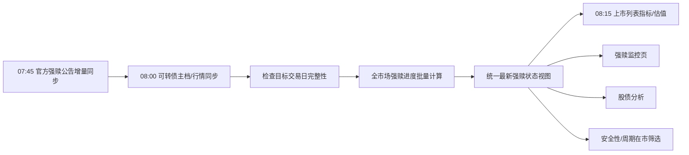

# 可转债强赎监控页面设计方案

> 方案日期：2026-08-25  
> 范围：新增“强赎监控”页面及其必要的数据链路，同时把股债分析、上市转债列表、估值和在市状态判断统一切换到同一份强赎数据；不改变安全性、周期、估值等模块原有业务公式。

## 1. 结论

在现有“可转债”一级模块下增加第五个二级页“强赎监控”，位置放在“上市可转债”之后：

`上市可转债｜强赎监控｜可转债安全性｜可转债周期｜可转债估值`

页面面向全市场在市转债，核心回答三个问题：

1. 哪些转债已经公告强赎，最后交易/转股时间是什么；
2. 哪些转债已满足强赎条件但尚未公告；
3. 哪些转债接近满足条件，至少还差几个符合条件的交易日。

产品上参考用户提供页面的信息密度，但不照搬其顶部行情条和超长条款列。现有系统已有市场周期、上市转债列表和统一表格规范，新页只保留强赎决策真正需要的信息。

## 2. 当前架构核查

### 2.1 产品现状

- “可转债”已有上市列表、安全性、周期、估值四个二级页，统一承载在 `public/index.html`。
- 页面采用公开只读模式，游客可查看数据库快照；涉及外部数据刷新时由后台任务处理。
- 全站业务表格已统一使用 `.biz-table` 和 `BusinessTable`，支持表头吸顶和底部横向滚动。

### 2.2 技术现状

- 前端：原生 HTML、CSS、JavaScript，无 React/Vue。
- 后端：Express 路由 + services 业务层 + jobs 定时任务。
- 数据库：PostgreSQL，启动时执行版本化迁移。
- 可转债每日主链：08:00 同步主档、转债/正股日线和周期，08:15 计算上市列表指标、估值与预警。
- 页面请求只读本地数据库；外部调用有预算、熔断、游标、任务锁和失败保留机制。

### 2.3 数据现状（本机数据库实测）

截至最新数据日 2026-08-19：

| 检查项 | 实测结果 | 结论 |
| --- | ---: | --- |
| 最新上市转债 | 314 只 | 新页首期覆盖范围 |
| 有强赎条款 | 314 只 | 条款基础已齐全 |
| 已有强赎触发价 | 314 只 | 可直接复用上市列表计算结果 |
| 已有强赎天数记录 | 10 只上市债 | 不能直接支撑全市场页面 |
| 正股近 60 日有至少 30 个交易日行情 | 305 / 311 只正股 | 其余需一次性补历史日线 |
| 已有转股价变更历史 | 11 只、58 条 | 需补当前在市债券的近期变更历史 |

当前 `analytics.convertible_bond_trigger_daily` 的强赎天数只在单只转债被手工分析时写入，因此新页必须增加“全市场每日批量计算”，不能在浏览器端临时逐只计算。

全局代码核查还发现：

| 模块 | 当前做法 | 改造要求 |
| --- | --- | --- |
| 股债分析 | 单债刷新时调用 `triggerProgress` 重新计算强赎触发价和天数，并保存进个券快照 | 改为读取统一强赎状态；下修、回售仍保留原计算 |
| 上市转债列表 | `convertibleBondListService` 再次解析强赎比例，并用当前转股价重新计算触发价 | 改为读取同交易日的统一强赎结果；列表快照只复制结果，不再执行公式 |
| 可转债估值 | 只读取主档 `conv_stop_date` 推断期权截止日 | 优先读取官方强赎事件中的最后转股日，主档日期仅作兜底 |
| 可转债安全性 | 不计算强赎指标，只按 `bond_unified.conv_stop_date` 过滤在市债券 | 无需读取强赎天数；统一视图补入官方有效停止转股日后自动复用 |
| 可转债周期 | 不计算强赎指标 | 只在每日样本筛选时复用统一的在市状态，不新增强赎公式 |
| 打新、首页、持仓 | 当前没有强赎展示或决策逻辑 | 首版不接入，避免增加无关改动 |

## 3. 页面设计

### 3.1 页面结构

```text
可转债 > 强赎监控                                  数据日期：2026-08-19

[已公告强赎  n] [已满足待公告  n] [临近触发  n] [正常跟踪  n]

[搜索代码、转债或正股] [状态：全部 v] [重新读取]

┌状态┬代码┬转债名称┬转债收盘价┬正股名称┬正股收盘价┬转股价┬触发价┬距触发价┬强赎进度┬至少还需┬公告信息┬剩余规模┬到期日┬条款┐
│…   │…   │…       │…         │…       │…         │…     │…     │…       │12/15    │3天     │…       │…       │…     │查看│
└────┴────┴─────────┴───────────┴─────────┴───────────┴───────┴───────┴─────────┴─────────┴─────────┴─────────┴─────────┴───────┴────┘
```

### 3.2 状态定义与排序

| 状态 | 判定 | 展示颜色 | 默认排序 |
| --- | --- | --- | ---: |
| 已公告强赎 | 官方公告确认行使提前赎回，且尚未完成 | 红 | 1 |
| 已满足待公告 | 最近观察窗口的符合天数已达到条款要求，但未发现行使公告 | 橙 | 2 |
| 临近触发 | 未满足，且至少还需 1—5 个符合条件交易日 | 黄 | 3 |
| 正常跟踪 | 至少还需 6 个及以上符合条件交易日 | 蓝灰 | 4 |
| 暂不强赎 | 官方公告承诺期内不行使强赎 | 灰 | 5 |
| 数据待补 | 条款、转股价或窗口行情不完整 | 灰 | 6 |

“至少还需 N 天”只表示数学上的最少符合天数，即 `条款要求天数 - 当前符合天数`，不是预计 N 个交易日后必然触发。

同一状态内：已公告强赎按最后交易日从近到远；其他状态按“至少还需天数”、距触发价从小到大排序。

### 3.3 表格交互

- 搜索：债券代码、债券名称、正股代码、正股名称。
- 状态筛选：全部、已公告强赎、已满足待公告、临近触发、正常跟踪、暂不强赎、数据待补。
- 点击债券代码或名称：跳转现有证券分析页，不新增第二套个券详情。
- 点击“查看条款”：使用现有公共对话框展示完整条款、观察窗口、要求天数和来源；不把长条款直接铺在表格中。
- “重新读取”只重新请求本站 API，不触发外部接口。
- 表格复用 `.biz-table`、`BusinessTable`、红涨绿跌和横向滚动规范。

### 3.4 行情口径

首版统一展示并计算“最新完整交易日收盘价”。强赎条款判断依据是收盘价，不能把腾讯盘中价与 Tushare 历史收盘序列混合后改变天数。

页面顶部明确显示数据日期。后台数据失败时继续展示上一份有效结果，并标记“数据暂未更新”。

## 4. 技术方案

### 4.1 前端改动

| 文件 | 改动 |
| --- | --- |
| `public/index.html` | 增加“强赎监控”二级导航、页面容器和静态资源引用 |
| `public/js/bond-cycle.js` | 在现有 `switchBondSub` 中增加 `redemption` 分支和 URL 恢复 |
| `public/js/bond-redemption.js` | 页面取数、筛选、排序、表格和条款对话框 |
| `public/css/bond-redemption.css` | 只保留状态徽标、字段宽度等页面差异，不复制共享表格样式 |

地址保持现有规则：`/?main=bond-safety&sub=redemption`。默认进入页仍为当前“可转债安全性”，避免改变既有用户习惯。

### 4.2 后端改动

| 文件 | 职责 |
| --- | --- |
| `server/routes/bondRedemption.js` | 参数校验和只读响应，不做采集与计算 |
| `server/services/convertibleBondRedemptionService.js` | 查询最新强赎状态、汇总数量和条款详情 |
| `server/services/convertibleBondRedemptionCalculator.js` | 全市场批量计算最近观察窗口的触发进度 |
| `server/services/convertibleBondRedemptionSync.js` | 官方公告增量同步、分类和标准化入库 |
| `server/jobs/convertibleBondRefresh.js` | 在可转债主档/行情成功后串行执行强赎进度计算 |
| `server/services/convertibleBondRedemptionSync.js` | 按公告日期增量读取巨潮官方公告，原始响应先入 `ops.raw_records`，解析结果幂等写入官方强赎事件表；已接入 07:45 定时任务 |
| `server/app.js` | 注册 `/api/bond-redemption` 路由 |
| `server/services/convertibleBondAnalysis.js` | 股债分析读取统一强赎状态；删除强赎部分的单债重复计算，保留下修和回售计算 |
| `server/services/convertibleBondListService.js` | 从统一强赎结果复制同交易日触发价，不再解析条款和自行相乘 |
| `server/scripts/convertibleBondValuation.py` | 最新估值优先读取官方最后转股日，作为期权截止日 |
| `server/db/migrations.js` | 新增强赎事件表、统一最新状态视图，并让 `bond_unified` 使用有效停止转股日 |

不在页面请求中调用 Tushare、腾讯行情或公告网站。

### 4.3 统一读取契约

新增数据库只读视图 `analytics.convertible_bond_call_latest`，作为所有模块读取“当前强赎状态”的唯一入口。视图按每只转债合并：

- 最新有效强赎条款；
- 最新交易日的 `analytics.convertible_bond_trigger_daily` 强赎进度；
- 最新有效官方强赎事件；
- 计算状态、官方状态、最终业务状态和数据完整性；
- 赎回价格、最后交易日、最后转股日、暂不强赎截止日和公告来源。

Node.js 模块统一通过 `convertibleBondRedemptionService.getLatestCallState()` / `getLatestCallStateMap()` 读取该视图；Python 估值任务直接只读该视图。禁止各调用方再次解析强赎条款、重复统计 15/30 天或自行判断官方状态。

为兼容现有接口：

- 股债分析响应仍保留 `call_trigger_price`、`call_day_count`、`call_required_days`、`call_met` 字段，但由统一状态覆盖旧快照值；打开个券不触发重算和外部调用。
- 上市转债每日快照仍可保留 `call_trigger_price` 展示字段，但它只能复制统一结果，不能在列表服务中重新计算。
- 强赎状态更新不再要求用户手工刷新某只转债，也不再把个券分析快照是否刷新作为数据新鲜度来源。

### 4.4 API 契约

`GET /api/bond-redemption?status=&q=&date=&limit=1000`

返回结构：

```json
{
  "trade_date": "2026-08-19",
  "calculated_at": "2026-08-20T08:10:00+08:00",
  "stale": false,
  "summary": {
    "announced": 0,
    "met_pending": 0,
    "near": 0,
    "tracking": 0,
    "waived": 0,
    "incomplete": 0
  },
  "data": []
}
```

单行至少包含：证券 ID、代码/名称、正股、两者收盘价、转股价、触发比例、触发价、距触发价、符合/要求/观察天数、至少还需天数、业务状态、剩余规模、到期日，以及最新官方强赎事件摘要。

## 5. 数据方案

### 5.1 复用现有数据

| 数据 | 现有归属 | 用途 |
| --- | --- | --- |
| 转债与正股身份 | `core.instruments` | 全链路使用 `instrument_id` 关联 |
| 转债档案 | `fundamental.convertible_bond_profiles` | 转股价、期限、剩余规模 |
| 强赎条款 | `fundamental.convertible_bond_terms` | 触发比例、观察天数、要求天数、条款原文 |
| 转股价历史 | `fundamental.convertible_bond_price_changes` | 按历史交易日还原当时有效转股价 |
| 正股日线 | `market.daily_bars` | 逐日判断是否达到触发价 |
| 上市转债快照 | `analytics.convertible_bond_list_metrics_daily` | 转债价格、正股价格及列表展示字段 |
| 强赎进度 | `analytics.convertible_bond_trigger_daily` | 扩大为全市场每日事实，不新建重复进度表 |
| 原始数据与质量 | `ops.raw_records`、`ops.sync_cursors`、`ops.data_quality_issues` | 留痕、增量、失败保留和补漏 |

### 5.2 新增官方强赎事件表

新增 `event.convertible_bond_call_events`，保存页面需要频繁查询的正式字段：

| 字段 | 说明 |
| --- | --- |
| `event_id` | 主键 |
| `instrument_id` | 可转债内部 ID |
| `event_type` | `warning`、`exercise`、`waive`、`implementation`、`completion` |
| `announced_at` | 公告日期 |
| `no_call_until` | 暂不强赎承诺截止日 |
| `redemption_record_date` | 赎回登记日 |
| `last_trade_date` | 最后交易日 |
| `last_conversion_date` | 最后转股日 |
| `redemption_price` | 赎回价格，元/张 |
| `source_id`、`document_id` | 官方来源和公告文档 |
| `source_key` | 上游公告唯一键，唯一约束 |
| `parser_version`、`parse_status` | 解析版本和完整性状态 |
| `raw_payload` | 暂未标准化字段与解析证据 |

索引：`(instrument_id, announced_at DESC)`、`(event_type, announced_at DESC)`；`source_key` 唯一。

现有 `analytics.convertible_bond_trigger_daily` 继续保存每日计算结果。`diagnostics` 增加输入数据日、条款版本、转股价版本、行情覆盖率和输入哈希；公式升级使用新 `formula_version`，不覆盖旧版本，支持历史追溯。

新增 `analytics.convertible_bond_call_latest` 只读视图，不保存第二份计算结果。其主要字段包括：

- `instrument_id`、`trade_date`、`formula_version`；
- `trigger_ratio`、`trigger_price`、`stock_close`、`distance_to_trigger_pct`；
- `matched_days`、`required_days`、`observation_days`、`remaining_days`；
- `calculated_status`、`official_status`、`business_status`、`data_status`；
- `announced_at`、`no_call_until`、`redemption_price`、`last_trade_date`、`last_conversion_date`；
- `document_id`、`source_url`、`calculated_at`。

`public.bond_unified` 的 `conv_stop_date` 改为“主档停止转股日”和“官方强赎最后转股日”中的较早有效日期。这样安全性、打新读取和其他只关心生命周期的模块可继续读取统一债券视图，无需分别连接强赎事件表。

### 5.3 强赎天数计算规则

对每个目标交易日和每只在市转债：

1. 读取该日有效的强赎条款版本；
2. 读取每个历史交易日当时有效的转股价，不能用今天的转股价覆盖整个观察窗口；
3. 从本地交易日历取最近 `observation_days` 个开市日；
4. 从 `market.daily_bars` 读取正股收盘价；
5. 逐日计算 `收盘价 >= 当日有效转股价 × 触发比例`；
6. 汇总 `matched_days`，并计算 `remaining_days = max(required_days - matched_days, 0)`；
7. 官方“行使强赎/暂不强赎”事件优先于模型状态；
8. 任一关键输入缺失时标记 `incomplete`，禁止用默认值或 0 冒充完整结果。

当前代码的 15/30 默认规则可保留作条款解析辅助，但新页发布时必须要求条款原文能明确解析出比例和窗口；无法确认时进入“数据待补”，不静默套用默认值。

### 5.4 各模块复用边界

| 调用方 | 直接读取的数据 | 不再允许的做法 |
| --- | --- | --- |
| 强赎监控页 | `convertible_bond_call_latest` 全量列表 | 页面逐只计算或调用外部接口 |
| 股债分析 | 单只最新强赎状态、天数、公告和最后交易/转股日 | 在 `refreshConvertibleBondAnalysis` 内重新计算强赎进度 |
| 上市转债列表 | 与列表交易日一致的触发价和业务状态 | 再次解析条款并执行“转股价 × 比例” |
| 可转债估值 | 官方最后转股日/最后交易日 | 重新解析公告或只依赖可能滞后的 `cb_basic.conv_stop_date` |
| 可转债安全性 | `bond_unified` 的有效停止转股日 | 计算强赎天数或维护第二套强赎状态 |
| 可转债周期 | 统一在市证券集合 | 为周期指标复制强赎公式 |
| 打新日历/历史 | `bond_unified` 生命周期字段（如确有需要） | 引入与打新无关的强赎详情 |

股债分析中的下修天数、回售天数和预估回售日期不属于本次强赎统一数据，继续使用现有计算链路，避免扩大修改范围。

### 5.5 数据源与增量策略

| 数据集 | 首次入库 | 日常增量 | 失败策略 |
| --- | --- | --- | --- |
| 主档、条款 | 复用现有 Tushare `cb_basic` 已落库数据 | 复用 08:00 主同步 | 空值不覆盖旧值 |
| 转债/正股行情 | 为当前在市债券补足至少 40 个交易日 | 每日按交易日分区写入 | 分区不完整则保留上日结果 |
| 转股价变更 | 当前在市债券回补最近 60 个自然日官方公告；历史不足时扩大到上市日 | 以公告日期游标保留 30 天重叠 | 解析失败记质量问题，不猜价格 |
| 强赎公告 | 支持对当前在市债券批量回补最近 2 年公告；代码提供增量同步服务并接入 07:45 定时任务 | 每日按公告日期增量，保留 30 天重叠 | 旧事件保留，游标不推进 |
| 强赎进度 | 对已有完整行情区间一次性回算 | 每个完整交易日幂等计算 | 事务失败不发布半成品 |

公告优先使用交易所/巨潮官方来源，搜索“可能触发赎回、触发赎回条件、不提前赎回、提前赎回、赎回实施、赎回结果”等关键词，并用债券代码/名称二次匹配，排除普通到期赎回公告。原始公告先写 `ops.raw_records` 和 `event.documents`，再标准化写事件表。

Tushare 的页面相关数据仅沿用当前 2000 积分可用的 `cb_basic`、`cb_daily` 和股票日线能力；不把单独权限接口设为核心依赖。腾讯行情仍按现有批量缓存规则服务盘中展示，但首版强赎计数不使用盘中价。

## 6. 后台任务链路



- 首次回补单独执行，不塞入普通每日任务。
- 官方公告同步先于行情主链，使安全性和周期的在市筛选能使用上一日已公告的最后转股日；公告任务失败时沿用上一份有效事件。
- 日常任务使用现有 PostgreSQL 锁、`job_runs`、同步游标、外部调用预算和有限重试。
- 公告同步失败时仍可基于已有公告和最新完整行情计算，但响应标记公告水位陈旧。
- 行情不完整时不发布目标日结果，页面继续显示上一份完整快照。

## 7. 实施顺序

1. 数据库迁移：新增官方强赎事件表、必要索引和数据质量字段。
2. 本地验收执行 314 只在市转债的最新行情口径强赎计算；历史公告按增量任务运行，历史大范围回补仍需单独维护窗口。
3. 开发全市场批量计算，并对同一交易日重复执行做幂等测试。
4. 建立统一最新强赎状态视图和 Node.js 读取服务。
5. 将股债分析、上市转债列表、估值和在市筛选切换到统一读取入口，删除对应重复计算。
6. 增加只读 API 与定时任务依赖。
7. 增加二级导航和页面，复用全局业务表格。
8. 补专项测试、全量回归、架构文档和版本记录。

## 8. 验收标准

- 最新上市转债 100% 有明确状态；数据不足的必须明确显示“数据待补”。
- 有标准强赎条款的转债，条款解析覆盖率 100%；无法解析的逐只列出原因。
- 正股最近观察窗口行情覆盖率 100%，且同一日期不混用不同来源时点。
- 抽查至少 10 只转债，逐日计算结果与人工按交易日复算一致。
- 转股价在观察窗口内发生变化的样本，按每日有效转股价计算通过。
- “已公告强赎”和“暂不强赎”均有可点击的官方公告证据。
- 页面刷新不会产生任何外部 API 调用；重复后台任务不产生重复事件或重复日结果。
- 同一只转债在强赎监控页、股债分析和上市转债列表中的触发价、天数、状态和数据日期完全一致。
- 静态扫描确认股债分析和上市转债列表不再包含强赎天数统计或触发价重复公式。
- 已公告强赎样本的估值期权截止日与官方最后转股日一致；主档日期仅在官方事件缺失时兜底。
- 安全性和周期只复用有效停止转股日/统一在市集合，不新增第二套强赎计算。
- 外部接口失败、空结果、权限错误时，上一份有效数据不被清空，游标不错误推进。
- 新页不影响现有上市列表、安全性、周期、估值、证券分析和游客访问权限。

## 9. 首版不做

- 不复制参考页面的全站行情指数条。
- 不做盘中强赎天数预测，盘中价格不计入正式交易日计数。
- 不新增个性化持仓提醒、短信或邮件告警。
- 不重做现有可转债导航和其他页面样式。
- 不使用 AI 自动判断作为强赎正式状态；正式状态以规则计算和官方公告为准。

## 10. 本次执行状态

- 已完成页面、只读 API、批量强赎计算、统一状态视图、股债分析/上市列表/估值复用改造，以及定向测试。
- 已提供并接入 `convertibleBondRedemptionSync` 官方公告增量同步服务；本地验收仅执行有限日期窗口，不执行大范围历史回补。
- 数据库迁移 `079_convertible_bond_redemption` 已执行并通过对象检查。
