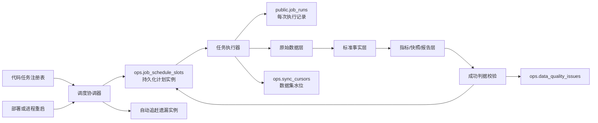
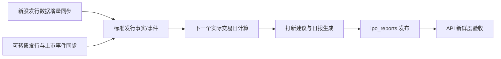

# 后台定时任务防漏跑与自动补偿系统研发方案

> 日期：2026-08-12
> 适用范围：生产环境全部周期任务、启动补偿任务、数据同步任务和派生快照任务
> 目标：解决部署、重启、进程异常、上游失败导致的任务漏跑，并保证不重复写脏数据、不覆盖上一份有效数据。

## 1. 背景与问题

当前生产采用独立 Worker 执行后台任务，Web 进程设置 `DISABLE_SCHEDULER=1`，任务统一登记在 `server/scheduler.js`。数据库已有：

- PostgreSQL advisory lock：避免多个实例同时执行同一个任务；
- `public.job_runs`：记录部分任务的开始、结束、成功或失败；
- `ops.sync_cursors`：记录各数据集同步水位、失败原因和重试次数；
- `ops.data_quality_issues`：记录数据质量问题；
- 各业务标准表、指标表和页面快照表。

现有问题不是“没有定时任务”，而是调度状态主要保存在 Worker 内存中：

1. 多数任务通过 `setTimeout` 只计算“下一个执行时间”。如果 Worker 在计划时间之后才启动，会直接等待下一个周期，今天这一轮永久丢失。
2. 部署时停止 Worker，如果恰好跨过任务时间，重启后没有统一的计划追赶机制。
3. 各任务自行实现定时、锁、启动补偿和失败重试，规则不一致。有的任务启动就跑、有的只在无数据时跑、有的只检查 `last_error`、有的完全不补跑。
4. `job_runs` 记录的是“实际执行”，没有记录“本应执行但没有执行”的计划实例，因此系统无法准确识别漏跑。
5. advisory lock 只能避免正在运行时重复执行，不能表示某个计划时间是否已经成功完成。
6. 部分任务只以进程退出码判断成功，没有统一核对目标日期、数据水位、有效行数和页面快照，可能出现“脚本成功退出，但数据未更新”。
7. 数据同步水位与调度状态混用风险较高：`ops.sync_cursors` 应表示数据集进度，不应代替任务计划表。

### 1.1 本次案例

打新日报计划在工作日 18:00 执行。服务器部署或重启跨过 18:00 后，Worker 只计算下一工作日 18:00，没有生成本次计划实例，也没有自动补跑。因此线上数据库仍停留在上一份报告。

## 2. 设计目标

### 2.1 必须实现

- Worker 重启后自动发现并补跑允许窗口内的遗漏任务；
- 部署跨过计划时间不再造成漏跑；
- 任务失败按统一策略有限重试，禁止无限重试；
- 同一计划实例在多 Worker、重复启动和人工补跑时保持幂等；
- 区分“运行成功”“数据有效”“产品已发布”三种结果；
- 外部接口失败、空响应或异常数据不得覆盖上一份有效数据；
- 调度状态、执行记录、数据水位和质量问题分层保存；
- 管理员能看到待执行、运行中、成功、迟到、失败、阻塞任务；
- 保持页面只读数据库，不因用户访问临时调用外部接口。

### 2.2 不做的事情

- 不引入 Redis 队列、Kafka、RabbitMQ、Airflow 等新基础设施；
- 不把后台调度重新放回 Web 进程；
- 不重写各业务的数据采集和计算逻辑；
- 不用“每天全部重拉”代替增量水位和补偿窗口；
- 不通过创建第二套业务表或页面缓存绕过统一数据层；
- 不允许部署脚本直接修改业务数据来伪造任务成功。

## 3. 总体方案

采用“代码定义任务 + PostgreSQL 保存计划实例 + 独立 Worker 统一执行”的持久化调度模式。



核心原则：

- 任务定义仍在 Git 代码中，随版本评审和测试，不在数据库中动态编排业务代码；
- 数据库只保存每个“应该执行的时间点”及其状态；
- Worker 每次启动和运行期间都执行对账，不依赖单次内存定时器；
- 业务任务只负责一次执行，定时、补跑、重试、锁、超时和记录由统一执行器负责。

## 4. 核心概念

### 4.1 任务定义

每个任务在 `server/scheduler.js` 中登记统一元数据：

```js
{
  code: 'ipo_calendar_refresh',
  schedule: { type: 'weekday', hour: 18, minute: 0, timezone: 'Asia/Shanghai' },
  catchupWindowMinutes: 360,
  deadlineMinutes: 60,
  maxAttempts: 3,
  retryDelaysMinutes: [5, 15, 45],
  timeoutMinutes: 30,
  dependencyCodes: ['ipo_source_sync', 'convertible_bond_refresh'],
  runner: runIpoCalendarRefresh,
  validator: validateIpoCalendarRefresh
}
```

任务定义必须包含：

- 唯一任务编码；
- 上海时区计划规则；
- 工作日、交易日或自然日规则；
- 允许补跑的时间窗口；
- 最大尝试次数和重试间隔；
- 单次执行超时；
- 前置依赖；
- 执行函数；
- 数据成功判据；
- 任务重要等级和告警期限。

### 4.2 计划实例

计划实例表示“某任务在某个时间本应执行一次”，例如：

```text
ipo_calendar_refresh @ 2026-08-12 18:00:00+08:00
```

`job_code + scheduled_for` 全局唯一。即使部署、重启或多个 Worker 同时对账，也只能产生一条计划实例。

### 4.3 执行尝试

同一计划实例可以有多次执行尝试。每次尝试继续写入现有 `public.job_runs`，保留失败历史，不覆盖前一次错误。

### 4.4 数据水位

`ops.sync_cursors` 只表示数据集已成功同步到哪个业务日期、公告日期或报告期。任务失败时只更新 `last_attempt_at`、`last_error` 和 `retry_count`，不得推进 `last_success_date`。

## 5. 数据库设计

### 5.1 新增计划实例表

建议新增迁移 `061_durable_job_scheduler`：

```sql
CREATE TABLE ops.job_schedule_slots (
  slot_id              BIGSERIAL PRIMARY KEY,
  job_code             TEXT NOT NULL,
  scheduled_for        TIMESTAMPTZ NOT NULL,
  business_date        DATE,
  status               TEXT NOT NULL DEFAULT 'pending',
  attempt_count        INTEGER NOT NULL DEFAULT 0,
  next_attempt_at      TIMESTAMPTZ,
  lease_owner          TEXT,
  lease_until          TIMESTAMPTZ,
  heartbeat_at         TIMESTAMPTZ,
  last_run_id          INTEGER,
  trigger_type         TEXT NOT NULL DEFAULT 'scheduled',
  data_as_of           TIMESTAMPTZ,
  result_summary       JSONB NOT NULL DEFAULT '{}'::jsonb,
  last_error           TEXT NOT NULL DEFAULT '',
  created_at           TIMESTAMPTZ NOT NULL DEFAULT now(),
  updated_at           TIMESTAMPTZ NOT NULL DEFAULT now(),
  CONSTRAINT uq_job_schedule_slot UNIQUE(job_code, scheduled_for),
  CONSTRAINT ck_job_slot_status CHECK (
    status IN ('pending','running','succeeded','degraded','failed','blocked','skipped')
  )
);

CREATE INDEX idx_job_slots_due
  ON ops.job_schedule_slots(status, next_attempt_at, scheduled_for);

CREATE INDEX idx_job_slots_recent
  ON ops.job_schedule_slots(job_code, scheduled_for DESC);
```

说明：

- 该表只保存调度控制状态，不保存业务数据；
- `business_date` 表示任务负责的数据日期，与机器启动日期分开；
- `lease_until` 用于识别进程崩溃后残留的 `running` 状态；
- `data_as_of` 表示最终产品数据的新鲜度；
- `result_summary` 只保存行数、目标日期、来源和质量摘要，不保存完整上游响应。

### 5.2 扩展现有执行记录

为控制爆炸半径，继续复用 `public.job_runs`，只增量补充字段：

```sql
ALTER TABLE public.job_runs ADD COLUMN IF NOT EXISTS slot_id BIGINT;
ALTER TABLE public.job_runs ADD COLUMN IF NOT EXISTS attempt_no INTEGER NOT NULL DEFAULT 1;
ALTER TABLE public.job_runs ADD COLUMN IF NOT EXISTS trigger_type TEXT NOT NULL DEFAULT 'scheduled';
ALTER TABLE public.job_runs ADD COLUMN IF NOT EXISTS worker_id TEXT;
ALTER TABLE public.job_runs ADD COLUMN IF NOT EXISTS heartbeat_at TIMESTAMPTZ;
ALTER TABLE public.job_runs ADD COLUMN IF NOT EXISTS result_json JSONB NOT NULL DEFAULT '{}'::jsonb;
ALTER TABLE public.job_runs ADD COLUMN IF NOT EXISTS error_code TEXT;

CREATE INDEX IF NOT EXISTS idx_job_runs_slot
  ON public.job_runs(slot_id, attempt_no);
```

暂不迁移或删除旧 `job_runs`，保证后台管理和现有任务兼容。后续如需完全收敛到 `ops` Schema，另立迁移方案，不在本次修改中扩大范围。

### 5.3 表职责边界

| 数据对象 | 表 | 职责 |
|---|---|---|
| 计划是否应执行、是否漏跑 | `ops.job_schedule_slots` | 调度控制面 |
| 每次实际执行过程 | `public.job_runs` | 执行审计 |
| 外部数据同步到哪里 | `ops.sync_cursors` | 数据水位 |
| 原始上游响应 | `ops.raw_records` 等原始层 | 追溯与重放 |
| 无效、异常、缺失数据 | `ops.data_quality_issues` | 数据质量 |
| 标准证券、事件、行情、财务数据 | `core/market/fundamental/event` | 标准事实层 |
| 指标、预测、页面快照、日报 | `analytics/public` 对应正式表 | 产品读取层 |

### 5.4 邮件告警投递记录

为避免同一个错误反复发送邮件，并保留投递审计，建议在迁移 061 中同时新增：

```sql
CREATE TABLE ops.alert_notifications (
  notification_id      BIGSERIAL PRIMARY KEY,
  alert_key            TEXT NOT NULL,
  alert_type           TEXT NOT NULL,
  severity             TEXT NOT NULL,
  status               TEXT NOT NULL DEFAULT 'pending',
  job_code             TEXT,
  slot_id              BIGINT,
  subject              TEXT NOT NULL,
  summary              TEXT NOT NULL DEFAULT '',
  first_detected_at    TIMESTAMPTZ NOT NULL DEFAULT now(),
  last_detected_at     TIMESTAMPTZ NOT NULL DEFAULT now(),
  occurrence_count     INTEGER NOT NULL DEFAULT 1,
  last_sent_at         TIMESTAMPTZ,
  next_send_at         TIMESTAMPTZ,
  resolved_at          TIMESTAMPTZ,
  send_attempts        INTEGER NOT NULL DEFAULT 0,
  last_send_error      TEXT NOT NULL DEFAULT '',
  created_at           TIMESTAMPTZ NOT NULL DEFAULT now(),
  updated_at           TIMESTAMPTZ NOT NULL DEFAULT now(),
  CONSTRAINT uq_active_alert_key UNIQUE(alert_key),
  CONSTRAINT ck_alert_status CHECK (
    status IN ('pending','sent','suppressed','resolved','send_failed')
  ),
  CONSTRAINT ck_alert_severity CHECK (
    severity IN ('warning','critical')
  )
);

CREATE INDEX idx_alert_notifications_due
  ON ops.alert_notifications(status, next_send_at);
```

`alert_key` 使用“环境 + 任务编码 + 计划实例 + 错误类型”生成，不包含密码、Token 或完整错误堆栈。同一故障重复发生时只增加 `occurrence_count`，不新增大量邮件。

## 6. 调度与补跑算法

### 6.1 Worker 启动流程

1. 初始化数据库迁移；
2. 加载代码任务注册表；
3. 将已过期的 `running` 租约恢复为 `pending`；
4. 为每个任务计算最近一个应执行时间；
5. 在补跑窗口内，插入缺失的计划实例；
6. 立即执行已到期的 `pending/blocked` 实例；
7. 启动每 60 秒一次的轻量对账循环；
8. 内存定时器只负责降低延迟，数据库计划实例才是最终依据。

### 6.2 计划实例生成

协调器每次对账计算：

- 当前时间之前、补跑窗口之内的所有应执行时间；
- 当前时间之后最近一个执行时间；
- 对每个时间执行 `INSERT ... ON CONFLICT DO NOTHING`；
- 工作日任务使用现有交易日历，不只判断周一至周五；
- 月度任务生成明确月份实例，禁止简单使用“进程启动后每 30 天”。

### 6.3 抢占与互斥

执行前同时满足：

1. 计划实例状态允许执行；
2. `next_attempt_at <= now()`；
3. 通过原子 SQL 更新租约；
4. 获取现有 PostgreSQL advisory lock。

计划实例唯一键防止“同一计划重复创建”，租约防止“崩溃状态永久卡住”，advisory lock 防止“两个进程同时运行同一任务”。三者职责不可互相替代。

### 6.4 心跳与超时

- 长任务每 60 秒更新 `heartbeat_at` 和 `lease_until`；
- 任务超过定义的 `timeoutMinutes` 后终止子进程，记录 `timeout`；
- Worker 异常退出后 advisory lock 自动释放；
- 新 Worker 发现租约过期后，将该实例恢复为可重试状态；
- 不允许仅凭 `locked_until` 强制并发执行仍有有效心跳的任务。

### 6.5 有限重试

默认瞬时失败重试：5 分钟、15 分钟、45 分钟，最多 3 次。

错误分类：

| 类型 | 示例 | 策略 |
|---|---|---|
| 瞬时错误 | HTTP 429/502、连接超时、临时 DNS 失败 | 按退避时间重试 |
| 数据异常 | 空响应、字段突变、行数异常下降 | 保留旧数据，定点重拉一次，仍失败则记录质量问题 |
| 配置错误 | Token 缺失、Python 不存在、权限不足 | 直接失败并告警，不做高频重试 |
| 代码错误 | SQL/解析异常 | 保留现场和错误，有限重试后等待修复 |
| 前置任务失败 | 标准数据未准备好 | 标记 `blocked`，待依赖成功后唤醒 |

达到最大次数后状态为 `failed`，不得无限重试。管理员手工重跑必须产生新的执行尝试，并记录 `trigger_type='manual'` 和操作者。

## 7. 任务成功判据

统一执行器不能只看函数是否返回或进程退出码是否为 0。每个任务必须定义三层成功判据：

1. **技术成功**：脚本/函数正常结束，事务提交；
2. **数据成功**：目标业务日期的标准数据、水位、有效行数和质量检查通过；
3. **产品成功**：对应日报、快照或页面读取表已经发布，API 返回的数据日期正确。

状态定义：

- `succeeded`：三层全部通过；
- `degraded`：保留了上一份有效数据，但本次部分来源或部分标的失败；
- `failed`：目标业务日期没有形成有效结果；
- `blocked`：前置依赖尚未成功；
- `skipped`：休市日、无适用对象或配置明确关闭，且跳过原因可验证。

“上游返回 0 条”只有同时满足以下条件才可视为正常：

- 请求本身成功；
- 目标日期明确；
- 业务允许该日期为空；
- 与上一周期、交易日历或公告事实不存在冲突；
- `result_json` 记录 `valid_empty=true` 及判断依据。

## 8. 数据层执行规范

每个金融数据任务统一遵循：

```text
外部源 → 原始记录 → 标准事实 → 派生指标 → 页面快照/日报 → 新鲜度校验
```

具体要求：

- 首次全量入库，后续按 `ops.sync_cursors` 增量同步并保留短重叠窗口；
- 原始响应与标准事实分层保存，不能只保存最终页面 JSON；
- 标准事实使用现有内部证券 ID、公司 ID、数据源 ID 和幂等唯一键；
- 写入使用 upsert 或事务，同一计划实例重复执行结果一致；
- 外部失败或可疑空数据不得删除、清空或覆盖上一份有效数据；
- 只有数据校验通过后才推进 `last_success_date`；
- 页面继续只读数据库，不在 API 请求内触发补跑；
- 报告和快照必须携带 `data_as_of`、目标业务日期和生成版本；
- 派生任务依赖标准事实层，不再各自重复拉取同一上游全量数据。

## 9. 任务分型与补偿策略

| 任务类型 | 当前代表任务 | 补偿依据 | 建议窗口 |
|---|---|---|---|
| 收盘事实型 | A股/港股收盘价、净值、指数 | 交易日历 + 缺失代码/日期 | 最近 5 个交易日 |
| 日报发布型 | 打新日报 | 目标报告日期 + 最新标准事件 | 当日 18:00 后至次日开盘前 |
| 每日增量型 | 股票分析、市场波动、港股每手股数 | 数据水位 + 目标自然/交易日 | 24 小时 |
| 主链/DAG 型 | 可转债主链 | 各阶段完成度 | 当日 + 次日 08:00 |
| 公告增量型 | 套利机会 | 公告游标 + 失败记录 | 最近 7 天重叠窗口 |
| 快照型 | 可转债安全性 | 最新有效快照日期 | 24 小时 |
| 月度维护型 | 休市日同步 | 目标月份/年份 | 7 天 |

补偿窗口必须按业务定义，不能所有任务统一“重启就跑全量”。

## 10. 打新链路专项落地

打新链路应改成有依赖关系的任务链，而不是多个脚本只靠固定时间碰巧先后完成：



建议规则：

- 18:00 触发的是一条任务链；数据同步成功后再生成日报，不依赖脚本启动速度；
- 日报只读取已经入库的标准发行事实和事件；
- 目标日期是“当前时点之后的下一个实际交易日”，不是简单的明天；
- `ipo_reports.report_date`、`created_at`、`summary_json.calendar` 和目标日期必须一致；
- 目标日期确实无申购项目时，日报仍生成，并明确记录“有效空结果”；
- 北交所是否展示属于产品规则，必须在报告和 API 使用同一配置，不能一张表有数据、另一层静默过滤且无说明；
- Worker 在 18:00 后启动，只要仍在补跑窗口且当天计划实例未成功，就立即补跑；
- 次日开盘前仍未成功则升级为高优先级告警，不允许静默等待下一工作日。

打新任务成功判据至少包括：

```text
计划实例成功
+ 数据源请求成功
+ 标准事件最新水位达到目标日期
+ 报告目标日期正确
+ 日历覆盖下一个实际交易日
+ API 返回同一 report_date/data_as_of
```

## 11. 部署协同

### 11.1 部署前

1. 检查 Worker 当前运行任务；
2. 将 Worker 切换为 `draining`：停止领取新计划实例；
3. 等待正在运行的任务完成，最长等待按任务超时设置；
4. 执行数据库备份和迁移；
5. 停止 Worker，再停止 Web；
6. 发布同一 Git 版本和依赖。

### 11.2 部署后

1. 先启动 Web 并完成迁移、健康检查；
2. 再启动 Worker；
3. Worker 启动后自动对账并补跑遗漏计划实例；
4. 执行“今日任务审计”，检查所有已过截止时间的关键任务；
5. 检查 `/health`、任务健康接口和本次相关业务 API；
6. 有失败实例时部署可标记为“应用上线、数据任务待恢复”，不得宣称全部验收成功。

部署不再需要避开所有任务时间。即使部署跨过 18:00，Worker 重启后也能根据持久化计划实例补跑。

### 11.3 优雅停机

Worker 收到 `SIGTERM` 后：

- 立即停止生成和领取新实例；
- 保持当前任务心跳；
- 等待当前任务在限定时间内完成；
- 超时后安全终止子进程并记录失败，保留下一次恢复所需水位；
- 释放数据库连接和 advisory lock 后退出。

## 12. 监控与邮件告警

新增只读管理员任务健康接口，复用现有管理员权限：

```text
GET /api/admin/jobs/health
GET /api/admin/jobs/slots?date=2026-08-12
POST /api/admin/jobs/:jobCode/retry/:slotId
```

页面至少展示：

- 任务名称和计划时间；
- 当前状态；
- 是否迟到；
- 尝试次数；
- 最近心跳；
- 数据日期 `data_as_of`；
- 本次抓取、写入、跳过和失败数量；
- 最后错误；
- 下一次重试时间。

告警条件：

- 计划时间超过 `deadlineMinutes` 仍未成功；
- 连续两次失败；
- 任务进程无心跳且租约已过期；
- 数据水位落后业务日期；
- 行数异常下降、异常空响应或质量问题持续未关闭；
- Worker 服务停止或没有心跳。

### 12.1 邮件通道

项目已经使用 `nodemailer`，并配置了 `SMTP_HOST/SMTP_PORT/SMTP_USER/SMTP_PASS`，告警服务直接复用该 SMTP 连接，不新增邮件依赖。新增配置：

```env
# 多个收件人用英文逗号分隔
ALERT_EMAIL_TO=
# 可选；不填时使用 SMTP_USER
ALERT_EMAIL_FROM=
# 默认 production，用于区分线上与本地测试邮件
ALERT_ENVIRONMENT=production
```

约束：

- SMTP 密码和收件地址只放 `.env`，禁止写入代码、Markdown 实际值、Git 和日志；
- 未配置 `ALERT_EMAIL_TO` 时，任务照常执行，但后台健康页必须显示“邮件告警未配置”；
- 邮件发送是旁路能力，发送失败不得把已成功的业务任务改成失败；
- 邮件发送失败写入 `ops.alert_notifications.last_send_error`，由后续投递循环有限重试；
- 邮件正文只保留脱敏错误摘要，不附加 Token、密码、数据库连接串或完整上游响应；
- 本地开发默认不发送真实告警，只有显式设置 `ALERT_EMAIL_TO` 和 `ALERT_ENVIRONMENT` 才允许发送测试邮件。

### 12.2 发送规则

| 场景 | 邮件规则 |
|---|---|
| 第一次瞬时失败 | 先自动重试，不立即发邮件 |
| 连续第二次失败 | 发送一封“警告”邮件 |
| 达到最大重试次数 | 立即发送一封“严重”邮件 |
| 超过任务截止时间 | 立即发送一封“任务漏跑”邮件 |
| 数据异常为空或水位落后 | 发送“数据质量”邮件 |
| 同一故障持续存在 | 6 小时最多提醒一次，邮件内累计发生次数 |
| 故障恢复 | 发送一封“已恢复”邮件，包含故障持续时间和最终数据日期 |
| 每日汇总 | 每天固定时间发送一封任务健康摘要；全部正常时可通过配置关闭 |

告警邮件标题统一：

```text
[存在小站][严重][生产] 打新日报超过截止时间仍未成功
[存在小站][警告][生产] Tushare 接口连续失败 2 次
[存在小站][恢复][生产] 打新日报已自动补跑成功
```

邮件正文至少包含：

- 环境、服务器和任务名称；
- 计划执行时间、实际检测时间；
- 当前状态和尝试次数；
- 数据停留日期 `data_as_of`；
- 脱敏后的最后错误；
- 下一次自动重试时间；
- 是否需要人工处理；
- 恢复邮件中的故障持续时间和最终结果。

### 12.3 两层监控，避免 Worker 崩溃后无人发信

仅由 Worker 自己发邮件存在盲点：如果 Worker 进程或整台服务器已经停止，它无法报告自身故障。因此采用两层：

1. **应用内告警**：持久化调度器检测任务失败、漏跑、数据落后和恢复，通过现有 SMTP 发邮件；
2. **独立存活检查**：使用独立的 systemd timer 每 5 分钟检查 `portfolio-worker.service`、Worker 心跳和关键任务截止时间。检查脚本不依赖 Worker 进程，发现异常后通过同一 SMTP 发邮件。

独立检查也必须防刷屏：状态首次异常发送，持续异常按 6 小时提醒，恢复后发送恢复邮件。检查状态保存在独立的小型状态文件或数据库记录中，禁止每 5 分钟重复发送。

如果整台云服务器宕机、断网或 SMTP 本身不可达，本机仍无法发送邮件。生产最终应同时在云厂商监控中配置“实例不可达/CPU/磁盘”邮件联系人，作为服务器外部的最后一层；该层不接触业务数据库和应用密钥。

### 12.4 邮件投递失败处理

- 单封邮件发送超时 10 秒；
- 最多重试 3 次，间隔 1、5、15 分钟；
- 达到上限后标记 `send_failed`，不阻塞业务任务；
- SMTP 恢复后先发送一封合并摘要，禁止逐条补发历史邮件造成轰炸；
- 后台任务健康页同时展示“业务任务状态”和“告警投递状态”。

第一阶段使用现有日志、后台页面和 SMTP 邮件，不增加微信、QQ 或第三方推送依赖。日志中禁止输出 Token、密码、完整上游敏感响应。

## 13. 后台“自动任务”界面升级

### 13.1 现有能力与改造原则

现有后台已经有“定时任务”入口，当前能力包括：

- `public/admin.html` 中已有独立菜单；
- `public/js/admin.js` 已展示任务说明、最近状态卡片和最近执行记录；
- `/api/admin/jobs` 已返回 `job_runs` 最近记录与每个任务最后状态；
- 已有“手动补漏收盘数据”和“手动核对休市日”两个受控操作；
- 后台运维权限使用 `ops_manage`，人工操作已有审计基础。

因此不新增第二个任务管理页面，不引入新的前端框架，不复制任务执行逻辑。直接升级现有“定时任务”页面，继续使用原生 HTML、JavaScript 和 `public/shared/style.css`，保持后台整体样式一致。

当前页面的主要不足：

- 只能看到实际执行过的记录，看不到“今天应该执行哪些任务”；
- 没有区分待执行、迟到、阻塞、降级、漏跑和告警发送失败；
- 最近一次执行成功不代表目标业务日期的数据已经成功发布；
- 看不到任务依赖、数据水位、下次执行时间、重试次数和邮件状态；
- 异常记录混在普通历史中，定位和介入成本高；
- 人工任务入口零散，不能针对具体失败计划实例安全补跑。

### 13.2 页面信息架构

现有“定时任务”页面升级为五个区域：

```text
┌─────────────────────────────────────────────────────────────────────┐
│ 自动任务                                         [刷新] [发送测试邮件] │
├─────────────────────────────────────────────────────────────────────┤
│ Worker：正常   今日任务：8/10   异常：2   邮件告警：正常   数据最旧：1天 │
├─────────────────────────────────────────────────────────────────────┤
│ [今日任务] [异常待处理 2] [全部任务] [执行历史] [邮件记录]              │
├─────────────────────────────────────────────────────────────────────┤
│ 06:30 可转债安全评分    成功      数据日期 08-12                      │
│ 15:10 A股收盘数据       成功      写入 319 条                         │
│ 18:00 打新日报          迟到      已重试 2/3      [查看] [立即补跑]     │
│ 18:45 市场波动          阻塞      依赖：中债接口   [查看]               │
│ 20:30 个股分析          待执行     距离执行 1小时32分                   │
├─────────────────────────────────────────────────────────────────────┤
│ 任务详情抽屉：执行尝试 / 数据水位 / 依赖 / 错误 / 邮件 / 审计           │
└─────────────────────────────────────────────────────────────────────┘
```

不使用复杂动画。任务详情使用现有弹窗或右侧抽屉模式，避免离开当前观察上下文。

### 13.3 顶部健康总览

顶部固定展示以下核心状态卡：

| 卡片 | 内容 | 异常判定 |
|---|---|---|
| Worker | 运行状态、最后心跳、当前版本 | 心跳超过 3 分钟为异常 |
| 今日任务 | 成功数/应执行数、待执行数 | 截止时间后未成功为异常 |
| 异常待处理 | 迟到、失败、阻塞、降级数量 | 大于 0 时突出显示 |
| 邮件告警 | SMTP 配置、最近发送结果 | 未配置或连续发送失败为异常 |
| 数据新鲜度 | 所有关键任务中最旧 `data_as_of` | 超过各任务阈值为异常 |

卡片点击后直接切换到对应筛选结果。颜色只表达状态，不单独依靠颜色传递信息：

- 绿色：正常或成功；
- 蓝色：待执行或运行中；
- 橙色：迟到、降级或需要关注；
- 红色：失败、Worker 离线或严重告警；
- 灰色：休市跳过、无适用数据或配置关闭。

### 13.4 今日任务时间线

默认展示上海时间“今天应该执行的全部任务”，按计划时间排序。每条任务至少显示：

- 任务名称和业务用途；
- 计划时间和截止时间；
- 状态与状态原因；
- 最近一次开始/结束时间和耗时；
- 当前尝试次数与最大次数；
- 业务数据日期 `data_as_of`；
- 本次抓取、写入、跳过和失败数量摘要；
- 依赖任务状态；
- 下一次自动重试或下次计划时间；
- 邮件是否已经发送。

未来任务显示“待执行”，不得因为没有 `job_runs` 记录被误判为漏跑。超过截止时间仍未成功才标记“迟到/漏跑”。

### 13.5 异常待处理队列

单独提供“异常待处理”页签，只显示管理员需要关注的任务：

- `failed`：已达到最大重试次数；
- `degraded`：部分数据失败，旧有效数据仍在使用；
- `blocked`：依赖任务未完成；
- `late`：超过截止时间仍未成功；
- `running_stale`：运行状态但心跳或租约已经过期；
- `alert_send_failed`：业务异常已识别，但邮件没有成功投递；
- `data_stale`：任务执行成功但产品数据日期仍落后。

默认按“严重程度 → 逾期时间 → 计划时间”排序。每条异常直接给出通俗处理建议，例如：

```text
打新日报：18:00 任务尚未成功，标准新股数据已准备好。
建议：立即补跑日报生成；无需重新同步全部历史数据。
```

### 13.6 任务详情抽屉

点击任务打开详情，分为六个页签：

1. **概览**：计划时间、状态、业务日期、耗时、当前版本、触发方式；
2. **执行尝试**：每次尝试的时间、结果、错误摘要和 Worker；
3. **数据水位**：关联的 `ops.sync_cursors`、标准表最新日期和产品快照日期；
4. **依赖关系**：前置任务、每个依赖当前状态及阻塞原因；
5. **告警邮件**：发送时间、收件人数、投递状态、失败摘要；
6. **人工审计**：谁在什么时间执行了补跑、复核或重发邮件，以及执行结果。

错误信息分两层：默认展示脱敏后的通俗摘要，点击“技术详情”后才显示请求 ID、错误代码和有限长度堆栈。任何层级都不得返回密钥、密码、数据库连接串和完整外部响应。

### 13.7 人工介入操作

任务详情根据状态显示最小必要操作：

| 操作 | 适用状态 | 实际行为 |
|---|---|---|
| 立即补跑 | 失败、迟到、降级 | 为原计划实例新增一次 `manual_retry` 尝试 |
| 重新校验 | 已执行但数据过期 | 只执行成功判据，不调用外部接口 |
| 解除阻塞并重试 | 依赖已恢复的 `blocked` | 重新检查依赖后进入待执行队列 |
| 重发告警邮件 | 邮件投递失败 | 重新投递同一告警，不重复创建告警 |
| 标记已知晓 | 告警已发送 | 记录管理员已知晓，不改变任务状态 |
| 复制诊断摘要 | 所有异常 | 复制脱敏任务、时间、水位和错误摘要 |

安全约束：

- 只有具备 `ops_manage` 的人员可以执行介入操作；
- 不提供绕过 advisory lock 的“强制运行”；
- 同一任务正在运行时补跑返回 `409`，页面明确显示正在运行的实例；
- 补跑前弹出确认信息，写清将访问的外部源、目标业务日期和是否可能产生费用；
- 人工补跑仍使用同一幂等写入、有限重试、数据校验和成功判据；
- “标记已知晓”只改变告警处理状态，绝不能把失败任务改成成功；
- 每次操作无论成功或失败都写入管理员审计日志，包含操作者、请求 ID、计划实例和结果；
- 不允许前端传任意脚本、命令、日期范围或数据库参数给服务器执行。

### 13.8 查询、筛选与刷新

支持以下轻量筛选：

- 日期：今天、昨天、最近 7 天、自定义单日；
- 状态：异常、运行中、待执行、成功、跳过；
- 分类：行情、打新、可转债、股票分析、账户净值、系统维护；
- 触发方式：定时、启动补跑、自动重试、人工补跑；
- 关键词：任务名称或任务编码。

页面默认每 30 秒刷新一次；浏览器页签不可见时暂停轮询，恢复可见时立即刷新。运行中任务可缩短为 10 秒，不引入 WebSocket。保留手动“刷新”按钮，并显示“数据更新时间”，避免用户误以为页面实时更新。

### 13.9 后端接口设计

在现有 `/api/admin/jobs` 兼容保留的基础上新增：

```text
GET  /api/admin/jobs/overview
GET  /api/admin/jobs/slots?date=2026-08-12&status=failed
GET  /api/admin/jobs/slots/:slotId
GET  /api/admin/jobs/alerts?status=open
GET  /api/admin/jobs/notifications
POST /api/admin/jobs/slots/:slotId/retry
POST /api/admin/jobs/slots/:slotId/validate
POST /api/admin/jobs/slots/:slotId/acknowledge
POST /api/admin/jobs/notifications/:id/resend
POST /api/admin/jobs/alert-email/test
```

接口要求：

- 所有读取和写入均检查 `ops_manage`；
- 列表接口分页，默认只查今天和异常数据；
- 重任务接口只创建或唤醒计划实例，立即返回任务编号，不让 HTTP 请求等待完整同步；
- 人工动作统一通过后端任务执行器，前端不直接调用 Python 或外部接口；
- 旧 `/api/admin/jobs` 继续服务现有概览与兼容调用，完成切换后再评估是否废弃。

### 13.10 前端文件边界

控制修改范围：

- `public/admin.html`：继续使用现有 `view-jobs`，不新增一级后台入口；
- `public/js/admin.js`：升级现有 `renderJobs/loadJobsData`，拆出任务总览、时间线、详情和操作函数；
- `public/shared/style.css`：复用现有卡片、标签、表格、按钮和弹窗风格，只补充任务页面专属类；
- 禁止在 HTML 中复制任务时间和任务说明，任务元数据由后端注册表返回，避免前后端再次不一致；
- 不引入新的 UI 组件库，也不改变其他后台页面样式架构。

### 13.11 界面验收标准

- 管理员打开页面后 5 秒内能判断 Worker 是否在线、今天是否有漏跑、邮件是否可用；
- 今天所有应执行任务均出现，包括尚未执行和休市跳过任务；
- 失败任务能在两次点击内看到错误、水位、依赖和处理建议；
- 人工补跑后立即显示新尝试，运行中不能再次重复触发；
- 数据任务必须同时展示“执行状态”和“数据日期”，避免假成功；
- 同一异常被邮件提醒后，页面显示发送结果和是否已知晓；
- 手机窄屏下卡片单列、表格允许横向滚动，不新增复杂响应式断点；
- 页面轮询不会触发任何外部数据源调用；
- 普通用户及无 `ops_manage` 用户无法读取任务详情或执行操作；
- 所有人工操作均能在操作审计中按请求 ID 查到。

## 14. 代码改造边界

### 14.1 新增或修改

- `server/scheduler.js`：任务定义注册表，去除分散的调度定义；
- `server/scheduler/runtime.js`：计划实例生成、对账、租约、重试、依赖和执行器；
- `server/db/jobs.js`：计划实例与执行记录数据库操作；
- `server/db/migrations.js`：迁移 061；
- `server/worker.js`：启动持久化调度、心跳和优雅停机；
- `server/services/jobAlertMailer.js`：邮件模板、脱敏、去重、合并、投递与恢复通知；
- `server/jobs/*.js`：保留单次 `run...` 函数，逐步移除各自 `setTimeout/setInterval`；
- 管理员任务健康、计划实例、异常队列、邮件记录接口及必要的人工介入接口；
- `public/js/admin.js`、`public/shared/style.css`：原地升级现有“定时任务”页面；
- `deploy/portfolio-worker.service`、独立存活检查 timer 和生产部署文档：增加停止等待、启动后审计及 Worker 离线邮件；
- `docs/技术架构.md`：实现完成后同步后台任务与部署章节。

### 14.2 不修改

- 不重构持仓、交易、股票分析、可转债、套利等业务算法；
- 不改变现有公开页面接口契约；
- 不删除旧业务表；
- 不改变数据源密钥保存方式；
- 不在本次一次性迁移所有历史任务代码，按阶段接入。

## 15. 分阶段实施

### 第一阶段：调度底座与可观察界面

- 新增计划实例表和兼容字段；
- 实现注册表、计划生成、启动追赶、租约、心跳、有限重试；
- 实现邮件告警记录、去重、合并、恢复通知和测试邮件；
- 接入打新日报作为首个任务；
- 升级后台现有“定时任务”页面，先交付总览、今日时间线、异常队列、详情和打新补跑；
- 增加任务健康查询和自动化测试。

### 第二阶段：关键金融任务接入

- 接入新股历史、可转债主链、市场收盘价、净值和指数任务；
- 为每个任务补齐数据成功判据；
- 将依赖任务改成 DAG 顺序执行；
- 移除对应任务内部定时器。

### 第三阶段：全部任务收敛

- 接入股票分析、市场波动、港股规则、套利、安全性和月度任务；
- 统一后台健康页、邮件告警和人工重跑；
- 清理旧 cron/system timer/重复入口；
- 完成部署流程和技术架构文档收敛。

每个阶段只迁移已验收任务，不进行一次性大重构。

## 16. 测试与验收

### 16.1 自动化测试

- 同一计划时间多次对账只生成一个实例；
- 两个 Worker 同时领取，只允许一个执行；
- Worker 在计划时间前启动，按时执行；
- Worker 在计划时间后启动，补跑窗口内立即执行；
- 超出补跑窗口按任务策略标记失败或跳过并告警；
- 执行中进程退出，租约过期后能恢复；
- HTTP 502 按 5/15/45 分钟重试，最多 3 次；
- Token 缺失直接失败，不高频重试；
- 空响应不推进 `ops.sync_cursors.last_success_date`；
- 重复执行不产生重复事实、重复事件或重复日报；
- 依赖失败时下游保持 `blocked`，依赖恢复后自动继续；
- 旧 `job_runs` 管理查询保持兼容；
- 后台页面能展示今天尚未执行、已迟到和休市跳过的计划实例；
- 人工补跑受 `ops_manage`、任务锁和审计保护；
- 页面轮询只读数据库，不触发外部接口调用；
- 全量回归 `npm.cmd run test:all` 通过。

### 16.2 部署场景验收

至少在测试环境演练：

1. 17:59 停 Worker，18:04 启动，18:00 任务自动补跑；
2. 任务运行中重启 Worker，旧租约恢复且任务幂等重跑；
3. 临时断开上游，确认有限重试、旧数据保留和告警；
4. 启动两个 Worker，确认同一计划实例只执行一次；
5. 模拟上游成功但返回空数据，确认不会错误发布空快照；
6. 检查打新日报、可转债、市场周期、持仓净值和套利接口数据日期。

### 16.3 验收标准

- 部署跨过任务时间后，补跑窗口内遗漏任务恢复率 100%；
- 同一计划实例重复业务写入为 0；
- 所有已登记关键任务都能在数据库中查到计划实例和执行结果；
- 所有数据任务都有明确 `data_as_of` 和成功判据；
- 外部失败不会清空或回退上一份有效数据；
- 达到最大重试次数后停止自动调用上游并产生可见告警；
- 同一故障在抑制窗口内只发送一封邮件，恢复后只发送一封恢复邮件；
- SMTP 失败不影响业务任务状态，并能在后台看到投递失败；
- Worker 停止后，独立存活检查能发送离线邮件；
- 管理员能在现有“定时任务”页面定位异常、查看数据水位并安全发起补跑；
- 生产只由独立 Worker 执行调度，Web 保持 `DISABLE_SCHEDULER=1`。

## 17. 回滚方案

- 数据库迁移仅新增表、字段和索引，不删除旧结构；
- 新调度器使用功能开关 `DURABLE_SCHEDULER=1`，首期可快速切回旧调度入口；
- 同一任务禁止新旧调度器同时启用；
- 回滚代码时保留 `ops.job_schedule_slots` 和新增执行记录，避免丢失审计历史；
- 业务表依靠原有幂等键和事务，不需要因调度器回滚而回滚有效业务数据；
- 如新调度器异常，停 Worker、关闭开关、恢复旧注册方式，再按数据库水位人工补跑缺失实例。

## 18. 最终决策

本项目不需要引入重型调度平台。最符合当前架构和研发准则的方案是：

1. 继续使用独立 Node Worker 和 PostgreSQL；
2. 用 `ops.job_schedule_slots` 持久化“应该执行的每一次任务”；
3. 复用 `job_runs` 保存执行审计，复用 `ops.sync_cursors` 保存数据水位；
4. 通过统一任务注册表收敛定时、补跑、重试、超时、锁和成功判据；
5. 部署前优雅排空，部署后自动对账补跑；
6. 原地升级后台现有“定时任务”模块，统一观察、告警和人工介入；
7. 先以打新日报验证，再分阶段接入其余任务。

这样既能系统性解决漏跑，也不会破坏当前业务代码、统一数据层和生产部署纪律。
