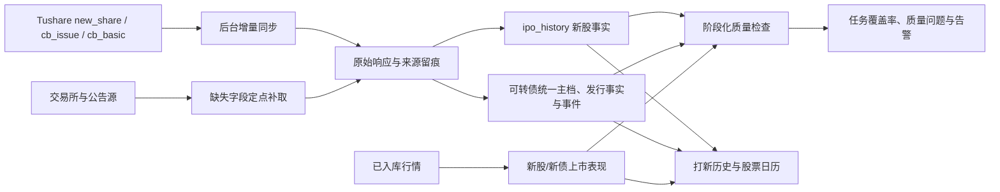

# 打新历史数据完整性与持续更新研发方案

> 状态：代码、部署、生产回填与专项验收已完成；全量回归仍受本机 PostgreSQL 环境影响  
> 日期：2026-08-14  
> 适用范围：打新历史、打新日历、新股发行详情、新股首日表现、新债发行结果、新债上市表现、后台任务质量判定  
> 前置基础：继续沿用现有 `ipo_history`、可转债统一数据层、独立 Worker、持久化任务调度和 PostgreSQL；不另建第二套页面数据链路。

> 验收复核（2026-08-14）：生产已部署 `0.6.1.16` 并完成回填。`/health` 正常；`688835` 已进入新股历史，日历可见 `688835` 与 `123277`；近 90 天 42 条新股均有阶段/质量日期，近两年已到期新债首日表现缺口为 0；重复事件组为 0，唯一索引已生效。

## 1. 背景与实测基线

本方案针对“打新历史存在大量空字段、已申购项目没有进入历史、数据任务执行后页面仍未更新”的问题进行局部整改。

2026-08-14 对生产库只读核查结果：

### 1.1 新股

- 新股历史同步游标为 `2026-08-13`，最近一次任务成功拉取 35 条，说明问题不是任务完全未运行。
- 非北交所新股共 188 只，其中 181 只有上市日并能进入当前历史接口。
- 4 只已经申购但尚无上市日，被当前接口直接隐藏：
  - `688826`：2026-08-07 申购；
  - `301655`：2026-08-10 申购；
  - `688836`：2026-08-10 申购；
  - `688835`：2026-08-14 申购。
- 另有 3 只申购日在未来，不应提前进入历史。
- 9 只缺行业、行业市盈率或主营业务。
- 当前质量检查未覆盖行业、主营业务和上市表现，存在“质量状态为完整，但页面仍有空字段”的假完整。

### 1.2 新债

- 可转债发行同步游标为 `2026-08-13`，统一主档和发行事实仍在更新。
- 排除定向、私募后共有 1,107 条公开发行记录。
- 最近两年 107 条记录中：
  - 44 条缺申请户数；
  - 63 条已上市但缺上市涨幅；
  - 6 条缺上市日，其中包含尚未上市、上游尚未发布和真实漏数三种情况；
  - 2 条缺网上发行量。
- 底层存在 343 组重复申购/上市事件，页面依靠查询去重暂时遮住了问题。
- 新债上市表现已有手动回填代码，但没有进入每日自动任务，因此历史数据不会持续补齐。

### 1.3 后台任务

- 新股历史和可转债主同步出现“业务写入成功、任务槽仍为 degraded”的状态不一致。
- 部分任务因此重复尝试 4 次，增加上游调用和排查噪声。
- 打新日报曾因模型文件写入失败而整体失败。日历事实、历史事实、报告生成和模型训练耦合过紧。

以上数字是本次研发的验收基线。实施前应重新执行同口径审计，保存实施时的最新基线，不能直接把本文数字当作回填结果。

## 2. 根因

### 2.1 新股历史准入条件错误

`GET /api/ipo/history?type=stock` 当前要求 `listing_date` 非空。它实际展示的是“已上市新股”，不是“已经完成申购的打新历史”。因此申购完成但尚未上市的记录会被隐藏。

### 2.2 基础同步与详情补全割裂

`ipo_history_sync.py` 通过 `new_share` 增量保存申购日、上市日、发行价、发行量和中签率等基础字段，但不负责完整补齐行业、主营业务和行业市盈率。

详情补全只在日报命中“目标申购日或目标上市日”时顺带执行。错过该时间点或日报失败后，没有稳定的补偿入口。

现有 `backfill_stock_detail.py` 还有两个边界问题：

- 缺失判定没有覆盖 `industry`、`industry_pe`；
- 详情获取依赖无日期参数的待发行列表，股票上市后可能已不在返回列表中，无法继续补齐。

### 2.3 上市表现只有临时或手动补全

- 新股首日涨幅只检查有限时间窗口，失败达到上限后缺少统一质量问题和后续人工处理入口。
- 新债上市表现的自动获取函数没有实际调用方，正式入口仍是手动回填脚本。

### 2.4 新债结果字段没有按业务节点补偿

申请户数、网上发行量、股东配售量等字段通常要等发行结果公告。当前主同步虽然重复拉取 `cb_issue`，但缺少“公告已到期且字段仍为空”的定点公告补取与质量判定。

### 2.5 数据质量规则不完整

当前新股质量规则只检查少量基础发行字段，没有按“已申购、待上市、已上市”阶段定义必填项。新债也没有按“已公告、已申购、结果已公告、已上市”阶段判断字段是否应当出现。

### 2.6 任务成功判定只看日期，不看覆盖率

现有调度系统主要使用游标日期或最新报告日期判断任务是否成功，不能识别“日期已经更新，但应补字段仍为空”。同时，业务任务内部的“今天已经执行”判断与持久化调度器可能互相误判，造成成功任务被重复补跑。

## 3. 研发目标

完成后必须满足：

- 新股在申购日到达后进入打新历史，不再等待上市日。
- 尚未上市、尚未公告和真正缺失三种状态可区分。
- 页面读取数据库，不因打开页面或刷新页面调用外部数据源。
- 新股与新债的应补字段按业务阶段自动补齐。
- 首次历史回填结果落库，之后只拉短重叠窗口和确实缺失的标的。
- 空响应、权限错误和网络失败不覆盖旧数据、不推进对应游标。
- 同一同步、公告和上市事件重复执行不产生重复记录。
- 任务状态同时反映执行结果、数据日期和到期字段覆盖率。

## 4. 范围与边界

### 4.1 本次修改

- 新股历史接口准入条件、排序和阶段字段。
- 新股历史前端对待上市、待收盘、待补全状态的展示。
- 新股增量同步后的缺失字段补全和质量检查。
- 新债发行结果字段和上市表现的自动补全。
- 重复可转债事件清理与唯一键收敛。
- 打新日历股票部分改为读取数据库事实，不再依赖最新日报中的日历快照。
- 打新相关任务的数据成功判据、重复执行控制和质量摘要。
- 一次性历史审计与分批回填脚本。
- 自动化测试、架构文档和运维说明。

### 4.2 不修改

- 不改变北交所股票当前不在页面展示的产品规则，但后台审计仍检查其数据。
- 不修改新股、新债预测模型和收益计算公式。
- 不改变用户账户、持仓、交易、可转债估值、安全性和周期算法。
- 不重做打新页面样式，不增加新的一级页面。
- 不恢复已移除的 `bond_history`，可转债继续只读统一数据层。
- 不引入新的重型调度平台或第二套金融数据客户端。

## 5. 目标数据流



页面请求只经过数据库读取链路。外部请求只允许由 Worker、人工受控补跑和离线回填脚本发起。

## 6. 产品口径

### 6.1 新股历史准入

新股进入历史的条件改为：

```text
ipo_date <= 当前北京时间日期
```

并继续排除北交所代码。不得再以 `listing_date` 是否存在作为历史准入条件。

阶段由接口计算，不新建第二份状态源：

| 阶段 | 判断 | 页面显示 |
| --- | --- | --- |
| `subscribed` | 申购日已到，上市日为空或晚于今天 | 已申购 / 待上市 |
| `listing_today` | 上市日等于今天，涨幅为空 | 今日上市 / 收盘后更新 |
| `listed` | 上市日早于今天 | 已上市 |
| `data_issue` | 应有的关键字段已到期仍缺失 | 待补全 |

历史排序使用：申购日倒序，同一申购日再按上市日和代码排序。这样最近参与的申购优先出现，不会被较晚公布上市日的记录打乱。

### 6.2 新债历史阶段

新债继续使用现有发行生命周期，但字段显示必须区分：

- 公告尚未发布：`待公告`；
- 申购日尚未到达：`待申购`；
- 已申购、上市日未发布：`待上市`；
- 上市日已到、现有口径所需行情尚未形成：`行情待形成`；
- 已超过应发布时间且仍为空：`待补全`。

不得把尚未到业务节点的空值统计为同步失败，也不得把真正漏数继续显示为普通横线。

### 6.3 打新日历

股票日历不再从最新 `ipo_reports.summary_json.calendar` 读取，改为直接从 `ipo_history.ipo_date/listing_date` 生成；新债继续读取 `event.instrument_events`。

日报只负责文字报告和预测，不再作为日历事实的唯一来源。模型训练或日报渲染失败时，日历和历史仍应正常更新。

## 7. 数据补全设计

### 7.1 新股基础发行字段

`ipo_history_sync.py` 保留当前首次两年、后续 60 天重叠窗口的增量方式，并继续使用 `security_code` 幂等 upsert。

改造要求：

- `new_share` 返回的完整原始行继续合并到 `source_payload`。
- 详情补全优先读取已保存的 `source_payload`，禁止为了同一行再次全量调用 `new_share`。
- 发行市盈率为空且 `issue_pe_status='loss'` 时视为合法值，不计入缺失。
- 申购日、上市日和代码必须先完成格式、唯一性和时间合理性校验后再提交。

### 7.2 新股行业、行业市盈率与主营业务

同步完成后，按申购日已到且相关字段为空的证券进行定点补全；每次默认最多处理 10 只，同一证券同一自然日只尝试一次：

1. 行业优先读取项目已入库证券主档或现有 `stock_basic` 结果。
2. 主营业务优先读取已入库资料；确实缺失时复用现有招股书/公司资料解析入口。
3. 行业市盈率沿用项目已有行业中位数 PE 映射；后续若用于历史估值研究，再增加按申购日冻结口径和来源日期的版本化字段。
4. 上游补全失败只更新质量状态和重试时间，不清空已有值。

现有 `backfill_stock_detail.py` 不再作为日常链路。其可复用逻辑应收敛到公共补全函数，手动脚本只负责按批次调用公共函数。

### 7.3 新股首日涨幅

继续使用现有“上市日收盘价相对发行价”的产品口径：

- 先读数据库中已入库的上市日行情。
- 数据库缺少该日行情时，才定点请求行情源并立即落库。
- 当天 15:30 前不尝试；同一证券同一天最多尝试一次。
- 当前自动窗口覆盖上市后 14 个自然日，并限制同一证券最多尝试 3 次；超过窗口仍失败时保留质量状态，不无限重试。
- 成功后清除该字段对应的质量问题。

### 7.4 新债发行结果字段

可转债主同步提交后，选择满足以下条件的记录进行补偿：

```text
res_ann_date <= 今天
并且 onl_size / onl_pch_num / shd_ration_size 等到期字段仍为空
```

处理顺序：

1. 优先读取 `ops.raw_records` 和标准发行事实。
2. 已有原始公告时重新解析，不重复下载。
3. 没有原始公告时才定点获取发行结果公告并落库。
4. 解析成功写入 `fundamental.convertible_bond_issuance`。
5. 解析失败保留旧值，记录来源、公告日期、错误类型和下次允许重试时间。

### 7.5 新债上市表现

把现有手动上市表现回填逻辑接入可转债主同步的提交后步骤：

- 只处理 `listing_date <= 今天` 且上市表现为空的证券。
- 优先读取 `market.daily_bars`，缺行情才调用上游。
- 保留当前已经确认的“首个非涨停日”计算口径，不修改公式。
- 计算结果继续写入 `analytics.convertible_bond_listing_performance`。
- 同一 `instrument_id + measurement_type + formula_version` 幂等更新。
- 当日尚未形成有效观察值时标记“行情待形成”，不计为质量失败。

### 7.6 重复事件治理

统一事件来源键中的证券代码为带交易所后缀的 `canonical_code`。历史上同时存在六位代码和标准代码的事件按以下规则处理：

- 唯一业务键：`instrument_id + event_type + event_date`。
- 同组保留来源更新时间最新、原始载荷最完整的一条。
- 迁移事务内先生成审计结果，再删除多余行并建立唯一约束。
- 清理前后事件业务组数量必须一致，减少数必须等于重复冗余数。

## 8. 阶段化质量规则

继续复用 `ipo_history.data_quality_status` 和 `ops.data_quality_issues`。不再只保存一个笼统的 `complete/missing`。

质量结果至少包含：

```json
{
  "stage": "subscribed",
  "status": "complete",
  "missing_required": [],
  "pending_not_due": ["listing_date", "ld_close_change"],
  "checked_at": "2026-08-14T19:30:00+08:00",
  "source_as_of": "2026-08-14"
}
```

### 8.1 新股必填规则

| 阶段 | 必填字段 | 暂不要求 |
| --- | --- | --- |
| 已申购 | 代码、名称、申购日、发行价、发行总量、网上发行量、申购上限、中签率、募资额 | 上市日、首日涨幅 |
| 待上市 | 已申购字段、行业、主营业务；发行PE允许合法亏损状态 | 首日涨幅 |
| 已上市且已收盘 | 上述字段、上市日、首日涨幅 | 无 |

### 8.2 新债必填规则

| 阶段 | 必填字段 | 暂不要求 |
| --- | --- | --- |
| 已公告 | 代码、名称、发行公告日、规模、评级、正股、转股价 | 结果公告字段、上市表现 |
| 已申购 | 上述字段、申购日、配售比例、股权登记日 | 结果公告字段、上市表现 |
| 结果已公告 | 上述字段、网上发行量、申请户数、股东配售量 | 上市表现 |
| 已形成观察行情 | 上述字段、上市日、当前公式的上市表现 | 无 |

`pending_not_due` 不计入缺失率；只有超过业务节点仍为空的 `missing_required` 才产生质量问题和任务降级。

## 9. 调度与事务设计

### 9.1 不新增第二套定时器

继续由持久化调度器执行现有任务：

- `ipo_history_sync`：新股基础增量同步、缺失详情补全、新股首日表现、质量统计。
- `convertible_bond_universe_refresh`：可转债主同步、发行结果补全、上市表现补全、质量统计。
- `ipo_calendar_refresh`：报告和预测产物；日历事实不再依赖该任务成功。

### 9.2 分段提交

单次任务按以下事务边界执行：

1. 基础同步与游标提交。
2. 缺失详情补全独立提交。
3. 上市表现独立提交。
4. 质量统计和任务摘要提交。

补全或预测失败不得回滚已经成功的基础事实。任务结果返回每个步骤的成功数、跳过数、失败数和到期缺失数。

### 9.3 成功判定

任务成功不能只看日期。至少同时满足：

- 基础同步执行成功且游标达到预期业务日期；
- 上游非空且没有结构异常；
- 本次应处理记录全部进入“成功、未到期、有限失败”之一；
- 到期关键字段缺失数没有无解释增加；
- 没有重复证券或重复事件。

基础同步成功但存在到期缺失时标记 `degraded`，但只重试缺失子步骤，禁止重新全量执行已经成功的基础同步。

### 9.4 重复执行控制

- 持久化任务槽是唯一执行编排者。
- 业务函数发现当天已有成功结果且游标已新鲜时，应返回 `fresh`，调度器将其视为成功，不得按失败重复 4 次。
- 外部请求使用数据库任务锁和同步游标；页面刷新不参与锁和同步。

## 10. 历史回填方案

### 10.1 回填范围

- 新股：审计全部 279 条库存记录；页面验收重点覆盖 188 条非北交所记录，但北交所数据也不得被破坏。
- 新债：审计全部 1,107 条公开发行记录。
- 第一批优先补最近两年和当前页面前 50 条，验收后再按年份向前完成剩余历史。

### 10.2 批次与断点

- 新股按申购月份分区，新债按发行年份和代码分区。
- 每批最多处理固定数量，批次游标写入数据库或明确的可恢复进度记录。
- 每批先读数据库原始记录和行情，只有缺少必要事实时才调用上游。
- 429、超时和 5xx 有限重试；权限、参数和结构错误立即停止当前数据源批次。
- 空结果不得把字段改为空，也不得把批次标记为完成。

### 10.3 执行入口

当前沿用两个受控入口：新股由 `ipo_history_sync.py` 内置定点补全，债券由 `ipo-report/backfill_bond_firstday.py` 分批补全上市表现。

二者必须支持：

- 债券脚本默认只处理事实表中尚未存在有效表现的记录，支持 `--dry` 和 `IPO_BOND_FIRSTDAY_LIMIT` 小批量运行；
- 新股同步输出基础同步、详情补全、首日表现和质量统计；
- 输出处理数、更新数、未到期数、剩余缺口和上游失败数；
- 重复执行不重复请求已有有效表现，空结果不推进游标。

生产执行 `--apply` 前必须另行获得用户明确同意，并按项目生产数据同步流程执行。

## 11. 接口设计

### 11.1 `GET /api/ipo/history?type=stock`

保持现有响应字段，新增：

| 字段 | 说明 |
| --- | --- |
| `history_stage` | `subscribed/listing_today/listed/data_issue` |
| `field_status` | 各关键字段的 `value/pending/missing/not_applicable` |
| `data_as_of` | 当前记录主要来源日期 |

查询条件改为申购日已到，返回上限继续保持最大 200，页面默认仍为 50。

### 11.2 `GET /api/ipo/history?type=bond`

保持现有字段，新增同口径的 `history_stage`、`field_status`、`data_as_of`。不得因新增状态字段改变代码、名称和数值字段的原类型。

### 11.3 `GET /api/ipo/calendar`

- 股票从 `ipo_history` 的申购日和上市日生成。
- 新债继续从标准事件表生成。
- 仅返回请求的未来天数范围。
- 报告缺失或模型失败时仍能返回日历事实。

## 12. 代码修改边界

预计涉及：

| 文件 | 修改内容 |
| --- | --- |
| `server/routes/ipo.js` | 新股历史准入、阶段字段、股票日历事实读取 |
| `server/services/bondDataService.js` | 新债阶段与字段状态、稳定排序 |
| `public/js/ipo.js` | 待上市、待公告、行情待形成和真实缺失展示 |
| `ipo-report/ipo_history_sync.py` | 新股补全编排、阶段质量、首日表现补偿 |
| `ipo-report/ipo_lib_fetch.py` | 公共定点补全函数，移除待发行列表对历史补全的限制 |
| `ipo-report/ipo_lib_report.py` | 日报与日历事实解耦，报告失败不影响历史事实 |
| `server/services/convertibleBondAnalysis.js` | 新债结果字段和上市表现的提交后补偿 |
| `server/services/jobScheduleSlots.js` | 数据日期与覆盖率联合判定、fresh 视为成功 |
| `server/db/migrations.js` | 已执行迁移 071：清理重复生命周期事件并建立 `event.uq_instrument_events_business` 唯一索引 |
| `ipo-report/backfill_bond_firstday.py` | 仅对上市表现事实缺口分批回填，支持 `--dry` 与环境变量限量 |
| 相关 Node/Python 测试 | 阶段、补全、幂等、失败保留和接口回归 |
| `docs/技术架构.md` | 实现完成后同步数据流、任务和质量规则 |

不得借本次整改重构上述文件中的无关业务逻辑。

## 13. 研发顺序

### 第一阶段：历史可见性与状态（已完成）

1. 修改新股历史准入条件。
2. 增加阶段和字段状态。
3. 股票日历改为读取 `ipo_history`。
4. 补齐接口和前端测试。

阶段验收：4 只实测隐藏新股进入历史，3 只未来申购新股仍不进入历史。

### 第二阶段：持续补全（已完成并已回填）

1. 收敛新股公共详情补全函数。
2. 接入新股阶段质量和首日表现补偿。
3. 接入新债发行结果字段补偿。
4. 接入新债上市表现自动补偿。
5. 增加失败保留、有限重试和缓存测试。

### 第三阶段：任务与重复事件（已完成）

1. 修正 fresh/成功/降级判定。
2. 子步骤失败只重试缺失部分。
3. 审计并清理重复事件。
4. 建立唯一约束和重复写入测试。

### 第四阶段：历史回填与生产验收（已完成）

1. 只读审计并保存最新基线。
2. 小批量回填最近数据。
3. 验证后按分区完成全历史。
4. 更新技术架构、变更记录和部署版本。
5. 按生产流程部署并观察一个完整任务周期。

## 14. 自动化测试

### 14.1 新股

- 申购日已到、上市日为空时进入历史。
- 未来申购日不进入历史。
- 北交所继续被页面过滤。
- 合法亏损发行的 `issue_pe` 不被判为缺失。
- 已保存 `source_payload` 时不重复调用 `new_share`。
- 行业、主营业务和行业PE补全失败不覆盖旧值。
- 上市日收盘前不抓首日涨幅，收盘后可幂等写入。

### 14.2 新债

- 结果公告日前，申请户数为空属于未到期。
- 结果公告到期后仍为空会进入补全队列。
- 上市前不要求上市表现。
- 上市后有效观察行情形成时自动写入表现。
- 重复同步不产生重复发行事实、事件或表现。
- 六位代码和带后缀代码归一化后只生成一个事件。

### 14.3 任务与失败

- 空响应不推进游标。
- 上游错误不清空旧字段。
- 基础同步成功、补全失败时基础事实仍已提交。
- 数据新鲜时返回 `fresh`，任务槽标记成功且不重复尝试。
- 模型训练失败不影响打新日历和历史接口。
- 页面连续刷新不会产生外部数据请求。

## 15. 防作弊验收标准

以下条件必须用生产同结构数据库和接口结果验证，不能只以测试通过或任务日志成功代替：

- [x] 代码层已取消新股历史对 `listing_date` 的准入依赖；生产接口已验证 `688826`、`301655`、`688836`、`688835` 可见。
- [x] 原基线 3 条未来申购记录均未提前进入历史；当前生产库未来日期记录共 4 条（`920288`、`301697`、`301688`、`601123`），均被日期条件排除。
- [x] 新股历史接口不再包含 `listing_date IS NOT NULL` 的准入限制。
- [x] 最近 90 天共 42 条新股均有阶段、质量检查日期和 `data_as_of`；公开非北交所已上市字段缺口为 0，未上市字段按 `pending` 标识，当前 4 条为未到期状态。
- [x] 最近两年到期新债申请户数缺口为 2 条（`123255`、`123266`），均已逐条归类为 `source_field_unavailable`，没有伪造数值。
- [x] 最近两年已上市且已形成观察行情的新债，上市表现到期缺失数为 0；当天及未来上市的 5 条仍标记为未到期。
- [x] 重复事件组已清理为 0，事件行 4,724 条，`event.uq_instrument_events_business` 唯一索引已生效。
- [x] 主同步连续执行两次均完成（各同步 325 只）；第二次未产生重复事件，逻辑事件唯一键已覆盖发行、申购和上市表现。
- [x] 上游空响应、失败保留、有限重试和游标不推进均有专项自动化测试覆盖。
- [x] 生产任务状态与水位一致：最新可转债主同步 `done`（325 只、行情日期 `20260814`、上市表现 80 只），最新估值回填 `done`（8 个交易日、2,275 只正式估值）；旧 Python 路径失败记录保留在历史审计中，修复后未再发生。
- [x] 模型/报告子步骤失败不阻断历史与日历事实；生产历史和日历接口在任务完成后均返回最新数据库事实。
- [ ] 全量相关测试通过，且持仓、交易、可转债分析、安全性、周期和估值回归无新增失败。

验收报告必须列出：核查总数、通过数、补全数、未到期数、仍异常数和每条异常原因。只给“成功”结论而没有数量，不视为验收完成。

## 16. 上线与回滚

### 16.1 上线

1. 完成代码、迁移、测试和只读审计。
2. 更新版本、变更记录和技术架构文档。
3. 提交并推送 Git。
4. 按标准流程部署 Web 和 Worker。
5. 先验证历史与日历只读接口，再经用户确认执行生产回填。
6. 回填采用小批量，批次间核对缺失数和接口结果。
7. 观察至少一个 19:30 新股历史同步周期和一个可转债主同步周期。

### 16.2 回滚

- 接口和前端异常：回滚应用版本，保留已经验证有效的补全数据。
- 事件唯一约束迁移失败：事务整体回滚，不允许只完成删除、不建立约束。
- 回填异常：停止后续批次；依靠旧值保留策略和批次审计定位，不执行全库覆盖式回滚。
- 调度异常：停用新增补全子步骤，保留基础同步和已入库事实，不恢复页面实时请求外部接口。

## 17. 完成定义

本次专项的代码研发、生产回填、重复事件清理和验收已闭环。全量回归项暂不勾选，原因是本机 PostgreSQL 未启动且存在既有安全性用例环境失败，不属于本次线上改动引入：

- 历史准入语义已修正；
- 当前隐藏案例已恢复；
- 新股、新债阶段化质量规则已上线；
- 每日缺失补全已接入持续任务；
- 重复事件已治理；
- 任务状态与真实数据水位一致；
- 确认范围内历史回填已完成，无法从上游取得的字段均已留存质量原因；
- 相关专项测试、架构文档、版本记录和生产验收齐全。
