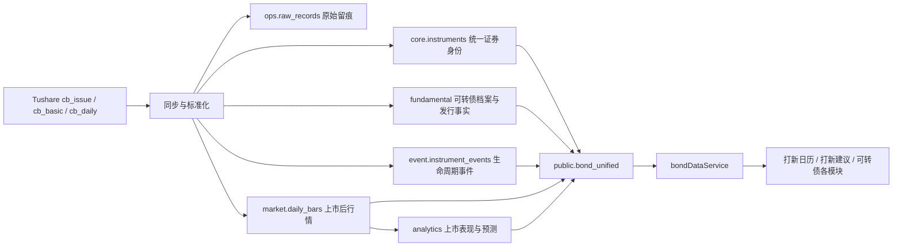

# 打新日历与可转债统一数据层直接切换研发方案

> 状态：研发已完成，待维护窗口执行生产迁移与验收  
> 日期：2026-08-12  
> 适用范围：打新日历、打新建议、可转债主档、发行数据、上市表现、可转债预测  
> 已确认决策：不做运行期双写，不保留旧读取兜底；所有调用方在同一版本直接切换；旧表仅允许保留离线回滚快照。

## 1. 目标

解决 `bond_history` 同时承担主档、发行事件、上市表现和兼容读取所导致的数据断层与职责混乱，使一只新债从发行前到上市交易后始终对应同一个 `instrument_id`。

完成后必须满足：

- 打新日历只读取数据库，不在页面请求过程中临时调用外部数据源。
- 新债在公告或申购阶段进入统一证券主档，上市后沿用原 `instrument_id`，直接接入行情、估值、周期和安全性模块。
- 发行事实、生命周期事件、上市表现分别存放，不再堆入一张历史兼容表。
- `bond_history` 从生产运行链路彻底移除。
- 打新建议继续严格只显示“下一个实际交易日”的申购建议和上市预测。
- 数据源首次全量入库，之后只做带重叠窗口的增量同步。

## 2. 架构结论

本方案符合现有统一数据层方向，但需要补齐“发行事实”和“证券事件”两个缺口。



产品和研发策略核查结果：

| 检查项 | 结论 | 落地要求 |
| --- | --- | --- |
| 证券生命周期统一 | 符合 | 发行前创建 `core.instruments`；上市后只更新状态和行情，不新建第二条证券 |
| 数据职责分层 | 符合 | 主档、发行事实、事件、行情、分析结果分层保存 |
| 统一读取 | 符合 | 页面和业务服务统一经过 `bondDataService`/`bond_unified` |
| API 调用成本 | 符合 | 首次全量、后续增量；原始响应入库，失败不清空旧数据 |
| 控制修改范围 | 符合 | 仅改可转债和打新链路，不迁移 `ipo_history`，不调整预测公式和页面 UI |
| 直接切换风险 | 可控 | 必须使用维护窗口、事务迁移、离线快照和成套回滚；禁止只回滚代码 |

## 3. 数据归属

### 3.1 `core.instruments`：唯一证券身份

继续作为可转债唯一主档，使用 `canonical_code` 唯一定位证券。

关键规则：

- 新债从 `cb_issue` 首次发现时即创建主档。
- `asset_class = 'convertible_bond'`。
- 状态按生命周期更新：`announced`、`subscribing`、`pending_listing`、`listed`、`delisted`。
- 上市日期写入 `list_date`；上市后行情必须关联原 `instrument_id`。
- 正股通过 `stock_instrument_id` 关联，不以名称或六位代码作为长期关联键。

### 3.2 `fundamental.convertible_bond_profiles`：债券档案

保留现有表，继续保存不会按发行事件重复出现的债券档案：

- 正股关联；
- 债券简称、正股简称；
- 转股价、转股起止日期；
- 到期日期；
- 债项/主体评级；
- 剩余规模等档案字段。

### 3.3 新增 `fundamental.convertible_bond_issuance`：发行事实

一只债券一行，建议字段如下：

| 字段 | 类型 | 单位/说明 |
| --- | --- | --- |
| `instrument_id` | `BIGINT PRIMARY KEY` | 关联 `core.instruments` |
| `issue_type` | `TEXT` | 发行方式 |
| `issue_price_yuan` | `NUMERIC` | 元 |
| `issue_size_100m_yuan` | `NUMERIC` | 亿元 |
| `shareholder_allotment_ratio_yuan_per_share` | `NUMERIC` | 元/股 |
| `online_size_100m_yuan` | `NUMERIC` | 亿元 |
| `offline_size_100m_yuan` | `NUMERIC` | 亿元 |
| `online_purchase_accounts_10k` | `NUMERIC` | 万户 |
| `shareholder_allotment_quantity` | `NUMERIC` | 张 |
| `source_id` | `SMALLINT` | 关联 `ops.data_sources` |
| `source_updated_at` | `TIMESTAMPTZ` | 上游更新时间 |
| `raw_payload` | `JSONB` | 原始记录留痕 |
| `updated_at` | `TIMESTAMPTZ` | 本地更新时间 |

金额和数量必须在入库处统一换算，字段名直接体现单位，禁止调用方再次猜测或换算。

### 3.4 新增 `event.instrument_events`：证券生命周期事件

现有 `event.company_events` 强制关联公司，不适合直接表达债券申购和上市事件，因此新增证券级事件表。

建议字段：

```sql
event.instrument_events (
  event_id BIGSERIAL PRIMARY KEY,
  instrument_id BIGINT NOT NULL REFERENCES core.instruments(instrument_id),
  event_type TEXT NOT NULL,
  event_date DATE NOT NULL,
  source_id SMALLINT NOT NULL REFERENCES ops.data_sources(source_id),
  document_id BIGINT NULL REFERENCES event.documents(document_id),
  source_key TEXT NOT NULL,
  details JSONB NOT NULL DEFAULT '{}'::jsonb,
  source_updated_at TIMESTAMPTZ NULL,
  created_at TIMESTAMPTZ NOT NULL DEFAULT NOW(),
  updated_at TIMESTAMPTZ NOT NULL DEFAULT NOW(),
  UNIQUE (source_id, source_key)
)
```

首期事件类型固定为：

- `issue_announcement`：发行公告；
- `shareholder_record`：原股东配售股权登记；
- `online_subscription`：网上申购；
- `result_announcement`：发行结果公告；
- `listing`：上市。

索引至少包括：

- `(instrument_id, event_date DESC)`；
- `(event_type, event_date)`。

### 3.5 新增 `analytics.convertible_bond_listing_performance`：上市表现

旧字段 `first_day_return` 的实际业务含义是“首个非涨停日涨幅”，不能继续以“首日涨幅”命名。

建议字段：

| 字段 | 说明 |
| --- | --- |
| `instrument_id` | 统一证券 ID |
| `listing_date` | 上市日 |
| `observation_date` | 实际采用的行情日期 |
| `measurement_type` | 首期固定为 `first_non_limit_day` |
| `close_price` | 采用的收盘价 |
| `return_pct` | 涨幅百分比 |
| `formula_version` | 计算公式版本 |
| `source_id` | 行情来源 |
| `raw_payload` | 计算依据 |
| `calculated_at` | 计算时间 |

唯一键：`(instrument_id, measurement_type, formula_version)`。

### 3.6 `predictions`：预测身份统一

在现有表增加 `instrument_id`：

- 历史可转债预测按标准代码回填 `instrument_id`；
- 可转债新写入必须携带 `instrument_id`；
- `code`、`name` 仅保留为预测当时的展示快照，不再作为关联主键；
- 完成回填后增加约束：`type = 'bond'` 时 `instrument_id IS NOT NULL`。

### 3.7 重建 `public.bond_unified`

视图只允许依赖：

- `core.instruments`；
- `fundamental.convertible_bond_profiles`；
- `fundamental.convertible_bond_issuance`；
- `event.instrument_events`；
- `analytics.convertible_bond_listing_performance`；
- 正股对应的 `core.instruments`；
- 必要的最新行情视图或 `market.daily_bars`。

通过事件聚合还原现有 API 所需的 `ann_date`、`res_ann_date`、`shd_ration_record_date`、`onl_date` 和 `listing_date`。视图定义中不得再出现 `bond_history`。

## 4. 同步链路

### 4.1 数据源和调用规则

- 发行数据：Tushare `cb_issue`。
- 档案数据：Tushare `cb_basic`，评级按现有可用接口补齐。
- 交易数据：Tushare `cb_daily` 入 `market.daily_bars`。
- 所有调用统一使用环境变量中的 `TUSHARE_TOKEN`，通过 `https://api.tushare.pro` 的官方 HTTPS POST JSON 协议访问，禁止代码硬编码或记录 Token。
- 上游原始响应先保存到 `ops.raw_records`，标准化成功后再更新业务表。

### 4.2 全量与增量

首次上线执行一次全量对账：

1. 拉取 `cb_issue` 和 `cb_basic`；
2. 保存原始响应；
3. 创建或更新证券主档；
4. 写入档案、发行事实和事件；
5. 关联正股；
6. 写入同步游标和质量结果。

日常同步：

- 以公告日/业务日期游标增量拉取，并保留 60 天重叠窗口处理上游修订；
- 接口不支持可靠增量时允许拉全量，但只更新内容发生变化的记录；
- `source_key` 建议格式：`tushare:cb_issue:{ts_code}:{event_type}:{event_date}`；
- 空结果、权限错误、超时或字段异常不得清空现有数据，也不得推进同步游标。

### 4.3 日历和建议生成

- 打新日历读取 `event.instrument_events` 和统一债券视图。
- `days=N` 必须严格按请求范围过滤，不能把后续全部日程返回。
- 打新建议先根据交易日历计算“当前时点之后的下一个实际交易日”，再只选该日的 `online_subscription` 和 `listing` 事件。
- 当下一个交易日无申购或上市安排时返回空列表，不允许回退到更远日期。
- 预测取不到时只标记该只证券缺少预测，不扩大日期范围，不用未来项目兜底。

## 5. 数据迁移与直接切换

迁移版本建议使用当前最新版本之后的下一个编号，例如 `058_convertible_bond_issue_unified`；开发开始前必须再次确认编号未被占用。

### 5.1 上线前只读审计

在生产库生成并保存审计结果：

- `bond_history` 总行数、唯一代码数、重复代码数；
- 能映射到 `core.instruments` 的数量；
- 正股关联缺失数量；
- 每个非空发行字段、事件日期和上市表现字段的数量；
- 可转债预测总数及可映射数量；
- 单位异常、非法日期和未知市场代码明细。

有任何无法唯一映射的记录时停止切换，先补数据规则，不允许静默丢弃。

### 5.2 事务迁移顺序

当前迁移框架不会自动包裹单个迁移，迁移函数必须自行取得同一个数据库连接并执行：

1. `BEGIN`；
2. 创建新表、约束和索引；
3. 从 `bond_history` 回填统一主档、档案、发行事实、事件和上市表现；
4. 回填 `predictions.instrument_id`；
5. 执行迁移内断言；
6. 重建 `public.bond_unified`；
7. 将旧表复制为只读离线快照，例如 `ops.legacy_bond_history_20260812`；
8. 核对快照行数后删除 `public.bond_history`；
9. `COMMIT`；
10. 任一步失败执行 `ROLLBACK`。

离线快照只用于回滚和审计，任何生产代码、视图、报表或脚本都不得读取或写入它；这不属于兼容双写。

迁移必须可重入。若业务事务已提交但迁移版本登记失败，再次执行时应能识别“目标表完整、旧表已归档”的状态，重新断言后安全结束。

### 5.3 迁移内硬性断言

- 旧债代码到 `instrument_id` 映射率为 100%；
- 一个可转债代码只对应一个 `instrument_id`；
- 旧表存在 `stk_code` 的记录，统一层正股关联缺失数为 0；
- 旧表每个非空发行字段迁移覆盖率为 100%；
- 旧表每个非空事件日期迁移覆盖率为 100%；
- 旧表每个非空上市表现迁移覆盖率为 100%；
- 所有 `type = 'bond'` 的预测均已回填 `instrument_id`；
- 新视图行数和唯一债券数与迁移规则一致；
- 任何断言失败时禁止删除旧表。

## 6. 研发改造清单

### 6.1 数据库和 Node 服务

- [x] `server/db/migrations.js`
  - 新增发行事实、证券事件、上市表现和预测关联迁移；
  - 完成事务回填、断言、离线归档和旧表删除；
  - 重建不依赖旧表的 `bond_unified`。
- [x] `server/services/convertibleBondAnalysis.js`
  - 删除 `bootstrapBondsFromHistory` 及其调用；
  - `cb_basic` 写档案，`cb_issue` 写发行事实和事件；
  - 发行前证券也必须创建统一主档。
- [x] `server/services/bondDataService.js`
  - 所有读取继续走新 `bond_unified`；
  - 删除基于旧表补主档的写入逻辑；
  - 将发行数据写入收敛为统一表幂等 upsert。
- [x] `server/scripts/backfillBondUnifiedLinks.js`
  - 改为从档案和统一主档补关联，或在迁移完成后删除；
  - 不允许保留旧表读取。

### 6.2 Python 打新和预测链路

- [x] `ipo-report/ipo_lib_fetch.py`
  - `cb_issue` 结果改写统一表；
  - 上市表现改写 `analytics.convertible_bond_listing_performance`。
- [x] `ipo-report/ipo_lib_prediction.py`
  - 历史实际值改从上市表现表读取；
  - 可转债预测按 `instrument_id` 写入和关联。
- [x] `ipo-report/ipo_lib_sector.py`
  - 市场温度所需历史涨幅改从上市表现表读取。
- [x] `ipo-report/ipo_lib_common.py`
  - 删除创建 `bond_history` 的 DDL；
  - 补充新表的最小兼容检查，不重复定义正式迁移。
- [x] `ipo-report/db_pg.py`
  - 删除旧表主键映射；
  - 增加新表映射或统一仓储方法。

### 6.3 旧维护脚本处理

以下脚本不得继续写旧表。仍有业务价值的改写到统一层；只服务旧表的直接删除：

- `ipo-report/backfill_bond_history.py`
- `ipo-report/backfill_bond_firstday.py`
- `ipo-report/backfill_bond_shd.py`
- `ipo-report/backfill_bond_ratings.py`
- `ipo-report/fill_ratings_batch.py`
- `ipo-report/generate_server_bond_sync.py`
- `ipo-report/generate_server_ipo_sync.py`
- `ipo-report/generate_server_ipo_reports_sync.py`
- `ipo-report/server_bond_sync.sql`
- `ipo-report/migrate.py`
- `ipo-report/deploy_server.py`
- `ipo-report/verify_server.py`
- `ipo-report/verify_ipo.py`
- `ipo-report/test_ipo_integration.py`
- `ipo-report/sql/schema.sql`
- `ipo-report/server_schema.sql`

删除文件前必须先确认没有部署任务、CI 或人工运维命令仍在调用。核心脚本删除属于本方案明确授权范围，不扩大到其他模块。

### 6.4 测试调整

- [x] `server/test/data-convergence-bond-master.test.js`
- [x] `server/test/data-convergence-ipo-read.test.js`
- [x] `server/test/unified-data-layer.test.js`

测试应改为验证新统一层，禁止继续把 `bond_history` 当作权威源。

### 6.5 文档同步

实现通过后更新：

- `docs/技术架构.md`：删除 `bond_history` 权威源、双读和兜底说明；
- `docs/生产部署流程.md`：补充直接切换和成套回滚顺序；
- `CHANGELOG.md` 和 `public/changelog.json`：记录用户可感知变化，不写内部密钥或连接信息。

## 7. 测试要求

### 7.1 数据库迁移

- 空数据库可完整建库；
- 含旧数据的数据库可一次升级成功；
- 人为制造映射缺失时，迁移回滚且旧表仍存在；
- 迁移重复执行不会产生重复事件、重复证券或重复预测；
- 迁移完成后 `bond_unified` 定义不包含 `bond_history`。

### 7.2 同步链路

- 未上市新债可从 `cb_issue` 创建主档、发行事实和事件；
- 同一新债上市后沿用原 `instrument_id`；
- 重叠窗口重复同步不产生重复记录；
- 上游返回空结果、超时或字段异常时，旧数据保留且游标不推进；
- 亿元、元、张、万户等单位分别有边界用例。

### 7.3 产品功能

- 打新日历按请求日期范围返回，不混入范围外项目；
- 打新建议只显示下一个实际交易日；
- 周末、节假日和调休后的下一个交易日计算正确；
- 当日无项目时返回空，不取更远日期兜底；
- 历史预测、上市实际表现和“无历史预测”状态正确；
- 可转债分析、安全性、周期、估值模块仍可读取上市后的同一只债券；
- API 同时保留六位 `security_code` 和标准 `canonical_code`，避免前端契约变化。

### 7.4 静态门禁

CI 增加旧表引用扫描：

```powershell
rg -n "bond_history" server ipo-report
```

允许名单仅包含本次迁移和明确的离线回滚脚本。运行服务、同步任务、报表、测试、部署脚本中命中数量必须为 0。

## 8. 上线步骤

由于不保留运行期兼容层，本次必须使用维护窗口，数据库和应用作为一个版本发布。

1. 合并代码后在生产同结构测试库完成全量迁移演练。
2. 执行生产只读审计并保存结果。
3. 备份生产数据库，确认可恢复。
4. 暂停可转债/打新定时任务，停止后台 worker，再停止 Web 服务，避免旧进程访问已删除表。
5. 发布新代码并执行数据库迁移。
6. 运行一次统一数据层全量对账同步。
7. 执行迁移验收 SQL、接口冒烟和核心测试。
8. 先启动 Web 服务，确认健康后再启动 worker。
9. 手工核对打新日历、下一个交易日建议及当日上市债券详情。
10. 观察一个完整同步周期后关闭维护窗口。

具体服务启停命令以当时已验证的 `docs/生产部署流程.md` 为准，文档不得假设未核实的进程管理方式。

## 9. 回滚方案

- 迁移事务未提交：直接回滚事务，旧系统保持不变。
- 迁移已提交但新版本验收失败：必须同时回滚数据库和应用，禁止只回滚应用代码。
- 优先使用上线前数据库备份恢复；也可通过专用逆向迁移将 `ops.legacy_bond_history_20260812` 恢复为 `public.bond_history`，完成校验后再启动旧版本。
- 离线快照不得被正常运行链路作为兜底读取。
- 回滚后恢复定时任务前，先确认没有新旧同步任务并发写入。

## 10. 验收标准

以下条件必须全部满足：

- [ ] 旧债到统一 `instrument_id` 的迁移覆盖率为 100%（待生产迁移执行）。
- [x] 标准债券代码重复数为 0（由主键和视图来源约束保证）。
- [x] 旧数据存在正股代码时，统一层正股关联缺失数为 0（迁移内断言）。
- [ ] 非空发行事实、事件日期和上市表现迁移覆盖率均为 100%（待生产迁移执行）。
- [ ] 所有可转债预测均有 `instrument_id`（待生产迁移执行）。
- [x] 生产运行代码和部署脚本对旧债历史表的引用数为 0。
- [x] `public.bond_unified` 不依赖旧表。
- [ ] 打新建议只返回下一个实际交易日的数据。
- [ ] 新债发行前、上市当天和上市后均使用同一 `instrument_id`。
- [ ] 打新日历、打新历史、可转债分析、安全性、周期、估值全部通过回归测试。
- [ ] 同步失败不会清空已入库数据或错误推进游标。
- [ ] 线上完成一个同步周期后无新增数据质量告警。

## 11. 不在本次范围

- 不迁移新股 `ipo_history`。
- 不改变现有预测模型和收益计算公式，只更换数据归属和关联键。
- 不调整打新页面 UI。
- 不新增 Tushare 之外的数据源。
- 不重构与本次可转债数据链路无关的模块。

## 12. 推荐研发顺序

1. 数据库迁移与目标表单元测试。
2. `cb_issue`/`cb_basic` 统一同步和幂等测试。
3. `bond_unified` 与 `bondDataService` 切换。
4. Python 打新、预测和上市表现链路切换。
5. 旧脚本删除或改造，增加静态门禁。
6. 全量迁移演练、数据对账和产品回归。
7. 更新架构与部署文档，按维护窗口上线。
