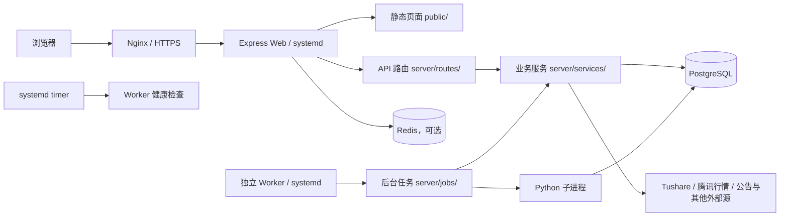
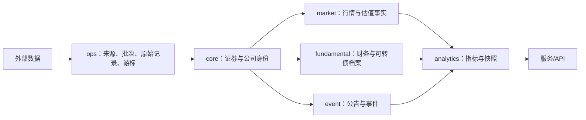

# 存在小站技术架构

> 本文描述当前代码实际实现，供后续开发、排错、数据维护和部署交接使用。
> 本文是整个项目技术架构的权威入口和长期项目记忆；影响架构的代码变更必须同步维护本文原有对应章节。
> 最后核对日期：2026-08-27。应用版本以根目录 `package.json` 的 `appVersion` 为准。

## 1. 系统定位

存在小站是一个单体 Web 应用，主要能力包括：

- 多用户、多券商账户的持仓、交易、现金流、净值和收益管理。
- A 股和港股行情、股票分析、可转债分析、安全性、周期和估值。
- 新股/新债打新日历与报告。
- 套利机会发现与跟踪（A股现金选择权/要约收购/换股吸收合并、港股私有化/供股权）。
- 股市波动、格雷厄姆指数、PE/PB/M2 市值比等市场周期指标。
- 知识文章、分类、评论、分享和后台管理。
- 图片识别、Excel 导入、邮件验证码和 AI 模型配置。

当前形态是“Node.js 单体应用 + PostgreSQL + 原生前端”。生产由 systemd 分别管理 Web、独立 Worker 和 Worker 健康检查定时器；Web 固定关闭调度，后台任务全部由 Worker 承担。

## 2. 技术栈

| 层级 | 当前实现 |
|---|---|
| 前端 | 原生 HTML、CSS、JavaScript；主站是 `public/index.html` 单页式界面，未使用 React/Vue |
| Web 后端 | Node.js 22+、Express 4、CommonJS |
| 数据库 | PostgreSQL，`pg` 连接池，启动时自动执行版本化迁移 |
| 会话/限流 | `express-session`；配置 Redis 后共享会话和限流，未配置时退回进程内存；登录态带会话版本号（`users.auth_version`），禁用/删号/改密/重置密码后旧会话立即失效 |
| 文件处理 | ExcelJS、Mammoth、Readability、JSDOM、DOMPurify、Multer |
| Python | 打新日报、可转债估值、公告/报告提取等离线或子进程任务 |
| 生产运行 | Nginx 反向代理、systemd 管理 Web/Worker/健康检查、腾讯云 Linux |
| 测试 | Node.js 自建测试入口 + Python 回归测试，统一命令 `npm.cmd run test:all` |

## 2.1 项目知识治理

项目事实统一存放在 Git 仓库，而不依赖任何 Agent 平台的私有记忆。`AGENTS.md`、`docs/知识索引.md` 与 `governance/knowledge-map.json` 构成最小入口：任务开始按描述路由，收尾按实际变更文件反向路由。`scripts/check-knowledge.js` 负责校验入口完整性及命中路由要求的文档更新，执行命令为 `npm.cmd run check:knowledge`，并由 CI 执行。

重要长期取舍记录在 `docs/decisions/`，重大或重复问题的根因与防复发证据记录在 `docs/incidents/`，跨会话任务交接使用 `docs/tasks/`。这些记录只补充本文件，不取代本文件对当前架构事实的权威地位。

## 3. 总体结构



浏览器只访问本服务，不应直接调用金融数据源。页面读取数据库或服务端缓存；后台任务负责增量采集、计算和落库。

## 4. 启动与请求链路

### 4.1 入口

- `server.js`：最薄启动入口，仅调用 `server/app.js` 的 `start()`。
- `server/app.js`：组装 Express、初始化依赖、注册路由、启动监听和调度任务。
- `server/worker.js`：可选独立任务进程；启用时 Web 必须设置 `DISABLE_SCHEDULER=1`，防止同一任务重复调度。

### 4.2 启动顺序

1. `initSchema()` 建立基础表并执行 `schema_migrations` 中尚未应用的迁移。
2. `ensureAdmin()` 确保管理员账户存在。
3. `migrateFromJson()` 兼容早期 JSON 数据迁移。
4. `ensureAiModelsInit()` 初始化 AI 模型配置。
5. 初始化 Redis；生产配置 `REDIS_REQUIRED=1` 时 Redis 连接失败会终止启动。
6. 注册会话、安全中间件、静态资源、API 和统一错误处理。
7. 监听 `PORT`，默认 3000。
8. 仅 `NODE_ENV=production` 且未设置 `DISABLE_SCHEDULER=1` 时，才在 Web 进程内启动后台任务；非生产环境禁止启动调度。

### 4.3 中间件顺序

请求体解析 → 请求 ID/访问日志 → Session → 未登录跳转 → 安全响应头 → 静态资源 → CSRF → 路由鉴权/限流/参数校验 → 统一错误处理。

修改顺序时要特别注意：Session 依赖 Redis 初始化；安全响应头必须在静态资源之前；错误处理中间件必须最后注册。

## 5. 前端结构

| 页面/目录 | 职责 |
|---|---|
| `public/index.html` | 主站壳，承载首页、持仓、交易、账户及各分析模块导航 |
| `public/login.html` | 注册、登录、找回密码 |
| `public/admin.html` + `public/js/admin.js` | 用户、券商、任务、AI 模型、知识内容和平台设置管理 |
| `public/ipo-report.html` + `public/js/ipo.js` | 打新日历、历史和报告 |
| `public/share-knowledge.html` | 知识文章公开分享页 |
| `public/js/` | 按业务拆分的页面控制器，如股票分析、可转债、知识、市场周期 |
| `public/shared/` | 持仓、费用、收益、交易、表格、行情等共享纯函数和组件 |
| `public/css/`、`public/shared/style.css` | 全局样式和各业务模块样式 |

前端通过 `/api/*` 与后端通信。新增功能应优先复用 `public/shared/` 和现有页面容器，避免另建重复状态和计算逻辑。

### 5.1 全局业务表格规范

所有新增或修改的业务数据表格统一以“上市可转债”列表为视觉和滚动交互基准。统一实现位于 `public/shared/style.css` 的 `.biz-table*` 样式和 `public/shared/business-table.js` 的表头吸顶、横向滚动同步逻辑；业务页面只需使用 `.biz-table-scroll` + `.biz-table`，禁止复制成多套页面私有实现。`biz-table--compact` 用于窄型指标表，`biz-table--detail` 用于键值详情表，`biz-table--matrix` 用于财务三表矩阵等明确例外。

| 项目 | 统一要求 |
|---|---|
| 容器 | 使用白色卡片，圆角 `10px`，轻阴影；工具栏位于表格上方并保持同一卡片视觉。 |
| 表头 | 高度不低于 `52px`，浅灰底 `#fafbfc`，文字 `#555`、`12px`、加粗、居中；短标题保持一行，超过约 6 个中文等宽字符时默认按字符中点换成两行，括号位于中点附近时才提前在括号前换行，不预留固定列宽，底部使用浅色分隔线。 |
| 表体 | 字号 `12px`，单元格居中、不换行，纵向内边距约 `9px`；数字使用等宽数字，行间使用浅色分隔线，悬停行为 `#f7fbff`。 |
| 涨跌颜色 | 中国市场口径统一为红涨 `#d93025`、绿跌 `#137333`；零涨跌使用普通文字颜色。 |
| 宽表格 | 表格按内容自然宽度布局，不主动用最小宽度或空白撑满容器；数据单元格不得为适配窗口而强制压缩或换行，表头允许按上述规则最多两行，超出部分仍通过横向滚动查看。 |
| 表头吸顶 | 页面纵向滚动时，完整列标题固定在当前页面二级导航正下方；定位二级导航必须使用当前页面作用域选择器，禁止使用可能命中其他隐藏页面的通用选择器。 |
| 横向滚动 | 浏览长表格时，横向滚动条固定在窗口底部并与表格双向同步；到达表格末尾、无需横向滚动或离开当前表格时自动隐藏。 |
| 排序与链接 | 可排序列的表头显示可点击状态；证券代码和名称沿用全站蓝色可点击样式。没有排序或跳转需求的表格不强制增加功能。 |

该规范约束视觉和通用滚动体验，不改变各业务表格的字段、金融公式、筛选条件和数据权限。键值详情、财务矩阵、导入预览等表格可使用上述变体，但必须保留统一字体、边框、颜色和横向滚动规则，并在页面样式中说明例外原因。

## 6. 后端分层

| 目录 | 职责 | 约束 |
|---|---|---|
| `server/routes/` | HTTP 协议、鉴权、参数校验、响应格式 | 不承载复杂采集和计算 |
| `server/services/` | 金融数据采集、业务计算、缓存和持久化编排 | 外部数据源和数据库规则集中在这里 |
| `server/jobs/` | 定时任务、补漏、任务锁和执行记录 | 必须幂等，失败保留上一份有效数据 |
| `server/db/` | 连接池、迁移、用户、账户、券商、任务锁和平台配置 | 通过 `server/db/index.js` 聚合导出 |
| `server/middleware/` | 登录与会话吊销（requireLogin/requireAdmin 统一校验用户存在、状态 active、会话版本一致）、CSRF、安全头、限流、校验和错误处理 | 新接口沿用现有中间件；禁止在各 routes 内另写第二套鉴权 |
| `server/scripts/` | Python/Node 数据回填、提取、审计脚本 | 不应成为页面实时依赖 |
| `server/test/` | 单元、接口、迁移和回归测试 | 新数据链路需补读写边界测试 |

## 7. API 模块

| 前缀 | 主要职责 | 主要鉴权 |
|---|---|---|
| `/api` | 注册登录、开放配置（/api/config 返回注册开关与邮箱可用性）、账户、持仓、交易、行情、导入、个人资料、版本记录 | 登录接口公开；账户和行情通常需登录；注册页显隐严格跟随 /api/config |
| `/api/admin` | 用户、券商、任务、模型、知识内容和平台设置 | 管理员 |
| `/api/stock-analysis` | 持仓/自选股票、三表快照、单股刷新 | 公开快照 `GET /:ts_code`、`/statements` 游客可读；`/stocks`、`/watchlist`、刷新需登录 |
| `/api/bond-analysis` | 上市可转债列表、搜索、详情和刷新 | 列表/搜索/详情只读；列表安全性列复用最新 `bond_safety_snapshots` 的四档评级；刷新需登录并限流 |
| `/api/bond-redemption` | 强赎进度、触发距离和官方强赎公告状态 | 只读；页面只读统一强赎状态视图 |
| `/api/ipo` | 打新报告、历史、日历 | 当前为只读接口 |
| `/api/bond-safety` | 安全性快照、导出、刷新 | 刷新需管理员 |
| `/api/bond-cycle` | 可转债周期聚合 | 只读 |
| `/api/bond-valuation` | 估值列表、详情、历史、预警和刷新 | 刷新需管理员 |
| `/api/knowledge` | 分类、文章、评论、导入和分享 | 写入需对应知识权限 |
| `/api/market-volatility` | 格雷厄姆指数、市场周期、策略边界和数据导入 | 设置需登录或管理员 |
| `/api/arbitrage` | 套利机会列表与详情（3类策略：A股套利/港股私有化/港股供股权） | 只读公开 |
| `/api`（position-comparison 子路由） | 仓位对比：公开状态、标杆列表、对比、复制测算 | 全部需登录；对比/测算限频 |

完整路由以 `server/app.js` 的挂载顺序和 `server/routes/` 目录为准。

### 7.1 页面级访问矩阵（ACCESS-01）

前端只维护一份页面级访问配置 `public/js/access-policy.js`，`switchMain()`、首次 URL 解析和导航显示共同使用，删除原独立的 `publicMain` 判断与 `switchMain()` 局部例外。口径：

- **游客可只读（无需登录）**：`home`、`knowledge`、`stock-analysis`、`bond-safety`、`market-volatility`、`ipo`、`arbitrage`、`changelog`。公开分析页只读取已有数据库快照；刷新、加入自选、评论、保存边界、个人设置、账户接口继续要求登录（由 `requireLogin` 拦截）。
- **需登录**：`holdings`、`profile`、`position-compare`。
- **作者/管理员**：在以上基础上叠加写权限，不改变公共读取范围。
- 游客直接打开 URL、导航点击、刷新页面三种进入方式结果一致；后端私有账户与写接口权限不变，不因页面公开而放开。

## 8. 数据库架构

可转债统一数据层的代码切换已完成；生产数据库迁移需在维护窗口执行，旧债历史表仅作为迁移事务中的一次性输入和离线回滚快照。

### 8.1 Schema 分工

| Schema | 职责 | 代表表 |
|---|---|---|
| `public` | 用户账户、持仓交易、知识、任务记录及公开兼容视图 | `users`、`accounts`、`positions`、`trades`、`nav_history`、`bond_unified`、`bond_safety_snapshots` |
| `ops` | 数据源、采集批次、原始响应、同步游标、质量问题、外部请求预算和按凭据/接口隔离的熔断 | `data_sources`、`ingestion_runs`、`raw_records`、`sync_cursors`、`data_quality_issues`、`external_call_budgets`（只计数，迁移076）、`external_circuits`（Token 指纹＋接口，迁移078） |
| `core` | 公司、证券主数据、代码映射、行业和控制人 | `instruments`、`companies`、`instrument_identifiers`、`company_instruments` |
| `market` | 日行情、估值、股本、汇率、交易单位、收益率和市场周期原始事实 | `daily_bars`、`daily_valuations`、`share_capital_history`、`fx_rates`、`instrument_trade_rules` |
| `fundamental` | 财报事实、公司行为、业绩预告、可转债档案、发行事实与条款 | `financial_reports`、`financial_facts`、`convertible_bond_profiles`、`convertible_bond_issuance` |
| `event` | 公告文档和结构化公司/证券事件 | `documents`、`company_events`、`instrument_events`、`convertible_bond_call_events` |
| `analytics` | 计算指标、页面快照、可转债强赎/上市表现、列表/周期/估值和市场周期结果 | `metric_values`、`analysis_snapshots`、`convertible_bond_trigger_daily`、`convertible_bond_call_latest`、`convertible_bond_listing_performance`、`convertible_bond_list_metrics_daily`、`convertible_bond_valuation_daily` |

### 8.2 标准数据流



核心关联应使用 `instrument_id` / `company_id`，外部代码保存到标识映射或原始记录中。日期、币种、单位、来源和公式版本必须可追溯。

### 8.3 兼容视图与统一服务的真实边界

- `public.bond_unified` 只合并 `core.instruments`、`fundamental.convertible_bond_profiles`、`fundamental.convertible_bond_issuance`、`event.instrument_events`、`analytics.convertible_bond_listing_performance` 和正股证券信息；`server/services/bondDataService.js` 提供统一读取。
- `public.stock_unified` 从 `core.instruments` 关联每只股票在 `market.daily_valuations` 中的最新一条估值；它是“单证券最新快照视图”，不是全市场任意历史日期的完整分区。
- 旧债历史表只在迁移 058 事务内作为一次性输入，完成覆盖断言后归档到离线快照并从生产库删除；正常服务、报表和脚本不得读取离线快照。
- 可转债发行事实、生命周期事件、上市流通规模和上市表现分别写入标准事实表；可转债预测通过 `predictions.instrument_id` 关联，`code/name` 仅作展示快照。新债估值同时保存转股价值、流通规模、未加流通调整的基础价格、流通调整百分点和模型版本，供后续按真实结果校准。
- 可转债主档同步由 `convertibleBondAnalysis.js` 和 Python 标准仓储负责，页面和 API 只读数据库；股票模块仍按自身标准事实表和快照运行。
- `server/services/financialDataArchitecture.js` 和 `server/services/convertibleBondAnalysis.js` 承担标准化表的主要写入；`server/services/market.js` 同时维护部分旧缓存和证券主数据。

旧表删除、标准化回填和视图重建由迁移 058 的事务与断言一次完成；失败时回滚，不允许运行期双写或读取兜底。

### 8.4 统一数据层读写矩阵

| 数据集 | 权威写入者 | 读取者 | 回退链 | 单位 | 更新频率 |
|---|---|---|---|---|---|
| 可转债基础信息（`bond_unified`） | 主同步 `saveProfile`（Tushare `cb_basic`）和 Python `bond_data_layer`（`cb_basic/cb_issue`） | `bondDataService`（打新日历/历史/报告） | 无运行期回退；失败保留上一份标准数据 | 发行规模：亿元；转股价：元；评级：文本 | 每日主同步 + 日历任务 |
| 可转债上市公告与流通解析 | 上交所 `sse_listing_announcements` 负责上市/退市日期、债券代码和官方公告编号；巨潮 `cninfo_announcements` 负责上市公告书 PDF、前十名持有人和限售明细；解析成功写入 `analytics.convertible_bond_listing_liquidity`，日报优先读库；Tushare `cb_basic` 仅作主档上市日基础来源 | Python `ipo_lib_fetch` / 打新日报 / 新债流通校准 | 上交所公告不含持有人明细，不能直接推算流通规模；巨潮公告书缺失时保留失败状态并记录官方上交所公告证据；空值或失败不覆盖已入库事实 | 发行/限售/流通规模：亿元；持有人数量：张；上市日：YYYY-MM-DD | 首次补近半年，之后新债上市时增量落库；公告检索按365天、最多5页 |
| 可转债正股关联（`stock_code`） | `saveProfile` / `bond_data_layer` 写入 `core.instruments` 和 `stock_instrument_id` | `bond_unified` 视图关联正股 `core.instruments` | 无运行期回退 | 标准代码：六位 + `.SH/.SZ` | 主同步 + 幂等回填脚本 `backfillBondUnifiedLinks.js` |
| 证券主档与代码映射（`core.instruments` + `normalize_stock_code` / `normalizeStockCode`） | 证券主档 `core.instruments` 由外部/Tushare 引导写入（种子数据，非归一化冲突点）；代码归一化为只读纯函数，无外部写入者 | 可转债正股关联（`bond_unified`）、其他需标准代码的模块 | 无（纯函数，无外部源）；`core.instruments` 缺失时由主档回填脚本补偿 | 标准代码：六位 + `.SH/.SZ` | 主档：引导写入；归一化函数随迁移 035 上线、规则固定 |
| └ DATA-02 数据集③ 收敛（可转债主档/正股关联/行情） | **写入者（统一）**：主同步 `saveProfile`（Tushare `cb_basic/cb_issue/cb_rating`）和 Python `bond_data_layer` 写入标准主档、发行事实、事件及 `market.daily_bars`。**唯一键**：`core.instruments.canonical_code`；发行事实按 `instrument_id` 幂等。 | **读取者（统一）**：`bondDataService`（`bond_unified` 视图）— `getBondList`/`getBondDetail`/`getActiveBondCodes`/`getRatingDistribution` 供打新日历/历史/报告。 | 无运行期回退；上游失败不推进游标且保留已入库标准数据。 | 发行规模：亿元；转股价：元；评级：文本；行情价：元 | **统一层核对**：`server/test/data-convergence-bond-master.test.js` 验证 `getActiveBondCodes()` ≡ 权威 SQL，且标准档案正股关联完整。 |
| └ 代码归一化规则（DATA-02 数据集① 双读核对） | JS `bondDataService.normalizeStockCode()` 与 SQL `normalize_stock_code()` 规则一致：空值→NULL、已带后缀原样返回、`0/3` 开头→`.SZ`、其余→`.SH`；与行情构造器 `toTsCode()` 在 A 股正股六位码空间等价（报告 P1-2：禁止两套代码规则并存）。测试见 `server/test/code-normalization-consistency.test.js` | — | — | — | — |
| 股票标准估值（`market.daily_valuations`） | `financialDataArchitecture.js`（个股分析落库）+ `convertibleBondAnalysis.saveFullStockMarketPartition`（可转债正股） | `stockDataService.getTotalMarketCap(tradeDate)`（按目标日聚合）；`stock_unified`（单券最新快照） | Tushare `daily_basic` | `total_market_cap`：元；PE/PB：倍数；`dv_ttm`：% | 个股分析手动 + 可转债主同步每日 |
| └ DATA-02 数据集② 收敛（股票行情/估值/财务事实） | **写入者（统一）**：`financialDataArchitecture.js`（个股分析流水线落库 `market.daily_bars`/`market.daily_valuations`/`fundamental.*` + 主档）+ `convertibleBondAnalysis.saveFullStockMarketPartition`（可转债正股行情同步）。**唯一键**：`(instrument_id, trade_date, source_id)`，按日幂等 upsert。 | **估值跨日全市场聚合**→`stockDataService.getTotalMarketCap(tradeDate)`（必须传目标日，拒绝全表混合）；**单券最新估值/行情/财务**→`stock_unified` 或 `stockDataService.getStockInfo/getLatestValuations`（预留）；**分析页读行情/财务**→`stockAnalysis.js` 直读标准层（正常分层，非散落旧链）。 | 行情/估值回退 Tushare `daily_basic`；财务回退 Tushare 财报接口；失败保留上一份有效快照 | `daily_bars.close`：元；`daily_valuations.total_market_cap`：元；财务字段见各 `fundamental.*` 表定义 | **双读核对**：`server/test/data-convergence-stock-valuation.test.js` 验证 `getTotalMarketCap` ≡ 权威聚合 SQL（总市值/证券数一致、按目标日仅含当日分区），并证明 `stock_unified`（单券最新）≠ 跨日聚合、不可混用。**旧链路决定**：跨日聚合调用方统一收敛到 `stockDataService`，`stock_unified` 仅保留用于单券最新展示，不删除（单券场景仍依赖）；禁止用 `stock_unified` 做跨日期全市场聚合。 |
| A 股总市值（`market.a_share_market_cap_daily`） | `marketVolatilitySync.syncAShareMarketCap`（统一层按日聚合且证券数 ≥ 4500 才启用，否则回退 Tushare `daily_basic`） | 市场周期页面（M2/市值比） | 统一层 → Tushare `daily_basic` → 保留上一份有效数据 | `total_market_cap_100m_yuan`：亿元 | 每次 `market_volatility_sync`（每日 18:45 + 启动） |
| 港股格雷厄姆利率替代基准（`market.sovereign_yield_daily`） | Tushare `us_tycr.y10`，写入 `US/10/tushare_us_tycr` | `calculateGraham` 计算港股时映射使用 | 使用美国十年期国债收益率；恒指 PE 仍取恒生指数公司官方文件 | 百分数 | Tushare 收益率更新后重算，市场波动任务负责校验 |
| M2 货币供应量（`market.money_supply_monthly`） | `marketVolatilitySync.syncMoneySupply`（Tushare `cn_m`，来源国家统计局） | `calculateM2MarketCap` | — | `m2_100m_yuan`：亿元 | 同上 |
| M2 市值比（`analytics.m2_market_cap_daily`） | `marketVolatilitySync.calculateM2MarketCap` | 市场周期页面 | — | `ratio_pct`：% | 同上 |
| 可转债强赎状态（`analytics.convertible_bond_call_latest`） | `calculateConvertibleBondCallStatus` 写入 `analytics.convertible_bond_trigger_daily`；`convertibleBondRedemptionSync` 将官方公告原始记录写入 `ops.raw_records`、结构化事件写入 `event.convertible_bond_call_events`；`market.trade_calendar` 保存 Tushare 真实开市日 | `/api/bond-redemption`、股债分析详情、上市转债列表、估值剩余期权窗口、`bond_unified` 生命周期过滤 | 强赎状态只发布同一交易日、同一 `call-v1` 公式版本的全市场结果；旧个券结果保留追溯但不得混入当前视图；正股缺口写入 `diagnostics.missing_dates`；公告按代码/名称唯一匹配，PDF按事件类型校验关键日期；计算覆盖不足时启动补跑，页面保留上一份有效快照；空值不以0代替 | 触发价/收盘价：元；进度：交易日数量（页面显示“已满足/要求 | 观察窗口”）；剩余规模：亿元 | 07:45 公告增量与正文解析、08:00 转债及正股行情/交易日缺口补齐、08:15 强赎进度/列表/估值串行更新；进程启动时校验强赎覆盖率并补跑本地派生计算 |
| 可转债估值/安全性/周期 | `convertibleBondValuationService` / `convertibleBondAnalysis` / `bondSafetyService`（仍直读各自事实表，属正常分层） | 各自路由；估值通过 `convertible_bond_call_latest` 读取官方停止转股日，安全性通过 `bond_unified` 复用生命周期，列表复用统一强赎触发价 | 安全性按计划业务日取上一交易日；Tushare `cb_basic` 生命周期日期统一为 `YYYY-MM-DD` 后再比较；标准发行事实中 `issue_type` 为“定向/私募”的未上市债券不计入安全评分覆盖分母；目标日空分区继续回查同日三接口；低覆盖、空结果或失败均保留上一份完整快照并记录诊断；水位校验取所有快照中的最新数据日期，避免较晚写入的旧日期快照造成误报 | 各自约定 | 各自定时任务 |
| 上市可转债列表（`analytics.convertible_bond_list_metrics_daily`） | `convertibleBondListService.buildDailyMetrics`：读取 `market.convertible_bond_daily_metrics`、正股行情/估值、可转债主档、财务缓存和基金持仓，批量计算并按交易日/公式版本幂等发布 | `/api/bond-analysis/bonds`、上市可转债子页 | 计算失败事务回滚，保留上一交易日有效快照；仅当前列表仍展示的字段缺失才标记 `partial`，不以 0 代替空值；资产负债率依赖财务缓存的资产总额和负债总额，缓存缺资产时由下一次安全性财务增量同步补齐；收益率允许接近 -100% 的高溢价临期债券 | 价格/估值：元；规模：亿元；成交额：万元；比例/收益率：小数（页面按百分比显示） | 08:00 行情完成后，08:15 与估值串行；目标日不完整时保留上一份有效快照并由统一任务退避重试 |
| 新股历史（`ipo_history`） | 独立 `ipo_history_sync.py` 通过 Tushare `new_share` 增量 upsert；每日定点补全行业、行业 PE、主营业务；日报仅补充当日详情，不再顺带同步历史 | `/api/ipo/history`、打新历史页面、预测校准（只读）；历史接口同时返回 `history_stage`、`field_status` 和 `data_as_of` | 启动追赶 + 60天重叠窗口；申购日已到但尚未上市的记录也进入历史；空响应/异常不覆盖旧值；缺字段按日限量补偿并保留 `source_payload.historical_enrichment` | 股数：万股；发行价：元；募资/公开发行市值：亿元；中签率：%；质量状态：`complete/missing/pending_not_due` | 工作日19:30 + 启动水位检查；日历从 `ipo_history` 事实表读取申购/上市事件 |
| 港股每手股数（`market.instrument_trade_rules`） | `server/jobs/hkTradeRulesSync.js`（Tushare `hk_basic.trade_unit` → `ops` 原始记录 → 主档 → 交易单位表，幂等；注册于 Web 默认调度 + worker，启动即跑一轮） | `server/services/tradeLot.js`（仓位对比复制测算；A 股按市场规则不落库）；同步后自动回填持仓 `instrument_id`（`backfillPositionInstrumentIds`，同迁移 037 规则） | 查询失败保留上一份有效规则 | 每手股数：股/手 | 启动补齐 + 工作日 20:30 增量同步 |

| └ DATA-02 数据集④ 收敛（打新兼容读取） | **写入权威源**：Python `bond_data_layer` 和 Node 主同步分别写入标准发行事实、生命周期事件与上市表现；主同步后自动调用 `backfill_bond_firstday.py`，仅补齐上市但缺少 `first_non_limit_day_v1` 事实的债券；预测写入携带 `instrument_id`。 | **读取者（统一）**：`bondDataService.getBondHistoryList`（`bond_unified` 视图）；返回 `security_code`（六位纯数字）+ `canonical_code`（带 `.SH/.SZ` 后缀，兼容旧六位调用方），并返回 `history_stage`、`field_status`。 | 无运行期回退；页面只读标准数据库；上市表现补偿失败不影响主同步，但输出剩余缺口并进入下一批。 | 发行规模：亿元；转股价：元；评级：文本；首日表现：% | **统一层核对**：`server/test/data-convergence-ipo-read.test.js` 验证标准视图每只证券均被读取者覆盖、编码兼容、已过滤定向/私募；历史接口质量状态用于前端区分待公告、待上市和待补全。 |
| └ DATA-02 数据集⑤ 收敛（市场周期和分析快照） | **市场周期写入者**：`marketVolatilitySync.calculateM2MarketCap` / `syncMarketVolatility`（Tushare 国债收益率、指数估值、M2 → `analytics.m2_market_cap_daily`、`market.index_valuation_history`、`market.market_valuation_daily`）。**分析快照写入者**：`stockAnalysis` / `financialDataArchitecture`（落库 `analytics.analysis_snapshots`）。 | **市场周期读取者（统一）**：`marketCycleMetrics.metricRows` / `getHistory`（按指标读 `analytics.m2_market_cap_daily` 或指数估值历史）。**分析快照读取者**：股票分析路由经 `analytics.analysis_snapshots` 读取。 | 市场周期回退 Tushare 原始接口；保留上一份有效快照（刷新失败不覆盖）。 | `m2_market_cap_daily.ratio_pct`：%；`m2_100m_yuan`/`total_market_cap_100m_yuan`：亿元；指数 PE/PB：倍数 | **双读核对**：`server/test/data-convergence-market-cycle.test.js` 验证 `getHistory('m2_market_cap')` ≡ 权威表 `analytics.m2_market_cap_daily`（日期序列、ratio_pct、M2/市值数值一致，单位 %）。**分析快照**：写入/读取统一走 `analytics.analysis_snapshots`，快照导入原子性由 `save-version-guard` 测试覆盖（失败不产生半写入）。**旧链路决定**：市场周期读取统一收敛到 `marketCycleMetrics`；分析快照读取统一收敛到分析路由，`analysis_snapshots` 保留为唯一权威快照存储。 |
> 单位铁律：`market.daily_valuations.total_market_cap` 为**元**；`market.a_share_market_cap_daily.total_market_cap_100m_yuan` 为**亿元**（元 ÷ 1e8）。Tushare `daily_basic.total_mv` 为**万元**（亿元 = 万元 ÷ 1e4）。任何模块迁移读写时须先核对单位，禁止混用。

## 9. 主要业务数据链路

### 9.1 持仓与收益

用户/账户 → `positions`、`trades`、`cash_flows` → 行情与每日收盘价 → `nav_history` → 前端收益和基准对比。所有查询和写入必须带 `username + account_name`，保持用户隔离。

收盘价、净值和任务业务日期统一按上海时区归一为 `YYYY-MM-DD`；PostgreSQL 的 `DATE` 读取为 JavaScript `Date` 时不得直接转字符串。收盘价和净值任务以 `accounts` 表遍历账户，`users.accounts` 仅保留兼容用途；已退市且无可用行情的退市债券按零市值处理，避免阻断整日净值补链。

`positions` 已增加 `instrument_id`（关联 `core.instruments`，迁移 036）；回填由迁移 037 执行（精确匹配→纯代码唯一匹配→未匹配写质量问题），`saveAccountData` 保存持仓时按 `code` 重新关联，避免 DELETE+重建清空回填映射；港股同步成功后自动回填补偿。

#### 账户账本整改（2026-08-03，迁移 042/043/044）

**核心原则**：交易、持仓、现金的关联修改必须在服务端同一事务完成（`server/services/tradeLedger.js`），前端不再自行实现持仓/现金计算规则。

- **字段语义**：`positions.price` = 当前行情价（只由行情刷新更新）；`positions.cost` = 移动加权成本（由账本事务维护）。交易录入永不修改 `price`。
- **交易字段**：迁移 042 为 `trades` 增加 `trade_date`（纯交易日 YYYY-MM-DD）、`executed_at`（成交时间）、`import_batch_id`（导入批次）；后台净值重放一律按 `trade_date` 比较，修复"当天带时间交易被字符串比较漏算"（方案 3.6）。
- **账本事务接口**（`/api/accounts/:name/ledger/*`）：`POST trades`（新增/替换）、`DELETE trades/:id`、`DELETE cash-flows/:id`、`POST position-events`（期初/调整）。校验：卖出不超过可卖数量（无持仓/超量拒绝）、`amount` 必须 = `price × quantity`（不一致拒绝）、费用非负。**禁止清空交易**（P1-1：清空破坏账实一致）。
- **删除交易**：无后续相关交易时反向撤销并重算；存在后续交易且重放会超卖时拒绝删除，提示用冲正交易。删除后服务端自动触发 `recomputeNav` 重算历史净值（P1-3 闭环）。
- **期初持仓（P0-2）**：`trades.direction` 扩展 `open`（期初建仓，等效买入计入成本、不产生现金）/ `adjust`（持仓调整，quantity=调整后目标数量，仅校正数量/成本、无现金变动）；智能导入持仓、直接编辑持仓、手动建仓均走账本事件，不再直接改 `positions` + 全量保存。
- **并发锁（P0-4）**：账本写事务先 `SELECT id FROM accounts ... FOR UPDATE` 锁账户行，同账户交易写入串行化，并发超卖只能一笔成功。
- **版本同步（P0-1）**：账本写操作在事务内同步提升 `account_data.version` 与对应数据集版本（pos/trade/cashflow/nav_version），旧页面全量保存无法覆盖新账本写入。
- **导入幂等（P1-4）**：`import_batch_id` 非空时按 批次+代码+交易日+方向+价格+数量 判重，服务端查重跳过（`uq_trades_import_dedupe` 唯一索引兜底）。
- **同日现金流（P0-3）**：`recordNav`（`core-returns.js`）同日覆盖时按完整时间戳比较，只计「快照时间之后新录入」的现金流；`nav_history.snapshot_at`（迁移 045）持久化快照边界，刷新后不丢。`account_data.nav_cash_cutoff` 记录结算边界。
- **数据库约束（P1-5）**：迁移 046 建 `chk_trades_price/qty/amount/fee`（兼容存量 0 价历史，禁负值）+ `chk_trades_direction`（buy/sell/open/adjust 四值）。
- **审计**：`auditAccountConsistency.js` 扩展账本检查（重复交易组 / 金额与价格×数量不一致 / 持仓数量与交易净数量差异 / 超卖历史缺口），只读不改数据。
- **旧全量保存已退役（2026-08-04 DATA-01）**：日常 `PUT /api/data/:name` 统一返回 410；整包导入改走专用 `POST /api/accounts/:name/import-snapshot`（强制全量覆盖、跳过版本校验、含账户归属校验与限频，导入后返回最新数据集版本号供前端同步）。前端 `saveData*` 死代码已删除。
- **行情刷新与总资产（2026-08-18）**：批量行情返回后，前端立即按实时持仓市值计算普通账户总资产；券商导入当天以导入持仓总值为准并叠加当日行情增量，从下一天开始直接采用系统按当前价格、数量和汇率计算的绝对持仓市值，不保留导入口径差异，并保证 `总资产 = 持仓市值 + 现金`。页面先渲染新价格与总资产，再调用 `PATCH /api/positions/prices` 落库；只有价格保存成功后才记录当日净值，指数同步继续异步执行。
- **持仓明细今日盈亏（2026-08-27）**：单只持仓的“今日盈亏”以当日行情的昨收/涨跌额为基准计算；当行情涨跌为 0 时，今日盈亏必须为 0。`previousPriceMap` 属于净值归因历史快照，只能用于累计或快照归因，不能代替日内昨收价。

#### 验收二轮修复（2026-08-03，迁移 046/047 补充）

- **replayNav 事件语义**：`heldQty`/`cashAsOf` 统一处理 open（累加数量不计现金）/adjust（目标数量绝对设置）/sell（减数量），净值重放与账本一致。
- **删除持仓事件化**：前端删除持仓走 `position-events` 的 adjust 清仓（quantity=0），不再直接删快照。
- **删除现金流用原日期**：`deleteCashFlow` DELETE RETURNING 读取原 date，历史净值从该日重算。
- **导入幂等含账户**：`uq_trades_import_dedupe` 索引含 username/account_name，同批次号跨账户不冲突。
- **净值备份还原带 snapshot_at**：`readEffectiveNavHistory`/`writeNavHistoryBoth` 全链路保留快照时间边界。
- **约束补全**：金额关系 `chk_trades_amount_rel`（NOT VALID 兼容存量错位）、全部费用非负 `chk_trades_fee_all`、交易日期格式 `chk_trades_trade_date`。
- **account_id 外键**（迁移 047）：六张业务子表加 `account_id` 列 + 回填 + `fk_*_account_id` 外键（NOT VALID），作为不可变账户主键基础设施；读写代码暂仍以 username+account_name 为准。

#### 券商收益历史导入与汇率口径（2026-08-15，迁移 072/073）

- **导入必填且权威**：`POST /api/nav/import` 每行必须有 `date`、`nav`、`totalAsset`、`invested`、`cash` 五项；同日导入覆盖系统快照，导入批次写入 `nav_import_batches`，按账户内容哈希幂等；`/api/nav/import/preview` 只读预览，`/api/nav/import/:batchId/rollback` 原子回滚。
- **导入历史清理**：导入事务提交前，以账户当前最新导入日期为边界，删除该日期之前所有 `snapshot_source <> 'imported'` 的非导入净值记录；更晚的非导入记录保留，避免旧系统快照继续混入收益历史。
- **Excel 导入兼容空现金列和重复日期**：前端自动识别“持仓现金”表头；现金列缺失或单元格为空时按 0 处理；同一天多条券商修订记录保留文件最后一行，再以 `cash: 0` 或对应现金值调用后端，非空现金值仍校验为非负且不超过总资产。
- **持仓数量不导入**：导入只替换账户级总资产、现金、净值和累计投入，`positions` 的代码、数量、成本不改。`market_value_cny = totalAsset - cash` 仅表示券商账户级持仓合计，不拆分到单只证券。
- **无长期“导入对账差额”**：导入行在 `nav_history` 标记 `snapshot_source=imported`、`source_priority=100`、`is_locked=true`；普通快照、行情刷新、全量保存不能覆盖或删除。系统不新建一笔虚拟资产来永久平账。
- **导入后计算公式**：最新导入日保存券商现金 `B_cash`、券商持仓合计 `B_pos`、当时系统持仓估值 `S_pos0`。导入日使用 `B_cash + B_pos`；从下一天开始：
  `effectiveCash = B_cash + 导入日之后现金流 + 导入日之后交易结算`；
  `effectivePosition = 当前系统按价格 × 数量 × 汇率计算的持仓市值`；
  `effectiveTotalAsset = effectiveCash + effectivePosition`。
  `B_pos - S_pos0` 不进入后续总资产；再次导入只重置现金和当日券商快照。
- **汇率差异说明**：券商总资产可能使用券商汇率，本系统逐证券明细使用系统汇率。导入日保留券商精确值；首个后续系统快照在涨跌浮框单独显示一次“导入口径切换差异”，说明汇率或收盘价更新时间造成的差异，之后不再保留或重复展示。
- **历史导入口径输入**：`S_pos0` 优先使用导入日 `daily_prices` 与该日系统汇率；导入日没有行情或行情不完整时，取导入日前最近一个“全部非零锚点持仓都有有效收盘价”的日期，并将该组前收固化到导入日、标记 `broker_previous_close`/`system_previous_close`，禁止混用不同日期价格；该值只用于导入审计及首次口径切换说明。缺少港股汇率时仍拒绝建立锚点。`/api/nav/import/preview` 返回实际行情日期和回退标记。
- **统一归因**：`server/services/navAttribution.js` 按统一区间计算价格、汇率、账本影响；若区间正好是“导入日→首个系统计算日”，额外返回一次性 `importBasisAdjustment`。`core-tables.js` 只展示后端结果；完整数据下各项与总资产变化闭合，缺数据时显示缺失状态。
- **持仓归因锚定**：存在券商导入的 `nav_position_snapshots` 时，历史持仓数量以最新导入快照为基准，只重放快照日之后的交易；若快照日后没有交易且当前持仓已校正，则以当前持仓现状覆盖旧快照数量，避免合法子账户拆分被误判为重复交易。无快照的历史账户继续沿用完整交易历史回放，并由一致性审计提示账实差异。
- **交易币种**：`trades` 同时保存原币 `amount`、`quote_currency`、`fx_rate_to_cny` 和 `amount_cny`；港股现金只使用人民币结算额，旧记录缺少结算额时标记 `needs_review` 并禁止静默计入历史重算。

### 9.2 仓位对比

公开状态 `accounts.position_visibility`（public/semi_public/private）→ 标杆列表 → 双方统一估值（同一批腾讯批量行情）→ 证券/资产类型/持仓细类对比与相似度 → 复制测算（`positionReplication.js`，交易单位由 `tradeLot.js` 提供：A 股主板 100 整数倍 / 科创板 200 起 1 股递增 / 港股查 `market.instrument_trade_rules`；买入预算仅限输入资金、增量扣款、港股先折算人民币、复制后现金占比方向正确）。半公开在服务端只脱敏标杆侧（删除标杆数量/市值/盈亏/总资产，保留我的）；对比/测算返回前再次校验标杆公开状态并同步最新状态标签。

- 持仓更新时间：`account_data.updated_at`（真实持仓保存时间），回退 `accounts.updated_at`；不用 `position_visibility_updated_at`。
- 汇率时间：实时抓取用抓取时刻；回退账户汇率用 `accounts.hk_rate_updated_at`（迁移 039 专用列，由 `ensureHkRate` / `saveAccountData` 在 hk_rate 变化时更新，不随持仓保存/公开状态修改而变）。
- 交易单位规则写入收敛于 `tradeLot.upsertTradeRule`：无变化不新增；同日变化直接 UPDATE 当天记录；跨天变化关闭旧规则 `valid_to=前一天` 再新增；`valid_from` 与东八区日期比较须先 `AT TIME ZONE 'Asia/Shanghai'` 转换（防 UTC 时区误判触发约束失败）。

### 9.2 股票分析

持仓/自选股票 → Tushare 财报、行情、估值 + 腾讯当前行情 + 公告/控制人来源 → 标准化 `core/market/fundamental/event` → `analytics.analysis_snapshots` 和概览 → 股票分析 API。

### 9.3 可转债

- 统一主链：Tushare 官方 API `cb_issue/cb_basic/cb_daily` → `ops.raw_records`、`core.instruments`、`fundamental.convertible_bond_profiles`、`fundamental.convertible_bond_issuance`、`event.instrument_events`、`market.daily_bars`。
- 可转债详情历史：`refreshConvertibleBondAnalysis` 以主档 `list_date` 为公告起点；主档缺少上市日时回退到 `value_date`，再由巨潮、上交所、深交所历史公告解析转股价调整和不下修记录。利息明细优先使用 `cb_rate` 或募集说明书解析结果，接口不可用时从已落库的 `rate_clause` 生成年度利率明细；PDF 解析器按 `IPO_PYTHON_PATH`、项目虚拟环境、`ipo-report/venv` 顺序选择 Python，并允许读取三家官方公告 PDF；详情页只读取 `analytics.analysis_snapshots` 和标准历史表，不调用受限的 `cb_price_chg`。
- 上市表现：首个非涨停日结果写入 `analytics.convertible_bond_listing_performance`；上市流通规模写入 `analytics.convertible_bond_listing_liquidity`；预测按 `predictions.instrument_id` 关联，`code/name` 仅作展示快照。
- 历史预测回滚与校准：`backfill_bond_liquidity_calibration.py` 按上市日顺序使用上市日前正股收盘价、评级、发行/流通规模和当时可见的市场样本回滚缺失预测，结果标记 `historical_rollback`；流通规模校准优先使用真实日报样本，真实样本不足时才使用历史回滚样本，并保留模型版本、样本来源和预测上下文。
- 安全性：财务缓存 + 债券/正股行情 → `bond_safety_snapshots`；计划实例的 `businessDate` 先由 `expectedDataDate('bond_safety_refresh', businessDate)` 换算为上一交易日，再通过 `runBondSafetyRefresh(reason, { targetTradeDate })` 传入数据源，禁止用服务器当前日期替代计划业务日。Tushare `cb_basic` 的 `YYYYMMDD` 生命周期日期先统一为 `YYYY-MM-DD` 再过滤；标准发行事实中 `issue_type` 为“定向/私募”的未上市债券不进入覆盖率预期集合。Tushare 行情按目标日向前最多回看 5 个开市日；每个候选日必须同时取得同一交易日的 `cb_daily`、`daily_basic`、`daily`，单个接口空分区只视为“尚未发布”并继续回查，权限、限流、网络和参数错误仍立即上报。显式目标日未形成完整分区时任务失败但不覆盖旧快照，并在任务结果保留目标日、候选日期、各接口行数和覆盖率诊断；任务水位校验取全部快照中的最新数据日期，不能因较晚写入的旧日期快照覆盖已有的前一交易日数据。
- 周期：每日可转债行情 → `market.convertible_bond_daily_metrics` → `analytics.convertible_bond_cycle_daily`。行情任务按计划槽位的 `businessDate` 计算上一交易日作为目标数据日，不使用服务器当前日期；主档同时要求正股存在于 Tushare `stock_basic(list_status='L')` 的上市列表，避免已退市正股继续污染活跃债券集合；`cb_daily` 目标日暂时空结果或派生字段覆盖不足时，继续检查最近 5 个开市日，保留上一份完整数据，不覆盖有效快照，并把候选日期、价格覆盖率和派生字段覆盖率写入任务结果诊断。
- 估值：周期完成后调用 Python 模型 → `analytics.convertible_bond_valuation_daily` 和预警表。
- 上市列表：沿用上述日行情事实和统一正股数据层，由 `convertibleBondListService` 计算 Excel 对应 34 列指标，写入 `analytics.convertible_bond_list_metrics_daily`；页面只读该表及同日行情，不触发外部 API。
- 打新：可转债发行事件和档案由统一标准表保存，日报/页面只读数据库；独立新股历史任务继续负责 `ipo_history`。首次全量入库，之后保留60天重叠窗口；缺字段每日补偿，首个非涨停日表现由 `backfill_bond_firstday.py` 按事实表缺口分批回填；任务使用 PG 锁、`job_runs` 和 `ops.sync_cursors`，外部失败不推进水位。历史页面按 `history_stage` 区分已申购、当日上市和已上市，按 `field_status` 区分待公告、待上市和待补全。已上市新债的转股价值与转股溢价率优先使用同一批腾讯转债/正股行情同步计算，腾讯失败时整组回退到 Tushare 完整交易日日线，禁止把真实转债价与旧正股价混算，也禁止把行情失败伪装成面值100。新债流通调整不再使用固定粗分档：按13档细分流通规模，以每只债的“实际首个非涨停日价格－未加流通调整的基础估值”除以上市前转股价值计算残差；近3个月权重70%，第4至6个月权重30%，窗口不足时使用近半年稳定项。同档没有样本时只允许合并紧邻档，禁止跨多个规模档凑样本；同档或紧邻档有1只即可启用，1只直接采用其实际残差，多只取中位数，达到10只后两端各截尾10%，最终限制在-25至+35个百分点，并禁止使用未来结果。新债上市展示直接使用不受首日交易上限影响的最终理论价，并按5元档向下取整；首日157.3元上限仅作为明细风险提示。页面区分“亏损 / 收盘后更新 / 无历史预测 / 待补全”。

### 9.4 市场周期

国债收益率、指数估值、M2、A 股总市值等事实 → `market.*` → 格雷厄姆指数和 M2 市值比等 `analytics.*` → 首页与市场波动页面。

### 9.5 知识模块

文章、分类、评论、分享和权限主要存放于 `public` 业务表；URL/文件导入经过服务端清洗后再保存，公开分享使用独立 token。

### 9.6 套利机会

公告检索（港交所披露易 + 巨潮资讯）→ `ops.raw_records` 原始记录 → `event.documents` 标准化公告 → `event.arbitrage_cases` 套利案件（3类策略：A股现金选择权/要约收购/换股吸收合并、港股私有化、港股供股权）→ 腾讯批量行情计算折价率/年化收益 → 公开列表（仅审核通过、未结束且核心计算条款完整的案件；关联公告已出现完成/终止信号时兜底隐藏）→ 管理后台审核/重新解析/手动同步。

- **数据库**：迁移054建立套利主表与公告链；迁移055增加稳定事件键、目标/参考固定换股价、解析状态/版本/置信度，以及逐公告的角色、解析结果、证据和版本。数据源代码 `hkex_announcements`/`cninfo_announcements`。
- **同步流水线**：首次1年同步（拆分为12+个月窗口）→ 增量同步（数据库日期游标统一转为 `YYYY-MM-DD`，并按月拆窗）→ 先识别完成/终止公告并关闭已有案件，再做标题分类 → 标准化入库（事务内创建 instrument → document → case）。港股分类同时读取公告标题和港交所 `LONG_TEXT` 分类标签，避免正式标题未直接出现“私有化”时漏收；巨潮额外检索B股转H股/境内上市外资股转换上市地方案，并将公告所属A股代码转换为实际享有现金选择权的B股代码，B股名称与港币行情通过腾讯缓存校验。完成/终止公告找不到旧案件时不新建案件；“免于发出要约”不归入现金要约套利。巨潮同时检索立案告知书、立案调查、行政处罚和监管措施等风险关键词；风险公告不新建套利案件，而是以公告证券代码关联到进行中的 A 股套利事件，保存为 `risk_event`。
- **解析补偿**：每次同步结束后限量补跑进行中事件里未解析或旧解析版本的正式条款、修订稿、摘要和预案；失败文档标记为 `failed` 并进入质量记录，避免无限重试。解析器版本升级时重新提取正文，不允许仅重新校验旧字段后改写版本号。
- **PDF解析**：Python PyMuPDF 提取正文，逐公告保存原始字段、证据、角色和解析版本；案件重建时先按公告日期、再按同日角色优先级合并。正文证券代码必须与A股事件目标一致；现金权、目标固定换股价、参考固定换股价组成独立字段，换股三元组必须来自同一份高优先级公告，禁止跨附件拼接。无法验证或存在冲突的案件只进入质量队列，不进入公开列表。合并方自身可展示现金权，但不计算自身换股套利。港股“现金+股权分派”只按确定现金计算，分派数量与公司估值写备注；公司股份回购在“要约人”列展示回购主体。供股比例可在整数关系成立时推导每股所需供股权份数，仍须识别临时代码后才能公开计算。
- **现金退出权术语**：将“异议股东收购请求权”和“现金选择权”统一映射为现金退出价格；遇到多标的吸收合并长句时，必须按证券代码反查目标简称并选择距离最近的具名条款，禁止湘财/大智慧、中金/信达/东兴等多主体之间串价。
- **公开列表**：各策略列表使用独立双向滚动容器和明确最小表宽，代码、名称及数值保持单行，备注列单独允许换行；字段标题在纵向滚动时吸顶。列表末尾统一展示案件备注与主公告链接，公告链接仅允许港交所披露易、巨潮资讯官方域名。
- **套利详情**：只有证券代码和名称作为蓝色详情链接；详情通过 `?main=arbitrage&case=<id>` 保存独立页面状态，进入时隐藏列表，返回时恢复列表，支持浏览器前进后退恢复。详情按当前策略完整复用列表字段，并继续展示公告链、理论对价等补充信息。换股吸收合并额外返回基于审核状态、公开进展、条款解析质量和风险公告的规则估计值 `successProbability`，并单独展示 `risk_event`；该值是可解释的风险评分，不是历史样本校准的统计概率。
- **公式版本**：v2.0。现金选择权同时输出“现价相对条款价的溢折价”和“条款价相对现价的预期收益”；换股同时输出固定条款溢折价和按参考证券现价计算的实时换股收益；供股权仍使用独立公式。
- **调度**：每日21:30上海时间增量同步 + 启动时断点补偿检查，PG advisory lock 互斥。

## 10. 外部数据源与缓存

| 数据源 | 用途 | 失败策略 |
|---|---|---|
| Tushare Pro 官方 API | 提供 A 股、财报、指数、可转债、交易日历、宏观数据及 `new_share` 新股发行清单；使用 `TUSHARE_TOKEN`，可配置 `TUSHARE_BACKUP_TOKEN` 作为失效、权限或额度异常时的备用 Token，通过官方 HTTPS POST JSON 协议调用 | 页面只读库；定时任务失败或可疑空结果保留旧数据并记录失败 |
| 腾讯财经行情 | 页面实时行情主源（A 股/港股/可转债） | 短 TTL 缓存、批量查询、失败回退 Tushare 日线；页面刷新不调用 Tushare `rt_min` |
| 巨潮资讯、上交所、深交所 | 公告、报告、可转债条款和历史事件；其中上交所可转债上市/退市公告单独登记为 `sse_listing_announcements` | 官方信息优先，抓取失败不覆盖已有结果；上交所上市公告仅作生命周期佐证，不替代巨潮持有人明细 |
| 港交所披露易 | 港股公告检索（套利机会同步） | 域名白名单限制，失败保留旧数据 |
| 巨潮资讯公告检索 | A股公告检索（套利机会同步） | 按关键词/交易所/日期检索，失败保留旧数据 |
| 东方财富 F10 | 实际控制人等补充信息 | 作为补充来源并记录来源 |
| QQ 邮箱 SMTP | 注册、找回密码验证码和后台任务告警 | 用户已确认 SMTP 服务开启；配置或投递失败时记录错误，不影响业务任务执行 |
| 兼容 OpenAI 协议的视觉服务 | 交易截图识别 | URL、模型和密钥由环境变量控制，服务端白名单限制 |

外部接口首次全量后必须落库，后续使用游标、交易日或公告日期增量更新。空结果和异常值不得覆盖上一份有效数据。

页面实时行情统一使用腾讯批量行情（当前价、涨跌幅和行情时间来自同一条报价），数据库缓存命中时不访问上游；腾讯暂时不可用时回退最近有效缓存或 Tushare 日线。Tushare `rt_min` 仅保留给明确需要分钟级数据的专项任务，不参与普通页面刷新，避免触发其频率限制。

## 11. 后台任务

| 任务 | 默认时间（上海） | 说明 |
|---|---|---|
| 市场收盘价 | A 股/可转债/ETF 15:10，港股 16:10 | 写每日价格，港股完成后串行更新净值、指数和汇率 |
| 可转债主链 | 每日 08:00 按上一交易日目标数据日同步，并补齐 `market.trade_calendar` 与正股行情缺口；08:15 执行估值；进程启动时校验新版强赎覆盖率 | 行情 → 周期 → 正股缺口补齐 → 强赎进度 → 上市列表派生指标 → 估值 → 预警；强赎必须达到全市场覆盖且公式版本一致，目标日空数据或覆盖率不足时保留上一快照并有限回看 |
| 打新日历 | 工作日 18:00 | 调用 Python 日报脚本 |
| 新股历史同步 | 工作日 19:30；启动时检查水位 | `new_share` 名单/发行字段增量入库，补行业/行业 PE/主营业务、首日表现和质量状态；同一上海自然日最多一条运行记录；成功判定以同步游标或结果日期水位为准 |
| 市场波动 | 启动时一次，之后每日 18:45 | 国债收益率、指数估值、M2、市值和格雷厄姆指数 |
| 股票分析 | 每日 20:30 | 刷新所有用户持仓和自选股票；成功结果返回实际入库日期水位，无目标股票时按成功空跑处理，不触发数据日期告警 |
| 可转债安全性 | 每日 06:30 | 按计划 `businessDate` 取上一交易日；先统一 `cb_basic` 生命周期日期并排除标准发行事实中“定向/私募”未上市债券，再计算覆盖率；目标日数据未形成完整分区时向前最多回看 5 个开市日，覆盖率低于 `min(预期活跃债券数, max(90% 预期数, 100))` 不发布；水位校验取全部快照中的最新数据日期；无快照时启动后补一次 |
| 套利机会同步 | 每日 21:30 | 从港交所和巨潮资讯同步公告，识别套利事件并计算套利空间；启动时断点补偿 |

任务通过 PostgreSQL advisory lock、计划实例租约和 `job_runs`/`ops.sync_cursors` 留痕。Web 与 worker 只能有一个负责调度。持久化执行器为每个计划实例建立唯一 `job_runs`，子进程不再写嵌套运行记录；`job_runs` 同时记录 `external_call_count`、`external_sources`、`datasets` 和 `error_type`。

任务定义统一声明 `externalSources`、`retryPolicy`、`catchupMode` 和 `dataDatePolicy`。可执行状态仅为到期的 `pending` 或带未来 `next_attempt_at` 的 `failed`；`succeeded`、`degraded` 和未解除的 `blocked` 不进入业务执行队列。成功但水位落后只显示为 `degraded`，后续由调度同步入口只读数据库重验，不重新调用 Runner。外部任务先做数据库游标/业务表新鲜度门禁，`fresh` 结果的外部调用数为 0；任务结果返回的 `dataAsOf` 优先作为本次成功水位，数据库查询用于无结果时的交叉确认；无目标数据集的成功空跑明确标记为无需水位校验。手动补跑默认同样受门禁，只有管理员显式 `force=true` 才能强制重拉。`latest_only` 任务（打新日报、行情主档、个股分析、套利公告等）补跑窗口只生成一个最新计划实例，按日分区的收盘数据仍按缺失代码补齐。

可转债安全性财务缓存按证券增量刷新，单批最多 15 家（每家 3 个财务接口、最多 45 次调用），公司并发硬上限为 3；外部调用的数据集锁、预算计数和成功/熔断收尾复用同一数据库连接，禁止持锁期间再申请第二连接造成连接池互等。每批完成后跨到下一分钟再继续，旧缓存始终保留。这样即使 30 天 TTL 集中到期，也不会在数秒内耗尽主、备 Token 的分钟预算、耗尽数据库连接池并连带阻塞后续任务。可转债安全性和行情主档按前一交易日校验数据水位，遇到网络、证书或可疑空结果时按 15、60、240 分钟退避，空结果不再提前截断任务自有的四次尝试；行情主链每次回看最多 5 个开市日，并记录目标日、原始行数、有效收盘行数、价格覆盖率和转股/纯债价值完整度。休市日月度自愈由 Worker 每日检查一次是否需要更新，禁止使用超过 Node 定时器上限的 30 天 `setInterval`。后台“待处理告警”只包含仍需介入的故障；已发送的恢复通知和主备切换通知保留历史记录，但不计入待处理数量。

账户持仓和交易保存前统一调用前后端共用的 `code-classify` 归一化证券代码；已知港股名称被误识别为六位 A 股代码时，同时修正为五位港股代码、港股市场属性和港币币种，阻止无效代码进入收盘行情任务。

Tushare 请求现在保留上游 HTTP/业务错误码并分类为网络、空数据、限额、权限或参数错误；HTTP 429、HTTP 200 但返回“频率超限”、权限不足、Token 无效和当日次数耗尽由 Node/Python 统一识别。主备凭据可在后台“全局参数 → 外部 API 主备”中加密保存，未配置后台值时回退到 `TUSHARE_TOKEN` / `TUSHARE_BACKUP_TOKEN`。自动模式按每个 Token 的不可逆指纹和接口路由：接口限流及上游单接口日额度只熔断“Token＋接口”，Token 无效或本系统日预算耗尽才熔断整套 Token；不修改全局 `lastSwitch`，其他接口继续使用主 Token。`rt_min` 每分钟限流下一分钟只放行一个探测，请求成功关闭实际命中的接口或 Token 级通配熔断；探测遇到网络、空数据或结构错误时释放实际命中的探测占用并短暂退避；当日次数耗尽次日上海时间恢复；权限不足在 Token 配置变化后再测。参数错误不重试，网络错误短暂退避，空数据不熔断且保留上一份有效数据。预算计数只写 `external_call_budgets`，熔断状态只写 `external_circuits`；Token 更换后新指纹自动绕过旧状态。后台测试必须选择具体 Token 和接口，测试结果及主备当前接口熔断范围、原因和预计恢复时间均显示在设置页。Node 和 Python 成功切备用后统一发送带 `api_name` 的接口级告警，只有备用请求成功才报告“主 Token → 备用 Token”。

外部请求预算计数写入 PostgreSQL `ops.external_call_budgets`，Token＋接口熔断写入 `ops.external_circuits`，数据集并发锁使用 PostgreSQL advisory lock；三者职责分离，由 Node 服务和打新日报/新股历史 Python 子进程共用。Python 子进程通过 `EXTERNAL_CALL_GUARD=1` 启用同一套保护，业务错误也保留 `api_name` 进入任务编排层。过期的 `job_runs` 租约由 Worker 自动回收，活动运行每分钟续租。

> **单一任务注册清单（WORKER-01，2026-08-26）**：所有后台任务的「启动补漏 + 周期调度」统一收敛到 `server/scheduler.js` 的 `SCHEDULER_REGISTRY`，`server/app.js`（必须设 `DISABLE_SCHEDULER=1`，见 `deploy/portfolio-server.service`）与 `server/worker.js`（独立 systemd 进程，见 `deploy/portfolio-worker.service`）共用同一份，避免漏注册。注册表含 **10 个**周期任务 + **6 个**启动任务（新增 `redemptionStartupCatchup`，用于新版本强赎派生结果的本地覆盖补跑）。**生产固定拆分：Web 关闭调度，全部后台任务由独立 worker 进程承担；旧 cron/system timer 的 IPO 入口必须停用。**

> **非生产隔离（2026-08-16）**：`server/app.js`、`server/worker.js` 和 `server/scheduler.js` 三层都要求 `NODE_ENV=production` 才允许运行后台调度；`jobAlertMailer` 的创建、重试、恢复、手动重发和最终 SMTP 出口同样只允许生产环境。测试与本地开发即使加载了真实数据库或 SMTP 配置，也不会创建、修改或发送任务告警。

## 12. 配置与敏感信息

敏感信息只放项目根目录 `.env`，禁止写入代码、Markdown、日志或 Git。模板见 `deploy/.env.example`。

主要配置分组：

- 服务：`PORT`、`NODE_ENV`、`ALLOWED_ORIGIN`、`TRUST_PROXY`。
- 数据库：`DATABASE_URL` 或 `PGHOST/PGPORT/PGUSER/PGPASSWORD/PGDATABASE`，可选 `PGSSL/PGSSL_CA`。
- 会话：`SECRET`、`REDIS_URL`、`REDIS_REQUIRED`。
- 金融数据：`TUSHARE_TOKEN`、可选的 `TUSHARE_BACKUP_TOKEN`、腾讯行情 TTL、可转债同步并发和估值参数；外部请求保护可用 `<SOURCE>_PER_MINUTE_BUDGET`、`<SOURCE>_DAILY_BUDGET`（例如 `TUSHARE_PER_MINUTE_BUDGET`、`TUSHARE_DAILY_BUDGET`、`TENCENT_PER_MINUTE_BUDGET`）调整预算，未配置时使用代码内安全默认值。后台外部 API 参数保存在 `platform_config.external_api_configs`，凭据加密且接口只返回掩码；IPO Python 子进程由 Node 注入后台当前的主备凭据与模式，不单独保存密钥。
- 邮件：`SMTP_HOST/SMTP_PORT/SMTP_USER/SMTP_PASS`，任务告警另使用 `ALERT_EMAIL_TO/ALERT_EMAIL_FROM/ALERT_ENVIRONMENT`。未设置 `ALERT_EMAIL_FROM` 时默认显示“存在小站任务告警”。QQ 邮箱 SMTP 服务已由用户确认开启并通过真实发送测试（2026-08-13）；敏感值不得写入文档或日志。
- AI：`VISION_API_URL/VISION_API_KEY/VISION_MODEL`、允许的模型和主机白名单。
- 调度/脚本：`DISABLE_SCHEDULER`、`IPO_PYTHON_PATH`、`VALUATION_PYTHON`。

## 13. 运行、测试与部署

### 本地

```powershell
npm.cmd ci
npm.cmd start
npm.cmd run test:all
```

本地需要可访问的 PostgreSQL。只做代码审查或文档修改时无需启动服务；涉及运行行为时按 `AGENTS.md` 核对 `/health`、相关页面/API 和静态资源版本。

### 生产

- systemd 管理 `portfolio-server.service`、`portfolio-worker.service` 和 `portfolio-worker-health.timer`；Web 入口为 `server.js`，Worker 入口为 `server/worker.js`。
- Nginx 终止 HTTPS 并反向代理到内网 3000 端口。
- 标准流程是：版本记录 → 本地测试 → Git 提交并推送 → 服务器从 Git 同步 → `npm ci --omit=dev` → systemd 重启 Web/Worker 并启用健康检查定时器 → `/health` 和业务验收。
- `deploy/deploy_password.py` 在本地前置校验的 `git fetch` 固定使用 `C:/Windows/System32/OpenSSH/ssh.exe`；这样与 Windows 推送命令使用同一套已核验的密钥和 known_hosts，校验失败时不会连接生产服务器。
- 当前登录方式、服务器命令和不可跳过的门禁以根目录 `AGENTS.md` 和 `docs/生产部署流程.md` 为准。
- 数据库结构、历史数据或模型产物同步必须先获得用户明确同意。

## 14. 维护约定

1. 先确认当前权威数据表、写入者和所有读取者，再修改数据层；不要把兼容视图当成完整替代品。
2. Schema 变化只新增版本化迁移，保持幂等；不得直接改生产表后不留迁移。
   - 收盘价历史日期由迁移 069 归一为 `YYYY-MM-DD`；若标准日期记录已存在，迁移 070 删除同账户、同证券、同日期的旧英文格式重复行，避免唯一键冲突后遗留脏数据。
3. 金额、市值、收益率、股本必须明确单位。Tushare `total_mv/circ_mv` 上游单位是万元，标准化 `market.daily_valuations` 当前按元保存。
4. 历史同步必须按目标日期读取同日期分区，不能用“每只证券最新值”代替历史截面。
5. 新数据源先定义全量范围、增量范围、唯一键、缓存周期、失败保留和补漏策略。
6. 空值、异常值和外部失败不覆盖旧有效数据；任务失败必须写执行记录。
7. 数据层切换必须验证数量、日期、单位、关键字段和同类对象覆盖范围；可转债统一层不保留运行期双读或旧表兜底。
8. 用户账户数据始终按用户名和账户名隔离；管理接口必须复用现有权限和审计（统一使用 `server/middleware/auth.js` 的 `requireLogin`/`requireAdmin`，不得在 routes 内重复实现）。
9. 前端不重复实现后端已有金融公式；共享计算优先放 `public/shared/` 或后端服务层。
10. 详细数据模型设计见 `docs/股票分析数据库整体设计方案.md`，部署铁律见 `docs/生产部署流程.md`，版本历史见 `CHANGELOG.md`。
