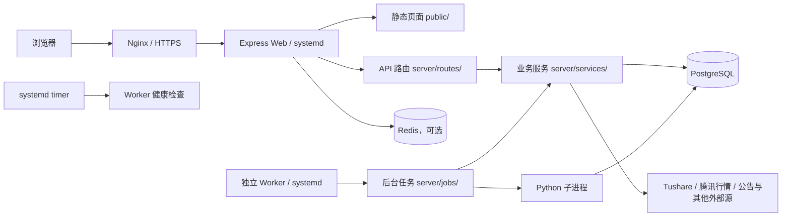
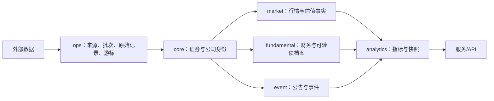

# 存在小站技术架构

> 本文描述当前代码实际实现，供后续开发、排错、数据维护和部署交接使用。
> 本文是整个项目技术架构的权威入口和长期项目记忆；影响架构的代码变更必须同步维护本文原有对应章节。
> 最后核对日期：2026-09-19。应用版本以根目录 `package.json` 的 `appVersion` 为准。
> 2026-09-19 版本 0.8.1.70：`dependency_blocked` 槽位告警允许进入既有的中立恢复证据层，只有原槽位成功且运行、阶段、严格分区和水位证据完整时才能收敛；`data_quality` 槽位告警仍被拒绝，必须使用对应数据集分区证据。提交 `c46a79b` 已完成标准生产发布，三日可转债行情、估值和安全评分均成功；预览通过后仅关闭依赖阻塞告警 `21206`、`21189`，相关业务告警现均已收敛。
> 2026-09-19 版本 0.8.1.69：可转债行情目标集合统一复用安全评分的数据口径，先规范化 `cb_basic` 生命周期日期，再要求目标日已有上市事实并排除已退市、到期、停止转股、定向及私募债券。生产只读对账确认 2026-09-18 的公开在市集合为 310 只，`cb_daily` 310/310 均有价格；旧代码因把 `YYYYMMDD` 与 `YYYY-MM-DD` 直接比较并允许空上市日，误造 140 条缺口。提交 `5277bf4` 已完成标准生产发布，线上版本、就绪状态和 Web/Worker/健康检查定时器均验收通过；用户授权后的三日生产补跑均成功，结果见 0.8.1.70 条目。
> 2026-09-18 版本 0.8.1.68：0.8.1.67 已将 208 条未完整解析收敛至华源转债 1 条；其正文明确披露“到期日为 2024年11月27日”及无法实施有条件赎回。至到期证据解析现同时接受“将于某日到期”和“到期日为某日”，仍要求无法办理/实施/行使赎回的同段正文证据。生产最终重建已验收：四组重复质量记录仅清理 4 条重复 `open`，投影发布 1172 条、质量状态 `passed`，独立游标推进至 2026-09-17，810649/810650 重试成功，线上健康检查为 `ok/0.8.1.68`。
> 2026-09-18 版本 0.8.1.67：生产断点重建确认 208 条未完整解析中 204 条是深交所公告列表与 PDF 正文共用匿名 `*` 单并发槽位造成的 `BUDGET_WAIT`，不是日额度耗尽；现将列表标识为 `announcement_list`、正文标识为 `document`，分别执行并发保护。其余边界按事实治理：募集资金理财赎回不进入强赎，无法实施有条件赎回按 `waive/through_maturity`，公告“日/月”排版错误可保守纠正，更正公告仅在同债同类主公告存在时去重。
> 2026-09-18 版本 0.8.1.66：强赎分类明确排除仅涉及转股价格下修/向下修正的预计触发公告，此类事实继续由下修监控消费。强赎受控重建的基线外官方核验改为按库内生命周期覆盖窗口的转债正股定向查询，不再先翻页全市场公告；每只正股完整查询结果在 `data/rebuild-cache` 保存 24 小时检查点，失败或中断后只续跑未完成证券，不缓存分页不完整结果。
> 2026-09-18 版本 0.8.1.65：历史强赎公告既未写债券代码也未写债券简称时，生命周期兜底优先选择公告日唯一具备明确上市日期的存续转债，避免无上市日的定向转债与公开上市转债同时成为候选；显式代码/简称仍优先，多只已上市债同时存续时仍阻断。
> 2026-09-18 版本 0.8.1.64：强赎公告分类将“预计触发”归为 warning、将“兑付结果”归为 completion；完成结果以官方结果公告及公告日确认完成，不强制结果公告重复披露赎回登记日/价格。锁定区间解析支持“YYYY年M月D日起至YYYY年M月D日”。法律/核查意见仅在同债、同事件类型、前后 3 日已有正式公告时作为重复辅助文件跳过独立投影，身份匹配仍保留；无正式公告陪伴时继续进入严格门禁。
> 2026-09-18 版本 0.8.1.63：历史强赎公告未写债券简称或代码时，在同一正股的 `cb_basic` 候选中按公告日上市/退市生命周期选择唯一存续转债；只有唯一命中才接受，并同步补齐转股起始日。若同日仍有多只存续债则继续阻断，不能按顺序或最新债猜测。
> 2026-09-18 版本 0.8.1.62：强赎受控重建遇到现有映射无法唯一确认的历史公告时，才按需读取一次 Tushare `cb_basic` 全量权威快照；按正股代码、公告内官方转债简称/债券代码和公告日生命周期（退市后保留 45 天结果公告窗口）唯一匹配。只有全部 39 条明确转债公告均唯一命中后，才在最终替换事务中补正本批债券的标准简称、上市/退市/到期日期与 Tushare 标识；原始申购简称继续保留在 `raw_data/raw_payload`，歧义项仍阻断发布。生产执行待标准部署后验收。
> 2026-09-18 版本 0.8.1.61：强赎公告受控重建遇到交易所匿名接口的瞬时单并发占用时，按 Guard 返回的恢复时间有界退避，最多重试 5 次、累计等待约 30 秒；分页不完整、权限拒绝和熔断仍立即保持失败，不绕过外部调用保护。
> 2026-09-18 版本 0.8.1.60：强赎公告受控重建优先复用生产既有事件的证券映射；统一交易所公告中只有标题具备明确可转债证据的未匹配项才阻断，普通公司债或资金产品“赎回”公告不进入强赎目标集。远程重建输出先写入临时日志再回传，避免业务进程结束后 SSH 输出通道悬挂；临时日志与基线在执行后统一清理。
> 2026-09-17 版本 0.8.1.59：强赎公告投影增加受控重建入口。生产修复先备份数据库，再把本地已验证的 `call-event-v3` 完整事件与公告正文基线写入现有 `event.documents`、`event.convertible_bond_call_events`；基线外只接受分页完整的上交所、深交所官方公告。全部目标事件完成证券匹配、正文提取和 v3 解析后，才替换历史重复/失败投影、推进独立水位、发布 `bond_redemption_events` 质量分区并重试当天失败槽位。历史质量记录保留并按重建证据标记恢复，不降低严格发布门禁。
> 2026-09-17 版本 0.8.1.54 已生产发布：港股持仓在交易时段通过 `/api/hkrate?realtime=1` 获取盘中汇率，5 分钟内复用数据库快照；港股收盘后 `hk_rate` 任务强制再抓一次最终值，失败才回退每日汇率接口。
>
> 港股 IPO 页面使用 `ipo_history.security_name_cn` 作为中文展示名；中文名缺失时前端显示“中文名待补”，不把港交所英文注册名直接当中文名。00100/03887/06880 的中文展示使用已审核的中文品牌别名。申购期认购倍数与配售结果最终倍数分开：前者写入 `analytics.hk_ipo_market_snapshots(signal_type='subscription')`，后者继续使用 `ipo_history.oversubscribe_multiple`。同一快照表保存 `livermore`、`vbkr-public` 与 `futu-public` 来源的市场信号及采集时间，接口失败只保留上一份有效快照；利弗莫尔历史接口仅在返回的截止日期仍覆盖业务日时补录申购期每日倍数，不能用上市后的最终倍数冒充实时值，申购实时接口返回空数据或升级提示时自动调用华盛公开新股接口作为备源，备源字段只标记为“预计孖展”，不冒充港交所最终超购。港股 IPO 三段任务在事实先落库后补全；对缺少中文主档名的港股按既有 `server/services/tencentQuote.js` 批量读取腾讯行情（最多 80 个、GBK 解码、短 TTL 缓存），仅将含中文的名称回填 `security_name_cn`，历史/详情接口继续只读缓存，不在页面请求时临时访问外部源。
> 2026-09-09 版本 0.8.1.3：港股历史报表补数的 `ipo_history` upsert 对文本、时间戳和数值占位参数显式标注 PostgreSQL 类型，避免真实生产库在 `$4` 等仅用于空值判断的参数上报类型不确定；不改变表结构或字段语义。
> 2026-09-10 版本 0.8.1.5：港股历史接口支持 `limit + offset + total`，页面默认读取 200 条并可继续分页，修复默认 50 条造成的历史截断；申购期任务在利弗莫尔实时接口返回空/升级提示时，改用同源历史接口按截止日校验后兜底写入 `subscription` 快照，原始载荷标记 `signal_kind=margin_estimate`、`signal_origin` 和采集时间，前端明确显示“预计孖展”；港交所配发/招股书补全不再仅凭 URL 复用未解析或误分类文件，增加解析证据门槛；新增 17600 类官方取消上市公告同步，将确认取消的 IPO 标为 `cancelled`。未新增表结构，未执行生产回补或部署。
> 2026-09-10 版本 0.8.1.5：港股历史接口支持 `limit + offset + total`，页面默认读取 200 条并可继续分页，修复默认 50 条造成的历史截断；申购期任务在利弗莫尔实时接口返回空/升级提示时，改用同源历史接口按截止日校验后兜底写入 `subscription` 快照，原始载荷标记 `signal_kind=margin_estimate`、`signal_origin` 和采集时间，前端明确显示“预计孖展”；港交所配发/招股书补全不再仅凭 URL 复用未解析或误分类文件，增加解析证据门槛；新增 17600 类官方取消上市公告同步，将确认取消的 IPO 标为 `cancelled`。未新增表结构，未执行生产回补或部署。
> 2026-09-10 版本 0.8.1.6：在同源历史兜底之外接入华盛公开新股接口（`vbkr-public`）。当利弗莫尔盘中接口为空、返回升级提示或请求失败时自动调用该备源，严格按本地申购窗口校验后写入独立来源快照；原始响应进入 `ops.raw_records`，预计值带来源和采集时间，主源恢复后不覆盖来源历史。新增迁移 150 配置来源级调用保护；未执行生产回补或部署。

> 2026-09-10 版本 0.8.1.15：IPO 晚间 `enrichment` 以“下一交易日申购日或上市日”为优先目标，修正目标日期字符串标准化、上市日排序和已有上市日期的待公告误标，保证发行阶段新股资料不会被较早历史缺口占用；本版本不新增表结构。
> 2026-09-10 版本 0.8.1.16：取消 IPO 资料补全固定 8 条业务上限，改为当前发行记录优先、历史缺口按 Guard 边界续跑；首日表现不再因 14 天/3 次规则永久放弃；A 股历史接口支持 `total + offset` 分页；主营业务保存完整文本；本版本不新增表结构。
> 2026-09-10 版本 0.8.1.17：修复 IPO 任务在触发外部 Guard 后返回 `datetime` 恢复时间、导致 Worker 结果摘要序列化失败的问题；恢复时间统一转为 ISO 文本，已完成的资料仍保留并由下一次计划续跑；本版本不新增表结构。
> 2026-09-15 版本 0.8.1.24：修复港股交易日历业务分区定向修复脚本的 PostgreSQL 参数类型声明，确保源分区 ID 能稳定写入审计诊断；不改变分区语义和幂等策略。
> 2026-09-15 版本 0.8.1.25：升级文件上传依赖 `multer` 至 2.4.0、邮件依赖 `nodemailer` 至 9.1.1，消除已知 DoS、文件句柄泄漏和邮件地址校验相关漏洞；不改变上传大小限制、鉴权或 SMTP 配置，生产发布后须按标准流程复核上传与邮件链路。
> 2026-09-15 版本 0.8.1.30/0.8.1.31：统一后台告警恢复证据、港币汇率时间型新鲜度和 IPO 核心/补全边界；0.8.1.31 补充 IPO Worker 失败路径的计划标记作用域保护。不新增数据库结构。
> 2026-09-15 版本 0.8.1.32：外部熔断等待槽位保持 `waiting_external`，不再被调度扫描中的旧失败运行记录覆盖；不新增数据库结构。

> 2026-09-16 版本 0.8.1.38：部署流程在发现生产 `.env` 明确残留 `VISION_MODEL=agnes-2.0-flash` 时，将其归一化为 `agnes-2.5-flash`；仅处理已废弃值，不覆盖其他合法模型配置，不涉及数据库或业务历史数据同步。
> 2026-09-16 版本 0.8.1.42：打新日报 Runner 按计划业务日计算下一个交易日作为报告目标日，避免把当天日期传给“明日建议”脚本；不新增数据库结构。
> 2026-09-16 版本 0.8.1.43：套利与可转债公告发现统一改走交易所官方接口；交易所失败或分页不完整时保留游标重试，不再自动回退 CNINFO；不新增数据库结构。
> 2026-09-16 版本 0.8.1.44：补充 0.8.1.43 生产部署与告警验收记录；不改变业务代码、不涉及数据库结构或生产数据同步。
> 2026-09-16 已发布能力：可转债上市公告书、前十持有人和流通规模补全先按正股代码/上市日期查询上交所或深交所官方公告 PDF；交易所无资料、下载失败或解析失败时，再以 CNINFO 同类公告兜底，来源按实际结果留痕。
> 2026-09-16 版本 0.8.1.45 生产验收：IPO 招股书、港股配发/取消上市资料、可转债上市流通/发行结果资料接入 Node/Python 共用的统一持久化 PDF 缓存；默认 30 天、总量 5 GiB，命中缓存不重复下载，不新增数据库结构。
> 2026-09-16 版本 0.8.1.45 生产验收：A 股 IPO 资料补全新增交易所发行公告解析，公告明确披露的所属行业和 T-3 静态行业市盈率优先于 Tushare；主营业务继续取交易所招股说明书，并由正文归类业务赛道。上交所 PDF 使用官方可下载镜像，来源 URL、标题、日期、正文哈希和解析器版本随补全结果留痕；不新增数据库结构。601091 已完成生产定向补全和预测重算，备份为 `/var/backups/portfolio/portfolio_20260916_215745.sql.gz.gpg`。
> 2026-09-16 版本 0.8.1.47 生产验收：A 股 IPO 资料补全新增交易所发行结果/中签率公告解析，601091 已写入网上有效申购倍数 `4960.63`、最终网上中签率 `0.04703721%`，质量状态完整；预测已按真实字段重算为 `165%`，建议评分 `258`。不新增数据库结构。
> 2026-09-16 版本 0.8.1.48：补充 0.8.1.47 生产数据和预测验收记录，不改变业务代码或数据库结构。
> 2026-09-16 版本 0.8.1.49：修复 AI 安全连接器与当前 `undici` 版本的兼容问题。固定公网 IP 时使用同一 `undici` 实例发起请求，并保留原主机名作为 TLS SNI；不改变 HTTPS、DNS 公网校验和同源跳转限制。
> 2026-09-16 版本 0.8.1.50：AI 固定连接在已校验公网地址中优先使用 IPv4；服务器无 IPv6 出口时不再固定到不可达的 AAAA 地址。
> 2026-09-17 版本 0.8.1.52 生产发布：可转债交易所公告分页增加总数/短页/空页/重复页完整性判断，交易所异常或分页不完整时自动切 CNINFO 批量备源；港股 IPO 配发结果排除澄清/更正公告，招股书候选排除供股等非 IPO 记录；市场波动任务取消内部 6 次单批调用上限，保留来源接口额度、熔断/并发和任务超时保护。
> 2026-09-17 版本 0.8.1.52 生产验收：补齐公告单标的分页、A 股套利 CNINFO 兜底、跨源公告逻辑键和双源证据；港股招股书终态统一写入 `data_completeness.prospectus` 并使用 `jsonb_set` 原子更新；可转债固定最近完成交易日，缺口队列写入 `ops.sync_cursors`，支持盘后腾讯定向补拉和 `partial_published`；市场周期拆分 M2 子阶段、取消任务级 6 次上限并增加计划实例 300 次累计止损；告警增加历史公平核对冷却、部分发布和来源备源 warning。迁移 157 已落库，服务与公开接口只读验收通过；未执行生产数据写入或历史补跑。
> 2026-09-17 生产补跑观察：港股 IPO 补全最新槽位已执行一次，当前外部来源额度/可用性仍不足而失败；失败状态、来源信息和后续重试边界继续由同一任务与 Guard 管理，不阻断核心事实链路。
> 2026-09-17 版本 0.8.1.53 生产验收：可转债行情状态统计修复后不再出现 `object is not iterable`；市场市值按最近已完成交易日读取 `daily_basic`，补跑槽位 `769355`、`832850` 成功，A 股市值、M2 市值比和 Graham 子数据均通过。目标日可转债行情以 `partial_published` 保存 255 条可信价格，140 条缺口进入 `ops.sync_cursors.cursor_payload.bond_daily_gap_queue`；公告主批次游标推进至 2026-09-17，但强赎旧文档解析缺口仍保持失败/告警，估值严格等待完整行情分区。
> 2026-09-17 版本 0.8.1.57 已生产发布：数据集告警作用域改用结果声明的目标分区日或任务策略期望日，不再直接使用槽位业务日；恢复证据同时核对 `dataset_code` 与注册表 `scope_key`。港股 IPO 四个成功收尾分支向 `ops.ingestion_runs.error_message` 写入空字符串，避免 PostgreSQL 非空约束把成功误判为失败。定向补跑后，`769365` 运行 `3059` 成功且无失败数据集，`810647` 运行 `3060` 确认 `2026-09-16` 仍有 `140` 条真实缺口。
> 2026-09-17 版本 0.8.1.58 已生产发布：`hk_ipo_enrichment` 在任务定义中声明固有 `mode='enrichment'`，默认调度槽位继承定义模式，恢复证据优先按定义模式校验，避免历史槽位残留 `core` 参数导致成功运行无法收敛告警；不涉及数据库结构迁移。线上提交 `f977ec6`，`/health` 和 `/ready` 均通过。

## 1. 系统定位

存在小站是一个单体 Web 应用，主要能力包括：

- 多用户、多券商账户的持仓、交易、现金流、净值和收益管理。
- A 股和港股行情、股票分析、可转债分析、安全性、周期和估值。
- 新股/新债打新日历与报告。
- 套利机会发现与跟踪（A股现金选择权/要约收购/换股吸收合并、港股私有化/供股权）。
- 股市波动、格雷厄姆指数、PE/PB/M2 市值比等市场周期指标。
- 知识文章、分类、评论、分享和后台管理。
- 图片识别、Excel 导入、邮件验证码和 AI 模型配置。

当前形态是“Node.js 单体应用 + PostgreSQL + 原生前端”。生产由 systemd 分别管理 Web、独立 Worker 和 Worker 健康检查定时器；Web 固定关闭调度，后台任务全部由 Worker 承担。

## 2. 技术栈

| 层级 | 当前实现 |
|---|---|
| 前端 | 原生 HTML、CSS、JavaScript；主站是 `public/index.html` 单页式界面，未使用 React/Vue |
| Web 后端 | Node.js 22+、Express 4、CommonJS |
| 数据库 | PostgreSQL，`pg` 连接池，启动时自动执行版本化迁移 |
| 会话/限流 | `express-session`；配置 Redis 后共享会话和限流，未配置时退回进程内存；登录态带会话版本号（`users.auth_version`），禁用/删号/改密/重置密码后旧会话立即失效 |
| 文件处理 | ExcelJS、Mammoth、Readability、JSDOM、DOMPurify、Multer |
| Python | 打新日报、可转债估值、公告/报告提取等离线或子进程任务 |
| 生产运行 | Nginx 反向代理、systemd 管理 Web/Worker/健康检查、腾讯云 Linux |
| 测试 | Node.js 自建测试入口 + Python 回归测试，统一命令 `npm.cmd run test:all` |

## 2.1 项目知识治理

项目事实统一存放在 Git 仓库，而不依赖任何 Agent 平台的私有记忆。`AGENTS.md`、`docs/知识索引.md` 与 `governance/knowledge-map.json` 构成最小入口：任务开始按描述路由，收尾按实际变更文件反向路由。`scripts/check-knowledge.js` 负责校验入口完整性及命中路由要求的文档更新，执行命令为 `npm.cmd run check:knowledge`，并由 CI 执行。

重要长期取舍记录在 `docs/decisions/`，重大或重复问题的根因与防复发证据记录在 `docs/incidents/`，跨会话任务交接使用 `docs/tasks/`。这些记录只补充本文件，不取代本文件对当前架构事实的权威地位。

## 3. 总体结构



浏览器只访问本服务，不应直接调用金融数据源。页面读取数据库或服务端缓存；后台任务负责增量采集、计算和落库。上市可转债列表首开和定时重读只读取 `analytics.convertible_bond_list_metrics_daily` 及同日标准行情，只有用户主动点击“刷新行情”才允许使用短 TTL 腾讯行情重算；可转债导航初始化只加载当前子页。持仓页的实时行情是明确的用户业务能力，刷新入口最多执行两次批量请求，不再逐只回退；净值对比指数只读取账户 `index_history`，由 Worker 的 `index_baseline/index_recent` 任务采集，页面和图表不再回源指数外部接口。

## 4. 启动与请求链路

### 4.1 入口

- `server.js`：最薄启动入口，仅调用 `server/app.js` 的 `start()`。
- `server/app.js`：组装 Express、初始化依赖、注册路由、启动监听和调度任务。
- `server/worker.js`：可选独立任务进程；启用时 Web 必须设置 `DISABLE_SCHEDULER=1`，防止同一任务重复调度。

### 4.2 启动顺序

1. `initSchema()` 建立基础表并执行 `schema_migrations` 中尚未应用的迁移；迁移序列在独立数据库会话持有 PostgreSQL advisory lock（`904000`），保证 Web 与 Worker 并行启动时只由一个进程执行未完成迁移。
2. `ensureAdmin()` 确保管理员账户存在。
3. `migrateFromJson()` 兼容早期 JSON 数据迁移。
4. `ensureAiModelsInit()` 初始化 AI 模型配置。
5. 初始化 Redis；生产配置 `REDIS_REQUIRED=1` 时 Redis 连接失败会终止启动。
6. 注册会话、安全中间件、静态资源、API 和统一错误处理。
7. 监听 `PORT`，默认 3000。
8. 仅 `NODE_ENV=production` 且未设置 `DISABLE_SCHEDULER=1` 时，才在 Web 进程内启动后台任务；非生产环境禁止启动调度。

### 4.3 中间件顺序

统计入口请求体预检 → 请求体解析 → 请求 ID/访问日志（含请求耗时；事件循环每分钟聚合 P50/P95/最大值） → Session → 未登录跳转 → 安全响应头 → 静态资源 → CSRF → 路由鉴权/限流/参数校验 → 统一错误处理。统计入口在解析前限制 32KB，普通业务上传仍保留原 15MB 上限。

修改顺序时要特别注意：Session 依赖 Redis 初始化；安全响应头必须在静态资源之前；错误处理中间件必须最后注册。

## 5. 前端结构

| 页面/目录 | 职责 |
|---|---|
| `public/index.html` | 主站壳，承载首页、持仓、交易、账户及各分析模块导航 |
| `public/login.html` | 注册、登录、找回密码 |
| `public/admin.html` + `public/js/admin.js` + `public/js/admin-analytics.js` | 用户、券商、任务、AI 模型、知识内容、平台设置和网站数据看板管理 |
| `public/ipo-report.html` + `public/js/ipo.js` | 打新日历、历史和报告 |
| `public/share-knowledge.html` | 知识文章公开分享页 |
| `public/js/` | 按业务拆分的页面控制器，如股票分析、可转债、知识、市场周期 |
| `public/shared/` | 持仓、费用、收益、交易、表格、行情等共享纯函数和组件 |
| `public/css/`、`public/shared/style.css` | 全局样式和各业务模块样式 |

前端通过 `/api/*` 与后端通信。新增功能应优先复用 `public/shared/` 和现有页面容器，避免另建重复状态和计算逻辑。
打新历史筛选标签统一显示为“A股、港股、可转债”，仅调整展示文案，内部筛选值仍保持 `stock`、`hk_stock`、`bond`。港股历史名称优先读取已入库的腾讯港股行情中文名称缓存，接口不在页面请求时临时调用外部行情；缓存缺失时保留原始主档名称。
打新建议结论统一按“证券名称-市场板块”展示，市场使用“沪市/深市/京市”，板块使用“创业板/科创板/主板”（例如“中塑股份-深市创业板”）；历史日报中的旧板块文案由前端兼容转换。

首页登录用户先请求 `GET /api/data/:name?scope=summary`，仅返回当前持仓、最新净值和现金汇总；完整交易明细、净值历史、指数历史及行情附加数据由后台继续请求，直接进入持仓页时仍等待完整接口。主站外部脚本使用 `defer` 按文档顺序执行，内联启动逻辑挂在 `DOMContentLoaded`；`autofill-guard.js` 保持同步执行。Chart.js、Vditor、marked、DOMPurify 等 vendor 资源均带版本参数，IPO 页面脚本 `public/index.html` 的 `js/ipo.js?v=` 与当前发布版本同步，避免旧缓存继续加载旧口径。

### 5.1 全局业务表格规范

所有新增或修改的业务数据表格统一以“上市可转债”列表为视觉和滚动交互基准。统一实现位于 `public/shared/style.css` 的 `.biz-table*` 样式和 `public/shared/business-table.js` 的表头吸顶、横向滚动同步逻辑；业务页面只需使用 `.biz-table-scroll` + `.biz-table`，禁止复制成多套页面私有实现。`biz-table--compact` 用于窄型指标表，`biz-table--detail` 用于键值详情表，`biz-table--matrix` 用于财务三表矩阵等明确例外。

| 项目 | 统一要求 |
|---|---|
| 容器 | 使用白色卡片，圆角 `10px`，轻阴影；工具栏位于表格上方并保持同一卡片视觉。 |
| 表头 | 高度不低于 `52px`，浅灰底 `#fafbfc`，文字 `#555`、`12px`、加粗、居中；短标题保持一行，超过约 6 个中文等宽字符时默认按字符中点换成两行，括号位于中点附近时才提前在括号前换行，不预留固定列宽，底部使用浅色分隔线。 |
| 表体 | 字号 `12px`，单元格居中、不换行，纵向内边距约 `9px`；数字使用等宽数字，行间使用浅色分隔线，悬停行为 `#f7fbff`。 |
| 涨跌颜色 | 中国市场口径统一为红涨 `#d93025`、绿跌 `#137333`；零涨跌使用普通文字颜色。 |
| 宽表格 | 表格按内容自然宽度布局，不主动用最小宽度或空白撑满容器；数据单元格不得为适配窗口而强制压缩或换行，表头允许按上述规则最多两行，超出部分仍通过横向滚动查看。 |
| 表头吸顶 | 页面纵向滚动时，完整列标题固定在当前页面二级导航正下方；定位二级导航必须使用当前页面作用域选择器，禁止使用可能命中其他隐藏页面的通用选择器。 |
| 横向滚动 | 浏览长表格时，横向滚动条固定在窗口底部并与表格双向同步；到达表格末尾、无需横向滚动或离开当前表格时自动隐藏。 |
| 排序与链接 | 可排序列的表头显示可点击状态；证券代码和名称沿用全站蓝色可点击样式。没有排序或跳转需求的表格不强制增加功能。 |

该规范约束视觉和通用滚动体验，不改变各业务表格的字段、金融公式、筛选条件和数据权限。键值详情、财务矩阵、导入预览等表格可使用上述变体，但必须保留统一字体、边框、颜色和横向滚动规则，并在页面样式中说明例外原因。

下修动机详情页的输入快照属于键值详情例外：使用 `motive-input-table` 固定列宽并允许长说明在单元格内换行；详情页蓝色标题保持上下居中，五维评分区域同时展示五项合计（满分 100 分）。列表“动机等级”对所有转债保持可点击；回测未通过时展示同一评分日、同一模型横截面的相对研究等级，不把它描述成下修概率或预测结论。

### 5.2 可转债功能页统一视觉规范

强赎监控、下修监控和可转债安全性属于同一功能族，必须共同使用 `public/shared/style.css` 的 `.bond-feature-*` 样式，不得在页面 CSS 中重新定义另一套颜色、字体或控件尺寸。统一口径为：标题区蓝紫渐变 `#3f51b5 → #5c6bc0`、标题 22px 白色、说明 13px 浅蓝白色、更新时间 12px；统计卡片白底、10px 圆角、轻阴影、标签 12px、数值 22px；工具栏输入框/下拉框高度 36px、7px 圆角、边框 `#d8dee8`、聚焦色 `#1a237e`；辅助文字 `#7a8495`，证券链接 `#1769aa`。新增可转债功能页必须复用 `.bond-feature-hero`、`.bond-feature-stats`、`.bond-feature-stat`、`.bond-feature-toolbar`、`.bond-feature-updated` 和 `.bond-feature-quality`，业务 CSS 只保留列宽和状态颜色等必要差异。

工具栏字体必须使用固定像素值：搜索框、下拉框和筛选标签统一为 13px，禁止使用 `font: inherit` 或相对字号；复选框固定为 14×14px，且不得套用普通输入框的 36px 高度和最小宽度。

可转债周期页的“导出图片”由 `public/js/bond-cycle.js` 生成 2 倍分辨率 PNG，并在最终图像边缘绘制 1px 黑色边框。

以上表格和工具栏尺寸为桌面规范；移动端统一覆盖见第 5.3 节。

### 5.3 移动端兼容与前端开发标准

所有后续前端改动必须同时考虑手机和桌面，范围包括主站栏目、独立详情/阅读页、登录及后台。全站复用原生 HTML/CSS/JS，不另建移动版站点、权限表、数据状态或取数链路。

- **共享入口**：`public/shared/mobile-ui.js` 已接入 6 个 HTML 入口，负责手机导航、账户工具条位置、分类/目录展开、估值次要筛选收起，以及弹窗焦点、正文滚动和动态可视区域。菜单直接移动原节点，保持既有事件、账户值和 `ACCESS_POLICY`；切回桌面恢复原位置。`navigation.js` 切页后同步当前栏目与浮动组件。
- **布局**：正文 760px 及以下按单列/紧凑统计双列排布；导航 900px 及以下进入折叠菜单。共享尺寸在 `shared/style.css`，业务 CSS 只保留字段和内容差异。手机页面左右 12px、正文 15～16px、表格正文 13px、输入/下拉 16px、操作区域至少 44px；桌面继续使用第 5.1、5.2 节尺寸。保留浏览器缩放，结合安全区与 `visualViewport` 高度调整弹层。
- **表格**：`BusinessTable` 提供局部横滑提示、当前导航下缘定位和名单身份列。上市转债、强赎、下修、安全性与持仓表的名称列附带代码；原独立代码列、字段和排序入口保留。手机浮动表头按源表头身份列的实际位置对齐，避免横向滚动量重复补偿造成名称列错位；桌面保留底部同步滚动条，手机直接滑表格。自动发现的只读滚动区域不与业务注册重复建表头，筛选重绘后恢复提示，移除页面时清理浮动节点。财务矩阵与键值详情使用原有例外样式。
- **图表**：`shared/chart-interaction.js` 统一点按、鼠标提示、外部点击/滚动/取消关闭、视口内定位及按宽度重绘。首页和股票估值/市场周期使用容器宽度，密集财务/周期图保留局部横滑。重绘只使用缓存数据，并恢复未提交的输入；触屏不拖动市场周期边界，继续使用已有数字输入和保存流程。
- **输入与阅读**：长弹窗使用原输入节点和业务提交函数，标题/操作区保留、正文单独滚动；关闭恢复触发点。投资笔记分类和目录复用原树/大纲，文章单列阅读，表格/代码局部横滑。独立报告及详情保留返回入口。资产字段精度、前导零、正负号和原权限不因适配改变。
- **取数约束**：菜单展开、旋转、图表点按不得额外请求业务或外部金融接口。原持仓实时刷新、登录验证和业务保存继续走已有服务。移动端只是展示/输入变化，数据源、数据库、接口契约和 Worker 不增加分支。
- **检查门禁**：`server/test/mobile-frontend.test.js` 纳入 `npm.cmd run test:all`，检查入口接入、原菜单/权限复用、焦点与弹窗结果、表格字段/排序/吸顶同步、触屏取消和重绘不取数。前端修改必须检查 320/360/390/430/768/1024/1440px 及 760/900px 分界，并回归手机触控、软键盘和桌面操作；不可用静态或 DOM 检查替代真机结果。

当前实现与分批验证状态见 [移动端适配方案](网站移动端适配与交互设计方案_20260905.md)。iOS Safari、Android Chrome 和微信内置浏览器应记录实测版本与结果；用户低性能模式未允许浏览器/服务启动时，继续执行允许的自动检查并明确未验证项。

### 5.4 后台运营统计

2026-09-06 已落地网站数据看板。共享 `public/shared/telemetry.js` 只发送白名单页面/行为事件；服务端通过签名的 `site_visitor` HttpOnly Cookie 计算匿名访客键，通过 `SITE_ANALYTICS_SECRET` HMAC 计算登录用户键。默认排除开发、后台和管理员内部流量；后台“网站数据看板”仅允许 `ops_manage` 读取，并可选择包含内部流量。

PV 只统计实际页面/虚拟栏目进入，UV 按访客键去重，会话标识按 30 分钟空闲窗口生成；注册成功、自选股添加成功和净值导入成功只由后端确认事件写入，真实新增注册数直接读取 `users.created_at`。事件事实写入 `ops.site_events`，应用请求与事件循环采样按分钟写入 `ops.site_runtime_minute`；总览支持今日小时/长期日趋势，访问分析提供来源、入口、页面停留和入口数，行为分析提供用户数、次数、顺序漏斗及最近 30 分钟最多 50 条行为；统计接口失败或写入失败不会影响登录、持仓、保存和导入。

看板接口为 `/api/admin/analytics/overview`、`traffic`、`behavior`、`runtime`、`data-health`，使用 Redis 优先、60 秒有界内存缓存；Redis 未配置显示可选未配置，已配置但 PING 失败显示异常，若 `REDIS_REQUIRED=1` 且未配置则标记为错误，`/ready` 使用同一实时健康服务。运行状态同时展示数据库、Redis、Worker、应用资源、分层请求 5xx/429/慢请求和按桶估算的 P50/P95；数据健康读取既有数据分区、质量问题、任务槽位、告警、预算和熔断事实，不复制金融业务状态。Nginx 采集器复用 `ops.sync_cursors.cursor_payload` 保存日志文件身份、轮转代数和偏移，首次从文件尾部开始，统计接口自身的 429/5xx 单独归入 Nginx 层，采集失败不影响 Worker 健康检查。迁移 138 建表、迁移 139 补齐既有运行表的 429 字段，`site_analytics_retention` 每日 02:00 分批清理保留期外统计，默认保留 30 天；后端保留匿名统计退出接口，主站 PC 端和手机端均不渲染底部统计提示或开关，失败批次最多重试 2 次且队列上限 100 条。

## 6. 后端分层

| 目录 | 职责 | 约束 |
|---|---|---|
| `server/routes/` | HTTP 协议、鉴权、参数校验、响应格式 | 不承载复杂采集和计算 |
| `server/services/` | 金融数据采集、业务计算、缓存、持久化编排和网站统计聚合 | 外部数据源、数据库规则和统计口径集中在这里 |
| `server/jobs/` | 定时任务、补漏、任务锁和执行记录 | 必须幂等，失败保留上一份有效数据 |
| `server/db/` | 连接池、迁移、用户、账户、券商、任务锁和平台配置 | 通过 `server/db/index.js` 聚合导出 |
| `server/middleware/` | 登录与会话吊销（requireLogin/requireAdmin 统一校验用户存在、状态 active、会话版本一致）、CSRF、安全头、限流、校验和错误处理 | 新接口沿用现有中间件；禁止在各 routes 内另写第二套鉴权 |
| `server/scripts/` | Python/Node 数据回填、提取、审计脚本 | 不应成为页面实时依赖 |
| `server/test/` | 单元、接口、迁移和回归测试 | 新数据链路需补读写边界测试 |

## 7. API 模块

| 前缀 | 主要职责 | 主要鉴权 |
|---|---|---|
| `/api` | 注册登录、开放配置（/api/config 返回注册开关与邮箱可用性）、账户、持仓、交易、行情、导入、个人资料、版本记录；`GET /api/data/:name?scope=summary` 为登录账户首页轻量摘要 | 登录接口公开；账户和行情通常需登录；注册页显隐严格跟随 /api/config |
| `/api/admin` | 用户、券商、任务、模型、知识内容、平台设置和网站数据看板 | 管理员或对应后台能力；网站数据看板明确要求 `ops_manage` |
| `/api/telemetry` | 公开匿名事件接收；`POST /events` 只接收白名单事件，游客/登录用户均可，经过 CSRF、IP/访客双限流和 32KB 请求体限制 | 公开写入，不返回统计数据；后端成功事件不可由客户端伪造 |
| `/api/admin/analytics` | 总览、访问、行为、运行状态和数据健康五个看板查询 | `ops_manage` |
| `/api/stock-analysis` | 持仓/自选股票、三表快照、单股刷新 | 公开快照 `GET /:ts_code`、`/statements` 游客可读；`/stocks`、`/watchlist`、刷新需登录 |
| `/api/bond-analysis` | 上市可转债列表、搜索、详情和刷新 | 列表/搜索/详情只读；列表安全性列复用最新 `bond_safety_snapshots` 的四档评级；刷新需登录并限流 |
| `/api/bond-redemption` | 强赎进度、触发距离和官方强赎公告状态 | 只读；页面只读统一强赎状态视图 |
| `/api/ipo` | 打新报告、历史、日历 | 当前为只读接口 |
| `/api/bond-safety` | 安全性快照、导出、刷新；公开快照的 `configured` 仅表示外部适配器配置状态，不改变数据库快照读取；`GET /bonds?view=summary` 仅返回日期、总数和四档计数 | 快照/导出公开只读；刷新需管理员；列表与摘要均返回 `Cache-Control: public, max-age=60, must-revalidate` 与数据版本 ETag |
| `/api/bond-cycle` | 可转债周期聚合；`view=home&maxPoints<=800` 返回首页投影并保留首尾点，默认接口仍返回完整历史 | 只读；周期响应返回 60 秒公共缓存与数据版本 ETag |
| `/api/bond-valuation` | 估值列表、详情、历史、预警和刷新 | 刷新需管理员 |
| `/api/knowledge` | 分类、文章、评论、导入和分享 | 写入需对应知识权限 |
| `/api/market-volatility` | 格雷厄姆指数、市场周期、策略边界和数据导入；首页周期接口复用轻量账户摘要计算参考仓位，并在一次历史查询中生成 overview 与 history | 设置需登录或管理员；`GET /home-cycle` 返回 60 秒公共缓存与数据版本 ETag |
| `/api/arbitrage` | 套利机会列表与详情（3类策略：A股套利/港股私有化/港股供股权） | 只读公开 |
| `/api`（position-comparison 子路由） | 仓位对比：公开状态、标杆列表、对比、复制测算 | 全部需登录；对比/测算限频 |

完整路由以 `server/app.js` 的挂载顺序和 `server/routes/` 目录为准。

### 7.1 页面级访问矩阵（ACCESS-01）

前端只维护一份页面级访问配置 `public/js/access-policy.js`，`switchMain()`、首次 URL 解析和导航显示共同使用，删除原独立的 `publicMain` 判断与 `switchMain()` 局部例外。口径：

- **游客可只读（无需登录）**：`home`、`knowledge`、`stock-analysis`、`bond-safety`、`market-volatility`、`ipo`、`arbitrage`、`changelog`。公开分析页只读取已有数据库快照；刷新、加入自选、评论、保存边界、个人设置、账户接口继续要求登录（由 `requireLogin` 拦截）。
- **需登录**：`holdings`、`profile`、`position-compare`。
- **作者/管理员**：在以上基础上叠加写权限，不改变公共读取范围。
- 游客直接打开 URL、导航点击、刷新页面三种进入方式结果一致；后端私有账户与写接口权限不变，不因页面公开而放开。

## 8. 数据库架构

可转债统一数据层的代码切换已完成；生产数据库迁移需在维护窗口执行，旧债历史表仅作为迁移事务中的一次性输入和离线回滚快照。

### 8.1 Schema 分工

| Schema | 职责 | 代表表 |
|---|---|---|
| `public` | 用户账户、持仓交易、知识、任务记录及公开兼容视图 | `users`、`accounts`、`positions`、`trades`、`nav_history`、`bond_unified`、`bond_safety_snapshots` |
| `ops` | 数据源、采集批次、原始响应、同步游标、质量问题、数据集发布分区、外部请求策略/精确预算、网站统计事实/运行采样和按凭据/接口隔离的熔断 | `data_sources`、`ingestion_runs`、`raw_records`、`sync_cursors`（网站日志游标使用 `cursor_payload` 保存文件身份/轮转/偏移）、`data_quality_issues`、`dataset_partitions`（数据日期/发布时间/新鲜度）、`site_events`（匿名白名单事件，迁移138）、`site_runtime_minute`（应用/Nginx 分钟采样，迁移138）、`source_endpoint_policies`（来源＋接口＋主备凭据策略，迁移127）、`source_endpoint_runtime`（接口最小间隔运行态，迁移127）、`external_call_budgets`（来源＋接口＋凭据精确计数，迁移127）、`external_circuits`（Token 指纹＋接口，迁移078） |
| `core` | 公司、证券主数据、代码映射、行业和控制人、历史证券合并审计候选 | `instruments`、`companies`、`instrument_identifiers`、`company_instruments`、`instrument_merge_candidates`（迁移118，默认只读；迁移122/123归一历史股票类型并补公司关系） |
| `market` | 日行情、估值、股本、汇率、交易单位、收益率和市场周期原始事实 | `daily_bars`、`daily_valuations`、`share_capital_history`、`fx_rates`、`instrument_trade_rules` |
| `fundamental` | 财报事实、公司行为、业绩预告、可转债档案、发行事实与条款、持有人与质押快照 | `financial_reports`、`financial_facts`、`convertible_bond_profiles`、`convertible_bond_issuance`、`convertible_bond_terms`、`convertible_bond_holder_positions`、`company_pledge_snapshots` |
| `event` | 公告文档和结构化公司/证券事件 | `documents`、`company_events`、`instrument_events`、`convertible_bond_call_events`、`convertible_bond_revision_events`、`convertible_bond_holder_change_events` |
| `analytics` | 计算指标、页面快照、可转债强赎/下修/动机评分/上市表现、列表/周期/估值和市场周期结果 | `metric_values`、`analysis_snapshots`、`convertible_bond_trigger_daily`、`convertible_bond_call_latest`、`convertible_bond_revision_latest`、`convertible_bond_revision_cycles`、`convertible_bond_revision_motive_daily`、`convertible_bond_listing_performance`、`convertible_bond_list_metrics_daily`、`convertible_bond_valuation_daily` |

### 8.2 标准数据流



核心关联应使用 `instrument_id` / `company_id`，外部代码保存到标识映射或原始记录中。日期、币种、单位、来源和公式版本必须可追溯。

### 8.2.1 公告数据源优先级与统一采集（P0-1）

公告处理分为“发现、存储、消费”三层，不能把业务任务的定时安排误当成数据源层：

1. **本地优先读取**：页面、API 和计算先读已发布的标准事实/派生表；缺字段时先检查 `ops.raw_records`、`event.documents` 中的原始响应、PDF 或正文，使用本地重解析补齐。只有本地记录缺失、覆盖水位不足、原文失效或解析版本/质量状态不满足要求时，才允许访问外部源。
2. **增量发现**：公告列表需要联网发现新增内容时，先检查 `ops.sync_cursors` 及来源/接口/业务日覆盖水位，只查询未覆盖的窗口。成功结果先写 `ops.raw_records` 和 `event.documents`，再由可转债、套利、IPO 等业务投影；成功空结果可推进“已核验”水位，失败、分页不完整或结果不确定不得推进游标。
3. **来源优先级**：上交所、深交所、北交所、港交所等官方交易所公告为事实主源；巨潮资讯只在具体任务契约允许时作为资料备源或兜底，Tushare 仅作为明确登记的末级备源。未在任务契约中声明备源时，不能在业务代码中自行切换巨潮；可转债批量公告已明确声明交易所异常时切换 CNINFO。
4. **统一存储与去重**：公告原始响应、来源游标、PDF/正文缓存、解析版本、质量状态和失败重试统一由公告采集层维护。唯一键优先使用“来源＋来源原生编号”，没有原生编号时使用规范化 URL 或内容哈希；补发、更正和重解析必须保留来源与版本关系，不得以空值或失败结果覆盖有效事实。IPO 招股书、港股配发/取消上市资料、可转债上市流通/发行结果资料使用 `server/services/documentPdfCache.js`（Node）与 `ipo-report/document_pdf_cache.py`（Python）共用的持久化目录 `data/document_pdf_cache`；文件名为 URL 的 SHA-256 哈希，采用 `.part` 原子写入，默认 30 天 TTL、总量 5 GiB，命中缓存时不进入外部 Guard，不重复下载。缓存只保存有效官方 PDF 原文，业务事实仍写入 `ops.raw_records`/`event.documents`。
5. **业务边界**：定时任务可以因业务时点不同分别编排，但不得各自复制交易所查询、下载、游标和去重逻辑。新增公告需求必须登记来源、接口、市场范围、筛选条件、主备顺序、覆盖水位、唯一键、缓存周期、补漏方式、失败保留策略和下游消费者后，才能接入统一采集层。

当前已统一的事实是：可转债公告、生命周期、下修/转股价和强赎事件共享官方公告批次；交易所公告请求失败或分页不完整时自动切 CNINFO 批量备源，只有主备都不完整才保留失败游标；套利 A 股公告使用上交所/深交所官方接口，港股使用港交所；IPO 招股书和上市流通资料仍按各自契约执行交易所优先及允许的巨潮兜底，但 PDF 原文已通过统一持久化缓存跨 Node/Python 复用，消除同一 URL 的重复下载。缓存命中先本地解析，缓存缺失、过期或损坏时才重新请求；解析失败保留原文供后续重解析，不以失败覆盖已存在事实。

2026-09-17 后，公告批量采集对单个“分页不完整/临时请求失败”执行一次有界重试；第二次仍不完整才切换 CNINFO 或保留游标，避免一次性源抖动造成公告缺口。Tushare 客户端仅对调用方明确声明的空数据启用主备切换，默认仍保留空结果语义。

### 8.2.2 后台任务、质量和熔断不变量（P0-2～P0-7）

- **接口限制与熔断**：只把官方文档或真实上游响应已核验的限制写入 `official_*`，未知上限保持 `NULL`；`internal_per_minute_limit/internal_daily_limit` 强制为空。任务不再用固定调用数冒充接口额度或完成边界，改由超时、无进展和持久化剩余进度保护。真实上游 429/额度异常才开启对应接口临时熔断，所有 `open` 熔断必须有 `recover_at`；权限拒绝只停用对应接口策略，不保存为永久 open 熔断。
- **单一更新链路**：同一外部接口和业务窗口只能有一个采集入口；自动、人工补跑、启动补偿和脚本复用同一个 Runner。页面、子页切换和普通刷新不触发外部采集，只有明确人工刷新才可进入受控入口。新增任务前必须证明现有任务无法承载。
- **完成判定**：任务成功必须同时满足结果成功、所有声明数据集已发布、分区日期等于目标业务日、质量通过且没有未完成子阶段/失败对象。接口成功空结果只能在有证据时标为 `verified_no_change`；失败不得伪装为空结果，部分完成必须保存进度续跑。执行状态、数据质量状态和业务状态分开保存。
- **批次与止损**：禁止用固定条数、页数、天数作为隐性业务完成上限。确需分批，必须持久化剩余队列/游标、剩余数量、续跑时间和待处理阶段；槽位总调用量、最长运行时间和无进展次数只用于防死循环，达到后进入等待、部分完成或人工阻塞。
- **日期、游标和对象**：目标业务日从调度器贯穿所有子阶段，统一按上海时区转换；游标单调前进，补旧数据不回退新水位。`MAX(date)` 不能证明无中间断档，历史补漏必须检查日期差集和分区；对象集合按目标日真实生命周期筛选并记录去重/排除原因。
- **告警恢复**：告警按槽位、任务、数据集分区或来源＋接口＋凭据绑定作用域。数据质量告警必须由对应分区和质量证据关闭；数据集作用域的分区日取实际结果目标日或任务策略期望日，不能直接拿槽位业务日代替，恢复证据还必须同时匹配数据集代码和注册表作用域。依赖阻塞告警可由原槽位成功状态进入中立证据层，但仍必须核对成功运行、阶段、严格分区和水位，不能只凭槽位状态关闭。来源告警还必须有熔断关闭和新的成功时间；空查询、手工改状态和单次普通任务成功都不能关闭告警，恢复通知按告警键去重。

当前代码已具备来源级策略表、接口级熔断、计划槽位/数据集分区和恢复证据等基础能力。迁移 159 在迁移 156 基础上清除所有具体接口和通配策略的内部分钟/日数字，并建立数据库约束禁止重新写入；任务契约中的固定调用数和槽位累计调用上限也已清空。可转债上市流通、港股 IPO 招股书/配发结果、港股日线补全和下修动机输入默认处理全部待补对象；显式人工调试上限会以部分完成记录，不得冒充成功。通用任务治理静态门禁已接入 `check:knowledge`，分析页面无快照或过期时只提示用户手动刷新；IPO 文档持久化缓存已补齐并由 Node/Python 共用。

2026-09-17 运行时修复：可转债行情状态统计直接使用 `reduce` 返回对象，修复 `object is not iterable`；市场市值月末目标日改用统一的“最近已完成交易日”口径，避免盘中 `daily_basic` 空返回阻断市值、M2 市值比和 Graham 派生；对明确允许的 `daily_basic` 空返回支持备用 Tushare 账号。可转债主同步和市场市值均保留空数据不覆盖旧分区的门禁。

2026-09-17 告警链继续修复：`jobOrchestrator` 创建数据集缺口/熔断告警时，优先采用结果中的 `targetTradeDate`、分区日或缺口日期，缺失时才回退到 `expectedDataDate()`；`jobRecoveryEvidence` 查询分区后按 `dataset_code + DATASET_PARTITION_REGISTRY.scopeKey` 取证，防止同一分区日的其他市场范围误作为恢复证据。港股 IPO 的配发、非公开上市、取消上市和招股书同步在无失败且未启用显式上限时，以空字符串写入 `ingestion_runs.error_message`，符合现行非空约束。该段代码已通过本地全量测试，标准生产发布和受控补跑仍需单独授权。

### 8.2.3 解析、身份和发布验收（P1）

- 公告解析按目标公司、代码、市场、币种和时间线隔离，保存原文证据、来源和解析版本；禁止用宽泛关键词、正文最后一个数字或跨市场条款替代目标事实，官方决定优先于数学推算。
- 证券代码和供应商映射统一经过身份服务；业务模块不得自行拼接后缀、复用环境数字 ID 或在多条匹配时猜测。
- 发布验收除测试和 `/health` 外，还必须核对提交版本、静态资源、目标接口、页面字段、任务运行记录、分区/质量状态和同类对象覆盖；未实测的生产或真机能力不得宣称通过。

### 8.3 兼容视图与统一服务的真实边界

- `public.bond_unified` 只合并 `core.instruments`、`fundamental.convertible_bond_profiles`、`fundamental.convertible_bond_issuance`、`event.instrument_events`、`analytics.convertible_bond_listing_performance` 和正股证券信息；`server/services/bondDataService.js` 提供统一读取。
- `public.stock_unified` 从 `core.instruments` 关联每只股票在 `market.daily_valuations` 中的最新一条估值；它是“单证券最新快照视图”，不是全市场任意历史日期的完整分区。
- 旧债历史表只在迁移 058 事务内作为一次性输入，完成覆盖断言后归档到离线快照并从生产库删除；正常服务、报表和脚本不得读取离线快照。
- 可转债发行事实、生命周期事件、上市流通规模和上市表现分别写入标准事实表；可转债预测通过 `predictions.instrument_id` 关联，`code/name` 仅作展示快照。新债估值同时保存转股价值、流通规模、未加流通调整的基础价格、流通调整百分点和模型版本，供后续按真实结果校准。
- 可转债主档同步由 `convertibleBondAnalysis.js` 和 Python 标准仓储负责，页面和 API 只读数据库；股票模块仍按自身标准事实表和快照运行。
- 2026-09-09 INC-0010 已完成本地修复：主采集新鲜度同时检查必需数据集的目标数据日分区（前一交易日任务不再误查槽位业务日），停牌缺口按交易日合并区间补取；`suspend_d` 成功空结果记为 `verified_no_suspension`，接口失败保留旧数据并标记 `unknown/stale`；失败重试仅续跑 `stock_suspend_calendar`，限流/额度等待也计入同一数据集连续失败熔断，达到 3 次后将计划槽位置为 `blocked` 并告警。强赎接口返回逐债 `diagnostics.missing_dates`，页面按 `business_status` 区分 `waived` 与 `incomplete`。详细记录见 `docs/incidents/INC-0010-宇邦转债停牌日缺口与任务误判完成.md`；生产补数与部署仍需单独授权。
- 2026-09-09 强赎公告状态优先级已固化（迁移 147）：提前赎回和到期兑付/停止交易公告在强赎视图中统一映射为 `business_status=announced`；`warning` 只表示触发提示，不得覆盖已有公告决策，也不能让状态回退为数学进度 `tracking`。统一视图只从 `exercise`、`implementation`、`waive`、`completion` 取最新有效决策事件，页面继续以 `business_status` 展示业务状态；本地测试通过，生产迁移与部署仍需单独授权。
- 强赎公告缓存重解析由 `convertibleBondAnalysis.syncConvertibleBondAnnouncementHistories({ cachedOnly: true, retryFailed: true })` 统一进入既有 `convertible_bond_announcement_reparse` 手工任务，直接复用 `convertibleBondRedemptionSync` 的缓存文档投影，不重新请求公告列表或外部 PDF；任务 SQL 必须同时覆盖未完成旧解析、无效不强赎期限、缺少决策证据和公告日期不一致记录。
- 公开可转债范围以 `core.instruments` 生命周期和 `fundamental.convertible_bond_issuance.issue_type` 为准，精确排除“定向”“私募”；原始主档仍保留这些记录，避免把非交易所公开债券带入列表、安全性、估值、强赎和下修监控。
- 下修条款先由 `convertibleBondAnalysis.saveTerms` 解析并写入方向、比较符、观察窗口、净资产底线和解析状态；只接受向下修正条款，单独出现的“向上修正150%”标记为解析失败，不生成下修触发结果。
- `server/services/financialDataArchitecture.js` 和 `server/services/convertibleBondAnalysis.js` 承担标准化表的主要写入；`server/services/market.js` 同时维护部分旧缓存和证券主数据。
- 历史证券 ID 审计脚本 `server/scripts/auditInstrumentMerges.js` 负责候选和影响量；迁移125在备份和事务保护下先按股票/转债的标准代码分组，按“标准代码优先、标准格式次之、主档 ID 最小”选唯一保留行，再迁移全部业务外键并物理删除历史主档，因此可覆盖裸代码、错误交易所后缀（如 `.SH.SH`、北交所误标 `.SH/.SZ`）以及原本不存在标准目标的重复记录；同时清除无效 `nan/HTML` 代码、孤立公司和旧候选记录。迁移126进一步更新 `normalize_stock_code()`，对带后缀代码按数字规则复核并纠正冲突（如 `920002.SH→920002.BJ`、`600519.BJ→600519.SH`）。标准主档只允许一条发行公司关系，官方 `ts_code` 关系优先保留；迁移完成后以唯一索引和格式约束阻止裸代码及同数字重复主档再次写入。
- Web 与 Worker 并行启动时，`runMigrations()` 通过会话级 advisory lock 串行执行所有版本迁移；单个高风险数据迁移另有事务级锁和提交前断言，避免启动竞态或半完成状态。
- `server/services/datasetPartitionRegistry.js` 维护非核心任务产出数据集的表白名单、行数和实际数据日期；主采集任务的 `producesDatasets` 必须全部命中白名单，过滤为空或交集不完整时失败关闭。`jobRunnerProcess` 优先使用结果显式声明的 `partitionKey`，否则使用任务目标业务日/策略期望日；`dataAsOf` 只保存数据覆盖水位，不得替代业务分区键。`server/scripts/backfillDatasetPartitions.js` 可在不调用外部接口的情况下为现有数据一次性回填 `ops.dataset_partitions`；明确由 `suspend_d` 成功返回的 `verified_no_suspension` 允许以 `row_count=0` 发布，接口失败则保留旧分区并标记 stale。2026-09-14 后，发布成功且质量通过会按 `dataset:scope:partition` 自动收敛数据缺口告警；`server/scripts/repairHkTradeCalendarPartitions.js` 默认只读预览，生产修复须显式确认并保留原分区。
- 2026-09-14 后台告警专项：`ops.alert_notifications` 通过迁移 151 增加 `scope_type/scope_key`，区分槽位、任务、数据集分区和来源接口；任务成功、数据分区发布、来源探测成功分别收敛对应作用域，历史记录仍可通过 `status=history` 查询。外部 403 只按来源＋接口＋凭据指纹做 30/60/120 分钟有界退避，连续 5 次才转人工阻塞；来源探测只按数据库实际关闭的接口作用域收敛告警，通配熔断对应 `source:*`，无熔断记录不能作为恢复证据。`server/scripts/reconcileAlertHistory.js` 默认只读预览，历史槽位失败可用连续 3 次后续成功作为人工对账证据，但数据质量/分区告警仍必须由对应数据集恢复证明；对账不删除运行审计。
- 2026-09-15 二次专项实现：运行时恢复统一复用 `verifyAlertScope()`，先查原槽位/可比后续槽位、目标分区质量或来源接口的实际闭合与 `last_success_at`，验证失败写入 `job_alert_resolution_failed` 审计，不再只凭状态字段关闭告警；恢复通知按同一告警键做一次性去重。Python Guard 只关闭熔断，健康检查再调用来源证据核对器，覆盖 Python 探测成功场景。港币汇率水位改取 `fetched_at`，以 24 小时最大年龄判定，日期分区不再冒充时间水位。IPO 19:30 核心槽位用调度标记跳过统一水位短路，确保晚间 `new_share` 更新不会被 18:00 成功记录掩盖。未新增数据库结构或平行业务链路。
- 2026-09-17 汇率实时刷新改动（0.8.1.54，已生产发布）：`/api/hkrate` 默认仍只读最近有效缓存；只有港股交易时段且持仓页显式带 `realtime=1` 时，才调用 `HKDCNY=X` 盘中快照并写入 `market.fx_rates`/兼容账户汇率，Guard 按接口单独限制 5 分钟最小间隔；16:15 `hk_rate` 收盘任务强制抓取当天最终值，实时源失败才使用原每日接口。迁移 158 已落库，仅新增接口策略，不改历史汇率。
- 2026-09-16 告警核查补强：计划槽位最终写入 `succeeded` 前，`completeSlot()` 还会检查结果中的 `ok/status/error`；失败结果即使调用方误传成功状态，也只能落为 `failed`，避免后台任务列表出现假成功。该补强已随 `0.8.1.52` 发布。
- 2026-09-16 公司财务空跑核验：财务数据没有新增时仍发布 `stock_financial_reports` 当天核验分区，`data_as_of` 保留最近真实披露日、`diagnostics.coverage_status=verified_no_change`，不伪造财报；恢复证据中的 PostgreSQL `Date` 统一按 `Asia/Shanghai` 转为业务日，避免 UTC 转换成前一天。对应代码为 `companyFinancialIncrementalSync.js`、`jobRecoveryEvidence.js`，本地全量回归通过。
- 2026-09-17 后台告警继续修复：数据集告警的 `scope_key` 与任务实际目标分区日保持一致，严格恢复证据同时校验数据集范围；港股 IPO 成功收尾不再向非空 `ops.ingestion_runs.error_message` 写入 `NULL`。本地 `npm.cmd run test:all` 通过 134 项、失败 0、跳过 0；生产发布、历史告警收敛和缺口补跑尚未执行。
- 全量测试入口 `server/test/run-all.js` 固定使用 `portfolio_test` 隔离库，并在测试前后清理测试专属熔断记录，业务库历史记录不由测试自动删除。

旧表删除、标准化回填和视图重建由迁移 058 的事务与断言一次完成；失败时回滚，不允许运行期双写或读取兜底。

### 8.4 统一数据层读写矩阵

| 数据集 | 权威写入者 | 读取者 | 回退链 | 单位 | 更新频率 |
|---|---|---|---|---|---|
| 可转债基础信息（`bond_unified`） | 08:00 主同步写 `cb_basic`；07:40/17:30 统一公告与生命周期任务写官方公告及 Tushare `cb_issue` | `bondDataService`（打新日历/历史/报告） | 无运行期回退；失败保留上一份标准数据 | 发行规模：亿元；转股价：元；评级：文本 | 主档每日同步；生命周期按 3 日重叠增量 |
| 可转债上市公告与流通解析 | 上交所/深交所官方公告接口按正股代码和上市日期发现可转债上市公告书、发行结果公告并下载 PDF；解析成功写入 `analytics.convertible_bond_listing_liquidity`，日报优先读库；Tushare `cb_basic` 仅作主档上市日基础来源；交易所失败时再查询 CNINFO 兜底 | 17:30 统一公告与生命周期任务调用 `ipo-report/sync_bond_listing_liquidity.py` 增量写入；Python `ipo_lib_fetch` / 打新日报 / 新债流通校准只读该事实 | 优先使用交易所上市公告书前十名持有人精确匹配；若 PDF 版式无法解析，优先使用当前主源发行结果公告中“控股股东、实际控制人及一致行动人”配售量，再使用上市公告书明确的上市数量兜底；交易所主源未形成结果时才进入 CNINFO 同等解析链，并在 `source_detail.quality` 留痕；不能把原股东合计配售量直接当成限售量；空值或失败不覆盖已入库事实 | 发行/限售/流通规模：亿元；持有人数量：张；上市日：YYYY-MM-DD | 17:30 同现有生命周期槽位执行，候选按游标和上市日期窗口持续分页，直到窗口完成；交易所失败后才查 CNINFO；若显式设置批次上限，只能标记 `partial/degraded`、持久化剩余游标并续跑；指定代码可定向幂等重算并覆盖旧事实，禁止默认截断为固定数量 |
| 可转债正股关联（`stock_code`） | `saveProfile` / `bond_data_layer` 写入 `core.instruments` 和 `stock_instrument_id` | `bond_unified` 视图关联正股 `core.instruments` | 无运行期回退 | 标准代码：六位 + `.SH/.SZ` | 主同步 + 幂等回填脚本 `backfillBondUnifiedLinks.js` |
| 证券主档与代码映射（`core.instruments` + `core.instrument_identifiers`） | Node `securityIdentity.js` 与 Python `ipo-report/instrument_identity.py` 统一按 `instrument_id`/标准代码读取供应商映射，使用 5,000 条、10 分钟 TTL 的有界进程缓存；缺失映射只允许身份服务按明确规则生成并先落库校验，业务模块不得自行拼接供应商代码；当打新入口未声明品种且主档无匹配时，Python 身份模块按统一规则区分 A 股/可转债并补出 `.SH/.SZ/.BJ`；腾讯行情适配器、东方财富（F10/股吧）、新浪、雪球及 Tushare 均使用映射类型 | 可转债正股关联（`bond_unified`）、行情路由、股票分析、指数 K 线、打新日报和其他需标准代码的模块 | 映射缺失或出现一对多时拒绝猜测并记录问题；`code-classify` 只做品种分类，不再生成东方财富 secid；Python 侧无映射时不发起腾讯请求 | 标准代码：六位 + `.SH/.SZ/.BJ` 或指数标准代码；供应商值保留在 `instrument_identifiers` | 迁移 116 补齐指数标准身份及 Tushare/腾讯/新浪映射；运行时按需补齐腾讯/东方财富/新浪/雪球映射；`financialDataArchitecture.ensureMaster` 写入正确东方财富 F10 代码 |
| └ DATA-02 数据集③ 收敛（可转债主档/正股关联/行情） | **写入者（统一）**：08:00 主同步只负责 Tushare `cb_basic/cb_rating/cb_daily`；统一公告与生命周期任务负责交易所/巨潮公告及 Tushare `cb_issue`，写入标准主档、发行事实和生命周期事件。**唯一键**：`core.instruments.canonical_code`；发行事实按 `instrument_id` 幂等。 | **读取者（统一）**：`bondDataService`（`bond_unified` 视图）— `getBondList`/`getBondDetail`/`getActiveBondCodes`/`getRatingDistribution` 供打新日历/历史/报告。 | 无运行期回退；上游失败不推进对应游标且保留已入库标准数据；官方公告优先于 Tushare 快照。 | 发行规模：亿元；转股价：元；评级：文本；行情价：元 | **统一层核对**：`server/test/data-convergence-bond-master.test.js` 验证 `getActiveBondCodes()` ≡ 权威 SQL，且标准档案正股关联完整。 |
| └ 代码归一化规则（DATA-02 数据集① 双读核对） | JS `bondDataService.normalizeStockCode()` 与 SQL `normalize_stock_code()` 规则一致：空值→NULL、已带后缀原样返回、`0/3` 开头→`.SZ`、其余→`.SH`；与行情构造器 `toTsCode()` 在 A 股正股六位码空间等价（报告 P1-2：禁止两套代码规则并存）。测试见 `server/test/code-normalization-consistency.test.js` | — | — | — | — |
| 股票标准估值（`market.daily_valuations`） | `financialDataArchitecture.js`（个股分析落库）+ `convertibleBondAnalysis.saveFullStockMarketPartition`（可转债正股） | `stockDataService.getTotalMarketCap(tradeDate)`（按目标日聚合）；`stock_unified`（单券最新快照） | Tushare `daily_basic` | `total_market_cap`：元；PE/PB：倍数；`dv_ttm`：% | 个股分析手动 + 可转债主同步每日 |
| └ DATA-02 数据集② 收敛（股票行情/估值/财务事实） | **写入者（统一）**：`financialDataArchitecture.js`（个股分析流水线落库 `market.daily_bars`/`market.daily_valuations`/`fundamental.*` + 主档）+ `convertibleBondAnalysis.ensureStockUniverse/saveFullStockMarketPartition`（共享收盘采集按 `stock_basic` 全市场落库日行情、估值、复权因子；不再裁剪为转债正股子集）。**唯一键**：`(instrument_id, trade_date, source_id)`，按日幂等 upsert。 | **估值跨日全市场聚合**→`stockDataService.getTotalMarketCap(tradeDate)`（必须传目标日，拒绝全表混合）；**单券最新估值/行情/财务**→`stock_unified` 或 `stockDataService.getStockInfo/getLatestValuations`（预留）；**分析页读行情/财务**→`stockAnalysis.js` 直读标准层（正常分层，非散落旧链）。 | 行情/估值回退 Tushare `daily_basic`；财务回退 Tushare 财报接口；失败保留上一份有效快照 | `daily_bars.close`：元；`daily_valuations.total_market_cap`：元；`adjustment_factors.adj_factor`：倍数；财务字段见各 `fundamental.*` 表定义 | **双读核对**：`server/test/data-convergence-stock-valuation.test.js` 验证 `getTotalMarketCap` ≡ 权威聚合 SQL（总市值/证券数一致、按目标日仅含当日分区），并证明 `stock_unified`（单券最新）≠ 跨日聚合、不可混用。共享收盘采集同时发布 `stock_daily`、`stock_valuation`、`stock_adj_factor` 分区；失败或可疑空结果不覆盖上一份有效分区。 |
补充（2026-09-15，版本 0.8.1.28）：可转债正股历史补水只纳入 `asset_class='stock'` 且已有有效上市日期、未退市的正股映射；无上市日期的历史遗留证券不应阻塞 `stock_daily` 完整性门禁。补水按代码修复达到限额仍有缺口时继续返回 `DATASET_INCOMPLETE`，不得发布为完整。
补充（2026-09-15，版本 0.8.1.29）：`suspend_d` 同一证券同一日期可能同时返回复牌与停牌记录；停牌日同步入库前按证券+日期去重并优先保留停牌事实，避免批量 `ON CONFLICT` 因重复输入回滚整个停牌分区。
| A 股总市值（`market.a_share_market_cap_daily`） | `marketVolatilitySync.syncAShareMarketCap`（统一层按日聚合且证券数 ≥ 4500 才启用，否则回退 Tushare `daily_basic`） | 市场周期页面（M2/市值比） | 统一层 → Tushare `daily_basic` → 保留上一份有效数据 | `total_market_cap_100m_yuan`：亿元 | 每次 `market_volatility_sync`（每日 18:45 + 启动） |
| 港股格雷厄姆利率替代基准（`market.sovereign_yield_daily`） | Tushare `us_tycr.y10`，写入 `US/10/tushare_us_tycr` | `calculateGraham` 计算港股时映射使用 | 使用美国十年期国债收益率；恒指 PE 仍取恒生指数公司官方文件 | 百分数 | Tushare 收益率更新后重算，市场波动任务负责校验 |
| M2 货币供应量（`market.money_supply_monthly`） | `marketVolatilitySync.syncMoneySupply`（Tushare `cn_m`，来源国家统计局） | `calculateM2MarketCap` | — | `m2_100m_yuan`：亿元 | 同上 |
| M2 市值比（`analytics.m2_market_cap_daily`） | `marketVolatilitySync.calculateM2MarketCap` | 市场周期页面 | — | `ratio_pct`：% | 同上 |
| 可转债强赎状态（`analytics.convertible_bond_call_latest`） | `calculateConvertibleBondCallStatus` 写入 `analytics.convertible_bond_trigger_daily`；统一公告任务将同批官方公告在本地路由给 `convertibleBondRedemptionSync`，原始记录写入 `ops.raw_records`、结构化事件写入 `event.convertible_bond_call_events`；`market.trade_calendar` 保存 Tushare 真实开市日；`convertibleBondAnalysis` 主采集链路集中请求一次 `suspend_d` 并写入 `market.stock_suspend_calendar`，成功空结果和接口失败分别登记 `verified_no_suspension`、`unknown/stale` | `/api/bond-redemption`、股债分析详情、上市转债列表、估值剩余期权窗口、`bond_unified` 生命周期过滤 | 强赎状态只发布同一交易日、同一 `call-v1` 公式版本的全市场结果；估值/强赎计算只读已入库停牌日，禁止在派生任务内重复调用 `suspend_d`；历史停牌缺口合并区间补取，覆盖不足时保留上一份有效快照并返回 `diagnostics.missing_dates`；`data_status` 与 `business_status` 分离，`waived` 不计入数据不完整 | 触发价/收盘价：元；进度：交易日数量；剩余规模：亿元 | 07:40/17:30 复用统一公告采集，08:00 转债/正股行情与停牌日共享采集，08:15 强赎进度/列表/估值串行更新；停牌数据集连续 3 次未完成时暂停自动重试并告警 |

> **强赎解析与锁定期治理（2026-09-15，目标问题已修复，生产全量验收未闭环）**：已复用统一公告任务、`event.documents`、强赎事件表、同步游标和质量告警体系；解析器升级为 `call-event-v3`，正文缓存优先并保留 PDF 字节哈希、文本哈希、证据与部分/失败状态，正文提取董事会决策日；迁移 152 新增决策日、锁定起点、有效期依据、首个重算交易日、日历状态和质量原因。同步器统一处理 PostgreSQL `Date`、官方 `announcementTime` 与 URL 日期，`exercise` 事件按决策日完成判定，非 `waive` 事件不带锁定截止日；截止日不晚于决策日的候选降级为 `partial` 并保留证据，缺少正文决策证据或 URL 日期错配的缓存记录会重新入队。强赎计算在正式不强赎公告有效期内使用 `not_active`/业务 `waived`，锁定前观察日不带入，目标日重算过滤其后公告；历史回放携带已有 `instrument_id`，新版低质量结果保留旧有效事实并记录解析历史；质量门禁按全量事件和未收敛告警统计，`bond_redemption_events` 非 `passed` 不得发布。本地最终复验 229 条事件中 228 条完整、1 条保守 `partial`；生产三项写入已获授权并执行，127053 已返回 `waived`、决策日 `2026-05-25`、锁定截止日 `2026-11-25`；但生产仍有500条事件，其中178条旧 `call-event-v2`、320条 `call-event-v3/partial`，未收敛文档缺失222条、解析不完整114条、未匹配69条，质量门禁仍为 `failed`。详见[研发方案](可转债强赎公告解析与锁定期状态治理_研发方案_20260915.md)与 [`INC-0023`](incidents/INC-0023-可转债强赎锁定期误判.md)。

- 2026-09-15 丰茂转债专项修复：`calculateConvertibleBondCallStatus` 以 `conv_start_date` 作为观察窗口下界，转股期前统一返回数学状态 `not_active`、业务状态 `not_active`，不读取或计入转股期前正股行情；迁移 153 同步修正统一视图，并将解析不完整的 `exercise/implementation` 降级为 `incomplete`。正股最近30日补水修复 PostgreSQL 参数数量错误，补水未完成会将 `stock_daily` 分区标记 stale，阻止新鲜度门禁把失败重试误判为成功；补水只纳入有效上市正股映射；停牌覆盖改按当前在市转债选择目标，并对同日复牌/停牌重复返回去重。现金管理/理财到期赎回标题增加负向识别规则，不再写入转债强赎事件。生产已完成 0.8.1.27–0.8.1.29 标准部署、27 条停牌事实同步、936 只有效正股补水和 310/310 强赎派生重算，`123283.SZ` 已为 `not_active/complete` 且 `missing_dates=[]`。详见 [`INC-0024`](incidents/INC-0024-丰茂转债强赎数据不完整.md)。
| 可转债下修监控与动机评分（`analytics.convertible_bond_revision_latest` / `analytics.convertible_bond_revision_motive_daily`） | 公告同步读取上交所/深交所并写入公告事实、`event.convertible_bond_revision_events`；`calculateConvertibleBondRevisionStatus` 按 `reset-v2` 写入触发进度；`convertibleBondRevisionMotiveService` 读取财务、持有人、质押、控制人、行情和安全性事实，按 `motive-v1.1` 写入每日评分快照及 `cycle-v1` 周期；`server/scripts/backtestConvertibleBondMotive.js` 按公告前时点生成回测结果到 `analytics.convertible_bond_revision_motive_backtests` | `/api/bond-revision`、`/api/bond-revision/:tsCode/motive-detail`、可转债“下修”子页和单债详情页 | 下修数学口径沿用现有统一视图；动机评分只对数据库已入库事实计算，五维满分 100（历史25/偿债压力30/转股稀释20/治理15/市场10），但“剩余规模低于发行规模”不再加分，其他转债/同行下修仅作市场背景不计入单债动机分；历史样本外回测未通过时继续保留原始研究分、明细和 `motive_level=unavailable`，禁止输出“强动机/存在动机”等预测结论。为避免列表失去研究价值，接口按同一交易日、同一模型全市场分位另算 `research_level`：累计分位前20%为较高、40%以下为较低、其余为中等，该等级只代表横截面研究优先级。已提议、待表决、已通过、已实施等状态由页面展示事实且仍可进入详情。`top10_cb_holders` 无公告日时按法定最晚披露日保守判定可见性；持有人同步支持多 `ts_code` 合并请求，官方单次 3000 行仅作为响应完整性边界，达到边界时按代码、必要时按日期递归拆分；每只债券仍独立保存水位和原始响应，不能把批量请求次数当作业务完成上限。`pledge_stat` 正常空结果按成功游标标记已核验，不当作接口失败。`input_snapshot`、`source_refs`、`input_hash` 固化本次计算事实；没有快照时详情接口返回明确待计算说明 | 价格/转股价/底价：元；规模/财务：元；持有人数量：张；比例：百分比点；评分：分；完整率：0-1；状态：研究等级、预测门禁、可执行性和数据质量 | 持有人/质押输入同步任务收盘日次日 07:20（首次全量、后续按已入库快照幂等更新）；公告事实 07:40；行情完成后 08:15 与强赎、下修数学进度、列表、动机评分、估值串行计算；详情页始终读取指定交易日评分快照。回测收益门槛只统计高分组；模型规则变化必须升级 `model_version`；历史回填、公告前样本外回测与生产同步需按生产流程单独授权 |
| 可转债估值/安全性/周期 | `convertibleBondValuationService` / `convertibleBondAnalysis` / `bondSafetyService`（仍直读各自事实表，属正常分层） | 各自路由；估值通过 `convertible_bond_call_latest` 读取官方停止转股日，安全性通过 `bond_unified` 复用生命周期，列表复用统一强赎触发价 | 安全性按计划业务日取上一交易日；Tushare `cb_basic` 生命周期日期统一为 `YYYY-MM-DD` 后再比较；标准发行事实中 `issue_type` 为“定向/私募”的未上市债券不计入安全评分覆盖分母；目标日空分区继续回查同日三接口；低覆盖、空结果或失败均保留上一份完整快照并记录诊断；水位校验取所有快照中的最新数据日期，避免较晚写入的旧日期快照造成误报；安全性接口和页面同时显示实际数据日期、发布状态及陈旧原因 | 各自约定 | 各自定时任务 |
| 上市可转债列表（`analytics.convertible_bond_list_metrics_daily`） | `convertibleBondListService.buildDailyMetrics`：读取 `market.convertible_bond_daily_metrics`、正股行情/估值、可转债主档、财务缓存和基金持仓，批量计算并按交易日/公式版本幂等发布 | `/api/bond-analysis/bonds`、上市可转债子页 | 计算失败事务回滚，保留上一交易日有效快照；仅当前列表仍展示的字段缺失才标记 `partial`，不以 0 代替空值；资产负债率依赖财务缓存的资产总额和负债总额，缓存缺资产时由下一次安全性财务增量同步补齐；收益率允许接近 -100% 的高溢价临期债券 | 价格/估值：元；规模：亿元；成交额：万元；比例/收益率：小数（页面按百分比显示） | 08:00 行情完成后，08:15 与估值串行；目标日不完整时保留上一份有效快照并由统一任务退避重试 |
| 新股历史（`ipo_history`） | `ipo_history_sync.py` 是 `new_share` 唯一采集者：18:00 和 19:30 两个 `core` 阶段各自按增量窗口获取并保存原始响应，upsert 申购日、上市日、名称和代码并执行基础事实门禁；19:35 `enrichment` 只补发行资料、历史缺口和首日表现，不再重复刷新 `new_share`；下游暴露以 `business_exposure` JSONB 留存证据、权重和可信度 | `/api/ipo/history`、打新历史页面、打新日历/日报和预测校准（均读已入库事实）；A 股历史接口返回 `total + limit + offset` 分页；历史接口同时返回 `history_stage`、`field_status`、`data_as_of` 及预测基础值/风口修正/可信度；新股历史中的“预测涨幅”在有预测和证券代码时链接至 `ipo-report.html?code=...` 打新详情，详情优先实时读取 `ipo_history` 和预测表，避免旧日报覆盖新补数据；详情在发行阶段同时展示 XGBoost 模型、模型基准涨幅、热度赛道、动态热度系数、样本数和受控赛道修正，并展示建议评分逐步计算和带单位/派生含义说明的模型输入/补位字段 | 启动追赶 + 60天重叠窗口；空响应/异常不覆盖旧值；核心阶段不调用 CNINFO 等资料接口且只以基础事实质量发布；资料补全不设业务条数上限，当前发行记录优先，历史缺口按统一 Guard 的真实来源保护线和任务异常止损线续跑，并用字段状态与尝试日期保证可恢复；行业、主营业务和业务暴露为发行阶段增强事实，行业 PE 为可低频复查的可选字段；发行结果/中签率公告存在时，交易所主源解析网上有效申购倍数和最终中签率并留存公告证据；仅在结果字段确实尚未公布或尚未解析成功时进入 `pending_not_due`，不伪造事实；预测在发行公告阶段即生成，缺少结果字段时记录 `model_imputed_fields`、`result_fields_pending`，并输出按样本外误差扩大的可能区间；基础质量不通过不发布，增强缺口显示待补全；招股书检索按返回总数翻页，主营业务完整文本入库，仅在页面摘要时截短；风口校准使用近365天非北交所新股的稳健中位数直接除以同期市场基准，不做样本收缩或最终系数上下限；业务可信度只描述赛道分类证据，不再折扣赛道系数 | 股数：万股；发行价：元；募资/公开发行市值：亿元；中签率：%；业务暴露权重：0~1；风口可信度：0~1；质量状态：`complete/missing/pending_not_due`；字段状态：`value/retryable/source_unavailable/pending`；分区质量：`passed`；增强状态：`passed/partial/waiting_external/failed` | 工作日18:00/19:30核心事实 + 19:35资料补全；18:05/19:45日报只消费当天已发布基础分区 |
| 港股 IPO 官方事实（`ipo_history.market_code='HK'`） | `server/services/hkexIpo.js` 解析官方新上市表、披露易预定义文件（招股书 `predefineddocuments=6`、配发结果 `predefineddocuments=4`）、标题检索和主板/GEM 历史 Excel 报表；配发结果通过官方 `15100` 标题检索定位英文 PDF，由 `server/scripts/extractHkIpoAllotment.py` 提取申购期初始公开发售/国际发售股数、回拨后最终公开发售股数、配发公告日、一手中签率、最终/发售价及公告中的经纪佣金和交易征费，并计算一手总应缴金额；`hkIpoSync` 先写入本轮发现，再由盘后/补全任务自动执行历史报表、官方 PDF、日线、市场信号和腾讯中文名称补全，所有名称仍写回同一 `ipo_history.security_name_cn`；`syncHkexHistoricalReports.js` 用官方报表做历史幂等回填 | `/api/ipo/calendar?market=HK|ALL`、`/api/ipo/history?type=hk_stock`、`/api/ipo/report/code?code=00001.HK` 与现有打新页港股筛选 | 空响应只记探针证据并保留旧分区；事实字段不完整时显示待公告/待补全，不进入正式建议；HK 分区 `scopeKey=HK`，港股与 CN 查询必须显式隔离；报表和配发 PDF 原始响应及解析证据保留在 `ops.raw_records`；初始发售结构用于审计，绿鞋保护比例固定使用回拨后最终香港公开发售股数，未披露最终数目时不沿用初始数目估算；公告未披露固定申请费时不臆造，页面的申请费用口径为一手官方佣金及征费合计；官方候选筛选排除介绍上市、GEM 转主板和 De-SPAC，并允许近期尚未得到上市日期的记录进入补全 | 价格/费用：HKD；每手股数：股；比例：小数；阶段：`offer_open/offer_close/pricing/allotment_result/hk_listing`；事实完整度：JSONB | `hk_ipo_preopen` 08:30、`hk_ipo_postclose` 18:10、`hk_ipo_enrichment` 19:40；双环境探针、`hk_daily` 覆盖和回测门禁通过前不开放正式建议 |
| 港股 IPO 上市后日线（`market.daily_bars`） | `server/services/hkDailyCoverage.js` 首选 Tushare `hk_daily`；因账号真实 `1 次/小时` 限制，历史补漏入口按单证券调用现有腾讯港股 K 线源，统一写入 `instrument_id` 并保留来源与原始摘要 | 港股 IPO 首日/五日覆盖审计、`hkIpoBacktest` | 两个来源按 `(instrument_id,trade_date,source_id)` 幂等保存；Tushare 与腾讯重叠日逐日核对；上游失败不覆盖有效数据，门禁从标准层重新计算 | 价格：HKD；成交量：股；成交额：HKD（腾讯补源无成交额时保留空）；来源：`tushare`/`tencent` | Tushare 走 `hk_daily` 增量；腾讯补漏使用 `server/scripts/syncTencentHkDailyCoverage.js`，不在页面请求中调用；正式建议门禁仍受双环境探针与回测条件约束 |
| 港股每手股数（`market.instrument_trade_rules`） | `server/jobs/hkTradeRulesSync.js`（Tushare `hk_basic.trade_unit` → `ops` 原始记录 → 主档 → 交易单位表，幂等；注册于 Web 默认调度 + worker，启动即跑一轮） | `server/services/tradeLot.js`（仓位对比复制测算；A 股按市场规则不落库）；同步后自动回填持仓 `instrument_id`（`backfillPositionInstrumentIds`，同迁移 037 规则） | 查询失败保留上一份有效规则 | 每手股数：股/手 | 启动补齐 + 工作日 20:30 增量同步 |
| 港交所交易日历（`market.trade_calendar.exchange='HKEX'`） | `hkTradeCalendarSync` 按探针确认后的官方/配置入口写入交易日、开市标记和原始载荷 | 港股 IPO 日期窗口和后续港股日线任务 | 入口未配置或空响应只跳过，不覆盖旧日历；与 SSE 交易日历分区保存 | 日期：YYYY-MM-DD；开市：布尔 | `hk_trade_calendar_sync` 工作日 07:50 |

| └ DATA-02 数据集④ 收敛（打新兼容读取） | **写入权威源**：Python `bond_data_layer` 和 Node 主同步分别写入标准发行事实、生命周期事件与上市表现；主同步后自动调用 `backfill_bond_firstday.py`，仅补齐上市但缺少 `first_non_limit_day_v1` 事实的债券；预测写入携带 `instrument_id`。 | **读取者（统一）**：`bondDataService.getBondHistoryList`（`bond_unified` 视图）；返回 `security_code`（六位纯数字）+ `canonical_code`（带 `.SH/.SZ` 后缀，兼容旧六位调用方），并返回 `history_stage`、`field_status`。 | 无运行期回退；页面只读标准数据库；上市表现补偿失败不影响主同步，但输出剩余缺口并进入下一批。 | 发行规模：亿元；转股价：元；评级：文本；首日表现：% | **统一层核对**：`server/test/data-convergence-ipo-read.test.js` 验证标准视图每只证券均被读取者覆盖、编码兼容、已过滤定向/私募；历史接口质量状态用于前端区分待公告、待上市和待补全。 |
| └ DATA-02 数据集⑤ 收敛（市场周期和分析快照） | **市场周期写入者**：`marketVolatilitySync.calculateM2MarketCap` / `syncMarketVolatility`（Tushare 国债收益率、指数估值、M2 → `analytics.m2_market_cap_daily`、`market.index_valuation_history`、`market.market_valuation_daily`）。**分析快照写入者**：`stockAnalysis` / `financialDataArchitecture`（落库 `analytics.analysis_snapshots`）。 | **市场周期读取者（统一）**：`marketCycleMetrics.metricRows` / `getHistory`（按指标读 `analytics.m2_market_cap_daily` 或指数估值历史）。**分析快照读取者**：股票分析路由经 `analytics.analysis_snapshots` 读取。 | 市场周期回退 Tushare 原始接口；保留上一份有效快照（刷新失败不覆盖）。 | `m2_market_cap_daily.ratio_pct`：%；`m2_100m_yuan`/`total_market_cap_100m_yuan`：亿元；指数 PE/PB：倍数 | **双读核对**：`server/test/data-convergence-market-cycle.test.js` 验证 `getHistory('m2_market_cap')` ≡ 权威表 `analytics.m2_market_cap_daily`（日期序列、ratio_pct、M2/市值数值一致，单位 %）。**分析快照**：写入/读取统一走 `analytics.analysis_snapshots`，快照导入原子性由 `save-version-guard` 测试覆盖（失败不产生半写入）。**旧链路决定**：市场周期读取统一收敛到 `marketCycleMetrics`；分析快照读取统一收敛到分析路由，`analysis_snapshots` 保留为唯一权威快照存储。 |
补充（2026-08-29）：下修监控 `v7` 解析器已确认“明确不下修但未承诺锁定期限”的公告仍可进入数学计数；已实施下修公告正文若声明“某日期前不再下修/下一触发期重新起算”，同样解析为锁定期，不能只按公告标题判断；新上市债券的观察窗口不使用上市前正股行情，起点取发行/条款生效日与上市日的较晚者；锁定状态仅影响业务标签、保留历史进度；解析失败会写入 terminal 标记，启动补偿不再重复下载，人工重解析任务可显式重试。迁移 103/104 负责视图质量门槛更新。补充：适用净资产底线且当前转股价不高于每股净资产的转债标记为 `floor_blocked`，不再计入已满足待公告和接近触发。

补充（2026-08-29）：公告若写明“至审议某年度第三季度报告的董事会会议之日”才停止不下修，解析器会记录 `symbolic_reference_type=quarterly_report_board_meeting`、报告期和 `symbolic_check_from`；2026 年三季报按法定披露截止日后的 `2026-11-01` 作为每日核查起点。每日 07:40 先针对这类待确认记录扫描交易所公告，发现审议对应季报的董事会公告后，再以真实董事会日期和下一交易日回写锁定期，不把估计日期写入官方事实日期。

补充（2026-08-30）：净资产底线解析同时覆盖“不得低于/不应低于/应不低于/不低于”同义表达，迁移 109 负责对已落库下修条款重解析。上交所转债数学条件触发后，若触发日及次一交易日没有修正/不修正响应，按次一交易日隐含重启观察窗口；正式公告事实优先，隐含日期仅写入下修派生诊断。

补充（2026-09-03，本地已实现，未生产发布）：下修状态按事实时间线计算，最新“不下修”公告只有在早于后续正式修正/表决事件时才让出优先级；它会覆盖更早的提议、待表决和终止状态。明确不下修但未声明固定锁定终点时，不再把到期日当作锁定；公告若给出明确的下一轮起算日就保存该日期，否则 `next_eligible_date` 为空，并从公告后的首个有效交易日重新起算。旧解析器若在未声明锁定的情况下把到期日写成未来日期，视为不完整事实并进入库内官方 PDF 的 v7 有界重解析；普通公告被旧解析器误写成无证据不下修事实时由迁移 133 清理；质量接口额外返回 `decision_status_conflicts`，用于阻止事实时间线冲突静默进入页面。

> 单位铁律：`market.daily_valuations.total_market_cap` 为**元**；`market.a_share_market_cap_daily.total_market_cap_100m_yuan` 为**亿元**（元 ÷ 1e8）。Tushare `daily_basic.total_mv` 为**万元**（亿元 = 万元 ÷ 1e4）。任何模块迁移读写时须先核对单位，禁止混用。

> 流通规模口径补充：上市公告书无法解析持有人表格时，发行结果公告必须优先读取“控股股东、实际控制人及一致行动人”配售量；同一发行有多份结果公告时优先读取“中签率/优先配售结果”公告。仅披露“原股东合计配售量”不能直接作为限售量，否则会把可流通的普通原股东配售部分错误扣除。只有明确上市数量时，才允许使用上市数量作为最后兜底。

## 9. 主要业务数据链路

### 9.1 持仓与收益

用户/账户 → `positions`、`trades`、`cash_flows` → 行情与每日收盘价 → `nav_history` → 前端收益和基准对比。所有查询和写入必须带 `username + account_name`，保持用户隔离。

收盘价、净值和任务业务日期统一按上海时区归一为 `YYYY-MM-DD`；PostgreSQL 的 `DATE` 读取为 JavaScript `Date` 时不得直接转字符串。安全评分从 `market.convertible_bond_daily_metrics` 读取目标交易日时，SQL 必须先将 `DATE` 转为文本，再交给 `normalizeTradeDate`，避免上海时区下 ISO 转换回退一天。收盘价和净值任务以 `accounts` 表遍历账户，`users.accounts` 仅保留兼容用途；已退市且无可用行情的退市债券，若持仓保留用户填写的最后退市价，`navAttribution` 按该固定价补齐归因（并返回 `manualPriceCodes`），否则仍按零市值/跳过收盘价处理，避免阻断整日净值补链。

`positions` 已增加 `instrument_id`（关联 `core.instruments`，迁移 036）；回填由迁移 037 执行（精确匹配→纯代码唯一匹配→未匹配写质量问题），`saveAccountData` 保存持仓时按 `code` 重新关联，避免 DELETE+重建清空回填映射；港股同步成功后自动回填补偿。

智能图片/Excel 导入先由 `server/routes/import.js` 解析交易或持仓，再由 `server/services/securityIdentity.js` 用 `core.instruments` 主档核对六位数字代码与名称：当六位代码只是港股五位代码多出的一个前导零，且主档无对应 A 股冲突时，统一恢复港股五位代码、港股分类和 HKD 币种。账本入口 `server/services/tradeLedger.js` 继续做同一校正，防止旧页面或手工录入绕过导入层；主档查询失败时保留原有代码规则，不阻断业务。

#### 账户账本整改（2026-08-03，迁移 042/043/044）

**核心原则**：交易、持仓、现金的关联修改必须在服务端同一事务完成（`server/services/tradeLedger.js`），前端不再自行实现持仓/现金计算规则。

- **字段语义**：`positions.price` = 当前行情价（只由行情刷新更新）；`positions.cost` = 移动加权成本（由账本事务维护）。交易录入永不修改 `price`。
- **交易字段**：迁移 042 为 `trades` 增加 `trade_date`（纯交易日 YYYY-MM-DD）、`executed_at`（成交时间）、`import_batch_id`（导入批次）；后台净值重放一律按 `trade_date` 比较，修复"当天带时间交易被字符串比较漏算"（方案 3.6）。
- **账本事务接口**（`/api/accounts/:name/ledger/*`）：`POST trades`（新增/替换）、`DELETE trades/:id`、`DELETE cash-flows/:id`、`POST position-events`（期初/调整）。校验：卖出不超过可卖数量（无持仓/超量拒绝）、`amount` 必须 = `price × quantity`（不一致拒绝）、费用非负。**禁止清空交易**（P1-1：清空破坏账实一致）。
- **删除交易**：无后续相关交易时反向撤销并重算；存在后续交易且重放会超卖时拒绝删除，提示用冲正交易。删除后服务端自动触发 `recomputeNav` 重算历史净值（P1-3 闭环）。
- **期初持仓（P0-2）**：`trades.direction` 扩展 `open`（期初建仓，等效买入计入成本、不产生现金）/ `adjust`（持仓调整，quantity=调整后目标数量，仅校正数量/成本、无现金变动）；智能导入持仓、直接编辑持仓、手动建仓均走账本事件，不再直接改 `positions` + 全量保存。
- **并发锁（P0-4）**：账本写事务先 `SELECT id FROM accounts ... FOR UPDATE` 锁账户行，同账户交易写入串行化，并发超卖只能一笔成功。
- **版本同步（P0-1）**：账本写操作在事务内同步提升 `account_data.version` 与对应数据集版本（pos/trade/cashflow/nav_version），旧页面全量保存无法覆盖新账本写入。
- **导入幂等（P1-4）**：`import_batch_id` 非空时按 批次+代码+交易日+方向+价格+数量 判重，服务端查重跳过（`uq_trades_import_dedupe` 唯一索引兜底）。
- **同日现金流（P0-3）**：`recordNav`（`core-returns.js`）同日覆盖时按完整时间戳比较，只计「快照时间之后新录入」的现金流；`nav_history.snapshot_at`（迁移 045）持久化快照边界，刷新后不丢。`account_data.nav_cash_cutoff` 记录结算边界。
- **数据库约束（P1-5）**：迁移 046 建 `chk_trades_price/qty/amount/fee`（兼容存量 0 价历史，禁负值）+ `chk_trades_direction`（buy/sell/open/adjust 四值）。
- **审计**：`auditAccountConsistency.js` 扩展账本检查（重复交易组 / 金额与价格×数量不一致 / 持仓数量与交易净数量差异 / 超卖历史缺口），只读不改数据。
- **旧全量保存已退役（2026-08-04 DATA-01）**：日常 `PUT /api/data/:name` 统一返回 410；整包导入改走专用 `POST /api/accounts/:name/import-snapshot`（强制全量覆盖、跳过版本校验、含账户归属校验与限频，导入后返回最新数据集版本号供前端同步）。前端 `saveData*` 死代码已删除。
- **行情刷新与总资产（2026-08-18）**：批量行情返回后，前端立即按实时持仓市值计算普通账户总资产；券商导入当天以导入持仓总值为准并叠加当日行情增量，从下一天开始直接采用系统按当前价格、数量和汇率计算的绝对持仓市值，不保留导入口径差异，并保证 `总资产 = 持仓市值 + 现金`。页面先渲染新价格与总资产，再调用 `PATCH /api/positions/prices` 落库；只有价格保存成功后才记录当日净值，指数同步继续异步执行。
- **休市日与导出边界（2026-09-06）**：休市日不请求并展示最近交易日的行情涨跌，前端“今日涨跌”和单只持仓“今日盈亏”均只在有效交易日显示；净值归因在休市日不把当前日伪装成实时计算日。持仓 Excel 导出与持仓列表统一只输出 `quantity > 0` 的记录，历史数量为 0 的残留行不再导出。
- **持仓明细今日盈亏（2026-08-27）**：单只持仓的“今日盈亏”以当日行情的昨收/涨跌额为基准计算；当行情涨跌为 0 时，今日盈亏必须为 0。`previousPriceMap` 属于净值归因历史快照，只能用于累计或快照归因，不能代替日内昨收价。
- **净值快照锚定与缺口保护（2026-09-10）**：后台 `nav_snapshot` 生成历史净值时，以最近券商导入快照作全量持仓底座，`manual_reconciliation` 仅按证券覆盖对应行（允许人工快照只校准部分证券），各证券只重放自身锚点之后的交易；历史港股代码别名按统一分类层归一。任一锚点持仓缺少收盘价/汇率时，账户结果返回 `partial`、缺失日期和代码，统一任务不得记录为成功。前端“今日涨跌”仅在上一条净值对应上一交易日时显示，存在交易日缺口时显示缺失状态，不把多日变化冒充当日变化。招商定点修复使用 `deploy/repair招商NavSnapshot.py`，要求备份、显式确认并支持幂等复核。

#### 验收二轮修复（2026-08-03，迁移 046/047 补充）

- **replayNav 事件语义**：`heldQty`/`cashAsOf` 统一处理 open（累加数量不计现金）/adjust（目标数量绝对设置）/sell（减数量），净值重放与账本一致。
- **删除持仓事件化**：前端删除持仓走 `position-events` 的 adjust 清仓（quantity=0），不再直接删快照。
- **删除现金流用原日期**：`deleteCashFlow` DELETE RETURNING 读取原 date，历史净值从该日重算。
- **导入幂等含账户**：`uq_trades_import_dedupe` 索引含 username/account_name，同批次号跨账户不冲突。
- **净值备份还原带 snapshot_at**：`readEffectiveNavHistory`/`writeNavHistoryBoth` 全链路保留快照时间边界。
- **约束补全**：金额关系 `chk_trades_amount_rel`（NOT VALID 兼容存量错位）、全部费用非负 `chk_trades_fee_all`、交易日期格式 `chk_trades_trade_date`。
- **account_id 外键**（迁移 047）：六张业务子表加 `account_id` 列 + 回填 + `fk_*_account_id` 外键（NOT VALID），作为不可变账户主键基础设施；读写代码暂仍以 username+account_name 为准。账户重命名只改 `account_name`，保留 `accounts.id` 与子表 `account_id`；旧名称重新创建时若确定性 ID 已被占用，改用随机 ID。

#### 券商收益历史导入与汇率口径（2026-08-15，迁移 072/073）

- **导入必填且权威**：`POST /api/nav/import` 每行必须有 `date`、`nav`、`totalAsset`、`invested`、`cash` 五项；同日导入覆盖系统快照，导入批次写入 `nav_import_batches`，按账户内容哈希幂等；`/api/nav/import/preview` 只读预览，`/api/nav/import/:batchId/rollback` 原子回滚。
- **导入历史清理**：导入事务提交前，以账户当前最新导入日期为边界，删除该日期之前所有 `snapshot_source <> 'imported'` 的非导入净值记录；更晚的非导入记录保留，避免旧系统快照继续混入收益历史。
- **Excel 导入兼容空现金列和重复日期**：前端自动识别“持仓现金”表头；现金列缺失或单元格为空时按 0 处理；同一天多条券商修订记录保留文件最后一行，再以 `cash: 0` 或对应现金值调用后端，非空现金值仍校验为非负且不超过总资产。
- **持仓数量不导入**：导入只替换账户级总资产、现金、净值和累计投入，`positions` 的代码、数量、成本不改。`market_value_cny = totalAsset - cash` 仅表示券商账户级持仓合计，不拆分到单只证券。
- **无长期“导入对账差额”**：导入行在 `nav_history` 标记 `snapshot_source=imported`、`source_priority=100`、`is_locked=true`；普通快照、行情刷新、全量保存不能覆盖或删除。系统不新建一笔虚拟资产来永久平账。
- **导入后计算公式**：最新导入日保存券商现金 `B_cash`、券商持仓合计 `B_pos`、当时系统持仓估值 `S_pos0`。导入日使用 `B_cash + B_pos`；从下一天开始：
  `effectiveCash = B_cash + 导入日之后现金流 + 导入日之后交易结算`；
  `effectivePosition = 当前系统按价格 × 数量 × 汇率计算的持仓市值`；
  `effectiveTotalAsset = effectiveCash + effectivePosition`。
  `B_pos - S_pos0` 不进入后续总资产；再次导入只重置现金和当日券商快照。
- **汇率差异说明**：券商总资产可能使用券商汇率，本系统逐证券明细使用系统汇率。导入日保留券商精确值；首个后续系统快照在涨跌浮框单独显示一次“导入口径切换差异”，说明汇率或收盘价更新时间造成的差异，之后不再保留或重复展示。
- **历史导入口径输入**：`S_pos0` 优先使用导入日 `daily_prices` 与该日系统汇率；导入日没有行情或行情不完整时，取导入日前最近一个“全部非零锚点持仓都有有效收盘价”的日期，并将该组前收固化到导入日、标记 `broker_previous_close`/`system_previous_close`，禁止混用不同日期价格；该值只用于导入审计及首次口径切换说明。缺少港股汇率时仍拒绝建立锚点。`/api/nav/import/preview` 返回实际行情日期和回退标记。
- **统一归因**：`server/services/navAttribution.js` 按统一区间计算价格、汇率、账本影响；若区间正好是“导入日→首个系统计算日”，额外返回一次性 `importBasisAdjustment`。`core-tables.js` 只展示后端结果；完整数据下各项与总资产变化闭合，缺数据时显示缺失状态。
- **持仓归因锚定**：存在券商导入的 `nav_position_snapshots` 时，历史持仓数量以最新导入快照为基准，只重放快照日之后的交易；若快照日后没有交易且当前持仓已校正，则以当前持仓现状覆盖旧快照数量，避免合法子账户拆分被误判为重复交易。无快照的历史账户继续沿用完整交易历史回放，并由一致性审计提示账实差异。
- **交易币种**：`trades` 同时保存原币 `amount`、`quote_currency`、`fx_rate_to_cny` 和 `amount_cny`；港股现金只使用人民币结算额，旧记录缺少结算额时标记 `needs_review` 并禁止静默计入历史重算。

### 9.2 仓位对比

公开状态 `accounts.position_visibility`（public/semi_public/private）→ 标杆列表 → 双方统一估值（同一批腾讯批量行情）→ 证券/资产类型/持仓细类对比与相似度 → 复制测算（`positionReplication.js`，交易单位由 `tradeLot.js` 提供：A 股主板 100 整数倍 / 科创板 200 起 1 股递增 / 港股查 `market.instrument_trade_rules`；买入预算仅限输入资金、增量扣款、港股先折算人民币、复制后现金占比方向正确）。半公开在服务端只脱敏标杆侧（删除标杆数量/市值/盈亏/总资产，保留我的）；对比/测算返回前再次校验标杆公开状态并同步最新状态标签。

- 持仓更新时间：`account_data.updated_at`（真实持仓保存时间），回退 `accounts.updated_at`；不用 `position_visibility_updated_at`。
- 汇率时间：盘中实时抓取用 `market.fx_rates.fetched_at`；普通读取或实时源失败时回退最近有效值；兼容账户汇率时间仍用 `accounts.hk_rate_updated_at`（迁移 039 专用列，由 `ensureRealtimeHkRate` / `ensureHkRate` / `saveAccountData` 在 hk_rate 变化时更新，不随持仓保存/公开状态修改而变）。
- 交易单位规则写入收敛于 `tradeLot.upsertTradeRule`：无变化不新增；同日变化直接 UPDATE 当天记录；跨天变化关闭旧规则 `valid_to=前一天` 再新增；`valid_from` 与东八区日期比较须先 `AT TIME ZONE 'Asia/Shanghai'` 转换（防 UTC 时区误判触发约束失败）。

### 9.2 股票分析

持仓/自选股票 → 已发布的共享行情与财务标准层 + 本地公告/控制人事实 → `analytics.analysis_snapshots` 和概览 → 股票分析 API。财务报表由 `company_financial_incremental_sync` 统一增量采集，股票分析计算路径只读标准层。

### 9.2.1 公司财务增量同步

`company_financial_incremental_sync` 每日 06:30 的唯一目标范围是计划目标交易日内仍上市、未到期、未退市且非定向/私募的可转债正股；禁止再从历史 `bond_unified status='listed'`、普通持仓、自选或 IPO 历史扩张目标集合。任务读取最近两个已结束报告期的 `disclosure_date`、当前缺口和到期重试游标，仅对待同步公司请求 `income`、`balancesheet`、`cashflow`、`fina_indicator`，日常三表显式限定 `report_type=1`。Tushare 标准版与 VIP 版 `fina_indicator` 均不返回 `report_type`，按其合并指标口径补齐标准层 `report_type=1`；其他报表仍必须以实际返回的 `report_type=1` 为准。数据先保存 `ops.raw_records`，再写入 `fundamental.financial_reports`/`financial_facts`；`source_version` 包含规范化原始报文内容哈希，空结果或失败不覆盖旧有效数据。日常任务使用 `latest_only`、批次上限和 `ops.sync_cursors` 续跑，未到重试时间的失败公司不得堵住队首；无待办时以 `verified_no_change` 核验分区保留真实有效行数和最近披露日，不能伪造零行分区；单批仍有待办但没有真实失败时返回 `partial` 并进入同一槽位的正常续批，不增加失败次数。一次性历史回填继续复用 `server/scripts/backfillCompanyFinancials.js`，目标范围同样只取当前上市可转债正股，默认仅预览，生产执行另需显式确认；应用模式默认只处理指定报告期仍有缺口的公司，支持 `--offset` 断点定位，只有显式 `--force` 才重跑已完成公司。

### 9.3 可转债

- 统一主链：08:00 可转债主档/行情任务调用 `cb_basic/cb_daily`；07:40/17:30 统一公告与生命周期任务调用上交所/深交所官方公告，且仅 17:30 调用一次 `cb_issue`。两条链共同写入 `ops.raw_records`、`core.instruments`、`fundamental.convertible_bond_profiles`、`fundamental.convertible_bond_issuance`、`event.instrument_events`、`market.daily_bars`，按数据集保持单一外部采集入口。
- 可转债详情历史：`refreshConvertibleBondAnalysis` 以主档 `list_date` 为公告起点；主档缺少上市日时回退到 `value_date`。公告事实任务按市场和年度窗口批量读取上交所/深交所，成功空结果不触发备源；交易所请求失败或分页不完整时自动切 CNINFO 批量备源，只有主备都不完整才保留失败游标并重试；必要时可通过 `ANNOUNCEMENT_TUSHARE_FALLBACK=true` 启用有独立权限要求的 Tushare `anns_d` 最后备源。来源编号、证券代码和 PDF 地址随事件落库，已命中的交易所来源写入对应 `sse`/`szse` 数据源；本地已有 PDF 继续用于解析补偿。上市公告书前十持有人、发行结果和流通明细按正股代码/上市日期优先查询上交所或深交所官方 PDF，交易所主源未形成结果时再转 CNINFO 兜底。利息明细优先使用 `cb_rate` 或募集说明书解析结果，接口不可用时从已落库的 `rate_clause` 生成年度利率明细；PDF 解析器按 `IPO_PYTHON_PATH`、项目虚拟环境、`ipo-report/venv` 顺序选择 Python，并允许读取三家官方公告 PDF；详情页只读取 `analytics.analysis_snapshots` 和标准历史表，不调用受限的 `cb_price_chg`。
- 上市表现：首个非涨停日结果写入 `analytics.convertible_bond_listing_performance`；上市流通规模写入 `analytics.convertible_bond_listing_liquidity`；预测按 `predictions.instrument_id` 关联，`code/name` 仅作展示快照。
- 历史预测回滚与校准：`backfill_bond_liquidity_calibration.py` 按上市日顺序使用上市日前正股收盘价、评级、发行/流通规模和当时可见的市场样本回滚缺失预测，结果标记 `historical_rollback`；流通规模校准优先使用真实日报样本，真实样本不足时才使用历史回滚样本，并保留模型版本、样本来源和预测上下文。
- 安全性：已发布的财务标准层 + 债券/正股行情 → `bond_safety_snapshots`；快照写入前执行记录数、财务完整公司覆盖率、评级覆盖率、共有转债评级变化和三表报告期一致性门禁，失败只写 `rejected` 记录并继续读取上一份 `published` 快照；最近 30 份 `published` 快照独立保留，拒绝记录不得挤占回退空间。计划实例的 `businessDate` 先由 `expectedDataDate('bond_safety_refresh', businessDate)` 换算为上一交易日，再通过 `runBondSafetyRefresh(reason, { targetTradeDate })` 传入数据源，禁止用服务器当前日期替代计划业务日。Tushare `cb_basic` 的 `YYYYMMDD` 生命周期日期先统一为 `YYYY-MM-DD` 再过滤；标准发行事实中 `issue_type` 为“定向/私募”的未上市债券不进入覆盖率预期集合。Tushare 行情按目标日向前最多回看 5 个开市日；每个候选日必须同时取得同一交易日的 `cb_daily`、`daily_basic`、`daily`，单个接口空分区只视为“尚未发布”并继续回查，权限、限流、网络和参数错误仍立即上报。显式目标日未形成完整分区时任务失败但不覆盖旧快照，并在任务结果保留目标日、候选日期、各接口行数和覆盖率诊断；任务水位校验取全部快照中的最新数据日期，不能因较晚写入的旧日期快照覆盖已有的前一交易日数据。
- 周期：每日可转债行情 → `market.convertible_bond_daily_metrics` → `analytics.convertible_bond_cycle_daily`。行情任务按计划槽位的 `businessDate` 计算上一交易日作为目标数据日，不使用服务器当前日期；`cb_basic` 生命周期日期与目标日统一规范化后比较，必须有目标日上市事实，并排除已退市、到期、停止转股及标准发行事实为“定向/私募”的债券；正股还必须存在于 Tushare `stock_basic(list_status='L')` 的上市列表。`cb_daily` 目标日暂时空结果或派生字段覆盖不足时，继续检查最近 5 个开市日，保留上一份完整数据，不覆盖有效快照，并把候选日期、价格覆盖率和派生字段覆盖率写入任务结果诊断。
- 估值：周期完成后调用 Python 模型 → `analytics.convertible_bond_valuation_daily` 和预警表。日常刷新除检查估值游标后的日期外，还会对 2021-01-01 以来的行情日与估值日做差集检查，发现游标已越过的历史断档时自动读全量连续回填；回填成功后游标只允许单调推进，不会因补旧日期倒退。历史完整性基线以交易日数、内部缺口和末尾待估值天数共同验收。
- 上市列表：沿用上述日行情事实和统一正股数据层，由 `convertibleBondListService` 计算 Excel 对应 34 列指标，写入 `analytics.convertible_bond_list_metrics_daily`；页面只读该表及同日行情，不触发外部 API。
- 下修动机：`convertible_bond_revision_motive_inputs_sync` 按当前行情候选过滤，首次同步 Tushare `top10_cb_holders` 与 `pledge_stat` 后写入持有人/质押事实，后续幂等增量保存并比较持债变动；两类接口独立调用，按运行时返回的权限/网络结果分别记录游标错误，任一接口失败都不阻断另一类事实写入，也不覆盖已有有效事实；单券或单公司的正常空结果记录成功游标并按 `last_attempt_at` 后置，接口限速、额度、权限或熔断等接口级错误才停止当前批次。`top10_cb_holders` 缺公告日时，评分按年报次年4月30日、中报当年8月31日、季报法定最晚披露日保守判定市场可见性；`pledge_stat` 空结果仅表示该截止日未返回统计记录，不写0值，但成功游标可作为已核验状态。任务按 `afterTradingDay` 运行并保留72小时补偿窗口。08:15 在下修数学进度完成后执行 `motive-v1.1` 评分，保存五维组成项、触发成熟度、可执行性、安全性、来源引用和输入哈希；预测门禁未通过时列表改用同日同模型全市场分位形成非预测性研究等级，所有动机等级单元格均可进入详情页。详情页只读 `analytics.convertible_bond_revision_motive_daily`，不临时抓取外部数据；计算项默认展开，持有人/控制人改为中文明细，历史下修按轮次换行，不再展示无意义的市场每月提议次数。正股没有公司主档关联时，财务指标回退读取已入库的 `bond_safety_financial_cache`，并保留实际来源标记，未命中缓存的字段显示暂无数据。
- 打新：可转债发行事件和档案由统一标准表保存，日报/页面只读数据库；独立新股历史任务继续负责 `ipo_history`。可转债生命周期首次全量入库，之后按成功游标回退3天增量采集；`cb_issue` 只在17:30槽位调用一次，官方公告与其互补并以官方事实优先。缺字段每日补偿：发行结果字段按结果公告日到期进入队列，不依赖可能晚到的上市日期；巨潮 PDF 先清理版面拆行空白，再提取沪市真实申购户数或深市配号总数估算户数。首个非涨停日表现由 `backfill_bond_firstday.py` 按事实表缺口分批回填；任务使用 PG 锁、`job_runs` 和 `ops.sync_cursors`，外部失败或申购/上市事件质量校验失败均不推进水位。历史页面按 `history_stage` 区分已申购、当日上市和已上市，按 `field_status` 区分待公告、待上市和待补全。已上市新债的转股价值与转股溢价率优先使用同一批腾讯转债/正股行情同步计算，腾讯失败时整组回退到 Tushare 完整交易日日线，禁止把真实转债价与旧正股价混算，也禁止把行情失败伪装成面值100。新债流通调整不再使用固定粗分档：按13档细分流通规模，以每只债的“实际首个非涨停日价格－未加流通调整的基础估值”除以上市前转股价值计算残差；近3个月权重70%，第4至6个月权重30%，窗口不足时使用近半年稳定项。同档没有样本时只允许合并紧邻档，禁止跨多个规模档凑样本；同档或紧邻档有1只即可启用，1只直接采用其实际残差，多只取中位数，达到10只后两端各截尾10%，最终限制在-25至+35个百分点，并禁止使用未来结果。新债上市展示直接使用不受首日交易上限影响的最终理论价，并按5元档向下取整；首日157.3元上限仅作为明细风险提示。页面区分“亏损 / 收盘后更新 / 无历史预测 / 待补全”。日报结论对股票和转债显示完整板块名称（如“电科思仪-沪市主板”）；目标日无申购、无上市时明确显示“没有打新建议的股和债”，前端仅对已落后的非空日报隐藏旧建议。

- IPO 统一事实链：`ipo_history_sync` 18:00 和 19:30 均为 `core`，各自调用一次 `new_share` 并按时段独立留痕；核心阶段只落库基础发行事实、原始响应和基础质量门禁，成功后发布业务日 `ipo_history` 分区。19:35 使用同一任务的 `enrichment` 模式，只补发行资料、行业/赛道和首日表现，不再重复刷新 `new_share`；资料阶段遇到 Guard 错误会先提交已完成进度，再由统一编排器进入等待/人工分流。`ipo_calendar_refresh` 18:05 仅依赖可转债公告任务和已发布且 `quality_status=passed` 的 IPO/发行事件分区，不把“历史任务曾成功”当作当天事实证据。发布前对申购/上市的股票、转债四组证券集合逐项对账，不一致则任务失败、保留上一份有效日报并告警。预测在申购阶段生成可能涨幅和区间，未公布的中签率/超额认购倍数只作为模型补位并明确标注，结果公告到达后由后续预测覆盖；区间和预测阶段继续保存在预测记录中，但打新建议摘要不展示“可能区间”及“上市前版”等版本标签。新股风口保留历史新股有效信号，但改为“相对同期基准的稳健效果×业务暴露”直接修正：赛道稳健中位数÷全市场稳健中位数，不做样本收缩，也不设置最终系数上下限；业务可信度只作分类证据标注，不再折扣赛道系数。多下游按证据权重合并，宽泛“新材料”不能单独触发高倍数。预测记录同时留存 `base_pred_return`、`sector_adjustment_pp`、`sector_multiplier`、`sector_confidence`、`sector_status` 和 `prediction_context`；模型输入、原始输出、板块校准、赛道修正、市场温度和打新建议评分步骤均写入 `prediction_context` 并在详情展示。资料缺失时显示“待补全”且不做赛道修正，只有行业兜底会明确标注，便于重放贝特利等极端案例；日报单签收益按板块申购单位计算，全面注册制后沪市主板新股按500股/签，收益满1万元按万元整数向下取整、低于1万元按千元向下取整；没有新增平行任务。

#### 港股打新扩展（2026-09-07，事实层与接口基础已实现）

港股打新后续沿用上述 `ipo_history_sync → ipo_history 分区 → ipo_calendar_refresh → /api/ipo → 现有打新页面` 链路，不新建平行调度器或第二套页面；港股采用独立的“先否决、后评分”模型，未通过历史样本、破发率和扣费净收益门禁前只允许显示事实及“研究评分，待校准”。Tushare 主账号最小请求已实测 `hk_basic`、`hk_tradecal`、`hk_daily` 可用，其中 `hk_daily` 属当前账号已开通的独立权限，不是 6000 积分自动权限；`hk_income`、`hk_fina_indicator` 主备账号均返回权限拒绝。招股、定价、发售结构、基石、回拨和配售结果必须以港交所官方披露为主源，Tushare 仅用于证券主档、交易日历及已开通的上市后日线。完整字段、任务模式、评分门禁、回测口径和验收标准以 [`港股打新日历与严选建议研发方案_20260907.md`](港股打新日历与严选建议研发方案_20260907.md) 为准；本节记录的是研发边界，不代表功能已经上线。

2026-09-07 评审修订后，实施必须以方案第 16 节为优先约束：`market_code` 负责 CN/HK 市场、`market_type` 只负责市场内板块；A 股读链路显式限定 CN；申购期不使用配售后数据并将 85 分可用维度重归一为百分制；期望收益计入一手/多手获配概率；HKEX 交易日历、事件时刻、任务预算和 `ipo_history` 的 CN/HK 质量分区分别落地。现有 18:00 A 股 `core` 单次15次硬上限、IPO每日计划预算25次及每日 20:30 的 `hk_basic` 主档采集保持不变，港股模式不得重复调用。暗盘因无港交所官方价格源不作为首期评分、回测或上线依赖。

本轮已落地方案第 17 节身份基础设施和首批事实接口：迁移 140/141 为 `ipo_history` 增加 `market_code`、`ipo_status`、`ipo_status_at`、`instrument_id` 外键并回填 CN；迁移 142 增加港股阶段事实字段、事件时刻和推荐快照容器；迁移 143 让证券数字代码唯一性包含市场维度。`ipo_history_sync.py` 新写入先经统一身份模块创建/复用 `core.instruments`，上市状态不会把已上市主档降级，A 股查询显式限定 `market_code='CN'`。新建 `hkexIpo` 解析器和只读探针，白名单覆盖 `www1.hkexnews.hk`、`www2.hkexnews.hk` 及官方新上市站点；新增官方历史报表回填入口，原始报表保留在 `ops.raw_records`；港股任务、HKEX 日历、HK 分区和 `/api/ipo` 的 CN/HK 过滤已接入。迁移 159 后所有内部分钟/日限额强制为空，只有已核验官方限制写入 `official_*`，未知值保持空。双环境探针、港股日线覆盖、历史回测审计链已完成接入，但正式建议门禁仍按下方 P0 状态阻断。

第二轮评审补充的实施门槛同样属于本架构边界：港交所入口仍必须在本机和服务器双环境探针验证；`www2.hkexnews.hk` 已进入 Guard 白名单；`ipo_history.ipo_status`、`ipo_status_at` 承载撤回/延期等候选状态；P0 仍必须验证 `hk_daily` 对当前规则阶段新上市、已退市证券的首日和 5 日覆盖；门槛统一解释为阶段归一化评分，保守涨幅来自冻结的历史 25 分位，配置哈希、维度分子/分母和固定 6 个月训练+3 个月测试季度窗口必须可审计。方案第 16.16 节记录完整修订结论。

第三轮评审进一步明确：IPO 事实仍存于 `ipo_history`，但必须通过 `instrument_id` 连接统一的 `core.instruments`、`market.instrument_trade_rules` 和 `market.daily_bars`；上市前使用候选状态，上市后更新同一证券身份，不得复制第二条港股主档。港交所官方页面、项目网络实测、内部 Guard 和计划任务止损必须分开记账；迁移 156 已清除 `hkex` 等来源级内部数字保护，官方或内部限制只能登记在明确的具体接口上。完整边界见方案第 17 节。

2026-09-08 P0 复核状态：服务器通过只读 `curl` 从生产网络再次访问官方主板/GEM入口，本地复用同一解析器后以 `environment=server` 写入当日审计证据；主板 4 行、GEM `empty_unconfirmed`，HTTP 均为 200。双环境同日交集为 `2026-09-07`、`2026-09-08` 两个 HKEX 开市日，尚未连续稳定 5 个工作日。`hk_tradecal` 已写入 518 行 HKEX 日历。`hk_daily` 已接入未覆盖证券筛选、官方单证券请求、每轮限频和覆盖审计；因真实账号“频率超限（1 次/小时）”，新增腾讯港股 K 线历史补漏入口，本地 171/171 历史候选已完成首日/五日覆盖，共 4,182 条港股日线，Tushare 与腾讯重叠样本逐日价格一致。官方主板/GEM 历史报表回填入口已完成，本地已回填 171 条港股 IPO 历史事实；配发结果补全使用官方 `15100` 标题检索和英文 PDF 解析，首档一手中签率已覆盖推荐档 162/162（100%）、全部已上市候选 165/165；官方招股书补全使用 `30700` 检索和专用 PDF 解析，已从官方英文结构化表格取得 17/162 条可审计保荐人分组；另有 6 条被官方文件确认属于非公众项目（2 条介绍上市、3 条 GEM 转主板、1 条 De-SPAC），已写入 `ipo_status`、统一主档状态和原始证据，不进入公众招股回测。当前 165/165 条公众招股候选的发行价区间、每手股数、公开发售开始和截止时间已有官方证据。冻结配置（`hk-ipo-research-v1.1`）原文和哈希随回测写入 `ops.raw_records`，严格按 HKEX 开市日匹配首日/第五交易日。正式验证器 `hk-ipo-formal-audit-v1` 已接入成本、后验区间、净收益和集中度检查；最新回测（`backtest_id=70`）候选 165、可回测样本 165、推荐档样本 162、测试样本 78、首日/五日覆盖均为 100%、硬否决计数为 0、自然月 walk-forward 窗口 2 个，当前门禁仍为 `blocked`：一手中签率已通过，行业分组仍为 0、保荐人分组仅 17/162，现有 162 条样本的扣费净收益中位数为 -85.22 港元，破发后验均值 0.2607、单侧 90% 上限 0.3056，双环境稳定工作日 2 个未达 5 个，窗口 2 个未达 3 个。正式模型配置当前仍为 `research_only`，港股页面继续只展示事实，正式建议快照写入口会拒绝未通过门禁的写入。本轮增量补全受港交所分钟保护线或超时影响，失败记录已保留，未使用估算值。保荐人解析器已升级为 v2；验收期间发现旧版曾把正文/角色说明误写为 8 条保荐人值，已清理本地派生字段，并保留规范化公司名单及原文证据，另修复了公开/国际发售比例不完整时丢弃有效一手中签率的问题；本轮又修复了无 `POOL A` 标题、有效申请数与成功数同行及 `100.0000` 命令行每手数导致的漏解析，14 条历史缺口均已显式重解析并保留官方证据，正式门禁继续失败闭合。

### 9.4 市场周期

国债收益率、指数估值、M2、A 股总市值等事实 → `market.*` → 格雷厄姆指数和 M2 市值比等 `analytics.*` → 首页与市场波动页面。

`market_volatility_sync` 运行时按 `cn_yield/csi300_pe/csi_all_pe/us_treasury_yield/a_share_market_cap/graham_*` 日频和 `hsi_pe/m2` 月频分别记录 `datasetDiagnostics`；各子数据集按自身允许滞后判断，不能用单一 `LEAST` 水位把缺失项掩盖。M2/市值比使用较慢输入的参考月，超过两个月标记为 stale；任何 stale 子数据集均不得将槽位标记为全绿成功。该任务不设置内部 `maxExternalCallsPerRun` 单批上限，仍受具体来源接口额度、熔断/并发保护和任务超时约束。

### 9.5 知识模块

文章、分类、评论、分享和权限主要存放于 `public` 业务表；URL/文件导入经过服务端清洗后再保存，公开分享使用独立 token。

### 9.6 套利机会

公告检索（港交所披露易 + 上交所/深交所官方接口）→ `ops.raw_records` 原始记录 → `event.documents` 标准化公告 → `event.arbitrage_cases` 套利案件（3类策略：A股现金选择权/要约收购/换股吸收合并、港股私有化、港股供股权）→ 腾讯批量行情计算折价率/年化收益 → 公开列表（仅审核通过、未结束且核心计算条款完整的案件；关联公告已出现完成/终止信号时兜底隐藏）→ 管理后台审核/重新解析/手动同步。

- **数据库**：迁移054建立套利主表与公告链；迁移055增加稳定事件键、目标/参考固定换股价、解析状态/版本/置信度，以及逐公告的角色、解析结果、证据和版本。数据源代码 `hkex_announcements`/`cninfo_announcements`。
- **同步流水线**：首次1年同步（拆分为12+个月窗口）→ 增量同步（数据库日期游标统一转为 `YYYY-MM-DD`，并按月拆窗）→ 先识别完成/终止公告并关闭已有案件，再做标题分类 → 标准化入库（事务内创建 instrument → document → case）。公告时间戳和同步截止日期统一按 `Asia/Shanghai` 的自然日处理；套利增量同步安排在每日 08:30，覆盖前一晚发布、次日早间才可检索到的公告。港股分类同时读取公告标题和港交所 `LONG_TEXT` 分类标签，避免正式标题未直接出现“私有化”时漏收；A股统一从上交所/深交所官方公告接口按日期批量检索，交易所失败或分页不完整时保留对应游标并重试，不再自动调用巨潮。完成/终止公告找不到旧案件时不新建案件；“免于发出要约”不归入现金要约套利；换股吸收合并中“终止上市”表示被吸收方退市进程，不得作为交易终止信号。风险公告同样从交易所公告标题识别，不新建套利案件，而是以公告证券代码关联到进行中的 A 股套利事件，保存为 `risk_event`；套利交易所扫描拆成7天窗口，降低单窗口分页压力并保留重复页/异常的未完成状态。交易所公告来源不设置本系统分钟/日预算，真实上游异常保留游标并等待后续计划实例继续补齐。
- **公告游标归一化**：PostgreSQL `date` 被 Node 读取为带时区的 `Date` 时，必须先转换为上海自然日再生成增量窗口，禁止直接对 `String(Date)` 截取前 10 位。
- **解析补偿**：每次同步结束后持续补跑进行中事件里未解析或旧解析版本的正式条款、修订稿、摘要和预案，不再设置固定公告条数或调用数上限；任务由已核验官方接口策略、超时和无进展保护止损。失败文档标记为 `failed` 并进入质量记录，避免无限重试。解析器版本升级时重新提取正文，不允许仅重新校验旧字段后改写版本号。
- **PDF解析**：Python PyMuPDF 提取正文，逐公告保存原始字段、证据、角色和解析版本（当前 `2.0.7`）；调用方传入的标准证券代码先去除 `.SH/.SZ/.HK` 市场后缀，再参与目标代码校验和 A/H 条款选择；港股五位目标代码允许港交所公告省略前导零（如 `01788`/`1788`），按五位代码归一后再校验，六位 A 股仍要求完整代码匹配；解析参考证券时兼容生产库的 `SSE/SZSE` 市场字段与 `601995.SH`/`601995.SZ` 标准代码；案件重建时先按公告日期、再按同日角色优先级合并；若最新修订公告只有换股比例而未重复换股价，优先保留最近一份包含完整换股三元组的条款，避免空字段覆盖已验证值。正文证券代码必须与A股事件目标一致；六位普通 A 股目标遇到 A/H 并列现金退出价时只接受 A 股人民币元/股条款，先按目标公司简称及价格前最近公司上下文定位，找不到目标公司条款时不使用其他公司的价格兜底；B 股转 H 股仍按港币条款处理；“行权价格”与“现金选择权价格”视为同一现金退出字段。现金权、目标固定换股价、参考固定换股价组成独立字段，换股三元组必须来自同一份高优先级公告，禁止跨附件拼接。现金选择权实施公告归入条款更新角色，进入解析补偿和案件重建。人工重解析因需重新下载已入库的官方 PDF，旧案件的历史 CNINFO 链接仍可能被读取；该任务不参与新的公告发现，新的套利同步不再生成 CNINFO 链接。任务契约只声明历史文档可能涉及的来源，不设置内部调用数止损；来源/接口 Guard 负责已核验官方接口策略、并发和可恢复熔断，任务超时与无进展保护负责终止异常循环。限速重试只补解析未完成文档，不重复下载同一版本已验证文档；Python 返回的 `BUDGET_WAIT` 等接口错误及 `recover_at` 会透传到统一等待队列，真实上游日额度错误才等待下一个上海自然日。所有公告 PDF（含套利、IPO 招股书和上市流通资料）下载后保存在统一 `data/document_pdf_cache`，默认保留 30 天、总量上限 5 GiB；超过 TTL 或上限时按文件修改时间最旧优先删除，缓存命中不重复下载，解析失败保留文件供后续重解析；缓存目录可通过 `DOCUMENT_PDF_CACHE_DIR`、`DOCUMENT_PDF_CACHE_TTL_DAYS` 和 `DOCUMENT_PDF_CACHE_MAX_BYTES` 覆盖。无法验证或存在冲突的案件只进入质量队列，不进入公开列表。合并方自身可展示现金权，但不计算自身换股套利。港股“现金+股权分派”只按确定现金计算，分派数量与公司估值写备注；公司股份回购在“要约人”列展示回购主体。供股比例可在整数关系成立时推导每股所需整数供股权份数，仍须识别临时代码后才能公开计算。
- **重解析缓存判断**：人工重解析查询必须同时读取公告的 `parser_version` 与 `parse_status`；仅同版本且 `validated` 的公告可以走缓存，失败、未完成或旧版本公告必须重新下载解析。
- **现金退出权术语**：将“异议股东收购请求权”和“现金选择权”统一映射为现金退出价格；遇到多标的吸收合并长句时，必须按证券代码反查目标简称并选择距离最近的具名条款，禁止湘财/大智慧、中金/信达/东兴等多主体之间串价。
- **公开列表**：各策略列表使用独立双向滚动容器和明确最小表宽，代码、名称及数值保持单行，备注列单独允许换行；字段标题在纵向滚动时吸顶。列表末尾统一展示案件备注与主公告链接，公告链接仅允许港交所披露易、巨潮资讯官方域名。
- **套利详情**：只有证券代码和名称作为蓝色详情链接；详情通过 `?main=arbitrage&case=<id>` 保存独立页面状态，进入时隐藏列表，返回时恢复列表，支持浏览器前进后退恢复。详情按当前策略完整复用列表字段，并继续展示公告链、理论对价等补充信息。换股吸收合并额外返回基于审核状态、公开进展、条款解析质量和风险公告的规则估计值 `successProbability`，并单独展示 `risk_event`；审核问询函回复/答复、注册稿或申报稿属于继续推进的正面进展，同一轮问询已有回复时不再按未解决风险扣分；该值是可解释的风险评分，不是历史样本校准的统计概率。
- **公式版本**：v2.0。现金选择权同时输出“现价相对条款价的溢折价”和“条款价相对现价的预期收益”；换股同时输出固定条款溢折价和按参考证券现价计算的实时换股收益；供股权仍使用独立公式。
- **调度**：每日08:30上海时间增量同步 + 启动时断点补偿检查，PG advisory lock 互斥。

补充（2026-09-08，2026-09-16 复核）：公告增量同步把 PostgreSQL 日期游标归一为上海自然日后，能覆盖前一日公告；`BUDGET_WAIT` 的 `recoverAt` 同时贯穿 PDF 重解析和公告同步。巨潮及其他来源不再使用来源级内部分钟/日保护；日调用量仍写入 `ops.external_call_budgets`，已核验的具体接口限制才可等待，真实上游 429/额度错误写入 `ops.external_circuits` 并记录熔断时间、恢复时间和错误详情。

## 10. 外部数据源与缓存

| 数据源 | 用途 | 失败策略 |
|---|---|---|
| Tushare Pro 官方 API | 提供 A 股、财报、指数、可转债、交易日历、宏观数据及 `new_share` 新股发行清单；使用 `TUSHARE_TOKEN`，可配置 `TUSHARE_BACKUP_TOKEN` 作为失效、权限或额度异常时的备用 Token，通过官方 HTTPS POST JSON 协议调用 | 页面只读库；定时任务失败或可疑空结果保留旧数据并记录失败 |
| 腾讯财经行情 | 页面实时行情主源（A 股/港股/可转债/场内基金 ETF·LOF） | 短 TTL 缓存、批量查询、失败回退 Tushare 日线；页面刷新不调用 Tushare `rt_min` |
| 上交所、深交所公告接口 | 可转债公告主取；由统一公告采集层按市场/年度窗口批量拉取，保留来源编号、证券代码和官方 PDF 地址 | 成功空结果不切备源；失败或分页不完整自动切 CNINFO 批量备源，主备都不完整才保留 `complete=false`、不推进游标并等待重试；结果先写 `ops.raw_records`/`event.documents` 再投影到业务事实，避免逐债重复请求 |
| 上交所、深交所、北交所 IPO 披露接口 | A 股 IPO 招股说明书主源：按证券代码（深交所按已入库公司简称）发现官方文件，下载并解析主营业务；北交所使用官方披露页及 PDF | 交易所候选、下载或正文解析失败时才调用巨潮；交易所接口不设本站分钟/日预算，保留并发和真实上游异常保护；成功结果写入同一 `ipo_history` 补全字段并记录来源 |
| 巨潮资讯网 | IPO资料及历史存量兼容；可转债上市流通明细的备源 | 不作为套利公告或可转债公告发现列表主源；交易所上市流通明细未形成结果时才作为同类资料兜底；IPO发行资料仍按其独立任务策略处理 |
| Tushare Pro `anns_d` | 可转债公告最后备源（需单独开通接口权限） | 默认关闭；仅 `ANNOUNCEMENT_TUSHARE_FALLBACK=true` 时启用，权限/限流/网络失败保留旧数据并记录 |
| 港交所披露易 | 港股公告检索（套利机会同步） | 域名白名单限制，失败保留旧数据 |
| 上交所、深交所公告接口 | A股公告检索（套利机会同步，复用统一采集层） | 按交易所/日期批量检索，复用来源游标、去重和文档缓存；失败保留旧数据并等待后续窗口重试 |
| 东方财富 F10 | 实际控制人等补充信息 | 作为补充来源并记录来源 |
| QQ 邮箱 SMTP | 注册、找回密码验证码和后台任务告警 | 用户已确认 SMTP 服务开启；配置或投递失败时记录错误，不影响业务任务执行 |
| Agnes AI OpenAI 兼容视觉服务 | 交易截图识别 | `https://apihub.agnes-ai.com/v1/chat/completions`；当前模型 `agnes-2.5-flash`；URL、模型和密钥由环境变量/后台配置控制，服务端白名单限制 |

外部接口首次全量后必须落库，后续使用游标、交易日或公告日期增量更新。空结果和异常值不得覆盖上一份有效数据。

#### 可转债公告获取方案（2026-08-29，迁移 108）

1. **主取地址**：上交所 `query.sse.com.cn/security/stock/queryCompanyBulletin.do`、深交所 `www.szse.cn/api/disc/announcement/annList`；按市场、年度窗口和公告关键词批量取，避免按每只债券重复请求。
2. **失败处理**：公告列表优先走上交所/深交所官方接口；请求失败或分页不完整时自动切 CNINFO 批量备源，只有主备都不完整才保留 `complete=false`、不推进 `ops.sync_cursors`，下一次按 3 天重叠窗口重试。Tushare `anns_d` 仅在配置 `ANNOUNCEMENT_TUSHARE_FALLBACK=true` 时作为独立的最后备源，港股公告继续使用港交所披露易，不混入 A 股可转债主链。
3. **分页与熔断**：预算、数据集锁和来源熔断分开记录；交易所和 Tushare 分来源隔离。“请求成功但 0 条”视为正常空结果，不触发备源或熔断。上交所、深交所和巨潮批量接口按接口返回总数、短页和重复页判断完整性；重复页或异常时保留 `complete=false`、不推进游标并重试，不能在业务函数内写死页数。套利同步仍按 7 天窗口降低单窗口压力。上交所、深交所公告来源不设置本系统分钟/日预算，仅保留并发去重和真实上游异常处理。
4. **其他情况**：同一公告按“来源+来源编号”去重，补发/更正更新原事实；公告 PDF 404、正文解析失败只标记解析失败并保留原缓存；证券代码缺失时才按标题匹配，日期、分页、来源编号和 PDF 地址都保存原始字段，便于审计和重跑。

#### A 股 IPO 发行公告与招股书主备链（2026-09-16，迁移 154）

`ipo-report/ipo_lib_fetch.py` 先按代码识别市场，调用上交所 `queryCompanyBulletinNew.do`、深交所 `api/ras/infodisc/query`、北交所 `disclosureInfoController/zoneInfoResult.do` 统一发现发行公告与招股说明书。发行公告直接提取公告披露的所属行业和 T-3 静态行业市盈率；只有公告缺值时才使用 Tushare 行业或行业中位数兜底。招股说明书提取主营业务，正文再由统一规则生成业务赛道；上交所相对 PDF 地址转换到官方 `big5.sse.com.cn` 镜像，避免主静态域返回挑战页。代码路由中 `92xxxx` 必须先判定为北交所，再处理其他 `9xxxx` 上交所代码；深交所检索优先使用已入库公司简称，北交所使用证券代码。招股书挑战页、404、网络/限流或正文无有效主营业务均视为主源失败，随后才进入巨潮招股书检索，最后才回退 Tushare `stock_company`；巨潮备源发生权限/熔断时仍尝试末级 Tushare，有可用结果就继续处理，末级无值则保留字段 `retryable` 并继续整批。结果在 `source_payload.historical_enrichment` 留存字段来源以及官方文档 URL、标题、日期、正文哈希和解析器版本，空值不覆盖已有有效字段；PDF 复用统一持久化缓存，页面和日报仍只读 `ipo_history`。交易所主源与巨潮备源均通过 Python Guard，来源策略写入 `ops.source_endpoint_policies`，北交所来源由迁移 154 登记。

页面实时行情统一使用 `server/services/market.js` 的批量入口（当前价、涨跌幅和行情时间来自同一条报价），持仓页与行情路由共用一次去重批量请求，数据库缓存命中时不访问上游；腾讯暂时不可用时回退最近有效缓存或 Tushare 日线。持仓页的批量失败重试仍限制为整批一次，禁止退化成逐只行情请求。场内基金/ETF·LOF·REITs 直接走腾讯，历史持仓缺少统一主档时由 `securityIdentity.ensureInstrumentIdentity` 补齐最小主档和腾讯映射，数据库暂不可用才允许本次请求按同一市场规则直连腾讯。Tushare `rt_min` 仅保留给明确需要分钟级数据的专项任务，不参与普通页面刷新，避免触发其频率限制。指数对比线不再由浏览器调用 `/api/kline` 或写入 `index_history`，统一由 `index_baseline/index_recent` Worker 任务增量落库。`securityIdentity.resolveCanonicalCode` 按市场规则直接生成唯一标准代码，不再因历史裸代码扫描出多条记录而丢弃行情。


**境内六位代码映射（2026-09-02，唯一规则在 `public/js/code-classify.js`）**：

| 代码段 | 品种 | 市场后缀 | 腾讯行情前缀 |
|---|---|---|---|
| `5xxxxx` | 沪市基金、ETF、LOF、基础设施 REITs（含 50/51/52/56/58/589 及交易所后续扩展段） | `.SH` | `sh` |
| `15xxxx`、`16xxxx`、`17xxxx` | 深市基金、ETF、LOF（含实时申赎货币基金 `1590xx`） | `.SZ` | `sz` |
| `180101–180999`、`181001–181999` | 深市基础设施及商业不动产公募 REITs | `.SZ` | `sz` |
| `184xxxx` | 深市封闭式证券投资基金 | `.SZ` | `sz` |
| `00xxxx`、`30xxxx` | 深市主板/创业板股票及存托凭证 | `.SZ` | `sz` |
| `60xxxx`、`68xxxx`、`900xxx` | 沪市主板/科创板股票及 B 股 | `.SH` | `sh` |
| `20xxxx` | 深市 B 股 | `.SZ` | `sz` |
| `43xxxx`、`48xxxx`、`83xxxx`、`87xxxx`、`88xxxx`、`92xxxx` | 北交所/全国股转系统股票（现上市普通股为 `92xxxx`） | `.BJ` | `bj` |
| `11xxxx`、`12xxxx`（按可转债细分段） | 可转债 | `.SH`/`.SZ` | `sh`/`sz` |
| `13xxxx` | 沪市信用债 | `.SH` | `sh` |
| `189500–189999` | 深市跨境债券 | `.SZ` | `sz` |

依据：深交所《证券代码区间表（2024 年 4 月修订）》明确 158/159 为 ETF、16/17 为开放式基金、180101–180999 为基础设施基金、184 为封闭式基金、20 为 B 股；深交所 2026 年又启用 181001–181999 商业不动产 REITs；上交所 2026 年公告已启用 565000–567999、581000–581999、587000–587999 等 ETF 段；北交所指引明确现上市普通股票使用 `92xxxx`，挂牌股票使用 `83/87/88xxxx`。代码段扩展后无需再改业务层，分类函数按上述段直接归类。

## 11. 后台任务

> 2026-09-17 INC-0026 最终执行口径：每次尝试的 `attemptExternalCalls` 从 0 开始，同一槽位的 `slotExternalCallsTotal` 只做真实调用审计，不再配置臆造的总量上限。正常 `partial` 续批保持 `attempt_count` 不增加、遵守 `next_attempt_at`，只执行 `pendingStages`；连续无进展、达到由实际剩余工作推导的最大批数或超过 24 小时才转人工阻塞。以下历史段落中的固定 10/32/80/600 等调用预算均为已废止历史口径。

公告相关任务遵循“采集层统一、业务层分开”的编排边界：交易所/巨潮查询、游标、原始记录、公告文档、PDF/正文缓存和去重只由统一公告采集层负责；可转债、套利、IPO 等任务因业务时点和投影逻辑不同可以保留独立槽位，但只能读取统一公告库。新增公告需求不得在业务任务内直接复制外部查询链路，必须先登记来源优先级、覆盖水位、唯一键、缓存及失败策略，并复用现有采集层。

| 任务 | 默认时间（上海） | 说明 |
|---|---|---|
| 市场收盘价 | A 股/可转债/ETF 15:10，港股 16:10 | 按统一身份映射发起腾讯批量行情；批量结果缺少代码时，本次任务只对缺失代码再做一次有界批量补取，成功后写每日价格；港股汇率在盘中独立实时刷新，收盘最终值由 `hk_rate` 任务写入 |
| 港币汇率 | 交易时段按页面刷新，收盘最终值 16:15 | 港股持仓页交易时段显式请求 `/api/hkrate?realtime=1`，服务端按 5 分钟 Guard/数据库缓存去重；16:15 强制抓取一次当天最终值，实时源失败回退每日汇率接口，失败时页面继续使用最近有效汇率 |
| 可转债主链（共享收盘采集） | 收盘日次日 08:00 按上一交易日目标数据日同步；同一批调用 `stock_basic`、`daily`、`daily_basic`、`adj_factor` 并把全A股主档、行情、估值、复权因子与可转债数据写入标准层；随后集中同步 `suspend_d` 并按缺口合并区间补齐、发布分区，08:15 执行估值 | 行情 → 股票标准层/转债行情 → 停牌日历 → 周期 → 强赎进度 → 上市列表派生指标 → 估值 → 预警；主任务严格校验全部数据集分区，停牌未完成时只续跑停牌阶段，连续 3 次未完成自动暂停；成功空结果可发布为已核验零行，接口失败保留上一份有效分区 |
| 可转债公告、生命周期、上市流通规模、下修监控与动机评分 | 持有人/质押输入收盘日次日 07:20；统一公告任务 07:40 按收盘日次日口径采集盘后公告，17:30 按工作日口径补当天公告、唯一调用一次 `cb_issue`，并在同一槽位增量补上市流通规模；同一批官方公告在本地路由为生命周期、下修/转股价和强赎事件，原独立 07:45 强赎任务退出。公告及生命周期按 `ops.sync_cursors` 回扫 3 日重叠窗口；行情完成后 08:15 串行完成 `reset-v2` 下修进度和 `motive-v1.1` 评分。公告发现主链严格走上交所/深交所，失败或分页不完整保留游标重试；上市流通明细补全优先交易所，交易所未形成结果时才切 CNINFO 兜底。上市公告书前十持有人、发行结果和流通规模按实际来源幂等 upsert，旧巨潮事实在正常补全时重新核验并覆盖；`cb_issue`成功且明确为空时推进已核验水位，外部失败或生命周期事件质量不通过时不覆盖旧事实、不推进水位；流通规模补全失败只标记该数据集 stale，不阻断公告生命周期同步 | 统一公告原始记录 → 生命周期/上市流通规模/下修/强赎本地分类 → `reset-v2` 进度与 `motive-v1.1` 评分快照；评分只读库、不调用外部 API；接口显式返回 `expected_trade_date`、`stale` 与质量诊断 |
| IPO事实同步 | 工作日 18:00/19:30 核心事实、19:35 资料补全；启动时检查水位 | 18:00 和 19:30 核心各自调用一次 `new_share`，保存原始记录、基础事实并发布通过基础门禁的 `ipo_history` 分区；19:35 只补发行资料、业务暴露和首日表现，按行提交已完成进度，遇外部 Guard 错误保留结构化原因进入等待/人工分流；发行结果未公布字段明确显示待公告，预测同时显示发行公告版可能涨幅和区间；行业/赛道缺失显示待补全，不伪装成“其他赛道” |
| 港股 IPO 事实同步 | 08:30 / 18:10 / 19:40 | 港交所新上市表、披露易和官方文件分段采集，写入 `market_code='HK'` 的事实和 `HK` 分区；空结果不解释为无新股，未通过双环境与回测门禁时仅展示事实 |
| 港交所交易日历 | 工作日 07:50 | 只写入 `market.trade_calendar(exchange='HKEX')`；入口未确认时安全跳过并保留上一份数据 |
| 打新日历与日报 | 工作日 18:05；资料补全后 19:45 刷新 | 只依赖同业务日 `ipo_history`、`bond_issuance_events` 分区已发布且基础质量通过，不绑定 `ipo_history_sync` 或可转债任务的整体成功状态，也不再要求只读日报返回任务级日期水位；Runner 按业务日计算下一个交易日作为“明日建议”目标日；18:05/19:45 均只读数据库生成，发布前与日历证券集合对账，失败保留上一份有效结果 |
| 市场波动 | 启动时一次，之后每日 18:45 | 国债收益率、指数估值、M2、市值和格雷厄姆指数 |
| 公司财务增量同步 | 每日 06:30 | 仅按最新有效行情日的当前上市可转债正股、披露计划、当前报告期缺口和到期失败游标增量采集；历史退市债、普通持仓、自选、IPO 历史及港股不进入目标集合；写入 `stock_financial_reports`，无待办时以成功空跑结束且不发布伪分区；一次性历史回填不进入该槽位 |
| 股票分析 | 每日 20:30 | 刷新所有用户持仓和自选股票；只读已发布共享行情与财务标准层，成功结果返回实际入库日期水位，无目标股票时按成功空跑处理，不触发外部调用；任务结果中的 `skipped` 只有在确有跳过项时才参与编排，空数组按成功结果处理 |
| 可转债安全性 | 收盘日次日 08:30 | 等待 08:00 可转债主链和财务标准层后再计算；自动任务、人工补跑和后台刷新均只读已入库标准层，外部调用为 0；写入 `bond_safety_snapshots` 前执行质量门禁，失败不覆盖上一份 `published` 快照；按计划 `businessDate` 取上一交易日；先统一 `cb_basic` 生命周期日期并排除标准发行事实中“定向/私募”未上市债券，再计算覆盖率；目标日数据未形成完整分区时向前最多回看 5 个开市日；水位校验取全部快照中的最新数据日期；无快照时启动后补一次 |
| 套利机会同步 | 每日 08:30 | 从港交所、上交所和深交所官方接口同步公告，识别套利事件并计算套利空间；覆盖前一晚公告，启动时断点补偿 |
| 网站统计保留清理 | 每日 02:00 | `site_analytics_retention` 只清理 `ops.site_events` 与 `ops.site_runtime_minute` 保留期外数据，分批执行，不访问外部 API；默认保留 30 天 |

任务通过 PostgreSQL advisory lock、计划实例租约和 `job_runs`/`ops.sync_cursors` 留痕。Web 与 worker 只能有一个负责调度。持久化执行器为每个计划实例建立唯一 `job_runs`，子进程不再写嵌套运行记录；`job_runs` 同时记录 `external_call_count`、`external_sources`、`datasets` 和 `error_type`。执行器判定任务结果时，只有非空 `skipped` 信号才进入跳过、等待或新鲜度分支，业务返回的空跳过列表不得覆盖 `ok/status` 的成功语义。计划槽位读取 PostgreSQL `date` 字段后统一经过 `normalizeBusinessDate()` 转为 `YYYY-MM-DD`，不得直接对 JavaScript `Date` 做字符串截取；外部限流、额度耗尽和熔断恢复期间，计划实例进入 `waiting_external`，恢复后自动继续且不消耗业务重试次数。数据集结果带 `failedDatasets` 时，编排器只累计实际执行产生的连续失败；达到任务配置的 `datasetFailureThreshold` 后使用现有 `blocked` 状态暂停，缺失日期进入数据质量告警，成功后告警收敛。调度器同步已存在的同一计划槽位时，必须保留 `manual_retry`/`auto_retry` 处于执行或待执行状态的请求参数，确保管理员显式设置的 `force=true` 能传递到实际 Runner。

任务定义统一声明 `externalSources`、`externalApis`、`producesDatasets`、`consumesDatasets`、`datasetDependencies`、`retryPolicy`、`catchupMode` 和 `dataDatePolicy`。联网任务的 `maxExternalCallsPerRun` 保持 `NULL`，`slotExternalCallsLimit` 和 `dailyBudget` 不再填入内部估算数字；本地纯计算任务保留 0 次外部调用约束。完整矩阵由 `scripts/generate-job-matrix.js` 生成并由 `check:knowledge` 校验。可执行状态为到期的 `pending`、带未来 `next_attempt_at` 的 `failed`，以及外部来源恢复后到期的 `waiting_external`；`succeeded`、`degraded` 和未解除的 `blocked` 不进入业务执行队列。任务依赖只认同业务日且早于下游计划时刻的最近上游实例，数据集依赖必须命中指定业务日的已发布分区和要求的质量状态。成功但水位落后只显示为 `degraded`，后续由调度同步入口只读数据库重验，不重新调用 Runner。外部任务先做数据库游标/业务表新鲜度门禁，严格发布任务还必须确认目标分区已发布，`fresh` 结果的外部调用数为 0；多来源任务按所有必要来源的最慢水位确认。手动补跑默认同样受门禁，只有管理员显式 `force=true` 才能强制重拉。`latest_only` 任务补跑窗口只生成一个最新计划实例，按日分区的收盘数据仍按缺失代码补齐。下修动机输入不再按 10 次调用切批，默认完整遍历当期实际候选；其他联网任务同样不使用内部调用数作为完成边界。真实调用量继续写入运行记录供审计；真实上游限流进入带恢复时间的等待，任务超时或无进展才进入续跑/人工阻塞。
2026-09-02 生产收盘任务暴露出一项批量降调用回归：腾讯批量返回缺少部分基金/ETF 时，旧逻辑把同一份不完整 Map 重复检查两次，既没有重新请求，也错误增加 `externalCalls`。现行逻辑先按统一证券代码/腾讯映射做一次有界补取，再按代码幂等写入；补取只发生一次，任务调用数以统一 Guard 的实际请求计数为准。可转债安全评分的人工入口也必须和 `bond_safety_refresh` 契约一致，默认只读共享行情、财务标准层，不因人工触发重新访问 Tushare；外部适配器仅保留显式的受控兼容入口，不能从任务或页面默认触发。公开安全评分接口即使外部适配器未配置，也必须正常返回最近一份数据库快照；`configured` 只能作为展示字段，不能成为公开读取的运行前置条件。

公司财务标准层按公司级游标增量刷新，三表日常采集固定使用 `report_type=1`；任务只处理新增、缺口、更正和重试对象，统一使用 Tushare Guard、批次上限和 `ops.ingestion_runs`/`ops.raw_records` 审计，空结果保留旧版本。可转债安全性与股票分析均禁止在计算或页面请求链路中调用财务接口；发现股票财务缺口时只登记 `company:{companyId}:{reportKind}` 游标，交由 06:30 财务任务处理。可转债安全性和行情主档按前一交易日校验数据水位，遇到网络、证书或可疑空结果时按 15、60、240 分钟退避，空结果不再提前截断任务自有的四次尝试；行情主链每次回看最多 5 个开市日，并记录目标日、原始行数、有效收盘行数、价格覆盖率和转股/纯债价值完整度。外部熔断探测由数据库行锁、探测所有者、一次性令牌和 5 分钟租约共同保护，异常退出后可回收租约。休市日月度自愈由 Worker 每日检查一次是否需要更新，禁止使用超过 Node 定时器上限的 30 天 `setInterval`。后台“待处理告警”只包含仍需介入的故障；已发送的恢复通知和主备切换通知保留历史记录，但不计入待处理数量。

账户持仓和交易保存前统一调用前后端共用的 `code-classify` 归一化证券代码；导入或账本遇到疑似六位港股代码时，再用 `core.instruments` 主档做唯一匹配，同时修正为五位港股代码、港股市场属性和港币币种，阻止无效代码进入收盘行情任务。

Tushare 请求现在保留上游 HTTP/业务错误码并分类为网络、空数据、限额、权限或参数错误；HTTP 429、HTTP 200 但返回“频率超限”、权限不足、Token 无效和当日次数耗尽由 Node/Python 统一识别。主备凭据可在后台“全局参数 → 外部 API 主备”中加密保存，未配置后台值时回退到 `TUSHARE_TOKEN` / `TUSHARE_BACKUP_TOKEN`。自动模式按每个 Token 的不可逆指纹和接口路由：接口限流及上游单接口日额度只熔断“Token＋接口”，Token 无效或本系统日预算耗尽才熔断整套 Token；不修改全局 `lastSwitch`，其他接口继续使用主 Token。路由先按官方积分门槛预筛选：6000 积分主账号可用常规接口及四个财务 VIP 接口，2000 积分备用账号不调用要求 4000/5000 积分的 `index_dailybasic`、`top10_cb_holders`、`income_vip`、`balancesheet_vip`、`cashflow_vip`、`fina_indicator_vip`，其余接口再以具体权限探测结果决定。权限策略在无权限时停用；更换凭据指纹或后续探测恢复为可用/可接受空结果时自动重新启用，避免旧 Token 的权限结果永久卡住。`rt_min` 每分钟限流下一分钟只放行一个探测，请求成功关闭实际命中的接口或 Token 级通配熔断；探测遇到网络、空数据或结构错误时释放实际命中的探测占用并短暂退避，探测占用超过 5 分钟也会自动回收，避免 Worker 异常退出后熔断永久卡住；当日次数耗尽次日上海时间恢复；权限不足在 Token 配置变化后再测。参数错误不重试，网络错误短暂退避，空数据不熔断且保留上一份有效数据。预算计数只写 `external_call_budgets`，熔断状态只写 `external_circuits`；Token 更换后新指纹自动绕过旧状态。后台测试必须选择具体 Token 和接口，测试结果及主备当前接口熔断范围、原因和预计恢复时间均显示在设置页。Node 和 Python 成功切备用后统一发送带 `api_name` 的接口级告警，只有备用请求成功才报告“主 Token → 备用 Token”。

外部请求计数写入 PostgreSQL `ops.external_call_budgets`，Token＋接口临时熔断写入 `ops.external_circuits`，数据集并发锁使用 PostgreSQL advisory lock；三者职责分离，由 Node 服务、Python 子进程和历史 PDF 解析脚本共用。Python Guard 默认开启，只有开发/测试显式 `EXTERNAL_CALL_GUARD=0` 才可关闭，生产环境即使设置 0 也强制开启；两端统一调用 `ops.reserve_external_call(source, api_name, credential_profile, credential_fingerprint)`，按来源＋接口＋凭据记录真实调用，并使用接口并发槽和最小间隔运行态。迁移 159 后所有 `internal_per_minute_limit/internal_daily_limit` 强制为 `NULL`，只有官方文档或真实上游响应核验的限制可以写 `official_*`，未知值保持 `NULL`。腾讯行情、交易所公告和公开补充来源均不设置内部分钟/日预算；汇率实时接口 5 分钟间隔仅用于页面刷新去重，不宣称为上游额度。真实上游 429/额度错误才按实际接口作用域熔断，所有 `open` 熔断必须带 `recover_at`；权限拒绝写接口权限阻塞并停用对应策略。普通 `/api/hkrate`、实时抓取等待/失败和持仓对比均读取最近有效汇率，不能因为一次外部请求失败阻断页面或估值。来源告警恢复必须在熔断全部关闭且存在新的 `last_success_at` 证据后由 Node 统一核对，手工关闭熔断不直接关闭告警。

接口限额策略由迁移 127、128、145、156、158、159 统一落地到 `ops.source_endpoint_policies`：按 `source_id`、`api_name`、`credential_profile` 保存官方最低积分、权限模式/状态、已核验官方分钟/日限额、并发、最小间隔、行数上限、超时、重试/空结果策略、启用状态、最近核验时间和备注；仅保存不可逆凭据指纹，不保存原 Token。历史 `internal_*` 字段保留用于兼容旧结构但强制为 `NULL`。`ops.source_endpoint_runtime` 保存接口＋凭据的最小间隔状态，`ops.external_call_budgets` 只记录真实调用计数。所有 `ops.external_circuits.state='open'` 记录必须有 `recover_at`；到期只放行一个探测，成功后关闭。权限拒绝通过策略表进入人工阻塞，Token 轮换或后续探测成功后恢复启用。

> **单一任务注册清单（WORKER-01，2026-08-28）**：所有后台任务的「启动补漏 + 周期调度」统一收敛到 `server/scheduler.js` 的 `SCHEDULER_REGISTRY`，`server/app.js`（必须设 `DISABLE_SCHEDULER=1`，见 `deploy/portfolio-server.service`）与 `server/worker.js`（独立 systemd 进程，见 `deploy/portfolio-worker.service`）共用同一份，避免漏注册。注册表含 **10 个**周期任务 + **7 个**启动任务（新增 `redemptionStartupCatchup`、`revisionStartupCatchup`，分别用于强赎和下修派生结果的本地覆盖补跑）。**生产固定拆分：Web 关闭调度，全部后台任务由独立 worker 进程承担；旧 cron/system timer 的 IPO 入口必须停用。**

> **收盘日次日口径（2026-08-30，2026-09-08 补充）**：计划实例的执行日由 `jobScheduleSlots` 的 `isSlotDayAllowed()` 判定。`weekdays` 表示工作日当天执行，`afterTradingDay` 表示前一天是交易日才执行。普通周后者落在周二至周六，长假只在假期第一天运行。附加槽位可覆盖主槽位的日期策略：统一可转债公告任务 07:40 使用 `afterTradingDay`，17:30 使用 `weekdays`，既补盘后公告又在打新日历前补当天发行/上市公告，不恢复独立强赎采集任务。历史漏数据仍使用现有回填工具，不能靠扩大日常重叠窗口替代。

> **非生产隔离（2026-08-16）**：`server/app.js`、`server/worker.js` 和 `server/scheduler.js` 三层都要求 `NODE_ENV=production` 才允许运行后台调度；`jobAlertMailer` 的创建、重试、恢复、手动重发和最终 SMTP 出口同样只允许生产环境。测试与本地开发即使加载了真实数据库或 SMTP 配置，也不会创建、修改或发送任务告警。

## 12. 配置与敏感信息

敏感信息只放项目根目录 `.env`，禁止写入代码、Markdown、日志或 Git。模板见 `deploy/.env.example`。

2026-09-05 审计首批整改：AI 模型配置已复用 `externalApiConfig` 的 AES-256-GCM 保护，存量明文在启动时迁移，接口仍只返回掩码；知识分类、文章列表和评论入口已统一经过 `optionalLogin`，只信任已验证的 `req.authUser`；CSRF 已覆盖全部非 GET/HEAD/OPTIONS 方法（包括 PATCH）。邮箱变更要求当前密码，本人改密增加账号/IP 限流与 6–128 位长度约束。模型运行产物已支持移出 Git 发布树，Web/Worker 默认只检查数据库迁移版本，迁移由独立入口和角色执行；CSP 已改为静态内联脚本/样式哈希，AI 请求增加逐跳 DNS 公网校验、同源跳转限制和已验证 IP 固定连接。剩余异地备份恢复、历史弱密码清理和腾讯云安全组/WAF/对象存储控制台核实仍待生产维护窗口处理。具体证据与边界见 [安全架构审计方案](项目与服务器安全架构审计及整改方案_20260905.md)。

主要配置分组：

- 服务：`PORT`、`NODE_ENV`、`ALLOWED_ORIGIN`、`TRUST_PROXY`。
- 数据库：`DATABASE_URL` 或 `PGHOST/PGPORT/PGUSER/PGPASSWORD/PGDATABASE`，可选 `PGSSL/PGSSL_CA`。
- 会话：`SECRET`、`REDIS_URL`、`REDIS_REQUIRED`。
- 网站统计：`SITE_ANALYTICS_ENABLED`、`SITE_ANALYTICS_SECRET`、`SITE_ANALYTICS_RETENTION_DAYS`、可选 `SITE_ANALYTICS_INTERNAL_USERS` 和 `NGINX_ACCESS_LOG_PATH`。密钥仅用于签名匿名访客/用户标识，不落库原账号；Nginx 未配置时仍保留应用层采样。
- 金融数据：`TUSHARE_TOKEN`、可选的 `TUSHARE_BACKUP_TOKEN`、`ANNOUNCEMENT_TUSHARE_FALLBACK`、腾讯行情 TTL、可转债同步并发和估值参数；外部 API 主备凭据保存在 `platform_config.external_api_configs`（加密且接口只返回掩码），接口策略保存在 `ops.source_endpoint_policies`，后台可分别调整主/备的限流、并发、重试和权限状态。`<SOURCE>_PER_MINUTE_BUDGET`、`<SOURCE>_DAILY_BUDGET` 仅作为旧配置兼容和静态默认读取，不再覆盖已落库策略。IPO Python 子进程由 Node 注入后台当前的主备凭据与模式，不单独保存密钥。
- 邮件：`SMTP_HOST/SMTP_PORT/SMTP_USER/SMTP_PASS`，任务告警另使用 `ALERT_EMAIL_TO/ALERT_EMAIL_FROM/ALERT_ENVIRONMENT`。未设置 `ALERT_EMAIL_FROM` 时默认显示“存在小站任务告警”。QQ 邮箱 SMTP 服务已由用户确认开启并通过真实发送测试（2026-08-13）；敏感值不得写入文档或日志。
- AI：交易截图和非结构化 Excel 识别使用 Agnes AI 的 OpenAI 兼容 `POST /v1/chat/completions`；官方已废弃 `agnes-2.0-flash`，当前默认 `agnes-2.5-flash`，消息与图片 `image_url` 格式保持兼容。`VISION_API_URL/VISION_API_KEY/VISION_MODEL`、允许的模型和主机白名单由配置控制；旧模型配置由迁移 155 幂等改为 `agnes-2.5-flash`，旧环境变量不会覆盖当前默认模型。所有 AI 请求经 `fetchSafeAi` 手动跟随跳转；每一跳重新解析全部 DNS 地址，拒绝私网/回环地址，限制同源且最多 3 跳，并将连接固定到已验证公网 IP（多地址时优先 IPv4）。固定 IP 请求使用与 dispatcher 同一 npm `undici` 实例的 `fetch`，避免与 Node 内置 `fetch` 版本不一致导致请求在发出前失败。
- 调度/脚本：`DISABLE_SCHEDULER`、`DISABLE_RUNTIME_MIGRATIONS`、`IPO_MODEL_DIR`、`IPO_PYTHON_PATH`、`VALUATION_PYTHON`、`PYTHON`、`CALL_EVENT_PYTHON`。生产环境 Web/Worker 设置 `DISABLE_RUNTIME_MIGRATIONS=1`，只检查最新迁移版本；发布维护命令从 root-only `/etc/portfolio/migration.env` 读取 `MIGRATION_DATABASE_URL` 和 `MIGRATION_ROLE=portfolio_owner` 执行迁移，Web/Worker 的 `/opt/portfolio/.env` 不保存迁移凭据。IPO 模型生产目录为 `/var/lib/portfolio/models/ipo`，由 `deploy/migrate_ipo_model_artifacts.py` 幂等迁移并设置 `portfolio-app` 可读权限；训练脚本写入同一目录，本地未设置 `IPO_MODEL_DIR` 时回退 `ipo-report/data`。

### 安全架构执行状态（2026-09-05）

- 模型目录迁移采用两阶段发布：先部署支持 `IPO_MODEL_DIR` 的版本并运行迁移脚本，再删除 Git 中的模型 JSON；模型目录始终位于 `/var/lib/portfolio/models/ipo`，不随代码回滚覆盖。
- 数据库角色拆分使用 `deploy/split_database_roles.sql`：`portfolio_owner` 为 NOLOGIN 对象所有者，`portfolio_migrator` 仅作为维护登录入口，`portfolio_user` 保留业务 CRUD/序列/函数权限并撤销建表权限。Web/Worker 启动不再自动执行迁移，版本不完整会阻止启动；标准部署脚本先校验加密备份，再由独立迁移入口完成版本升级后启动服务。
- CSP 的 `script-src`/`style-src` 已移除整体 `unsafe-inline`，静态内联块使用 SHA-256 哈希；动态 `onclick` 和 `style` 属性暂由 `script-src-attr`/`style-src-attr` 单独放行，后续迁移属性后再关闭。
- 腾讯云安全组、WAF、对象存储、云账号权限及云侧备份策略不在服务器 SSH 可见范围内，控制台侧仍标记为“未核实”，不能用主机防火墙结果替代。
- 版本 `0.7.0.39` 已删除 Git 中的两份历史模型 JSON；生产运行模型已在 `/var/lib/portfolio/models/ipo` 验证可加载，当前目录为唯一生产来源。
- 备份链路已补齐：`portfolio-db-backup.timer` 每日生成 root-only AES-256 GPG 备份，`portfolio-db-offsite-sync.service/timer` 只同步 `.gpg` 与 `.sha256` 到 S3 兼容对象存储，`portfolio-db-restore-drill.service/timer` 每月在 `portfolio_restore_drill_YYYYMMDD_HHMMSS` 隔离库恢复并默认清理；恢复演练与备份共用 `/var/lib/portfolio-backup/gnupg`，不向受保护的 `/root/.gnupg` 写入。三个链路失败均通过 `portfolio-backup-alert@.service` 复用 `ops.alert_notifications` 和现有 SMTP 告警。异地同步在腾讯云 COS 地址、客户端和凭据未配置前保持关闭，不能把模板安装视为已完成异地备份。

备份专项整改（0.8.0.0）：异地服务固定设置 `REQUIRE_ENCRYPTION=1`；恢复演练对 `public.users/accounts/positions/trades/nav_history` 与 `core.instruments` 做生产行数对账，要求存在迁移记录，并把清理失败判为失败；告警成功路径复用 `ops.alert_notifications`，数据库不可用时直接通过已配置 SMTP 兜底，备份/同步/恢复成功后自动收敛对应旧告警。生产已通过本机备份、隔离恢复、关键表对账、告警收敛和 SMTP 断库注入；异地对象存储真实上传、远端校验和下载恢复仍因 COS 地址、客户端及凭据未配置而未验收，详见安全审计报告第 9 节。

## 13. 运行、测试与部署

### 本地

```powershell
npm.cmd ci
npm.cmd start
npm.cmd run test:all
```

本地需要可访问的 PostgreSQL。只做代码审查或文档修改时无需启动服务；涉及运行行为时按 `AGENTS.md` 核对 `/health`、相关页面/API 和静态资源版本。

### 生产

- systemd 管理 `portfolio-server.service`、`portfolio-worker.service` 和 `portfolio-worker-health.timer`；Web 入口为 `server.js`，Worker 入口为 `server/worker.js`。
- 2026-09-05 生产核查与本轮整改：应用目录权限、统一 Python 解释器、Web/Worker 文件系统隔离、模型运行目录、迁移启动开关、CSP 哈希和 AI DNS/跳转校验均已有仓库实现；生产部署后的实际状态以 `/health`、systemd、目录权限和迁移角色验收为准。数据库备份使用 `/var/lib/portfolio-backup/gnupg` 专用 root-only GPG 工作目录；异地同步配置和隔离恢复演练由独立 systemd 单元承载，详见 `docs/生产部署流程.md`。
- Nginx 终止 HTTPS 并反向代理到内网 3000 端口。
- 仓库中的 Nginx 模板已包含 gzip 参数（含 `gzip_proxied any`；生产 Ubuntu 主配置负责在 `http` 上下文开启 gzip）、命名 upstream keepalive、静态缓存区分（静态 location 隐藏 Node 默认 `Cache-Control` 后只返回一份缓存头）、HTTP/2、TLS 会话复用和分段耗时日志；连接限制只放在 API 与页面动态 `location` 内，JS/CSS 等静态资源不得受 `limit_conn` 限制，避免 HTTP/2 并发流被误判为过多连接。标准部署脚本会先备份生产 `/etc/nginx/conf.d/portfolio.conf`，安装模板并执行 `nginx -t`、reload，失败时连同 Nginx 配置一起回滚。
- 标准流程是：版本记录 → 本地测试 → Git 提交并推送 → 服务器从 Git 同步 → 生产加密备份 → 更新 Nginx → `npm ci --omit=dev` → 独立迁移入口执行数据库迁移 → 预创建 `/var/lib/portfolio/models/ipo` 运行目录 → systemd 重启 Web/Worker 并启用健康检查定时器 → `/health` 和业务验收。
- 当前生产版本及提交以部署后的 `/health` 与服务器 Git 状态为准；版本记录和具体变更见 `CHANGELOG.md`，不得以本文缓存旧版本号作为线上判断依据。
- `deploy/deploy_password.py` 在本地前置校验的 `git fetch` 固定使用 `C:/Windows/System32/OpenSSH/ssh.exe`，并以 UTF-8 解码本地检查输出；校验失败时不会连接生产服务器。
- 版本 0.7.0.5 的部署脚本对包含历史主档迁移的启动过程采用最多60秒有界健康轮询，再核对 `/health` 版本，避免迁移耗时导致过早回滚。
- 当前登录方式、服务器命令和不可跳过的门禁以根目录 `AGENTS.md` 和 `docs/生产部署流程.md` 为准。
- 数据库结构、历史数据或模型产物同步必须先获得用户明确同意。

## 14. 维护约定

1. 先确认当前权威数据表、写入者和所有读取者，再修改数据层；不要把兼容视图当成完整替代品。
2. Schema 变化只新增版本化迁移，保持幂等；不得直接改生产表后不留迁移。
   - 收盘价历史日期由迁移 069 归一为 `YYYY-MM-DD`；若标准日期记录已存在，迁移 070 删除同账户、同证券、同日期的旧英文格式重复行，避免唯一键冲突后遗留脏数据。
3. 金额、市值、收益率、股本必须明确单位。Tushare `total_mv/circ_mv` 上游单位是万元，标准化 `market.daily_valuations` 当前按元保存。
4. 历史同步必须按目标日期读取同日期分区，不能用“每只证券最新值”代替历史截面。
5. 新数据源先定义全量范围、增量范围、唯一键、缓存周期、失败保留和补漏策略。
6. 空值、异常值和外部失败不覆盖旧有效数据；任务失败必须写执行记录。
7. 数据层切换必须验证数量、日期、单位、关键字段和同类对象覆盖范围；可转债统一层不保留运行期双读或旧表兜底。
8. 用户账户数据始终按用户名和账户名隔离；管理接口必须复用现有权限和审计（统一使用 `server/middleware/auth.js` 的 `requireLogin`/`requireAdmin`，不得在 routes 内重复实现）。
9. 前端不重复实现后端已有金融公式；共享计算优先放 `public/shared/` 或后端服务层。
10. 详细数据模型设计见 `docs/股票分析数据库整体设计方案.md`，部署铁律见 `docs/生产部署流程.md`，版本历史见 `CHANGELOG.md`。

### 港股打新 P0 最终验收复核（2026-09-08）

保荐人分组解析器已兼容跨页参与方标题、`Sponsor-OCs` 多角色表头、单独 `Sponsor` 角色、单数 `Intermediary` 和 `Hong Kong SAR` 地址边界；官方英文招股书定向重解析 run 608—609、615 后分组覆盖达到 165/165，集中度分组覆盖 100%，角色标题、地址和短词脏值反查为 0。最新生产回测为 `backtest_id=1`：候选/可回测 166/166，首日覆盖 78.31%、第五交易日覆盖 75.90%，正式建议门禁仍被收益指标、双环境稳定日、行情覆盖和 walk-forward 阻断；不得用估算、历史日期回填或放宽阈值替代。生产历史同步已按授权完成，港股历史接口 175 条、绿鞋最终口径 159 条；正式建议仍只读事实。

本次字段缺口复核确认：历史配发 PDF 原先只保存初始发售比例和一手中签率，未把公告日期写入 `allotment_at`，也未解析最终/发售价及佣金、证监会征费、联交所交易费和会财局征费。现由 `extractHkIpoAllotment.py`（`hk-ipo-allotment-v2`）解析并由 `syncHkexAllotmentFacts` 幂等写回；`lot_amount_hkd` 表示一手官方总应缴金额，`application_fee_hkd` 表示其中佣金及征费合计，公告未披露费率时保持空值，不使用模型默认的固定申请费。页面同时展示配发公告日和一手中签率；本地历史回填按任务槽位止损分批执行，具体接口限制按策略表记录，失败记录保留待后续增量续跑。
配发公告补全同时解析并写回 `ipo_history.oversubscribe_multiple`（香港公开发售明确披露的超额认购倍数）和 `greenshoe_details`（超额配售/绿鞋机制、超配股数及已行使/未行使状态）。绿鞋保护比例按公告回拨后的最终香港公开发售股数计算：`overAllocatedShares / finalPublicOfferShares × 100%`；初始公开发售股数、最终公开发售股数、分母口径、计算结果及原文证据一并留存，公告未披露最终数目时不沿用初始数目估算。解析器以 `factsParserVersion=hk-ipo-allotment-facts-v5` 留存状态和原文证据；公告明确说明没有稳定价格/绿鞋时显示“无绿鞋保护”，公告完全未提及时显示“未披露”，不从假设性“assuming”表格推断。港股历史接口分别返回 `public_oversubscription`、`greenshoe_details`、`greenshoe_protection_ratio`、`greenshoe_initial_public_offer_shares`、`greenshoe_final_public_offer_shares`，页面新增“超额认购倍数”和“绿鞋保护”两列并展示“绿鞋/公开发售”比例。
