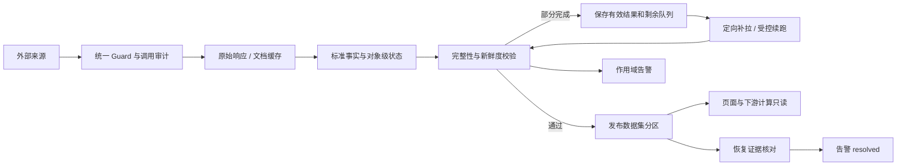

# 线上后台告警与数据缺口闭环整改研发方案

> 日期：2026-09-17  
> 状态：本地实施已完成，尚未生产发布；生产补跑、历史数据修正和告警状态写入待单独授权  
> 范围：可转债行情、交易所公告分页、港股 IPO 补全、市场周期/M2、后台告警生命周期  
> 原则：复用现有 Worker、任务契约、外部 Guard、数据集分区和告警表，不新增平行任务、平行事实表或第二套调度器。

> 2026-09-17 代码复核修订：已增量吸收 8 条实施前审查意见，补明目标交易日与部分发布、单标的公告分页、套利 CNINFO 备源、市场周期槽位总止损、腾讯额度优先级、无交易证据、港股终态 JSON 层级和历史告警既有能力复用边界；不改变原方案主线。

> 2026-09-17 第二轮评审修订：增量补明跨源公告去重、部分发布滞留告警、连续备源告警、缺价重试降频、剩余队列持久化、外部等待退出语义、JSONB 原子更新、腾讯兜底时间窗、warning 通知策略和腾讯价格单位校验；继续沿用原工作包和架构边界。

## 1. 背景与已确认事实

本次线上告警不是单一故障，而是五条链路同时暴露出“上游不完整、任务完成判定、补漏终态和告警恢复”之间没有完全闭环：

1. 可转债目标日 `cb_daily` 连续多个候选交易日只返回约 315 条原始记录，其中约 255 条具备有效收盘价；当前活跃债券预期集合约 395 只，价格覆盖约 64.56%。
2. 可转债主链只会按交易日整批查询、按活跃代码过滤，不会计算缺失代码后定向补拉；当覆盖不足时整天失败，已取得的有效价格也不会进入本轮完整分区。
3. 交易所公告批量接口可能忽略请求的页大小；旧逻辑把正常短页或异常重复页混为一类，且主源不完整后不会自动切换 CNINFO。
4. 港股 IPO 的利弗莫尔、华盛等补充行情来源存在真实外部每日额度；4 个配发结果曾误选澄清/更正公告，3 个对象实际关联供股/配售资料，不应继续要求普通 IPO 招股书。
5. `market_volatility_sync` 原本最多允许 6 次外部调用，该限制来自项目内部任务契约；前置子数据源耗尽调用数后，`cn_m` 等后续阶段无法执行，M2 最新月份因此长期停留在 2026-06-01。
6. 历史任务后来即使恢复，旧槽位、任务和数据集告警也可能继续保持待处理。现有健康检查只周期核对来源接口告警，历史告警收敛脚本仍以人工预览和按 ID 应用为主。

上述问题必须同时解决“停止新增告警、补齐真实数据、正确表达部分完成、按证据关闭历史告警”四件事。仅提高阈值、批量删告警或拿旧价格伪装当天价格，都不属于有效修复。

## 2. 目标与非目标

### 2.1 目标

- 活跃可转债的每个目标日对象都得到明确终态：有效价格、已核验无成交/停牌、生命周期不适用或仍待补拉；不再只有一个总行数。
- 公告主源完整翻页；主源失败或分页不完整时按任务契约自动切换 CNINFO，主备均失败才保留失败游标。
- 港股 IPO 核心官方事实不被暗盘、孖展等可选市场信号的额度问题连锁阻断。
- M2、A 股总市值等市场周期子数据集可以独立重试，不再被任务内部调用次数顺序卡住。
- 已恢复的历史告警自动收敛；仍真实异常和无恢复证据的告警继续保留。
- 所有页面继续只读数据库或已发布快照，普通访问不新增外部请求。

### 2.2 非目标

- 不取消来源级 Guard、接口级熔断、并发、超时或槽位总止损。
- 不把上一交易日价格写成目标日行情，不用零值、面值 100 或旧溢价填充缺失事实。
- 不把券商补充信号升级为港交所官方事实。
- 不新增第二个可转债行情任务、港股 IPO 任务、市场周期任务或告警调度器。
- 不删除历史告警和原始错误文档；只改变活动状态并保留审计。
- 本方案不授权生产部署、历史数据修正、任务补跑或生产告警状态写入。

## 3. 架构对齐结论

本方案复用当前架构：

- 任务编排：`JOB_DEFINITIONS`、`jobOrchestrator`、`jobRunnerProcess` 和持久化计划槽位。
- 外部保护：`externalCallGuard`、`ops.source_endpoint_policies`、`ops.external_call_budgets`、`ops.external_circuits`。
- 数据发布：`ops.raw_records`、标准事实表、`ops.dataset_partitions`、`ops.sync_cursors`。
- 公告治理：官方交易所主源，任务契约允许时 CNINFO 兜底，结果进入统一原始记录和文档缓存。
- 港股 IPO：继续使用 `hk_ipo_preopen`、`hk_ipo_postclose`、`hk_ipo_enrichment` 和同一张 `ipo_history`。
- 告警治理：继续使用 `ops.alert_notifications`、`verifyAlertScope`、健康检查 timer 和现有人工历史对账脚本。

不会引入新的消息队列、微服务或平行数据库。需要的新状态优先放入现有任务结果、数据集诊断、`data_completeness` 和审计事件；只有现有字段无法表达时才评估版本化迁移。

## 4. 总体数据流

统一完成条件为：任务结果成功、目标业务日一致、必需阶段完成、对象没有未知缺口、数据集分区已发布且质量通过。外部请求成功但结果不完整只能算部分完成。

## 5. 工作包 A：活跃可转债价格补缺

### 5.1 当前问题

`latestFullBondDaily()` 目前按交易日调用一次 `cb_daily`，并按活跃代码筛选有效收盘价。价格覆盖不足时返回空行，`syncConvertibleBondUniverse()` 在数据库事务开始前抛错，因此：

- 上游完全没返回的活跃代码没有定向补拉；
- 返回了代码但 `close` 为空或不大于 0 的对象没有分类；
- 已取得的有效价格没有进入本轮事实表；
- 后续按日期补历史缺口的逻辑只能补“缺日期”，不能补“同一天缺代码”。

### 5.2 目标对象与状态

“目标日”固定定义为任务业务日对应的最近一个已经收盘且交易日历确认完成的交易日，即 `defaultBondTargetTradeDate()/businessDate` 解析出的 `previous_trading_day`。不再把“向前回看 5 个交易日后第一个达到 80% 的日期”替换成目标日：原回看逻辑只用于读取上一有效事实、页面滞后展示和兼容诊断，不能推进目标日水位，也不能把旧日期行情写成目标日行情。

目标日活跃集合继续由 `cb_basic` 生命周期、债券代码规则和上市正股状态共同确定。每个代码必须归入以下一种状态：

| 状态 | 含义 | 是否写目标日日线 |
|---|---|---|
| `priced` | 同日有效价格，`close > 0` | 是 |
| `verified_no_trade` | 已核验停牌、无成交或交易状态不产生当日价格 | 否；保留上一有效价格用于展示并标记滞后 |
| `not_applicable` | 目标日前未上市、已退市、到期、转股停止或正股已退市 | 否；从目标集合排除并留原因 |
| `retryable_missing` | 活跃且应有行情，但上游未返回或结果无效 | 否；进入定向补拉队列 |
| `source_unavailable` | 补拉来源受限或失败 | 否；保留旧值，任务部分完成 |

“活跃”不等于“当天必然成交”。未取得同日证据时，禁止把旧价写成目标日价格。

`verified_no_trade` 不得仅凭“接口没有返回”推断。核验链固定复用现有事实：

1. `activeProfile()` 判断转债在目标日是否处于有效上市、未到期、未停止转股的生命周期；不满足者归 `not_applicable`。
2. `isUnderlyingStockListed()` 判断正股关系是否仍有效；正股已退市或关系无效归 `not_applicable`，不得误归“无成交”。
3. 复用现有 `suspend_d → market.stock_suspend_calendar` 证明目标日正股停牌或已核验无停牌。由于该数据集核验的是正股，它只能作为辅助证据，不能单独证明转债自身停牌。
4. 只有转债自身的交易所停牌公告/状态、同日行情明确无成交标志，或其他已登记的债券级官方证据能够闭环时，才归 `verified_no_trade`；只有正股停牌但缺少债券级证据时仍归 `retryable_missing`。

`retryable_missing` 必须同时记录 `first_missing_trade_date`、`attempted_trade_days`、`last_attempt_at`、`next_retry_at`、`last_reason` 和已尝试来源。连续 3 个目标交易日仍未补回时，不得每天继续消耗额度：状态保持真实的 `retryable_missing`，重试策略降为每 5 个交易日一次，并产生数据质量 warning；只有来源本身进入额度、熔断或不可用状态时才归 `source_unavailable`，不能用该状态掩盖长期对象缺口。

### 5.3 补拉顺序

1. 先执行现有目标日 `cb_daily(trade_date)` 全市场批量请求。
2. 以活跃代码集合减去有效价格代码，生成 `missingCodes`；分别记录“完全未返回”和“返回但价格无效”。
3. 优先按缺失 `ts_code + targetTradeDate` 通过现有 Tushare 客户端定向查询。并发保持保守，所有调用继续经过统一 Guard；已补成功的代码立即从剩余队列移除。
4. 仅当目标日是最近一个已完成交易日，且当前时间位于“目标日 15:00 收盘后至下一个交易日 09:15 盘前”时，才允许对剩余代码使用现有腾讯行情适配器批量兜底，每批不超过 80 只；时间窗按 `market.trade_calendar` 判断，周末和节假日自然延长。窗口外直接跳过腾讯请求并保留剩余队列，避免下一交易日盘中拿到实时价后再因日期不符白耗调用。返回结果必须校验代码、`price > 0` 和行情时间等于目标交易日；历史目标日禁止使用腾讯“最新价”倒填。
5. 腾讯转债 `parts[3]` 按现有适配器直接解释为“人民币元/张”，换算系数固定为 1；不得套用股票手数、分或厘的换算。解析结果同时携带 `currency=CNY`、`price_unit=CNY_per_bond`，供入库和诊断核验。
6. 腾讯只补价格和涨跌。转股价值、转股溢价和双低值必须使用同日正股价格与当前有效转股价重新计算；缺少同日正股价格时相关派生字段保持不可用。
7. `bond_value` 等无法可靠推导的字段保持缺失并进入估值完整度诊断，不能反向阻止已验证价格事实入库。

### 5.4 保存与发布

- 目标日已验证的日线按现有唯一键幂等写入 `market.daily_bars`，来源分别记录为 Tushare 或腾讯，不互相覆盖来源证据。
- 数据集分区诊断至少保存：`expected_count`、`raw_count`、`priced_count`、`recovered_count`、`verified_no_trade_count`、`unresolved_count`、缺失代码摘要和来源调用统计。
- 价格事实完整度和估值派生完整度分别定标：`price_quality` 只检查价格日期、来源、数值和对象终态；`valuation_quality` 单独检查 `cb_value/bond_value`、同日正股价格和有效转股价。估值字段缺失只影响估值页签和 `valuation_quality`，不得阻止已验证价格事实写入。
- 目标日存在已验证价格且事实校验通过时，即发布目标日分区。`unresolved_count=0` 时状态为 `published`；仍有未知缺口时状态为 `partial_published`，同时保存缺口清单并返回 `partial/continuationRequired`。`partial_published` 不能冒充完整分区，但也不能因个别上游缺口永久停在上一交易日。
- `partial_published` 不推进“完整覆盖”游标；补拉完成后在同一目标日幂等升级为 `published`。无任何可信目标日价格、日期错配或来源证据异常时才拒绝发布。
- 页面优先读取最新目标日的 `published/partial_published` 分区：有目标日价格的债券显示当日事实；缺失债券可显示上一有效价格，但必须同时标注实际行情日、滞后和目标日缺口，绝不能把旧价标成目标日价格。

现有 `ops.dataset_partitions.status` 约束只允许 `loading/published/rejected/stale`，因此 `partial_published` 必须通过版本化迁移扩展约束，并同步 `publishDatasetPartition()` 的时间戳语义。新增 `getLatestReadablePartition()` 仅供可转债行情页面读取 `published/partial_published`；现有 `getLatestPublishedPartition()`、严格数据集依赖和告警恢复仍只认 `published`，避免部分分区误放行估值、安全评分或其他下游任务。

剩余队列在 P1 开发前直接定案，不再延后评审：权威队列写入现有 `ops.sync_cursors.cursor_payload` 的 `bond_daily_gap_queue`，按 `dataset_code='bond_daily' + scope_key='CN'` 保存 `schema_version`、目标交易日、预期集合哈希、队列更新时间和逐代码重试元数据；`ops.dataset_partitions.diagnostics` 只保存数量和缺失代码摘要。`ops.job_schedule_slots.result_summary` 只保存游标键、队列版本/哈希和 `remaining_count`，不保存完整代码数组——现有 `sanitizeJobResult()` 会把数组截到 100 项，不能作为完整队列载体。队列更新使用现有任务锁并以 `jsonb_set` 原子写入；补齐后清空活动队列但保留最终统计。

“部分可用”不能成为监控盲区：同一目标日分区在后续 2 个已完成交易日后仍是 `partial_published`，或同一代码连续 3 个目标交易日保持 `retryable_missing`，均通过现有 `data_quality + dataset` 作用域产生 warning。恢复条件是该分区升级为 `published`，或该代码取得价格/债券级无交易/生命周期不适用的明确终态；普通任务成功或备源返回不能直接关闭。

### 5.5 调用保护

可转债主任务保留现有单批和槽位累计止损。补拉采用“全市场一次 + 缺失代码续批 + 最新日腾讯批量兜底”，禁止批量失败后无界 N+1 请求。跨批只处理剩余代码，不重复查询已经成功的代码。

腾讯兜底必须登记到 `convertible_bond_universe_refresh.externalApis` 的 `tencent_quote`，每批最多 80 只是单次请求的证券数量，不是 80 次请求；实际请求次数按 `ceil(剩余代码数/80)` 计入该任务运行统计，并与 `market_close:*` 共用腾讯来源/接口 Guard、`ops.external_call_budgets`、并发和熔断。它不占用 `market_close:可转债` 自己的任务级 `dailyBudget=4` 名额，但会消费共享 `tencent_quote` 接口的真实可用额度。

优先级固定为“用户持仓收盘价任务 > 活跃转债全市场补缺”。若两者发生时间冲突、Guard 额度不足或腾讯进入等待，补缺链路保留 `partial_published` 和剩余代码并进入等待，不得抢占收盘任务额度，也不得绕过 Guard。测试需覆盖共享预算计数、收盘任务优先和补缺等待后的续跑。

“进入等待”统一表示立即结束当前执行：遇 `BUDGET_WAIT/QUOTA_EXHAUSTED/CIRCUIT_OPEN` 时先提交已验证事实和剩余队列，返回结构化 `recoverAt`，由编排器把槽位置为 `waiting_external` 并释放 Worker；下一调度周期从 `cursor_payload.bond_daily_gap_queue` 续跑。禁止在进程内 `sleep` 等待额度恢复。

腾讯连续兜底也要记录主源退化：以 Tushare `cb_daily` 为主源端点，连续 3 轮需要腾讯补回缺失对象时，创建 `source_fallback_degraded` warning，但不把有真实价格的任务改成失败。一次后续主源完整轮次将连续计数归零并形成恢复证据。

## 6. 工作包 B：公告分页完整性与 CNINFO 兜底

### 6.1 完整分页规则

上交所、深交所和 CNINFO 的批量与单标的接口统一采用以下判断。实施范围同时包含 `fetchSseEventsBatch/fetchSzseEventsBatch` 和仍被转股价、回售、评级、定期报告调用的 `fetchSseEvents/fetchSzseEvents`：

- 首个非空页面记录接口实际页面容量，不能把请求的 `pageSize=100` 当作上游一定返回 100 条。
- 有总数时，以累计行数达到总数为正常完成条件。
- 无总数时，以空页、明确 `hasMore=false` 或相对实际容量变短的末页作为完成条件。
- 页面签名重复、总数尚未达到却出现空页/异常短页时，返回 `complete=false`。
- 去重使用来源原生公告编号，缺少编号时再用规范化 URL/标题组合。

单标的函数也必须返回 `{ events, complete, fetched, diagnostics }`，不得继续只返回数组。现有调用点中的 `.catch(() => [])` 必须改为保留结构化失败/分页不完整证据，再由调用任务执行主备选择；禁止把截断或请求错误静默伪装成“没有公告”。股票定期报告并行读取 CNINFO 时可保留另一来源成功结果，但必须记录交易所分支的完整性状态。

上述来源原生编号只用于同源翻页去重。跨 SSE/SZSE 与 CNINFO 合并时必须使用独立逻辑键：`标准证券代码 + 公告日期 + 规范化标题`。标题规范化固定为 Unicode NFKC、复用 `cleanSecurityText()` 清理 HTML/空白、去除一个或多个开头 `【…】` 来源前缀后再移除剩余空格；不得把两套来源编号直接比较。`arbitrageRules.js` 新增可测试的 `announcementMergeKey()` 并由套利主备合并复用；当前 `standardizeAnnouncement()` 只有文本清理，没有等价的跨源键。两个来源的原始记录和 URL 均保留审计，只对同一逻辑公告执行一次业务标准化，交易所官方 URL 为主证据、CNINFO 为备源证据。

### 6.2 主备切换

1. 先查询对应交易所官方接口。
2. 主源完整时只消费交易所结果，不调用备源。
3. 主源请求失败或 `complete=false` 时，保留已取得的官方记录并调用 CNINFO 相同市场、日期窗口和关键词的批量接口。
4. CNINFO 完整时，主备结果去重合并并把本轮视为成功；每条事实保留实际来源。
5. 主备都失败或分页不完整时，任务失败并保留游标，下轮只重试未覆盖窗口。
6. Tushare `anns_d` 继续只作为管理员显式开启、且权限独立核验后的末级备源。

该主备规则同时适用于可转债公告和 A 股套利公告。`arbitrageAnnouncementSync.js` 的 SSE/SZSE 适配器在 `PAGINATION_INCOMPLETE` 或交易所请求失败时，复用现有 `cninfoAnnouncement.js` 按相同窗口检索、过滤、去重并保留实际来源；CNINFO 完整才允许推进对应游标。港交所套利公告仍只使用港交所官方来源，不以 CNINFO 代替。任务契约同步为套利声明 `cninfo` 备源，避免实现与 ADR、任务矩阵不一致。

备源成功不等于主源健康。SSE、SZSE 任一端点连续 3 轮因请求失败或分页不完整而使用 CNINFO 成功时，记录 `source_fallback_degraded` warning；任务仍可成功/降级，游标按已验证合并结果推进。后续一次该交易所主源完整成功后重置连续计数并按主源成功时间关闭该 warning。只记录“本轮使用了 CNINFO”而不维护连续状态，不满足验收要求。

本地代码已覆盖批量与单标的分页完整性、可转债与 A 股套利的 CNINFO 兜底、跨源逻辑去重和来源证据留痕；港交所套利仍保持官方单源。生产发布前仍须通过隔离 PostgreSQL 全量回归。

## 7. 工作包 C：港股 IPO 额度和错误文档终态

### 7.1 来源额度隔离

- 港交所官方文件负责 IPO 核心事实；利弗莫尔、华盛、富途和腾讯只负责补充市场信号或中文名称。
- 识别到 `RATE_LIMIT`、`QUOTA_EXHAUSTED`、`BUDGET_WAIT` 或 `CIRCUIT_OPEN` 后，本轮将对应来源加入 `blockedSources`，不再调用同来源其他历史接口。
- 继续执行仍可用来源；可选市场信号失败只把任务标为 `degraded`，不得把 `hk_ipo_facts` 标为失败。
- 外部每日额度仍由来源级策略和熔断控制，不通过取消 Guard 解决。

### 7.2 4 个配发结果失败

配发文件选择增加终态规则：

- 标题或分类含澄清、更正、补充公告时，不得作为正式配发结果覆盖已有文档。
- 只有当前解析器版本已经产出可核验 `parserEvidence` 的正式配发 PDF，才允许标记为已验证。
- 误选文件继续保留在原始记录中作为审计证据，但不阻止下一轮重新检索更早的正式配发结果。
- 检索窗口覆盖上市日前至少 31 天至上市后 5 天，并按证券代码、公告类型和发布时间选择正式文件。

### 7.3 3 个非普通 IPO 对象

`01355.HK`、`01792.HK`、`01822.HK` 当前关联文件属于供股/配售资料，不应永久进入普通 IPO 招股书重试队列。处理方式：

- 候选发现时排除标题、分类或源文档证据明确为 `rights issue/供股/placing/配售/share option` 的对象。
- `data_completeness.prospectus` 是招股书终态的唯一层级，记录 `status=not_applicable`、`checked_at`、`reason` 和 `evidence_url`；顶层 `data_completeness.status` 继续表示整条 IPO 记录的总体状态，不重复承载招股书终态。
- `not_applicable` 和 `terminal_missing` 永久退出日常队列；`retryable` 必须带 `next_retry_at` 后才重新进入。
- 不删除错误来源文档；后续页面和质量统计不得再把“不适用”显示为“缺招股书”。

候选 SQL `hkexIpo.js:956-975` 必须同步读取 `data_completeness#>>'{prospectus,status}'`；为兼容历史数据，仅在嵌套状态不存在时识别旧顶层 `pending_not_due`。候选过滤明确排除 `not_applicable/terminal_missing/pending_not_due`，仅让已到 `next_retry_at` 的 `retryable` 进入，并按“已有可解析招股书证据 → 到期重试 → 其他候选”排序。写入层级、筛选层级、页面层级和测试夹具必须一致。

`ipo_history` 并非单写者：港股三段任务中的历史报表、非公众上市、取消上市、招股书、配发结果和主事实 upsert 都可能更新同一行，现有招股书路径也存在“JS 读整块 → 修改 → 整块回写 `data_completeness`”的覆盖风险。招股书终态必须使用单条 SQL `jsonb_set(COALESCE(data_completeness,'{}'::jsonb),'{prospectus}',...)` 原子更新指定嵌套对象，不得回写读出的整块 JSONB；并发测试需证明其他子任务刚写入的完整度字段不会丢失。

### 7.4 数据集发布与暂停恢复

- 核心子任务仅包括官方历史报表、非公众上市分类、招股书和配发事实；市场信号、腾讯名称和港股日线是可选增强。
- 核心对象达到 `value/not_applicable/terminal_missing` 终态后，不再因无文件重复失败。
- 代码发布并生成新成功证据后，使用现有人工重试入口恢复被暂停的 `hk_ipo_facts` 槽位；不得直接把 blocked 状态批量改成成功。

本地代码已完成额度短路、澄清/更正公告排除、供股资料候选过滤、`not_applicable/terminal_missing` 嵌套状态持久化和历史错误关联清理；生产暂停恢复仍须按授权使用现有人工入口执行。

## 8. 工作包 D：市场周期和 M2 定向重试

### 8.1 调用上限

原 `maxExternalCallsPerRun=6` 是项目内部任务契约，不是外部官方额度。`market_volatility_sync` 改为 `maxExternalCallsPerRun=null`，表示不设置该任务级单批调用数上限；同时在调度定义中显式设置 `slotExternalCallsLimit=300`，作为同一计划实例跨重试累计的量化止损。300 次覆盖当前最重的首次历史建立路径（中债按年分段、2010 年以来月末市值和其他指标）并保留余量；达到后必须转 `blocked` 并记录停止原因，不能继续请求。

来源接口限额、熔断、并发、任务超时和 `slotExternalCallsLimit=300` 共同保留。测试不能只断言 `maxExternalCallsPerRun===null`：还要用真实 Guard/编排上下文验证第 7 次允许、累计第 300 次后下一次被 `JOB_BUDGET_EXCEEDED` 拦截，以及跨重试累计值仍生效。历史全量回填超过该边界时必须由管理员显式分段，不得临时取消止损。

本地代码已经完成该项基础修改。

### 8.2 子阶段拆分

不新增任务，只把现有 Runner 内部阶段拆为可定向重试的子数据集：

| 子阶段 | 入口 | 失败后的重试范围 |
|---|---|---|
| `cn_yield` | `syncChinaYield` | 仅中债收益率 |
| `csi300_pe` | `syncCsiIndexPe('CSI300')` | 仅沪深 300 PE |
| `csi_all_pe` | `syncCsiIndexPe('CSIALL')` | 仅中证全指 PE |
| `hsi_pe` | `syncHsiPe` | 仅恒指 PE |
| `us_treasury_yield` | `syncUsTreasuryYield` | 仅美国十年期收益率 |
| `csi300_valuation` | `syncCsi300Valuation` | 仅沪深 300 估值 |
| `m2` | `syncMoneySupply` | 仅货币供应量 |
| `a_share_market_cap` | `syncAShareMarketCap` | 仅 A 股总市值 |
| `m2_market_cap` | `calculateM2MarketCap` | 输入新鲜后只做本地重算 |

`failedDatasets` 或 `pendingStages` 中出现 `m2`、`a_share_market_cap` 时，必须映射到对应内部阶段，不能因为旧的总阶段名 `cycle_metrics` 不匹配而整轮跳过。

### 8.3 M2 来源与新鲜度

- 首选继续使用现有 Tushare `cn_m`，一次成功响应后按月份幂等入库，只保留必要重叠窗口。
- 数据日期以 `month` 为准，抓取时间不能冒充 M2 参考月；距目标月超过 2 个完整月份即为 stale。
- 如果 `cn_m` 请求成功但最新月份仍明显落后已核验的官方发布时间，应登记为“来源数据陈旧”，不能把任务标为成功。
- 只有核实人民银行官方月度货币供应量端点、字段、单位、发布时间和许可后，才接入官方备源；不得猜接口或把网页抓取时间当参考月。
- M2 或 A 股市值任一输入 stale 时，`m2_market_cap` 保持 stale；输入恢复后只做数据库重算，不重复抓取其他已经成功的市场指标。

## 9. 工作包 E：历史告警自动收敛

### 9.1 当前缺口

本工作包必须复用 2026-09-14/09-15 已发布的告警恢复能力，不能重复开发第二套验证器。差异如下：

| 能力 | 现状 | 本方案动作 |
|---|---|---|
| `verifyAlertScope()` 统一验证槽位、任务、数据集、来源接口 | 已发布 | 复用，只修订证据边界 |
| 历史槽位使用后续连续 3 次可比成功 | 已发布 | 复用，不另写 SQL |
| 空查询不关闭来源告警、通配熔断按 `source:*` 收敛、必须有新 `last_success_at` | 已发布 | 复用并补防回归测试 |
| `data_quality/dependency_blocked` 的数据绑定保护 | 已发布 | 保持数据集证据优先，禁止普通 slot/job 成功误关 |
| `resolveWorkerOfflineAlert()` 心跳恢复 | 已发布的专用入口 | 保持独立，不塞进 `verifyAlertScope()` |
| 健康检查周期核对来源告警 | 已发布 | 扩展为公平、有冷却的其他作用域扫描 |
| 历史告警公平扫描、检查冷却、warning 后台/摘要延迟 | 本地已实现，待隔离库回归和发布 | 本方案新增 |
| `partial_published` 滞留与连续备源退化 | 本地已实现，待隔离库回归和发布 | 本方案新增“假健康”监控，不改变任务真实结果 |

`jobAlertMailer` 已具备按槽位、任务、数据集和来源接口核对恢复证据的能力；`reconcileAlertHistory.js` 也支持历史告警只读预览和按 ID 关闭。但目前：

- 健康检查只自动调用 `reconcileRecoveredSourceAlerts()`；
- 历史槽位、任务、数据集和依赖阻塞告警没有统一周期扫描；
- 后续成功槽位执行时，只容易命中当前槽位或当前任务候选，旧槽位作用域可能永远不再被选中；
- 已发送故障告警仍可能按较短周期重复通知，形成“旧问题一直在发生”的错觉。

### 9.2 自动核对服务

从现有脚本中抽取可复用的 `reconcileHistoricalAlerts()` 服务，由 `portfolio-worker-health.timer` 的现有健康检查有界调用，不新增调度器：

- 在 `ops.alert_notifications` 增加 `last_checked_at`、`next_check_at`，只记录恢复证据核对进度，不新建告警事实表；未恢复时按 1 小时、6 小时、24 小时有界冷却，出现新的 `last_seen_at` 时提前到期。
- 在现有 `ops.source_endpoint_runtime` 增加 `consecutive_fallback_count`、`last_fallback_at`、`last_primary_success_at`，分别由“主源失败/不完整但备源成功”和“主源完整成功”原子更新；不从任务最终 `succeeded` 状态反推主源健康。
- 同一 `alert_key` 再次发生时，upsert 除增加 `occurrence_count` 外还要把 `next_check_at` 提前到当前时间，使新证据及时复核；不得让旧冷却时间压住新故障。
- 每轮最多扫描 100 条到期活动告警；新告警（`last_checked_at IS NULL`）优先，其余按 `next_check_at`、`last_checked_at` 从旧到新轮转，并以最近发生时间作为同优先级排序。不能继续单纯按 `last_seen_at` 最旧优先，避免一批长期无证据的旧告警永久占满 100 条配额。
- 生产环境才能改状态，非生产只返回预览；
- 单条核对失败写 `job_alert_resolution_failed` 审计，不阻断其他告警；
- 恢复通知按作用域键去重，同一根因只发送一次。

### 9.3 恢复证据

| 类型 | 自动关闭条件 |
|---|---|
| `slot` 作用域 | 非数据类告警：原槽位成功且运行/阶段证据通过；历史槽位可使用同业务日、同模式的后续可比槽位连续 3 次成功。严格发布任务仍须验证其声明的分区 |
| `job` 作用域 | 非数据类告警：最近 3 次同模式运行成功；严格发布任务仍须逐次具备声明的数据集证据 |
| `dataset` | 精确 `dataset_code + scope_key + partition_key` 分区已发布、非 stale、质量通过 |
| `source_endpoint` | 对应实际接口/凭据的熔断全部关闭，且有晚于告警时间的新 `last_success_at` |
| `source_fallback_degraded` 告警类型 | 仍绑定主源 `source_endpoint`。连续备源计数归零，且主源端点有晚于告警的完整成功时间；备源继续成功不能关闭主源退化告警 |
| `partial_published` / 长期缺对象 | 使用 `data_quality + dataset` 作用域。目标分区升级为 `published`，或缺失代码取得价格、债券级无交易、生命周期不适用终态；普通任务成功不能关闭 |
| `worker` 专用入口 | 不进入通用 `verifyAlertScope()`；只由 `resolveWorkerOfflineAlert()` 在 Worker 服务 active 且最近 2 分钟存在运行中心跳时关闭 |
| `dependency_blocked` 告警类型 | 它不是作用域。创建时必须绑定精确依赖的 `dataset`；对应分区恢复后，再确认原阻塞槽位成功或已安全续跑。普通 slot/job 成功不能替代数据恢复 |
| `data_quality` 告警类型 | 必须绑定并使用 `dataset` 证据；槽位、任务或页面成功均不能关闭 |

通用 `verifyAlertScope()` 只接受 `slot/job/dataset/source_endpoint`。`DATA_BOUND_ALERT_TYPES` 的数据类告警必须先通过数据集证据；实现时不得为了扩大自动收敛范围绕过这条保护。空查询、手工关闭熔断、仅有较新 `MAX(date)`、单次普通任务成功或前端页面可访问，都不能作为恢复证据。

### 9.4 告警归并和通知

- 相同 `alert_key` 继续通过 upsert 增加 `occurrence_count`，不新增记录。
- 来源问题统一按 `source + api_name + credential` 归并；数据问题按精确分区归并；下游依赖告警在后台列表关联其上游根因。
- 首次 critical 告警立即发送；仍未恢复的旧告警进入每日摘要，不再每 6 小时逐条重复发送。
- warning 首次只入库并显示在后台，不单独即时发邮件；统一进入下一次每日摘要。若后续升级为 critical，则按 critical 规则立即发送一次。
- 有恢复证据时设为 `resolved`；只有管理员确认“不再适用但无法形成恢复事实”的旧记录才可设为 `acknowledged`，并保留审计原因。
- 不删除 `ops.alert_notifications` 历史行；后台默认“待处理”只展示仍需介入的活动故障，历史页继续可查 resolved/acknowledged。

### 9.5 一次性积压处理

1. 先发布并运行本方案中产生新恢复证据的业务修复，避免一边清理一边继续新增同类告警。
2. 运行历史对账脚本 dry-run，输出 `可关闭/仍真实异常/证据不足/不再适用` 四类清单。
3. 只对“可关闭”清单按显式告警 ID 应用 `resolved`。
4. 对真实异常执行定向任务补跑或等待外部恢复；成功后再由同一证据服务关闭。
5. “不再适用”必须由管理员逐项确认后 `acknowledged`；不得批量清零。

## 10. 工作包 F：任务状态、数据集和页面口径

### 10.1 状态边界

- `succeeded`：所有必需阶段和数据集质量通过。
- `fresh`：数据库已有当期完整结果，本次外部调用为 0。
- `partial`：已保存部分有效事实且仍有剩余工作；持久化剩余对象和阶段后续跑。
- `degraded`：核心结果可用，但可选来源失败或数据沿用旧快照。
- `waiting_external`：等待外部额度、限流或熔断恢复，不消耗业务失败次数。
- `blocked`：权限、连续数据质量失败或达到续跑停止线，需要人工处理。

### 10.2 页面展示

不新增页面或样式体系，只在现有更新时间和质量区域显示：

- 实际数据日期；
- 是否沿用上一份完整数据；
- 单券价格是否滞后及最近有效行情日；
- 港股 IPO 字段是“待补全”“不适用”还是“来源额度等待”；
- M2 的参考月份和 A 股市值交易日；
- 后台告警的作用域、根因组、最后发生时间和恢复证据状态。

页面请求外部调用数必须保持为 0。

## 11. 研发修改范围

| 文件/模块 | 计划修改 |
|---|---|
| `server/services/convertibleBondAnalysis.js` | 固定目标交易日、缺失代码计算、`sync_cursors.cursor_payload` 剩余队列、三日后降频、腾讯有效时间窗、对象级终态、价格/估值质量分离、部分分区发布和续跑 |
| `server/services/datasetPartitions.js` | 支持写入 `partial_published`，增加页面专用可读分区查询；严格发布查询和告警恢复仍只认 `published` |
| `server/services/stockAnalysis.js` | 批量与单标的公告统一分页完整性契约、结构化返回和异常分页诊断 |
| `server/services/arbitrageAnnouncementSync.js`、`server/services/cninfoAnnouncement.js`、`server/services/arbitrageRules.js` | A 股套利交易所不完整/失败后的 CNINFO 备源、跨源逻辑键、原始证据保留和游标保护 |
| `server/services/jobDefinitions.js` | 可转债腾讯接口声明、套利 CNINFO 声明、市场周期无单批上限与 `slotExternalCallsLimit=300`、任务/数据集契约核对 |
| `server/services/jobRunnerProcess.js` | `null` 不设置任务级上限，继续保留来源级和槽位级保护 |
| `server/jobs/marketVolatilitySync.js` | 市场周期子阶段拆分、失败阶段映射、M2 新鲜度和本地重算 |
| `server/services/hkexIpo.js` | 正式配发文档选择、招股书嵌套 `not_applicable/terminal_missing` 终态持久化、候选 SQL 和排序统一、`jsonb_set` 原子更新 |
| `server/services/hkIpoMarketSignals.js` | 来源额度短路、可选来源降级和错误诊断 |
| `server/jobs/hkIpoSync.js` | 核心事实与可选市场信号发布隔离 |
| 下一可用数据库迁移 | 扩展 `ops.dataset_partitions.status` 支持 `partial_published`；为 `ops.alert_notifications` 增加 `last_checked_at/next_check_at`；为 `ops.source_endpoint_runtime` 增加连续备源和主源恢复时间；补相应索引，不新建事实表 |
| `server/services/jobAlertMailer.js` | 复用现有验证器，增加部分分区滞留/连续备源 warning、公平有界扫描、检查冷却、每日摘要和恢复去重；Worker 保持专用恢复入口 |
| `server/scripts/checkWorkerHealth.js` | 调用历史告警核对服务 |
| `server/scripts/reconcileAlertHistory.js` | 继续作为 dry-run/显式 ID 人工维护入口，复用同一验证器 |
| `server/test/*` | 分页、缺价、港股文档、M2 定向重试、告警恢复的通用回归 |
| 文档和任务矩阵 | 技术架构、港股方案、知识索引、自动生成矩阵和变更记录同步 |

不新增业务事实表或平行告警表。剩余队列已确定使用现有 `ops.sync_cursors.cursor_payload`，任务结果只保存队列指针和摘要；不得再把存储位置留到编码中途决定。版本化迁移仅处理分区状态、告警检查时间和来源连续备源运行态，不直接修改生产表。

## 12. 实施阶段

### P0：停止新增错误和告警噪声

1. 完成批量/单标的公告分页完整性、跨源去重，以及可转债/套利 CNINFO 备源回归和连续备源 warning。
2. 完成港股额度短路、错误公告排除和非 IPO 对象终态。
3. 取消市场周期内部 6 次上限，增加计划实例累计 300 次止损，并修复子阶段定向重试映射。
4. 复用现有恢复验证器，把部分发布滞留、连续备源和公平有冷却的历史告警核对接入现有健康检查。

退出条件：同一已知根因不再新增重复告警；任务部分失败不会连锁阻断无关核心数据集。

### P1：补齐可转债和 M2 数据

1. 先落定并测试 `cursor_payload.bond_daily_gap_queue` 读写契约，再实现活跃可转债对象级缺口清单、Tushare 定向补拉和限定时间窗内的腾讯批量兜底。
2. 分离价格分区完整度和估值派生字段完整度。
3. 拆分市场周期内部阶段，恢复 `cn_m` 和 A 股总市值后本地重算 M2/市值比。
4. 若 `cn_m` 成功响应仍陈旧，完成官方 M2 来源契约核验后再接备源。

退出条件：可转债目标对象没有未分类缺口；仍未补回的对象有持久化队列、降频时间和活动 warning，不会每日无界重试。M2 新鲜度不超过 2 个完整月份，或明确报告真实官方来源尚未发布/来源不可用。

### P2：生产恢复和历史积压收敛

1. 按标准发布流程部署代码。
2. 生成港股错误文档关联和非 IPO 对象的只读预览，经用户确认后执行生产修正。
3. 手动重试被暂停的 `hk_ipo_facts` 和相关可转债、市场周期槽位。
4. 在新成功证据产生后 dry-run 历史告警对账，只关闭验证通过的记录。
5. 连续观察至少 3 个交易日。

本阶段涉及生产数据写入、任务状态变更和告警状态变更，执行前必须单独取得用户明确授权。

## 13. 测试方案

### 13.1 可转债

- 批量结果 315 条、有效价格 255 条、活跃集合约 395 只时，能够生成准确缺失集合。
- 定向补拉只请求缺失代码，跨批不重复请求已成功代码。
- 完整剩余队列写入 `ops.sync_cursors.cursor_payload`；即使缺失代码超过 100 个，跨批读取也不受 `sanitizeJobResult()` 数组截断影响，任务结果只携带可核对的队列指针、哈希和数量。
- 连续 3 个目标交易日未补回后，代码改为每 5 个交易日重试一次并触发 warning；成功补回或取得明确终态后退出降频队列。
- 腾讯按 80 只分批，上海/深圳转债映射正确；只有目标日收盘后至下一交易日 09:15 前进入腾讯路径，窗口外外部调用数保持 0。
- 腾讯价格字段单位固定为“人民币元/张”、换算系数为 1。使用已知转债抓包夹具断言原始 `101.234` 解析后仍为 `101.234`，并与同日 Tushare 收盘价做单位级交叉校验，防止误按分/厘缩放。
- 腾讯补缺计入共享 `tencent_quote` Guard 和实际调用统计；与收盘任务冲突时，补缺等待且不抢占收盘任务。
- 停牌/无成交不写伪造目标日日线，上一有效价格保留并显示滞后。
- `suspend_d` 只能证明正股停牌状态；缺少债券级停牌/无成交证据时仍是 `retryable_missing`。
- 腾讯债券价与非同日正股价不得混算转股溢价和双低。
- 最近已完成交易日固定为目标日，不得因完整度不足悄悄回退成前一日目标。
- 部分事实已保存时发布 `partial_published` 并返回 `partial`，完整覆盖游标不前进；缺口补齐后同一分区升级为 `published`。
- `partial_published` 可被可转债行情页面读取，但严格数据集依赖、告警恢复和 `getLatestPublishedPartition()` 均不得把它当成完整发布。
- `cb_value/bond_value` 缺失只让 `valuation_quality` 不通过，不阻止已验证价格事实发布。

### 13.2 公告

- 接口固定返回 50 条而请求页大小为 100 时，仍能继续翻页。
- 总数未完成时出现空页、短页或重复页，必须返回 `complete=false`。
- 主源不完整后调用 CNINFO；主源完整时不调用备源。
- 同源按来源编号/URL 去重；跨源按“标准证券代码 + 公告日期 + NFKC/去前缀/去空格后的标题”合并，来源证据不丢失。
- 上述夹具必须分别覆盖批量函数和 `fetchSseEvents/fetchSzseEvents` 单标的函数；单标的调用点不得再用空数组吞掉分页错误。
- A 股套利主源不完整或失败时切换 CNINFO，备源完整才推进游标；港交所套利不走 CNINFO。
- 同一主源连续 3 轮走备源时产生 `source_fallback_degraded` warning；备源成功不能关闭，后续一次主源完整成功才能恢复。

### 13.3 港股 IPO

- 澄清、更正和补充公告不能成为已验证配发结果。
- 正式配发 PDF 仍可被检索和解析。
- 供股/配售对象把 `not_applicable` 保存到 `data_completeness.prospectus.status` 后不再进入日常招股书队列；顶层总体状态不能代替该嵌套字段。
- 旧顶层 `pending_not_due` 兼容读取、嵌套终态过滤和 `retryable.next_retry_at` 到期排序均有 SQL 回归。
- 并发夹具模拟另一子任务在招股书读取后写入新的完整度字段；招股书使用 `jsonb_set` 后只能更新 `prospectus`，不得覆盖该字段。
- 利弗莫尔额度耗尽后不再调用同来源历史接口；可用备源继续执行。
- 可选市场信号失败不产生 `hk_ipo_facts` 核心失败。

### 13.4 市场周期

- 第 7 次及后续外部调用不再被任务级 6 次限制拦截。
- `maxExternalCallsPerRun=null` 时，第 300 次以内允许执行；同一计划实例累计达到 `slotExternalCallsLimit=300` 后，下一次请求仍被 Guard 拦截并把槽位置为 `blocked`，跨重试不得清零累计值。
- `failedDatasets=['m2']` 时只运行 M2 及其本地派生，不重新抓取已成功的其他指标。
- M2 成功返回旧月份时仍判 stale；参考月更新后重新计算 M2/市值比。
- 任一输入 stale 时派生结果不得显示 fresh。

### 13.5 告警

- 空查询、手工关熔断、无关任务成功不能关闭告警。
- 精确分区发布且质量通过后，数据集告警在一个健康检查周期内自动关闭。
- 来源熔断关闭但没有新成功时间时不关闭；新成功时间晚于告警后关闭。
- 历史槽位需连续 3 次可比成功且逐次证据通过。
- `worker` 告警只走 `resolveWorkerOfflineAlert()`；通用验证器对未知作用域保持 `unknown_scope`。
- `data_quality/dependency_blocked` 不得由普通 slot/job 成功关闭，必须命中精确数据集恢复证据并满足依赖后续条件。
- `partial_published` 超过 2 个交易日、单代码连续缺失 3 个交易日均产生 warning；分区/代码形成精确恢复事实后关闭。
- warning 首次不即时发邮件，只进入后台和每日摘要；升级为 critical 时立即发送一次。
- 100 条长期无恢复证据的旧告警经过 `next_check_at` 冷却后不会阻塞新告警；多轮扫描能公平覆盖全部到期告警。
- 相同根因只增加发生次数，不新增活动记录；恢复通知只发送一次。
- 非生产环境只能预览，不修改或发送真实告警。

### 13.6 必跑检查

- 相关纯函数和回归测试。
- PostgreSQL 隔离库中的任务状态、分区、告警恢复集成测试。
- `npm.cmd run test:all`。
- `npm.cmd run check:knowledge`。
- `git diff --check`。

## 14. 上线验收

### 14.1 可转债

- 输出目标日活跃数、批量原始数、有效价格数、补回数、已核验无交易数和未知缺口数。
- 目标日固定为最近已完成交易日；有可信事实但仍有缺口时发布 `partial_published`，`unresolved_count=0` 后升级为完整 `published`。
- 价格事实分区可以发布而估值质量保持不完整；页面分别显示价格和估值状态。
- 剩余队列数量、哈希和 `cursor_payload` 实际代码集合一致；超过 100 个缺口时仍可完整续跑。长期缺失对象按 3 个交易日阈值告警并降为每 5 个交易日重试。
- 腾讯只在规定盘后窗口调用，入库单位为人民币元/张；窗口外不产生无效腾讯调用。
- 页面随机抽查上海、深圳转债及停牌对象，价格日期和来源正确。

### 14.2 公告

- 任务结果能看到主源页数、累计条数、总数、完整状态和是否使用 CNINFO。
- 主备均失败时游标不推进；下一轮从未覆盖窗口继续。
- 批量、单标的可转债路径和 A 股套利路径均通过异常分页验收；套利 CNINFO 兜底不改变港交所官方单源规则。
- 同一公告的交易所/CNINFO 双份记录只形成一个业务公告，两个原始来源仍可审计；连续 3 轮备源会出现 warning，主源恢复后自动关闭。

### 14.3 港股 IPO

- 4 个原配发失败对象重新命中正式文档或进入有证据终态。
- `01355.HK`、`01792.HK`、`01822.HK` 不再因普通 IPO 招股书缺失失败。
- 上述对象的终态实际落在 `data_completeness.prospectus.status`，候选 SQL 和页面均读取同一层级。
- 并行子任务写入的其他 `data_completeness` 字段在招股书终态更新前后保持不变。
- 外部补充来源额度耗尽只产生来源级等待/降级，不再暂停 `hk_ipo_facts`。

### 14.4 M2

- M2 参考月不晚于目标月 2 个完整月份；若仍陈旧，任务结果明确是上游资料陈旧而不是内部 6 次限制。
- M2/市值比同时展示 M2 参考月和市值交易日。
- 运行记录证明第 7 次调用不再被内部 6 次上限拦截，同时计划实例累计 300 次止损可实际触发且跨重试有效。

### 14.5 告警

- 待处理列表只包含当前真实异常；已恢复记录进入历史页。
- 同一根因只有一个活动告警，发生次数持续累计。
- 新成功证据产生后一个健康检查周期内自动关闭对应告警。
- 连续备源和长期 `partial_published/retryable_missing` 不再表现为无告警的健康状态；warning 进入每日摘要但不即时轰炸邮箱。
- 新旧告警均能在冷却和批次上限下获得核对机会，不出现旧告警占满配额导致的新告警饥饿。
- 无证据历史告警保持开放，不通过批量清零制造“全绿”。

## 15. 回滚与失败保护

- 目标日事实校验通过但覆盖不完整时保留 `partial_published`；若日期、来源或数值完整性校验失败，则继续读取上一份可信分区。已保存的原始响应和有效事实不删除。
- 腾讯兜底异常时关闭该次补拉路径，不影响 Tushare 主链和旧快照。
- 公告备源异常时恢复为“主源失败即保留游标”，不回退或删除已落库官方记录。
- 港股终态误判时可把对应对象改回 `retryable`，保留原始文档证据。
- 市场周期内部阶段失败只回滚本阶段数据库事务，不撤销其他已成功子数据集。
- 历史告警自动核对出现异常时可停止健康检查中的该步骤；人工 dry-run/显式 ID 入口继续可用。
- 生产数据修正前必须备份；代码、迁移和任务定义按同一版本发布，禁止只在生产手改代码或状态。

## 16. 当前完成度

| 项目 | 当前状态 |
|---|---|
| 交易所批量分页完整性判断 | 本地已完成，待隔离库全量回归和发布 |
| 交易所单标的分页完整性判断 | 本地已完成，待隔离库全量回归和发布 |
| 可转债交易所不完整自动切 CNINFO | 本地已完成，待隔离库全量回归和发布 |
| A 股套利交易所不完整自动切 CNINFO | 本地已完成，待隔离库全量回归和发布 |
| 公告跨源逻辑去重与双源证据保留 | 本地已完成，待隔离库全量回归和发布 |
| 连续 3 轮备源退化 warning | 本地已完成，待隔离库全量回归和发布 |
| 港股补充来源额度短路 | 本地已完成，待发布 |
| 港股澄清/更正公告排除 | 本地已完成，待发布 |
| 港股供股/配售候选过滤 | 本地已完成，待隔离库全量回归和发布 |
| 港股招股书 JSONB 嵌套原子更新 | 本地已完成，待隔离库全量回归和发布 |
| 市场周期取消内部 6 次上限 | 本地已完成，待发布 |
| 市场周期计划实例累计 300 次止损 | 本地已完成，待隔离库全量回归和发布 |
| M2 子阶段定向重试 | 本地已完成，待隔离库全量回归和发布 |
| M2 官方备源 | 待完成官方契约核验后开发 |
| 活跃可转债缺失代码补拉 | 本地已完成，待隔离库全量回归和发布 |
| 可转债剩余队列 `sync_cursors.cursor_payload` 持久化 | 本地已完成，待隔离库全量回归和发布 |
| 可转债长期缺失降频、部分发布滞留 warning | 本地已完成，待隔离库全量回归和发布 |
| 腾讯兜底盘后窗口和人民币元/张单位校验 | 本地已完成，待隔离库全量回归和发布 |
| 可转债固定目标日与 `partial_published` | 本地已完成，待隔离库全量回归和发布 |
| 可转债价格/估值完整度分离 | 本地已完成，待隔离库全量回归和发布 |
| 告警统一恢复证据、历史 3 次成功、空证据/通配熔断保护 | 已有实现，直接复用 |
| 历史告警公平周期核对与检查冷却 | 本地已完成，新增迁移 157，待隔离库全量回归和发布 |
| warning 首次进入每日摘要、不即时发送 | 本地已完成，待隔离库全量回归和发布 |
| 生产补跑、历史数据修正和告警收敛 | 未执行，需单独授权 |

## 17. 文档同步要求

实际开发完成时必须同步：

- `docs/技术架构.md`：更新可转债行情完整度、市场周期子阶段、港股 IPO 终态和告警自动收敛的当前实现。
- `docs/港股打新日历与严选建议研发方案_20260907.md`：补充额度隔离、错误文档终态和生产验收结果。
- `docs/自动任务重复执行与API调用保护整改方案_20260815.md`：补充无任务级上限语义、历史告警周期核对和通知降噪。
- `docs/decisions/ADR-0001-公告数据源优先级与统一采集.md`：登记 A 股套利在交易所失败/不完整时允许使用 CNINFO 备源，港交所仍为官方单源。
- `docs/知识索引.md`：登记实施状态、版本、测试、生产授权和观察结果。
- `docs/任务接口数据集矩阵.generated.md`：由生成脚本更新，禁止手工漂移。
- 发生生产事故或重复故障时，补充相应 `docs/incidents/` 记录。

本方案描述目标实现和验收边界；生产是否已经完成，以代码提交、测试结果、数据库分区、任务运行记录和告警恢复证据为准。
