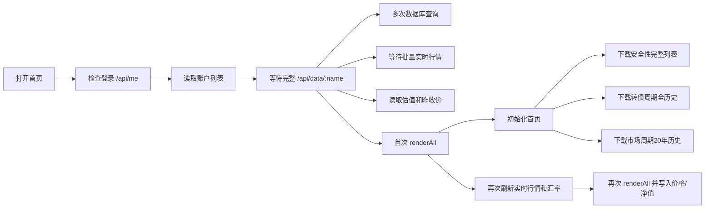
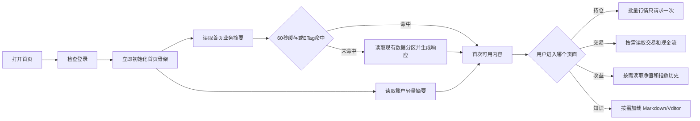

# 网站性能优化研发方案

> 编制日期：2026-09-04  
> 评审修订：2026-09-04（已完成两轮仓库核对，并核对 Express、Nginx 与现行证书政策）  
> 当前状态：本地研发实现已完成，待生产验证与发布授权；尚未连接或修改生产配置  
> 适用范围：主站首页、登录后账户初始化、公共首页接口、静态资源、Nginx 与性能监控  
> 不在本次范围：金融指标口径、后台任务调度、外部数据采集规则、数据库结构迁移、页面视觉重做

### 执行记录（2026-09-04）

- 已落地：Nginx gzip（含 `gzip_proxied any`）、HTTP/2、TLS 会话复用、上游 HTTP/1.1 keepalive、去除无 WebSocket 依据的固定 Upgrade、分段耗时日志。
- 已落地：静态资源缓存头拆分，JS/CSS 使用版本参数和 `immutable`，图片/字体保留 7 天缓存；5 个 vendor 引用已补版本参数。
- 已落地：主站外部脚本安全 `defer`，内联启动逻辑改为 `DOMContentLoaded`；首页账户先读 `scope=summary`，完整账户数据后台补齐，直接进入持仓页仍等待完整数据。
- 已落地：公共首页接口增加 60 秒 Cache-Control 与数据版本 ETag；市场周期参考账户改用轻量摘要读取；Node 每分钟聚合记录事件循环 P50/P95/最大值。
- 已落地：首页安全性接口使用 `view=summary` 四档计数，转债周期首页使用 `view=home&maxPoints<=800` 投影；市场周期首页复用一次历史查询生成 overview 与 history。
- 已修复验收问题：两份 Nginx 模板的静态 location 增加 `proxy_hide_header Cache-Control`，避免 Node 默认 `max-age=0` 与 Nginx 缓存头重复；完整安全性列表 ETag 纳入强赎计算/公告更新时间、行情水位和北京时间日期，避免 `call_status` 变化时错误返回 304；并补充对应回归断言。
- 本地验收（2026-09-05）：`npm.cmd run test:all` 通过 115、失败 0、跳过 0；`check:knowledge`、数据架构只读验收、Node 语法、ETag 和安全性路由缓存冒烟均通过。
- 待完成：Nginx 生产 `nginx -t`/HTTP2/gzip/304 验收、生产发布授权及线上冷启动/回访实测；P1-3 动态模块按需加载和 P2 `pg_stat_statements` 保留后续独立阶段。方案文档仍不加入项目知识索引。

## 1. 背景与目标

当前网站可以正常使用，但打开首页和登录后的首次加载存在明显等待。此次整改目标是缩短“打开页面到看到可用内容”的时间，同时保持现有数据口径、权限、统一数据层和页面功能不变。

目标不是重写前端或拆分微服务，而是在现有“原生前端 + Express + PostgreSQL + Redis + Nginx”架构内解决以下问题：

1. 首页被完整账户数据阻塞。
2. 首页下载了远超展示需要的历史数据。
3. JSON、JavaScript、CSS 未压缩。
4. 首屏一次加载过多业务脚本，且公网仍使用 HTTP/1.1。
5. 账户统一接口混合数据库读取和实时行情请求，造成等待和重复请求。
6. 每日低频变化的公共数据没有形成明确的客户端/共享响应复用策略。
7. 对偶发固定停顿缺少 Nginx、TLS 和 Node 事件循环的分段证据。

## 2. 实测基线

以下数据均为 2026-09-04 对生产环境和当前代码的只读检查结果。

### 2.1 服务器与数据库

| 项目 | 实测结果 | 判断 |
|---|---:|---|
| CPU | 2 核，采样期间 96%～100% 空闲 | 无 CPU 瓶颈 |
| 系统负载 | `0.00 / 0.02 / 0.02` | 无排队 |
| 内存 | 3.6GB，总可用约 2.8GB | 无内存压力 |
| 磁盘 | 59GB，已用 34% | 容量正常 |
| 磁盘等待 | 采样期间约 0%～2% | 无明显 IO 瓶颈 |
| 网卡 | 无 errors/dropped | 网卡正常 |
| PostgreSQL 数据库 | 约 1.75GB | 规模正常 |
| PostgreSQL 缓存命中率 | 97.68% | 数据库缓存正常 |
| 完整账户数据库读取 | 98～148ms | 不是主要等待来源 |
| 账户统一接口线上耗时 | 263～724ms，中位约 702ms | 接口内其他处理占主要部分 |
| 批量行情接口线上耗时 | 中位约 394ms | 实时行情会放大首屏等待 |

当前未启用 `pg_stat_statements`，因此还不能提供生产历史 SQL 的逐语句耗时排名。现有接口实测足以确认数据库不是当前首要瓶颈；后续应先补统计，再决定是否增加索引，禁止凭感觉改库。

### 2.2 首屏资源与接口体积

| 内容 | 当前原始体积 | gzip 后估算体积 | 可减少 |
|---|---:|---:|---:|
| 首页 HTML + 51 个静态资源 | 1,396KB | 402KB | 71.2% |
| 可转债安全性首页数据 | 208KB | 37KB | 82.1% |
| 可转债周期全历史 | 505KB | 53KB | 89.6% |
| 市场周期 20 年历史 | 473KB | 68KB | 85.6% |
| 最大账户完整数据 | 476KB | 73KB | 84.6% |

当前主页面引用 51 个本地资源，其中 JavaScript 40 个、约 1,131KB；CSS 10 个、约 172KB。页面另有一段大型内联启动脚本。40 个外部脚本中只有 Vditor 使用 `defer`，其余 39 个为同步脚本。业务 JS/CSS 大多已有查询版本号，但 Chart.js、Vditor 的 JS/CSS、marked 和 DOMPurify 共 5 个 vendor 引用没有版本号。静态资源已有 7 天浏览器缓存，这是现有可复用能力，但生产 Nginx 只压缩 HTML，没有压缩 JSON、JavaScript 和 CSS。

最大账户的 476KB 返回内容中：

| 字段 | 体积 | 行数 | 首首页是否需要 |
|---|---:|---:|---|
| `indexHistory` | 263KB | 2,015 | 不需要 |
| `navHistory` | 154KB | 263 | 首页只需摘要 |
| `positionSnapshots` | 32KB | 133 | 浏览器不使用，仅服务端归因使用 |
| `trades` | 20KB | 40 | 首页不需要 |
| `positions` | 6KB | 32 | 首页资产摘要需要 |

### 2.3 公网链路

- 生产服务器本机访问首页约 2ms，公共接口通常约 17～168ms。
- 公网首页 HTML 首包通常约 73～120ms。
- 两个大历史接口公网完整传输约 1.3～2.4 秒。
- 公网请求偶发约 1.8 秒固定停顿，但现有日志粒度不足，暂时不能把它归因于线路、TLS 或 Node。
- 本机到服务器 ping 为 7～8ms、20 次测试 0% 丢包；服务器网卡无丢包，但系统存在较多历史 TCP 重传计数。
- 2026-09-04 复核时，主域名和 `www` 域名均未查询到 AAAA 记录，因此“IPv6 失败后回退 IPv4”不是当前已证实原因；发布前仍须重查 DNS 与实际监听状态。

结论：当前没有带宽被单用户占满的证据。1.8 秒停顿的候选原因包括公网重传、完整 TLS 握手、Node 事件循环阻塞及客户端连接回退，必须先补分段监控再判断。传输数据过大会放大所有候选问题，现阶段不建议先升级服务器或购买更高带宽。

## 3. 当前请求链路与根因

### 3.1 登录用户当前链路



直接问题是：首页必须等完整账户接口结束后才开始加载。该接口内部注释称行情“异步、不阻塞返回”，但实际代码使用 `await fetchQuotesByCodes()`，仍然阻塞响应。

### 3.2 已确认根因

#### 根因一：首屏初始化顺序错误

`public/index.html` 依次等待登录、账户列表和完整账户数据，之后才调用首页加载。用户即使只看首页，也必须先下载交易、净值、指数历史和持仓快照。

#### 根因二：统一账户接口职责过重

`GET /api/data/:name` 同时承担账户事实读取、净值归因、指数历史、实时行情、转债估值和昨收价拼装。统一事实来源是正确的，但“统一接口必须一次返回所有内容”并不合理。

#### 根因三：首页接口返回全量明细

- 首页安全性卡片只展示四档数量，却下载全部转债明细。
- 转债周期首页图只使用日期、周期分位和综合估值，却下载 1,878 行多字段历史。
- 市场周期首页图下载 4,847 行历史；接口还会加载参考账户计算实际仓位，随后又把实际仓位字段删除。
- 市场周期的 overview 和 history 会分别查询一次完整历史，存在重复查询。

#### 根因四：传输层未压缩且未启用 HTTP/2

仓库内 `deploy/nginx-portfolio.conf` 和 `deploy/nginx-portfolio-http.conf` 均没有 gzip 指令。生产只压缩 HTML的现象说明 gzip 很可能继承自未纳入版本管理的 `/etc/nginx/nginx.conf` 的 `http` 块，但必须以部署前 `nginx -T` 为准。当前仓库模板不能独立复现生产压缩配置，也不能完整回滚。生产 HTTPS 监听未启用 HTTP/2，51 个首屏资源仍按 HTTP/1.1 传输。

两个 Nginx 模板的静态资源 location 均未显式配置上游 HTTP 版本和连接复用；动态 location 则把 `Connection` 固定为 `upgrade`。仓库服务端和前端业务代码未发现 WebSocket、SSE 或 Socket.IO 使用证据，因此当前 Upgrade 头没有业务用途。[Nginx 1.29.7](https://blog.nginx.org/blog/keep-alive-to-upstreams-is-now-default-in-nginx-1-29-7)之前默认上游 HTTP/1.0 且默认 `Connection: close`；1.29.7 起默认行为已改为 HTTP/1.1 keepalive，实施时仍需按生产版本显式收敛，避免模板行为随系统升级漂移。

#### 根因五：前端一次加载全部业务模块

首页会加载持仓、交易、股票分析、可转债、套利、知识和 Vditor 等全部脚本。Chart.js 实际来自站内 `/vendor/chart.umd.min.js`，不是外部 CDN，但它与 `autofill-guard.js` 都位于 `<head>` 并同步阻塞解析。`autofill-guard.js` 需要尽早接管表单，不能未经验证直接延后。Vditor 虽使用 `defer`，但首页仍会下载。

页面尾部大型内联脚本会立即调用 `checkAuth()`、`fetchAccounts()` 等外部脚本函数。若只给前面的脚本批量增加 `defer`，内联脚本会先执行并报未定义错误，因此“统一加 defer”不是零风险机械修改。

静态 location 同时使用 `expires 7d` 和 `add_header Cache-Control`；前者本身已经生成 `Cache-Control: max-age=604800`，因此当前可能出现重复的 Cache-Control 响应头。`immutable` 只能用于 URL 会随内容变化的资源，不能直接覆盖所有图片、字体和未版本化文件。

#### 根因六：公共响应没有形成有效复用

三个首页公共接口没有显式 `Cache-Control`。当前 Express 4 默认会对 `res.json()` 生成弱 ETag，并在请求新鲜时返回 304，但 ETag 是在业务查询、JSON 序列化和正文哈希之后生成，只能节省部分传输，不能避免重复计算。项目还没有基于现有数据分区版本的提前 304，也没有严格白名单的 Nginx 共享响应缓存。

### 3.3 已排除项

- 未发现无边界死循环。
- 行情自动刷新为 15 分钟一次；后台任务页面为 30 秒一次且仅页面可见时运行；二维码轮询只在主动打开扫码功能后运行。
- 当前服务器 CPU、内存、磁盘、连接数均无容量瓶颈。
- PostgreSQL 当前查询和缓存状态不支持“数据库整体过慢”的判断。

## 4. 架构对齐结论

### 4.1 已有能力

- 业务数据已按数据库事实、分析快照和页面接口分层。
- 大多数业务 JS/CSS 已有查询版本参数和 7 天浏览器缓存，可继续复用；5 个 vendor 引用仍需补齐版本参数。
- 实时行情已有统一批量接口、数据库短缓存和单次请求保护。
- 首页数据已按多个业务模块独立加载，不需要新增第二套数据源。
- Node 已有访问耗时日志，Nginx 已承担 HTTPS 和反向代理。
- Express 已有默认弱 ETag 和 304 能力，可复用 HTTP 条件请求语义，但不能把它误认为服务端计算缓存。

### 4.2 可复用能力

- 继续复用 `loadAccountData` 和现有业务服务作为唯一数据来源，只增加响应范围控制。
- 继续复用 `/api/quotes`，不新增另一套行情接口。
- 继续复用现有转债安全、转债周期和市场周期服务，只增加首页摘要/字段投影和抽样能力。
- 继续复用现有静态资源版本号，不引入新的前端打包框架。

### 4.3 真正缺口

- 缺少“首页摘要”和“详细页面数据”的读取边界。
- 缺少公共接口的轻量返回模式。
- 缺少基于现有数据版本的公共响应复用和提前 304。
- 缺少 JSON/JS/CSS 压缩和 HTTP/2。
- 缺少确定性的 Nginx→Node 上游连接复用，以及只对版本化资源生效的单一静态缓存策略。
- 缺少数据库、外部行情、JSON 序列化、Node 事件循环、TLS 和 Nginx 传输的分段耗时。

本次整改不得新增平行事实表、平行行情源、第二套缓存真相或新的后台调度器。

### 4.4 评审意见采纳结论

| 评审项 | 结论 | 落地方式 |
|---|---|---|
| Nginx 配置来源与回滚不完整 | 采纳 | 部署前保存 `nginx -T` 和实际配置备份，仓库模板形成可复现配置 |
| `gzip_proxied any`、压缩级别 4～5 | 采纳并修正表述 | 按 [Nginx gzip 官方说明](https://nginx.org/en/docs/http/ngx_http_gzip_module.html)覆盖带 `Via` 的代理客户端请求；不是因为存在 `proxy_pass` 才必须配置。压缩级别先用 4，实测 CPU 后再决定是否提高 |
| 公共接口缓存/ETag | 采纳 | 先做显式浏览器缓存和数据版本 ETag；共享缓存只允许严格白名单，账户数据禁止共享 |
| 1.8 秒归因为线路抖动 | 采纳质疑 | 删除单一归因，提前补 Nginx/TLS/事件循环观测 |
| TLS 会话复用 | 采纳 | 依照 [Nginx SSL 官方说明](https://nginx.org/en/docs/http/ngx_http_ssl_module.html)单独发布 `ssl_session_cache`、`ssl_session_timeout`，并验证会话复用 |
| OCSP stapling | 不采纳 | 当前证书路径为 Let's Encrypt；其 [OCSP 服务已于 2025-08-06结束](https://letsencrypt.org/2025/08/06/ocsp-service-has-reached-end-of-life)，不应新增依赖 |
| RSA/ECDSA 套件兼容 | 条件采纳 | 发布前检查实际证书公钥算法；只有确认为 ECDSA 或双证书时才调整套件，禁止猜测修改 |
| DNS AAAA/IPv6 回退 | 作为检查项采纳 | 当前未查到 AAAA，不列为已确认根因；发布前复查 DNS、IPv6 监听和防火墙 |
| 批量增加 `defer` | 采纳风险，不直接机械执行 | 先调整内联启动顺序并做依赖回归，再分批启用 |
| Chart.js CDN 优化 | 不采纳 | 当前是站内 vendor 文件，无外部 CDN 首包问题；只处理它的同步阻塞 |
| 监控提前、拆分发布、补充验收 | 采纳 | 纳入 P0 和独立回滚步骤 |
| 不引入 Webpack/Vite | 采纳为硬约束 | 保留原生 JavaScript 和细粒度版本缓存 |
| Nginx→Node 上游连接复用 | 采纳并补全 | 按生产 Nginx 版本显式配置；旧版本使用命名 upstream、keepalive、HTTP/1.1 和清空 Connection，不能只加两行就默认完成 |
| 删除固定 Upgrade 头 | 采纳 | 当前无 WebSocket/SSE；动态和静态代理统一复用普通上游连接，未来有 WebSocket 时再用独立路径和 `map` |
| vendor 版本号与 immutable | 采纳并限定范围 | 5 个 vendor 先补版本号；移除重复 Cache-Control，只对带版本参数的 JS/CSS 使用 immutable |
| 首访/回访、curl 四段计时、阶段收益表 | 采纳 | 纳入 P0-A1、性能验收与排期章节 |
| `pg_stat_statements` 独立授权 | 采纳 | 先检查预加载状态；需要重启 PostgreSQL 时单独申请维护窗口，不随应用发布执行 |
| `proxy_cache` 默认不实施 | 采纳 | 降级为预留设计；并区分 `keys_zone` 元数据容量与 `max_size` 响应体磁盘上限 |

## 5. 目标链路



## 6. 分阶段研发任务

### P0-A1：Nginx 压缩、基线日志与可回滚配置

修改范围：

- `deploy/nginx-portfolio.conf`
- `deploy/nginx-portfolio-http.conf`
- `public/index.html` 中 5 个 vendor 静态资源引用
- Node 性能监控入口及相关测试
- 实际启用的 `/etc/nginx/conf.d/portfolio.conf`；若全局配置确有相关指令，同时纳入 `/etc/nginx/nginx.conf` 的只读快照和备份范围
- 实现完成后更新 `docs/生产部署流程.md`

要求：

1. 部署前执行 `nginx -T`，保存完整生效配置和 Nginx/OpenSSL 版本；分别备份实际站点配置与本次涉及的全局配置，禁止只改服务器上未版本化的配置。
2. 两份仓库模板写全站点自身需要的 gzip 配置，使其不依赖生产全局隐式值；生产只部署当前实际启用的模板。
3. 配置 `gzip on`、`gzip_vary on`、`gzip_min_length 1024`、`gzip_comp_level 4`、`gzip_proxied any`。`gzip_proxied` 用于覆盖请求头带 `Via` 的代理客户端场景，不把 `proxy_pass` 本身误判为触发条件。
4. `gzip_types` 至少覆盖 `application/json`、`application/javascript`、`text/javascript`、`text/css`、XML、SVG 和纯文本。
5. 对 Nginx 1.29.7 之前的生产版本，定义命名 `upstream portfolio_node` 并配置小容量 `keepalive` 连接池；静态和动态 location 统一使用该 upstream、`proxy_http_version 1.1` 和 `proxy_set_header Connection ""`。若生产版本不低于 1.29.7，也保留显式站点配置或形成等效验证，避免依赖版本默认值。
6. 删除当前动态 location 的 `proxy_set_header Upgrade $http_upgrade` 和固定 `proxy_set_header Connection "upgrade"`。未来确有 WebSocket 时，使用独立路径和标准 `map $http_upgrade $connection_upgrade`，不得重新污染全部动态请求。
7. 给 Chart.js、Vditor 的 JS/CSS、marked 和 DOMPurify 五个引用补查询版本号，并纳入现有静态版本更新规则。
8. 移除 `expires 7d` 与手工 Cache-Control 叠加造成的重复响应头。通过明确规则只给带版本参数的 JS/CSS 返回 `public, max-age=604800, immutable`；未版本化静态资源不得标记 immutable。
9. 在仓库模板的 `http` 上下文定义独立性能日志格式，至少记录 `$request_time`、`$upstream_connect_time`、`$upstream_response_time`、`$bytes_sent`、`$gzip_ratio`、`$server_protocol`、`$ssl_protocol` 和 `$ssl_session_reused`；站点 `access_log` 显式使用该格式。
10. Node 增加低频、聚合的事件循环延迟观测，记录 P50/P95/最大值；不得逐请求刷日志，不得记录用户名、Token 或响应正文。
11. 确认当前启用的是 HTTPS 模板还是临时 IP HTTP 模板。临时 HTTP 模板不得与正式 HTTPS 模板被误认为同时生效；若仍需保留 IP 访问，明确保留兼容或 301 跳转策略。
12. 先执行 `nginx -t`，成功后只 reload；部署前后对同一批 URL 使用 `curl -w` 记录 `time_connect`、`time_appconnect`、`time_starttransfer` 和 `time_total`，直接区分 TCP、TLS、首包和正文传输阶段。

预期收益：首次静态传输量约减少 71%；三个首页大接口即使暂不改响应，也可减少约 87% 的传输量，同时获得后续判断停顿位置所需的客观证据。

### P0-A2：HTTP/2 与 TLS 会话复用

本阶段必须在 P0-A1 稳定后单独发布、单独回滚：

1. HTTPS 启用 HTTP/2；按实际 Nginx 版本选择 `listen ... http2` 或 `http2 on` 的受支持写法。
2. 增加 `ssl_session_cache shared:SSL:10m` 和 `ssl_session_timeout 10m`，通过重复握手验证会话确实复用。
3. 发布前读取实际证书的公钥算法并测试 TLS 1.2/TLS 1.3。当前模板只显式列出 ECDHE-RSA 的 TLS 1.2 套件；若实际证书是 ECDSA 或双证书，再按实际算法调整，禁止仅因“可能是 ECDSA”直接改套件。
4. 不新增 OCSP stapling。当前证书路径为 Let's Encrypt，而其 OCSP 服务已结束；只有未来更换为仍提供 OCSP 的证书机构并完成真实验证时才重新评估。
5. 发布前复查域名 AAAA。只有 DNS、服务器 IPv6、公网防火墙和 Nginx `[::]:443` 全链路可用时才发布 AAAA，避免客户端失败后回退 IPv4。
6. 验证旧浏览器/旧客户端的 TLS 兼容性，握手异常立即回滚 P0-A2，不连带回滚已通过的 gzip。

### P0-B1：首页不等待完整账户数据

本阶段只改前端初始化顺序，账户接口仍返回原有全量结构，以便独立发布和回滚。

修改范围：

- `public/index.html`
- `public/js/navigation.js`
- `public/js/home-dashboard.js`
- `public/shared/core-account.js`
- `public/shared/core-quote.js`

要求：

1. 登录状态确认后立即绑定导航并初始化首页。
2. 账户列表和完整账户数据异步加载，不阻塞公开首页业务数据。
3. 账户数据到达后只局部更新首页资产卡，不执行无必要的整页重复渲染。
4. 首次打开首页不得自动触发两次行情或两次汇率请求。

### P0-B2：增加账户轻量读取模式

P0-B1 稳定后再改接口：

- 保留 `GET /api/data/:name` 默认响应，作为过渡期兼容入口。
- 增加 `GET /api/data/:name?scope=summary`。
- `summary` 只返回首页所需的账户摘要、持仓、现金、汇率快照、归因摘要和版本号。
- `summary` 禁止调用外部行情；实时价格仍统一走 `/api/quotes`。
- `positionSnapshots` 只留在服务端归因计算中，不发送给浏览器。
- 后续再按页面增加 `scope=trades`、`scope=returns`，本阶段不一次性重写全部账户接口。

涉及文件为 `server/routes/accounts.js`、`server/db/accounts.js`、前端调用处和账户接口测试。

### P0-C：公共响应复用与条件请求

优先复用现有数据分区版本，不新增缓存事实表：

1. 对可转债安全性、转债周期、市场周期三个公共只读 GET 接口显式返回 `Cache-Control: public, max-age=60, must-revalidate`。
2. ETag 优先由现有数据分区日期、更新时间/内容版本和影响响应的查询参数共同生成；收到匹配的 `If-None-Match` 后，应在昂贵聚合与大对象序列化前返回 304。不得把每次请求都会变化的服务器时间写进版本依据。
3. Express 默认弱 ETag 继续作为兜底，但不得把“生成完整正文后再 304”计为避免服务端计算。
4. Nginx `proxy_cache` 仅保留为预留设计，本轮默认不实施。当前单用户低并发场景先以浏览器缓存和提前 304 为准；只有后续监控证明确有跨用户重复计算收益，并经单独评审后才启用。
5. Nginx 共享缓存必须使用接口白名单，禁止覆盖 `/api/data/:name`、登录、个人资料、管理后台及任何用户私有接口。
6. 若未来实施 `proxy_cache`，必须分别声明 `keys_zone` 的 key 元数据容量和 `max_size` 的响应体磁盘上限；不得把 `keys_zone=...:10m` 写成“缓存响应体 10MB”。
7. 账户 `summary` 只能使用 `Cache-Control: private, no-cache` 和账户数据版本 ETag；完整账户接口包含实时行情时，不能仅用账户版本判断正文未变化。
8. 接受公共数据最多 60 秒的响应缓存延迟；管理员刷新成功后的验证请求必须能绕过或失效对应缓存，不得把短期缓存当作新的数据真相。

### P0-D：安全处理同步脚本与布局跳变

1. 不直接给现有 39 个同步外部脚本机械增加 `defer`。先将页面尾部立即执行的启动 IIFE 改为在依赖就绪后触发，或迁入单独 bootstrap 文件，再做全局函数依赖测试。
2. 脚本改为 `defer` 时保持现有依赖顺序；Chart.js 是站内 vendor 资源，不做 CDN/preconnect 改造。`autofill-guard.js` 默认保持头部同步，除非验证延后不会破坏表单保护。
3. 首页骨架和实际内容共用固定的卡片最小高度，避免数据到达后页面整体跳动；只做尺寸约束，不进行视觉重做。
4. 本阶段只处理安全的解析阻塞；深层业务模块动态加载放到 P1，避免扩大改动范围。

### P1：首页接口瘦身与业务模块按需加载

#### P1-1 可转债安全性摘要

首页改用现有安全性服务的摘要模式，只返回：数据日期、更新时间、总数和四档数量。详细安全性页面继续读取完整列表。

建议接口：`GET /api/bond-safety/bonds?view=summary`。不得另建第二套统计表，摘要直接基于当前已发布快照聚合。

#### P1-2 周期首页数据投影

1. `GET /api/bond-cycle?range=all&view=home&maxPoints=800` 只返回首页实际使用的日期、综合估值、周期分位和最新摘要。
2. `GET /api/market-volatility/home-cycle` 查询一次历史后同时生成 overview 与 history。
3. 首页公共接口不得调用 `loadAccountData` 计算随后会被删除的实际仓位。
4. `maxPoints` 必须有服务端固定上限；抽样保留首尾数据点，详细页面仍返回完整历史。

涉及文件：`server/routes/bondCycle.js`、`server/routes/bondSafety.js`、`server/routes/marketVolatility.js`、`server/services/convertibleBondCycleService.js`、`server/services/marketCycleMetrics.js` 和 `public/js/home-dashboard.js`。

#### P1-3 前端业务模块按需加载

保持原生 JavaScript，不引入 Webpack、Vite 或其他新构建链。按以下三组处理：

1. 首屏核心：首页、登录态、导航、基础样式。
2. 持仓组：持仓、交易、收益、Chart.js。
3. 分析组：股票、可转债、套利、知识；Vditor 仅在进入知识编辑功能后加载。

非首屏脚本使用现有页面切换入口动态加载；必须保证同一脚本只加载一次，并保留现有全局函数兼容。HTTP/2 下继续保留带版本号的小文件和细粒度浏览器缓存，不以“资源数量多”为由引入大 bundle 重构。

### P2：深入耗时分析与二次优化

1. 对 `/api/data/:name`、`/api/quotes` 和两个周期接口记录 `dbMs`、`externalMs`、`serializeMs`，不得记录用户名、Token 或完整响应。
2. 先只读检查 `SHOW shared_preload_libraries` 和扩展状态。若 `pg_stat_statements` 尚未预加载，按 [PostgreSQL 官方要求](https://www.postgresql.org/docs/17/pgstatstatements.html)修改配置需要重启实例，必须作为独立维护窗口另行取得用户授权，不得随应用发布或 Nginx reload 顺带执行。
3. 获得授权并启用后形成慢 SQL 排名，再决定是否需要索引整改；没有统计证据不改数据库。
4. 连续观察至少 24 小时公网 P50/P95、事件循环延迟、TLS 会话复用、缓存命中率、TCP 重传增量和接口错误率。
5. 只有整改后公网 P95 仍不达标，才评估腾讯云公网线路、带宽套餐或 CDN；当前不升级服务器。

## 7. 兼容性与风险控制

| 风险 | 控制方式 |
|---|---|
| 生产全局 Nginx 配置未版本化 | 先保存 `nginx -T` 和实际文件备份；站点所需指令收回仓库模板，禁止只改线上 |
| 轻量账户接口漏字段 | 默认旧接口保留；前端逐页面切换 scope，不一次性替换 |
| 首页资产短暂为空 | 显示“正在加载”，摘要返回后局部更新 |
| 行情刷新重复或漏刷 | 单飞 Promise；同一页面初始化只允许一批 `/api/quotes` |
| 周期抽样丢失最后一天 | 强制保留首点、末点和当前最新点 |
| gzip 增加 CPU | 服务器当前余量充足；压缩级别先用 4，只压缩大于阈值的文本响应 |
| HTTP/2/TLS 配置不兼容 | 与 gzip 分开发版；核对 Nginx、OpenSSL、证书算法并执行 `nginx -t` 和握手回归 |
| ETag 未覆盖真实内容版本 | 版本必须包含分区、更新时间和查询参数；账户实时行情不得只使用账户版本 |
| 共享缓存泄露账户数据 | Nginx 仅允许三个公共 GET 白名单；账户、登录、管理接口明确禁止共享缓存 |
| 公共数据短暂陈旧 | TTL 固定 60 秒；管理员刷新后支持失效或绕过，页面展示数据日期 |
| 批量 `defer` 破坏依赖顺序 | 先调整内联启动触发点，再按原顺序启用并回归所有入口 |
| 骨架切换造成页面跳动 | 首页卡片固定最小高度，验收 CLS < 0.1 |
| 上游 keepalive 配置只改一半 | 旧版 Nginx 同时配置命名 upstream、keepalive、HTTP/1.1 和清空 Connection，并从日志验证连接耗时 |
| immutable 导致旧 vendor 长期缓存 | vendor 先补版本参数；immutable 只匹配带版本参数的 JS/CSS，未版本化资源保持原策略 |
| 静态缓存加载旧版本 | 继续使用现有资源查询版本号；代码修改同步递增版本参数 |

## 8. 测试与验收

### 8.1 自动测试

必须新增或更新以下回归：

1. 账户 `scope=summary` 不返回 `indexHistory`、`positionSnapshots` 和完整交易历史。
2. `scope=summary` 不调用 `fetchQuotesByCodes` 或其他外部数据源。
3. 首页初始化不等待完整 `/api/data/:name`。
4. 首次打开首页只调用一次 `/api/quotes` 和一次 `/api/hkrate`。
5. 安全性摘要数量与完整列表聚合结果一致。
6. 周期首页抽样保留最新点，且 overview/history 不重复读取同一历史。
7. 游客首页、登录首页、持仓、交易、收益、知识和各分析页入口保持可用。
8. 三个公共接口返回正确 `Cache-Control`，相同数据版本与参数的条件请求返回 304，数据版本变化后返回 200 和新 ETag。
9. 304 判断发生在大结果聚合和序列化之前；Express 默认正文 ETag 只能作为兜底。
10. 账户摘要只能返回 `private` 缓存策略，所有账户、登录和管理接口均不会进入共享缓存。
11. 启用 `defer` 后，内联启动逻辑不早于依赖脚本执行，控制台无未定义函数错误。
12. 五个 vendor 引用全部带查询版本号；修改 vendor 版本时对应 URL 必须变化。
13. 带版本参数的代表性 JS/CSS 只返回一个 Cache-Control，且包含 `immutable`；未版本化静态资源不得包含 `immutable`。
14. 两份 Nginx 模板均不存在固定 `Connection "upgrade"`，静态和动态请求共用明确的上游 keepalive 配置。

交付前执行：

```powershell
npm.cmd run test:all
npm.cmd run check:knowledge
```

### 8.2 性能验收

首访与回访必须分开验收，禁止把浏览器已有的 7 天静态缓存计入首访成绩，也禁止用强制刷新代表正常回访：

| 模式 | 操作条件 | 核心目标 |
|---|---|---|
| 首访（冷缓存） | 清除本站缓存后正常打开首页 | 首次静态资源压缩传输 < 500KB；公共摘要原始体积合计 < 100KB；LCP < 2.5 秒 |
| 回访（缓存有效） | 不清缓存、版本号未变化，正常重新进入首页 | 带版本 JS/CSS 在 7 天内不重新请求；60 秒内公共数据直接使用浏览器缓存 |
| 条件重验 | 公共缓存超过 60 秒，携带上一版 ETag 请求 | 数据未变返回 304 且正文为 0；数据已变返回 200、新 ETag 和新正文 |

| 指标 | 当前基线 | 验收目标 |
|---|---:|---:|
| 首页 HTML 公网首包 P95 | 通常 73～120ms，偶发更高 | < 200ms |
| 首页业务接口 P95 | 大接口约 1.3～2.4s 完成传输 | < 300ms |
| 登录首页账户阻塞 | 263～724ms | 首页不等待完整账户接口 |
| 首页三个核心业务接口原始体积 | 约 1.19MB | 摘要模式合计 < 100KB |
| 首次静态资源传输 | 原始约 1.40MB | 压缩且按需后 < 500KB |
| 重复行情/汇率请求 | 当前存在 | 初始化各 1 次以内 |
| JSON 压缩 | 未开启 | 三个公共 API 均返回 `Content-Encoding: gzip` |
| JavaScript/CSS 压缩 | 未开启 | 代表性 `.js`、`.css` 均返回 `Content-Encoding: gzip` |
| 客户端协议 | HTTP/1.1 | `curl -sI --http2` 确认为 HTTP/2 |
| TLS 会话复用 | 未明确配置 | 重复握手显示会话复用，且无握手错误增长 |
| 同版本条件请求 | 未明确保证 | 携带有效 `If-None-Match` 时 100% 返回 304 |
| 页面最大内容绘制 LCP | 未形成基线 | < 2.5 秒 |
| 页面布局偏移 CLS | 未形成基线 | < 0.1 |

性能验收优先使用 `curl`、响应头、服务日志和自动测试。每轮公网采样必须用同一条 `curl -w` 模板同时记录 `time_connect`、`time_appconnect`、`time_starttransfer`、`time_total`，并结合 Nginx 的 `$upstream_connect_time`/`$upstream_response_time` 判断停顿发生在 TCP、TLS、应用首包还是正文传输阶段。

必须分别验证 HTTPS 域名、域名 HTTP 入口和公网 IP HTTP 入口：明确后两者是 301 跳转、保留兼容还是关闭，不能把临时 HTTP 模板默认当作仍在生产提供全站。若需要浏览器性能面板测量 LCP/CLS 或做视觉回归，须按工作区规则另行取得用户明确同意。

### 8.3 业务回归

- 10 个现有账户均能打开。
- 持仓数量、现金、总资产和港币换算一致。
- 交易、净值、收益曲线和净值归因结果一致。
- 首页转债风险分布与完整安全性列表一致。
- 周期详情页仍能读取完整历史。
- 游客权限、登录权限和管理员权限不变。

## 9. 发布与回滚

本方案预计不需要数据库迁移或生产数据同步。

1. 每个阶段独立提交、独立发版、独立验收，应用代码按 `docs/生产部署流程.md` 完成版本记录、测试、推送和 systemd 发布。
2. P0-A1 前保存 `nginx -T` 输出，备份 `/etc/nginx/conf.d/portfolio.conf`；若实际修改 `/etc/nginx/nginx.conf`，该文件也必须单独备份。备份不得包含或提交证书私钥。
3. P0-A1 验收失败只恢复压缩/日志配置并 reload；P0-A2 验收失败只恢复 HTTP/2/TLS 配置，不能用一份混合配置扩大回滚范围。
4. 公共缓存验收失败时先撤销精确接口缓存规则并清理对应缓存目录；不得影响静态资源缓存和账户接口。
5. 部署后检查 `/health`、首页、账户摘要、完整账户接口、首页摘要接口、缓存响应头、TLS 协议和静态资源版本。
6. 应用验收失败时按标准流程回滚对应应用版本。旧的无 `scope` 账户接口在过渡期保留，因此 P0-B1 可独立回滚。

## 10. 研发排期建议

| 阶段 | 内容 | 预计工作量 |
|---|---|---:|
| P0-A1 | Nginx 生效配置快照、gzip、上游 keepalive、静态缓存、性能日志、事件循环观测 | 0.5～1 天 |
| P0-A2 | HTTP/2、TLS 会话复用、证书/IPv6 兼容验收 | 0.5 天 |
| P0-B1 | 仅调整首页初始化顺序，不等待完整账户接口 | 0.5 天 |
| P0-B2 | 账户 summary、去重复行情及接口回归 | 0.5～1 天 |
| P0-C | 公共缓存头、版本 ETag；只预留 proxy cache 设计 | 0.5 天 |
| P0-D | 安全启用 defer、启动顺序回归、固定骨架高度 | 0.5 天 |
| P1 | 三个首页接口摘要/投影/抽样、非首屏模块按需加载 | 1～1.5 天 |
| P2 | 深入分段耗时、数据库统计评估、24 小时观察 | 0.5 天 + 观察期；PostgreSQL 重启窗口不计入 |

预计研发工作量约 4.5～6 天，另加至少 24 小时观察期。用户体感优先时，建议按 P0-A1 → P0-B1 → P0-A2 → P0-C → P0-B2 → P0-D → P1 → P2 顺序实施；P0-B1 可先直接消除登录首页约 700ms 的账户阻塞，P0-A2 仍保持独立发布和独立回滚。若希望集中服务器维护，也可交换 P0-B1 与 P0-A2，不影响技术依赖。

### 10.1 每阶段预期收益

| 阶段 | 用户可感知改善 | 验收对账依据 |
|---|---|---|
| P0-A1 | 首访静态资源和大 JSON 传输明显缩小；减少 Nginx→Node 短连接；可直接定位 1.8 秒停顿阶段 | 压缩体积、四段 curl 计时、Nginx 上游耗时和连接复用 |
| P0-B1 | 登录用户无需等待完整账户接口才看到首页，预计提前约 0.7 秒进入可用状态 | 首页初始化时序和账户接口阻塞时间 |
| P0-A2 | 首访多资源复用一个 HTTP/2 连接，回访减少完整 TLS 握手 | HTTP/2 协议、TLS 会话复用、首访/回访计时 |
| P0-C | 60 秒内回访不重复请求公共数据；数据未变时提前 304，避免大结果重复计算和传输 | Cache-Control、ETag、304 正文大小和服务调用次数 |
| P0-B2 | 首页不再下载最大约 476KB 的完整账户数据，也不被账户接口内实时行情阻塞 | summary 体积、字段白名单和外部行情调用次数 |
| P0-D | 减少同步脚本阻塞并控制骨架切换跳动 | 脚本时序、控制台错误、LCP 和 CLS |
| P1 | 三个首页公共接口由约 1.19MB 原始数据降至合计 < 100KB，并减少重复历史查询 | 响应体积、查询次数和业务口径一致性 |
| P2 | 不直接承诺提速，用统计证据决定是否还需要数据库、线路或带宽整改 | 24 小时 P50/P95、慢 SQL、事件循环和错误率 |

## 11. 完成定义

同时满足以下条件才算整改完成：

1. 性能验收表全部达标或有明确、可复现的未达标原因。
2. 首页不再被完整账户数据和实时行情阻塞。
3. 首页不下载完整安全性列表和不必要的全字段历史。
4. JSON、JavaScript、CSS 已压缩，HTTPS 已使用 HTTP/2。
5. 公共接口能够在数据未变化时复用响应或提前返回 304，账户数据没有进入共享缓存。
6. TLS 会话可复用，偶发停顿能够由日志区分为应用、TLS、Nginx 或公网阶段。
7. 数据来源、金融口径、权限和后台任务均未改变，且没有引入 Webpack/Vite 或第二套数据真相。
8. 自动测试、知识门禁、本地验收和生产验收全部通过。
9. 实际实现同步更新 `docs/技术架构.md` 的请求链路、前端结构、API 和生产运行章节，以及 `docs/生产部署流程.md` 的 Nginx 验收项。
10. 本研发方案在未实施前不加入 `docs/知识索引.md`；只有实际开发和生产验收完成后，才把最终实现事实写入知识索引和权威文档。
