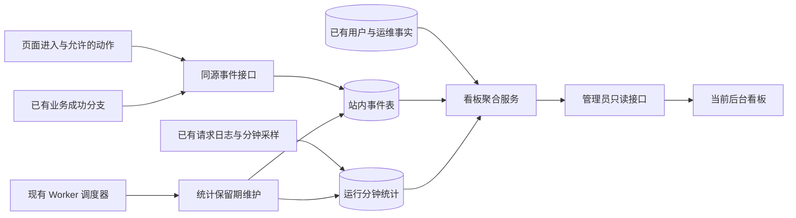

# 网站数据看板设计方案

> 日期：2026-09-06。状态：设计稿，尚未开发。
> 核查基线：本地提交 `a52b3a2`，`appVersion=0.8.0.6`，开始时工作区干净。
> 本次依据仓库代码和官方公开资料设计；未连接生产统计库、未检查生产访问日志，未打开浏览器或启动服务。本文没有把示例、建议阈值或历史记录当作当前网站的真实统计数据。

## 1. 建议做成什么

将管理后台现有“概览仪表盘”扩展为“网站数据看板”，回答五个问题：

1. **有多少人来？** 浏览量、访客数、最近活跃访客、访问来源和设备。
2. **大家在用什么？** 热门栏目、功能使用、阅读情况、注册和关键操作的完成情况。
3. **网站运行如何？** 接口是否报错、是否变慢、Web/Worker/数据库是否正常。
4. **展示的数据可靠吗？** 行情、打新、强赎、下修、安全性等数据是否按时更新，哪些正在使用旧数据。
5. **接下来应处理什么？** 待处理故障、数据缺口、功能流失点。

采用“一个总览＋四个明细页签”：**总览、访问分析、行为分析、运行状态、数据健康**。首期默认面向管理员；已有用户、券商、任务、设置、审计等管理功能保留，通过详情链接进入。

推荐首期沿用现有原生前端、Express、PostgreSQL、Redis 和 Worker，补充少量站内统计。参考成熟产品的指标和组织方式，不为这次单站看板引入整套新应用框架。

## 2. 已有能力、可复用能力与真正缺口

| 领域 | 已核实的现状 | 本方案如何处理 |
|---|---|---|
| 后台概览 | `renderOverview()` 已显示总用户、管理员、禁用用户、券商账户、今日新增和平台总资产六张卡片 | 复用入口和卡片；增加网站运营指标，原卡片保留在用户/账户摘要中 |
| 用户基础 | `users` 有注册时间、最近登录时间；`adminOverview()` 已聚合用户和账户数据 | 注册总量直接读业务表；最近登录时间不能推算每日活跃和历史留存 |
| 文章阅读 | 文章详情接口会增加 `articles.view_count` | 原阅读计数保留；它是接口调用累计值，不能等同于全站浏览量或独立阅读人数 |
| 请求日志 | `errorHandler.js` 已记录请求路径、状态码、耗时、请求 ID，并每分钟输出事件循环指标 | 扩展现有采样入口，形成可查询的分钟统计；不再增加一套访问日志中间件 |
| Nginx 日志 | 两份模板已有请求耗时、上游耗时、状态码、字节数等字段；当前格式未含完整访客分析维度 | 可用于排障和有限历史请求分析；不能据此还原过去的用户点击、来源、停留和准确 UV |
| 服务健康 | 已有 `/health`、`/ready`、Worker 心跳和健康检查 timer | 复用检查逻辑；`/ready` 的 HTTP 状态目前主要取决于数据库，必须单独读取 Redis 状态 |
| 任务与告警 | 已有计划槽位、运行记录、Worker 心跳、邮件告警、补跑和审计 | 总览读取摘要，故障详情跳回现有任务页；不复制补跑或告警系统 |
| 金融数据质量 | 已有 `ops.dataset_partitions`、质量问题、发布水位、同步游标及 API 预算/熔断 | 统一呈现数据是否过期、质量是否通过、上游是否等待；不另存第二套金融事实 |
| 访问与行为 | 未发现全站 PV/UV、会话和行为事件的统一采集链路 | 新增轻量事件采集，这是本次主要新增能力 |
| 前端与权限 | 原生 HTML/CSS/JS，主站通过 `switchMain()`、子页及独立详情切换；后台已有能力权限 | 复用共享样式、导航与鉴权；页面切换必须记为实际栏目访问 |

**架构对齐结论：**现有架构能承载这个规模的首版设计。新增的是网站自身的访问事实和运行统计，不新增证券数据源、金融事实表、业务计算链路或第二套调度器。

## 3. 参考项目与选型

以下资料于 2026-09-06 查阅，以项目官方仓库和官方文档为依据。

| 参考 | 可借鉴的内容 | 在存在小站的采用方式 |
|---|---|---|
| [Plausible](https://github.com/plausible/analytics) / [官方看板说明](https://plausible.io/docs/guided-tour) | 核心数字、趋势图、来源、热门页面、设备和目标转化集中展示 | 总览采用清晰的指标卡＋趋势＋排行榜；低频指标放明细页 |
| [Umami](https://github.com/umami-software/umami) | 访问、活动、行为和转化分析，支持自托管；官方源码安装使用 Node.js 与 PostgreSQL | 作为现成统计服务的备选；本次不安装、不复制其应用代码 |
| [PostHog 漏斗说明](https://posthog.com/docs/product-analytics/funnels) | 按连续步骤看总体转化、相邻步骤转化及流失；区分转化观察窗口 | 首期只做预设流程，避免一开始建设任意报表编辑器 |
| [Uptime Kuma](https://github.com/louislam/uptime-kuma) | HTTP/TCP/DNS 等可用性监测、响应趋势、证书信息和通知 | 借鉴运行状态呈现；后期如需整机宕机与公网故障告警，可在另一台主机部署官方项目 |

三种路径比较：

| 路径 | 优点 | 额外负担 | 建议 |
|---|---|---|---|
| 扩展当前后台，补少量明确事件 | 用户行为、任务、金融数据状态可以统一；复用现有权限和部署 | 需要自行维护本方案定义的有限统计口径 | **首期推荐** |
| 接入 Umami，后台读取统计结果 | 访客分析能力现成 | 多维护一个应用、数据库边界和鉴权；任务/数据健康仍需站内实现 | 如果后续更重视完整通用分析，重新评估 |
| 完整产品分析平台＋独立运维监控 | 能力范围更广 | 运维、采集、权限和报表配置明显增加 | 目前缺少流量与资源基线，不作为首期默认 |

以上选择是结合仓库现状的设计判断。若后续决定采用 Umami 或 Uptime Kuma，应按其官方方式安装并作为该领域唯一采集来源，不同时启用两套 PV 事实，也不手写替代品。

## 4. 看板内容与交互

### 4.1 总览：进入后台先看这一屏

默认“今天”，支持昨天、近 7 天、近 30 天及自定义日期。统一使用北京时间；默认展示上一等长区间对比。今天尚未结束时，只与昨天相同时刻以前的数据比较。

页面从上到下：

1. **时间范围与更新时间**：显示统计起始日、数据截至时间、刷新按钮。
2. **核心卡片**：浏览量、访客数、最近 5 分钟活跃访客、活跃登录用户、新增注册、待处理异常。
3. **访问趋势**：PV/UV 切换；今天按小时，长区间按日。
4. **功能热度与来源**：左右分别为热门栏目、来源渠道；点击进入对应筛选后的明细。
5. **网站与数据状态**：Web、数据库、Redis、Worker，以及关键金融数据集的状态。
6. **待处理事项**：最多展示 5 条最需要处理的事项，注明影响范围、发生时间与现有详情入口。

状态只使用“正常、需关注、异常、未知”四种，并带文字原因。接口加载失败显示“暂不可用”；历史快照必须标注时间，不能用旧的绿色状态冒充实时正常。

### 4.2 访问分析：流量从哪里来

| 内容 | 展示方式与用途 |
|---|---|
| 浏览量、访客数、访问次数 | 数字和趋势；分别回答看了多少页面、多少浏览器访客、来了多少次 |
| 热门栏目/页面 | 排行表：栏目、PV、UV、平均有效停留、入口次数；列表与独立详情分开 |
| 来源 | 搜索引擎、外部网站、推广渠道、直接/未知；只存来源域名和允许的活动标识 |
| 设备 | 手机/桌面/平板、浏览器大类；帮助判断后续优化优先级 |
| 新访客与回访客 | 在可观测身份有效期内区分首次和再次访问；明确是浏览器标识口径 |
| 入口与离开页 | 看用户从哪里进入、在哪个页面结束本次访问 |

不把所有请求都当作浏览量。JS/CSS、图片、API 轮询、健康检查和后台访问均排除；自动刷新行情不增加 PV。

首期不做精确位置地图。微信、浏览器隐私策略或直接打开链接可能不提供来源，统一显示“直接/未知”，不推测具体平台。

### 4.3 行为分析：什么功能有价值，哪里卡住

**功能使用排行**覆盖持仓、交易、打新、股票分析、上市可转债、强赎、下修、安全性、估值、周期、套利、投资笔记等实际栏目。每项同时显示使用人数和使用次数，避免少数用户高频点击掩盖整体使用情况。

**最近行为**默认显示近 30 分钟最多 50 条，内容如“访客 V-7F2 打开了下修监控”“登录用户 U-19A 添加自选成功”。只展示去标识后的短编号、时间、栏目、动作和结果；不展示持仓、金额、证券组合或输入内容。

**首期预设两条流程：**

- 注册流程：进入注册区域 → 提交注册 → 注册成功。同一分析会话内按顺序、同一浏览器访客去重；注册关闭时显示“注册未开放”，不计算 0% 转化率。
- 分析流程：进入分析列表 → 打开详情。同一会话内按顺序统计。详情阅读、加入自选等不同意图另外显示，不把所有人都当作必须注册或交易。

**后续再加入：**新注册用户 7 天内首次建立账户/添加持仓或自选的激活情况、7 日留存、文章阅读完成度、常见访问路径。

长期转化只用经后端确认的用户标识；匿名跨设备不合并。7 日留存按首次观测到有效使用的登录用户分组，以第 7 个自然日再次有效使用为回访；尚未满 7 天的分组显示“观察中”，同时显示样本数。它不是“曾经登录过的所有用户”的历史留存。

### 4.4 运行状态：网站是否可用、是否变慢

| 范围 | 首期内容 | 边界 |
|---|---|---|
| Web | 当前版本、最近采样、请求量、5xx 比例 | `/health` 只能证明进程响应；不能据此判断业务和所有依赖正常 |
| 数据库与 Redis | 分项连接状态、最近成功检查时间 | 复用现有连接和就绪逻辑，不能只看 `/ready` 的 HTTP 200 |
| Worker | 心跳、版本、待运行/逾期/失败/等待任务 | 沿用现有 2 分钟心跳窗口；等待外部额度不直接标为服务故障 |
| 接口质量 | 5xx、404、429、慢接口排行，耗时 P50/P95 | 401/403 单列权限结果；按路由模板统计，不把动态 ID 拆成无限多个接口 |
| 应用资源 | Web 进程内存、事件循环延迟 | 不是整台服务器的资源情况；CPU、磁盘、备份和证书趋势放后续 |

P95 表示“95% 请求耗时不超过此值”。分钟数据保存固定耗时桶的计数，跨时间段先合并桶再计算近似 P95，不能平均各分钟 P95。样本太少时显示样本数并提示参考价值有限。

首期只承诺 **Express 接收到的请求** 的运行趋势。Nginx 直接拦截的 429、静态资源故障、TLS/DNS 和整机断网不在这个统计范围内。后续接入 Nginx 日志时，必须按 `layer=nginx/app` 分开，不能将同一请求算两次。

同一台服务器无法在自身完全宕机时可靠报警。需要“公网可用率、证书到期、整机宕机通知”时，将 Uptime Kuma 部署到独立主机或使用现有云监控；未接入前显示“外部监测未接入”，不展示虚假的 99.99%。

### 4.5 数据健康：存在小站最需要的专项视图

| 数据组 | 主要检查 |
|---|---|
| 持仓行情与净值 | 按市场收盘时间检查缺价、目标交易日与最新净值日期；只给出汇总缺口 |
| 股票/转债行情与分析 | 目标交易日、最后成功发布、覆盖率、派生结果是否同步 |
| 打新日历和报告 | 核心事实与日报日期、集合是否一致、是否仍保留旧报告 |
| 强赎/下修 | 公告水位、行情水位、解析质量、计算结果日期 |
| 可转债安全性/估值/周期 | 发布状态、质量门禁、目标日完整度 |
| 外部数据接口 | 当日实际计数/内部预算、等待状态、接口熔断和预计恢复时间 |

统一表格列：**模块、应到日期、实际数据日期、发布时间、覆盖情况、状态、原因、详情**。

新鲜度判断直接复用 `jobDefinitions`、`expectedDataDate`、`isDataAsOfFresh` 和分区服务。不能简单用“超过 24 小时”报警：公告、收盘日次日任务、港股、节假日和月度宏观数据有各自口径。

“任务运行成功”和“数据已通过质量检查并发布”分开呈现。数据未到期为正常等待；到期仍缺失为需关注；拒绝发布时标明“当前沿用上一份完整数据”。尚未登记检查规则的数据集显示“未纳入检查”，不得冒充 100% 健康。

新看板只读这些事实。查看、刷新、切筛选和点开详情都不触发 Tushare、腾讯行情或公告补抓；人工处理仍进入现有任务/运维入口。

## 5. 指标口径：先保证数字可信

| 指标 | 首期定义 |
|---|---|
| PV 浏览量 | 真实可见页面/虚拟栏目进入次数；每次进入生成 `page_view_id`，事件重传不重复计数。主动刷新可算新一次；重复点击当前栏目不算 |
| UV 访客数 | 选定区间内不同第一方浏览器访客标识数；同一浏览器登录前后保持同一访客标识。不是自然人数，跨设备/清理存储会增加计数 |
| 访问次数 | 同一访客连续活动算一次会话，超过 30 分钟无有效活动后另开会话；多标签同一访客合并，心跳本身不延长会话 |
| 最近活跃访客 | 过去 5 分钟发生页面进入或前台有效交互的不同访客；明确标为“估计”，不是在线登录会话总数 |
| 活跃登录用户 | 区间内发生有效页面/功能操作的后端验证用户去重；不以登录请求、自动轮询或心跳定义活跃 |
| 新增注册 | 按 `users.created_at` 和上海时区计算的真实新增用户数；与埋点注册成功数分开，后者可能受采集关闭影响 |
| 有效停留 | 仅累计页面可见且近期有交互的时间段；隐藏页面暂停，长时间挂机不累计；异常关闭可能少计，展示为估计值 |
| 功能使用人数 | 区间内完成指定事件的访客或登录用户去重，页面明确当前口径；人数和次数不得混用 |
| 转化率 | 同一观察对象在规定窗口内按顺序完成终点的人数 ÷ 进入起点人数；显示分母，分母为 0 时为“暂无样本” |
| 请求错误率 | 应用层业务 API 的 5xx 数 ÷ 同范围已完成业务 API 请求数；排除统计接口、健康检查与静态资源 |

默认剔除后台、管理员/员工测试流量、开发环境、健康探针和可识别机器人；管理员可单独切换“内部流量”，统计接口也必须复用同一过滤条件。

补充约束：

- 所有时间数据库使用带时区时间，报表统一按 `Asia/Shanghai` 切日；范围采用起点包含、终点不包含。
- 日 UV 相加不等于周 UV；栏目 UV 相加不等于全站 UV。跨日和跨栏目都重新去重。
- 前端禁用统计、拦截脚本或网络失败会造成漏计；不宣称能统计所有真人，也不通过指纹识别强行补齐。
- 首期“总浏览量”指所选区间的合计，查询最多覆盖实际保留的 90 天。只有启用时间仍在保留范围内，才可显示“自统计启用日起累计”；需要永久累计时必须先完成长期汇总，不能清理明细后继续冒充全历史。上线之前没有的行为数据不回填为 0，也不从用户数反推。
- 历史 Nginx 日志若后续单独导入，只能作为“服务器请求历史”展示；先核实留存和字段，按文件与偏移去重，不与正式 PV 混算。

## 6. 采集设计与事件清单

### 6.1 如何接入现有页面

拟新增一个共享统计脚本。主站在 `navigation.js` 的页面实际切换完成处触发，二级页签复用各自现有状态；独立报告、详情、阅读和登录页接入同一脚本。

页面键采用稳定枚举，如 `home`、`holdings.positions`、`ipo.calendar`、`bond.revision`、`knowledge.article`。`main`、`sub`、详情类型只按允许列表映射；不直接保存完整 URL、查询参数或动态页面标题。

直接打开链接、前进后退和二级页签切换均要覆盖。打开菜单、旋转屏幕、图表重绘、接口刷新和同页筛选不增加 PV；筛选可作为单独的功能事件。

### 6.2 首批事件

| 事件 | 触发点 | 允许内容 |
|---|---|---|
| `page_view` | 页面/虚拟栏目实际进入 | 页面键、模块、入口、设备大类 |
| `engagement` | 前台有效活动时间合并上报 | 页面实例、活动秒数、最近交互时间；不记录每次鼠标移动 |
| `detail_open` | 分析详情或文章打开 | 模块和详情类型；首期不附证券、账户或文章正文 |
| `filter_apply` | 筛选确认生效 | 模块、筛选项名称；不保存搜索词和输入值 |
| `register_view` / `register_submit` | 注册区域显示/提交 | 入口和步骤；不含用户名、邮箱和验证码 |
| `register_success` | 后端注册成功后 | 服务端时间、结果；全站注册总数仍以业务表为准 |
| `watchlist_add_success` | 后端自选保存成功后 | 模块、成功结果，不含证券代码 |
| `import_result` | 现有导入服务执行结束后 | 导入类型、成功/失败、条数区间；不含文件、识别文本和持仓 |

前端事件只能描述访问或点击，不能通过请求体伪造注册成功、身份和保存成功。服务端事件从原有成功分支产生；业务事实仍在原业务表，统计写入失败不改变业务成功结果。

失败原因只使用允许的错误分类，不采集任意错误字符串。精确用户路径和长期激活功能在后续阶段完成事件覆盖后再启用，不能提前展示未完整采集的报表。

### 6.3 身份和最小采集

- 浏览器使用本站生成的随机标识，建议有效期 90 天；不使用 IP＋设备信息生成指纹。
- 用户标识由服务端对真实用户 ID/用户名做带密钥的不可逆映射，密钥只在 `.env`；请求体中的用户身份不可信。
- 匿名与登录访问只在同一浏览器的事件中自然连续；登录用户 DAU 可跨设备按服务端标识去重，访客 UV 仍按浏览器统计，两类口径不混合。
- 非必要统计提供说明和关闭入口。关闭后停止访客/行为采集并清除统计标识；技术故障计数和已有业务审计各按原用途保留。
- 不采集密码、验证码、Cookie 内容、邮箱、姓名、账户名、交易金额、持仓内容、上传文件、正文、剪贴板和完整请求体；不做录屏或会话回放。
- 来源只保留域名；活动标识限制长度和字符集。分析事件不保存原始 IP 或完整 User-Agent，现有运维日志保持独立用途和权限。

## 7. 数据链路与存储

图中“业务成功分支”调用的是同一统计接收服务，不经浏览器回传，也不额外请求自己的 HTTP 接口。

### 7.1 首期只新增两个事实表

| 拟定表 | 保存内容与约束 |
|---|---|
| `ops.site_events` | `event_id` 唯一；`received_at/occurred_at`、`visitor_key/user_key/session_key/page_view_id`、事件名、页面键、来源、设备、内外部流量、数据版本和允许的 `properties JSONB`；身份、时间、事件类型等高频条件用正式列 |
| `ops.site_runtime_minute` | 分钟、进程实例、应用版本、路由模板/样本类型、请求数、状态分类、耗时桶、资源/依赖样本、采样覆盖情况；唯一键保证同批次重试不重复累加 |

运营数据放 `ops`，不占用现有金融指标表。原始事件只保存已筛选字段，不能以“保存原始数据”为名保存完整敏感请求。

索引优先覆盖时间、事件＋时间、页面＋时间、用户＋时间、会话＋时间；枚举、属性大小、非负耗时、版本和去重键做数据库及接收层约束。首期不按所有维度预计算组合表，也不提前分库或上 ClickHouse。

已有的 `users`、`admin_audit_log`、`job_runs`、`ops.job_schedule_slots`、`ops.worker_heartbeats`、`ops.alert_notifications`、`ops.dataset_partitions`、`ops.data_quality_issues`、`ops.external_call_budgets`、`ops.external_circuits` 保持各自唯一事实来源。看板读取聚合，不复制成另一套业务状态。

### 7.2 首次、增量、缓存和保留

| 项目 | 设计 |
|---|---|
| 首次启用 | 从启用时间开始采集；用户总量和既有运维历史直接读现有库，无须重新拉金融接口 |
| 增量接收 | 事件按唯一 ID 去重入库；分钟样本按批次键覆盖写，重传不会重复加总 |
| 上报频率 | 事件积累后批量发送，建议 10 秒或 20 条触发；单批不超过 20 条/32 KB；活动时间最多每分钟合并一次，隐藏/退出时尽力发送 |
| 时间校验 | 保留客户端发生时间与服务端接收时间；拒绝明显未来时间及超过 24 小时的迟到事件，报表对最近 24 小时允许补入并标记暂定 |
| 失败处理 | 浏览器仅保留有界队列、有限次数重试；服务端批量写入超时即失败，不阻塞业务。记录拒绝/丢弃/延迟计数，有缺口就标记统计不完整 |
| 查询缓存 | 当前活跃约 30 秒，运营报表约 60 秒；缓存键必须包含权限范围、时间和筛选；异常时可显示带时间的旧报表，不能悄悄返回 0 |
| 首期保留期 | 事件明细 90 天、运行分钟统计 30 天；首期可查询范围按真实保留期限制，清理只处理这两张新表 |
| 历史长期趋势 | 二期如确需一年趋势，再增加可重算的日汇总；PV 可累加，跨日 UV 必须保留去重能力或明确不提供，不用日 UV 求和冒充 |

首期用带索引的库内聚合和现有缓存满足查询；根据实际数据量和查询耗时再决定汇总优化。精确写入后才确认事件接收成功；进程崩溃或关页造成的未送达事件不能承诺完全无损。

保留期维护确需一个新任务，因为现有证券同步任务不负责网站统计。将其登记到现有 `JOB_DEFINITIONS`，复用 Worker、任务锁、幂等分批清理和运行记录；外部 API 调用预算为 0，禁止建立独立 cron 或另一套调度器。请求耗时的分钟刷新沿用已有采样周期，不挂到金融采集任务上。

## 8. 接口、权限与页面实现边界

拟新增：

- `POST /api/telemetry/events`：游客和登录用户均可提交允许事件；同源校验、现有 CSRF/限流体系、独立小请求体上限、事件白名单；拒绝客户端提交服务端专属事件。游客在安全中间件的公开入口清单中精确放行，不能开放整个后台。
- `GET /api/admin/analytics/overview`：运营摘要和趋势。
- `GET /api/admin/analytics/traffic`：页面、来源和设备分析。
- `GET /api/admin/analytics/behavior`：排行、预设流程与近期行为，服务端分页。
- `GET /api/admin/analytics/runtime`：运行分钟统计与当前健康摘要。
- `GET /api/admin/analytics/data-health`：已有分区、任务、质量、预算与熔断的聚合。

接口统一返回 `range/timezone/generatedAt/dataThrough/coverage` 等元信息，区分“无访问”“尚未采集”“部分缺失”“查询失败”。管理接口使用私有缓存规则，不能进入公开缓存。

**权限采用现有能力：**新看板默认由管理员或 `ops_manage` 访问，复用 `requireCapability('ops_manage')`；仅有内容管理能力的账号不能看到全站行为流和运行信息。当前 `/api/admin/overview` 仅要求 `requireStaff`，因此不能直接把新敏感数据塞入它；保留原响应，通过新接口加载新指标。菜单隐藏和后端校验必须同时生效。

**前端沿用当前体系：**原生页面与现有 Chart.js、`shared/style.css`、`BusinessTable`、`MobileUI` 和图表交互能力；页面专属脚本可按模块拆开，避免把全部逻辑继续堆进 `admin.js`。不改写整个后台文件，也不引入 React/Vue 或另一套 UI 样式。

看板可见时按 60 秒刷新，近期活跃/行为最多 30 秒；切页、后台标签和离开页面时停止轮询。手机沿用 760px 正文、900px 导航规范：卡片双列/单列，图表跟随容器，宽表仅局部横滑；不增加新的断点体系。

## 9. 异常提示与后续扩展

首期复用已有任务故障、Worker 离线、数据质量及熔断告警，只新增聚合展示，不再次发送相同故障通知。异常跳转到原始任务/告警详情，保留原有确认、补跑与操作审计。

新增运行阈值先作为看板提示，建议从“5 分钟内至少 100 个请求且 5xx 超过 2%”“连续 3 个有足够样本的窗口出现明显变慢”起步；这些是待真实基线校准的建议，不是当前故障标准。小流量时同时看错误绝对次数，不靠百分比判定；无访问不能直接判断网站宕机。

后续按收益选择：

1. **用户价值**：7 日激活/留存、常见流程、文章阅读完成度。
2. **体验质量**：前端错误分类和实际页面体验指标；先限制采样、去除 URL/堆栈敏感内容，再接入。
3. **运维完整度**：Nginx 层错误、主机 CPU/磁盘、证书、备份新鲜度与异地副本状态；不存在历史成功记录时显示未知，不以“无告警”证明备份成功。
4. **外部可用性**：独立位置的探测与故障通知，补足整机宕机盲区。

首期不加入热力图、录屏、任意 SQL 报表、拖拽大屏、自动 AI 建议、地理大屏和收入预测。这些暂不影响用户提出的核心问题。

## 10. 实施顺序与验收

### 阶段一：采集和口径

完成事件白名单、身份规则、两张表的版本化迁移、共享脚本、服务端成功事件、分钟采样和管理权限；记录统计启用时间。先验证真实导航和去重，再开放指标。

### 阶段二：首期看板

完成五个页签的首期内容，接入现有任务/数据健康摘要、缓存、状态标识和维护任务。第一批可用成果应包括“能看访问、能看近期行为、能判断运行和数据状态”。

### 阶段三：观察后扩展

启用后至少观察 7 天的事件量、查询耗时、漏计原因与实际使用问题，再决定留存、长期汇总、外部探测和新通知。工期与服务器容量在实施前按实际可用资源评估，本设计不虚构线上日活或资源余量。

| 验收场景 | 必须满足的结果 |
|---|---|
| 一次会话访问首页→下修→详情 | 每次实际进入各计 1 次；自动刷新、菜单展开、屏幕旋转不增加 PV |
| 重复点击当前栏目/重复发送同一批事件 | 不重复计数；一次有效导入的业务成功只统计一次 |
| 匿名访问后登录、两个标签并行 | 浏览器 UV 不增加；登录用户活跃单独按服务端身份计算；会话和活跃去重正确 |
| 日期边界、跨日 UV、观察期未满 | 上海时区正确；周 UV 不用日 UV 相加；未满 7 日不记为流失 |
| 机器人、后台、测试访问 | 默认流量指标不计入；排除规则在总览与明细一致 |
| 游客、普通用户、内容管理员直接调用统计接口 | 均不能读取受保护统计；伪造用户身份和成功事件被拒绝 |
| 隐私检查 | 事件和返回报表无账户、持仓、金额、密码、邮箱、Token、完整 URL/输入内容 |
| 采集或统计数据库写入失败 | 登录、查看持仓、保存和导入保持原业务结果；队列有界，统计覆盖状态变为不完整 |
| 真实任务失败/等待额度/旧分区 | 与现有后台一致；等待不误报宕机，旧数据标注截至日期，不补抓外部源 |
| 跨时间段耗时统计 | 按桶合并计算，不能对 P95 求平均；缺少样本和采样中断明确展示 |
| 看板重复刷新 20 次 | 金融外部 API 新增调用为 0；不会新增业务补跑槽位 |
| 关闭采集或回滚新看板 | 原网站与后台继续可用；保留已有统计表，不删除业务表或已有事实 |

性能验收建议：用明确标注的合成数据评估 10 万、100 万事件的查询计划与延迟，记录测试机器配置；常用近 30 天报表缓存命中目标在 1 秒内返回。相同业务负载下比较开关统计前后的业务 P95，新增开销目标不超过 5%；未满足则减小采样/查询负担后再上线。这些是未来验收目标，本次尚未测试。

实现后执行 `npm.cmd run test:all` 与 `npm.cmd run check:knowledge`，重点验证导航计数、去重、权限、时区、数据库失败和既有业务回归。移动端按仓库规范验证；受低性能模式限制时，不开启浏览器/视觉测试/开发服务器，不把静态检查当作真机通过。

## 11. 改动范围与知识同步

| 范围 | 后续实施位置 |
|---|---|
| 后台展示 | `public/admin.html`、`public/js/admin.js` 局部入口与新增看板脚本；共享样式仅做必要扩展 |
| 页面采集 | 一个共享统计脚本、`navigation.js`、实际子页切换和独立 HTML 入口 |
| 业务结果 | 注册、自选、导入等现有服务/路由的成功或失败分支，统计失败隔离 |
| 请求采样 | `server/middleware/errorHandler.js` 的已有入口及新增聚合服务 |
| 接口和权限 | `server/app.js`、现有安全中间件的精确公开入口、`server/routes/admin.js` 与新增事件路由 |
| 存储与维护 | `server/db/migrations.js` 新迁移、统计存取服务、现有任务定义与 Runner 接入 |

实施时同步《技术架构》第 4/5/7/8/11/12 节的实际变化；更新本方案的执行记录和《知识索引》。新增维护任务后重新生成《任务接口数据集矩阵.generated.md》，不手改矩阵。配置或部署流程确有变化时同步《生产部署流程》，发布时按既有流程维护版本记录。

本次仅交付设计文档及知识入口，不实施迁移、采集或部署。后续执行涉及新增统计表时，按现有生产规则在具体迁移范围可审阅后取得相应授权。

## 12. 本次设计核查记录

- 核对了后台六项概览、能力鉴权、主站导航、文章阅读计数、请求日志、就绪检查、Worker 心跳、任务定义/分区边界和 Nginx 日志模板。
- 官方参考来自 Plausible、Umami、PostHog 和 Uptime Kuma；参考链接已随相关选择列出。
- 未测量当前生产 PV、UV、日活或服务器容量，未声称统计已经存在。
- 本次为纯文档改动，`npm.cmd run check:knowledge` 和 `git diff --check` 已通过；未运行代码测试、性能测试或页面视觉验收。
