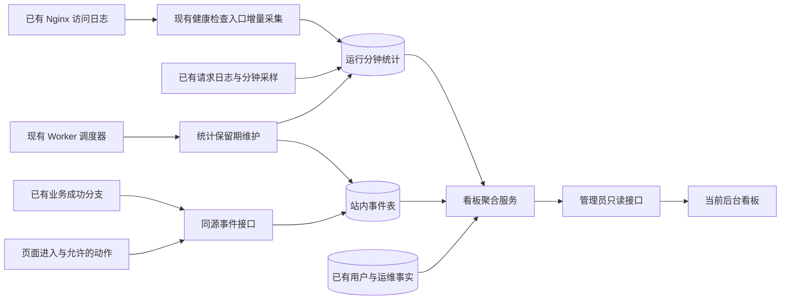

# 网站数据看板设计方案

> 日期：2026-09-06。状态：已按“执行方案”落地代码，待生产部署与真实运行验收。
> 初稿基线：本地提交 `a52b3a2`，`appVersion=0.8.0.6`。评审修订：2026-09-06，复核提交 `1e3244f`，`appVersion=0.8.0.7`，修订开始时工作区干净。
> 当前工作区实现版本：`appVersion=0.8.0.8`；验收补充迁移 `139_site_analytics_429`，用于兼容既有运行采样表的独立 429 字段。
> 本次依据仓库代码和官方公开资料设计；未连接生产统计库、未检查生产访问日志，未打开浏览器或启动服务。本文没有把示例、建议阈值或历史记录当作当前网站的真实统计数据。

## 执行记录（2026-09-06）

- 已完成迁移 138：新增 `ops.site_events`、`ops.site_runtime_minute`，并为 `ops.sync_cursors` 增加 `cursor_payload`；新增每日 02:00 的 `site_analytics_retention`，默认保留 30 天，已重新生成任务矩阵。
- 已完成公开事件入口 `POST /api/telemetry/events`：游客/登录用户均可上报，沿用 CSRF，增加 32KB 解析前限制、IP/访客双层限流、签名访客 Cookie、HMAC 用户键、事件/页面/属性白名单；客户端不能伪造注册、自选股和导入成功事件。
- 已完成 `/api/admin/analytics/{overview,traffic,behavior,runtime,data-health}`，后台菜单新增“网站数据看板”，服务端和前端均检查 `ops_manage`；Redis 使用实际 PING，查询缓存使用 Redis 优先和有界内存兜底，健康状态同步到 `/ready`。
- 已完成共享埋点脚本、主站/独立页面入口、导航/二级页签/详情/筛选事件，以及注册、自选股、净值导入的后端成功事件；已复用访问日志和事件循环采样入口，不新增第二套业务刷新或外部金融 API 调用。
- 已完成 Nginx 两份模板的统计专用限流与 32KB 体积限制；Worker 健康检查挂接 Nginx 增量采集，首次从日志尾部开始，按游标事务写入，采集失败不影响原健康检查。
- 验收修订已补齐真实新增注册、金融数据健康、数据库/Worker 状态、今日小时趋势、来源域名与会话串联、统计退出控制、独立 429 统计和有限重试；修复了主站虚拟页面误报、统计接口批次被应用采样拒收、Nginx 单条完整日志不消费及直接打开打新链接误记首页等问题。
- 已完成语法检查、看板纯函数/Nginx 日志解析测试和项目完整自动测试；方案落地阶段未执行生产迁移、生产数据同步、Nginx reload 或部署。
- 2026-09-06 本地界面核查补充：修复看板页签点击后选中态仍停留在“总览”的问题；行为、数据健康、运行状态中的技术标识已按页面语义显示中文；运行采样的特殊路由改为中文描述；数据健康新增指标说明，区分事件数、采样行数、分区行数、质量问题、接口额度和熔断状态；非生产环境的 Worker 明确显示“未启用”，不再把本地禁用调度误报为“已过期”；预算预警只展示当前窗口并补充预算上限、消耗、剩余、使用率和风险，熔断列表明确标注为暂停请求。专项 UI 断言通过，`npm.cmd run test:all` 为 118 通过、0 失败、0 跳过，`npm.cmd run check:knowledge` 通过；本地服务可访问，未执行生产变更。

## 1. 建议做成什么

将管理后台现有“概览仪表盘”扩展为“网站数据看板”，回答五个问题：

1. **有多少人来？** 浏览量、访客数、最近活跃访客、访问来源和设备。
2. **大家在用什么？** 热门栏目、功能使用、阅读情况、注册和关键操作的完成情况。
3. **网站运行如何？** 接口是否报错、是否变慢、Web/Worker/数据库是否正常。
4. **展示的数据可靠吗？** 行情、打新、强赎、下修、安全性等数据是否按时更新，哪些正在使用旧数据。
5. **接下来应处理什么？** 待处理故障、数据缺口、功能流失点。

采用“一个总览＋四个明细页签”：**总览、访问分析、行为分析、运行状态、数据健康**。首期默认面向管理员；已有用户、券商、任务、设置、审计等管理功能保留，通过详情链接进入。

推荐首期沿用现有原生前端、Express、PostgreSQL、可选 Redis 和 Worker，补充少量站内统计。Redis 未启用时统计查询使用有界进程内缓存；环境要求 Redis 必须可用时，缺配置或故障仍应明确报错。参考成熟产品的指标和组织方式，不为这次单站看板引入整套新应用框架。

## 2. 已有能力、可复用能力与真正缺口

| 领域 | 已核实的现状 | 本方案如何处理 |
|---|---|---|
| 后台概览 | `renderOverview()` 已显示总用户、管理员、禁用用户、券商账户、今日新增和平台总资产六张卡片 | 复用入口和卡片；增加网站运营指标，原卡片保留在用户/账户摘要中 |
| 用户基础 | `users` 有注册时间、最近登录时间；`adminOverview()` 已聚合用户和账户数据 | 注册总量直接读业务表；最近登录时间不能推算每日活跃和历史留存 |
| 文章阅读 | 文章详情接口会增加 `articles.view_count` | 原阅读计数保留；它是接口调用累计值，不能等同于全站浏览量或独立阅读人数 |
| 请求日志 | `errorHandler.js` 已记录请求路径、状态码、耗时、请求 ID；性能优化已落地每分钟事件循环采样，当前只输出日志后重置 | 复用采样位置，新增路由/状态/耗时桶聚合及分钟落库层；这是新增存储能力，不是现有统计表复用 |
| Nginx 日志 | 两份模板已有请求耗时、上游耗时、状态码、字节数；`INC-0008` 记录过静态脚本遭 429 拦截 | 首期增量读取现有日志，形成独立边缘层 429/5xx 指标；不当作 PV，也不能还原过去的用户点击、停留和准确 UV |
| 服务健康 | 已有 `/health`、`/ready`、Worker 心跳和每两分钟健康检查 timer；`/ready` 的 Redis 值来自初始化变量 | 数据库复用现有连接；Redis 增加带超时的实际探测和状态缓存，不能把初始化变量当作实时结果 |
| Redis 与缓存 | `config.js` 在未配置 `REDIS_URL` 时使用内存会话/限流；本地配置核对为未启用，生产状态需另验 | 区分可选未启用、配置后异常、环境要求必需但缺失；查询缓存明确 Redis/内存两种运行方式 |
| 任务与告警 | 已有计划槽位、运行记录、Worker 心跳、邮件告警、补跑和审计 | 总览读取摘要，故障详情跳回现有任务页；不复制补跑或告警系统 |
| 金融数据质量 | 已有 `ops.dataset_partitions`、质量问题、发布水位、同步游标及 API 预算/熔断 | 统一呈现数据是否过期、质量是否通过、上游是否等待；不另存第二套金融事实 |
| 访问与行为 | 未发现全站 PV/UV、会话和行为事件的统一采集链路 | 新增轻量事件采集，这是本次主要新增能力 |
| 前端与权限 | `switchMain()` 只覆盖主导航，二级页签和详情入口分散；`redirectUnauthenticated` 只拦 `/admin.html`，不存在通用公开入口清单 | 先按第 6.1 节盘点埋点；统计上报按公开路由接入并防滥用；看板读取继承后台鉴权且明确检查 `ops_manage` |

**架构对齐结论：**现有架构能承载这个规模的首版设计。新增的是网站自身的访问事实和运行统计，不新增证券数据源、金融事实表、业务计算链路或第二套调度器。

## 3. 参考项目与选型

以下资料于 2026-09-06 查阅，以项目官方仓库和官方文档为依据。

| 参考 | 可借鉴的内容 | 在存在小站的采用方式 |
|---|---|---|
| [Plausible](https://github.com/plausible/analytics) / [官方看板说明](https://plausible.io/docs/guided-tour) | 核心数字、趋势图、来源、热门页面、设备和目标转化集中展示 | 总览采用清晰的指标卡＋趋势＋排行榜；低频指标放明细页 |
| [Umami](https://github.com/umami-software/umami) | 访问、活动、行为和转化分析，支持自托管；官方源码安装使用 Node.js 与 PostgreSQL | 作为现成统计服务的备选；本次不安装、不复制其应用代码 |
| [PostHog 漏斗说明](https://posthog.com/docs/product-analytics/funnels) | 按连续步骤看总体转化、相邻步骤转化及流失；区分转化观察窗口 | 首期只做预设流程，避免一开始建设任意报表编辑器 |
| [Uptime Kuma](https://github.com/louislam/uptime-kuma) | HTTP/TCP/DNS 等可用性监测、响应趋势、证书信息和通知 | 借鉴运行状态呈现；后期如需整机宕机与公网故障告警，可在另一台主机部署官方项目 |

三种路径比较：

| 路径 | 优点 | 额外负担 | 建议 |
|---|---|---|---|
| 扩展当前后台，补少量明确事件 | 用户行为、任务、金融数据状态可以统一；复用现有权限和部署 | 需要自行维护本方案定义的有限统计口径 | **首期推荐** |
| 接入 Umami，后台读取统计结果 | 访客分析能力现成 | 多维护一个应用、数据库边界和鉴权；任务/数据健康仍需站内实现 | 如果后续更重视完整通用分析，重新评估 |
| 完整产品分析平台＋独立运维监控 | 能力范围更广 | 运维、采集、权限和报表配置明显增加 | 已有历史资源基线，但缺少事件量与统计负载实测，不作为首期默认 |

以上选择是结合仓库现状的设计判断。若后续决定采用 Umami 或 Uptime Kuma，应按其官方方式安装并作为该领域唯一采集来源，不同时启用两套 PV 事实，也不手写替代品。

## 4. 看板内容与交互

### 4.1 总览：进入后台先看这一屏

默认“今天”，支持昨天、近 7 天、近 30 天及自定义日期。统一使用北京时间；上一等长区间完整可用时才展示对比，否则显示“对比期数据不足”。首期明细默认保留 30 天，因此近 30 天报表不能默认提供此前 30 天的完整环比。今天尚未结束时，只与昨天相同时刻以前的数据比较。

页面从上到下：

1. **时间范围与更新时间**：显示统计起始日、数据截至时间、刷新按钮。
2. **核心卡片**：浏览量、访客数、最近 5 分钟活跃访客、活跃登录用户、新增注册、待处理异常。
3. **访问趋势**：PV/UV 切换；今天按小时，长区间按日。
4. **功能热度与来源**：左右分别为热门栏目、来源渠道；点击进入对应筛选后的明细。
5. **网站与数据状态**：Web、数据库、Redis、Worker，以及关键金融数据集的状态。
6. **待处理事项**：最多展示 5 条最需要处理的事项，注明影响范围、发生时间与现有详情入口。

状态使用“正常、需关注、异常、未知、未启用/不适用”五种，并带文字原因。“未启用/不适用”只适用于明确为可选且未配置的能力，不计入故障数；环境要求必需的 Redis 等依赖缺配置时仍为异常。接口加载失败显示“暂不可用”；历史快照必须标注时间，不能用旧的绿色状态冒充实时正常。

### 4.2 访问分析：流量从哪里来

| 内容 | 展示方式与用途 |
|---|---|
| 浏览量、访客数、访问次数 | 数字和趋势；分别回答看了多少页面、多少浏览器访客、来了多少次 |
| 热门栏目/页面 | 排行表：栏目、PV、UV、平均有效停留、入口次数；列表与独立详情分开 |
| 来源 | 搜索引擎、外部网站、推广渠道、直接/未知；只存来源域名和允许的活动标识 |
| 设备 | 手机/桌面/平板、浏览器大类；帮助判断后续优化优先级 |
| 新访客与回访客 | 在可观测身份有效期内区分首次和再次访问；明确是浏览器标识口径 |
| 入口与离开页 | 看用户从哪里进入、在哪个页面结束本次访问 |

不把所有请求都当作浏览量。JS/CSS、图片、API 轮询、健康检查和后台访问均排除；自动刷新行情不增加 PV。

首期不做精确位置地图。微信、浏览器隐私策略或直接打开链接可能不提供来源，统一显示“直接/未知”，不推测具体平台。

### 4.3 行为分析：什么功能有价值，哪里卡住

**功能使用排行**覆盖持仓、交易、打新、股票分析、上市可转债、强赎、下修、安全性、估值、周期、套利、投资笔记等实际栏目。每项同时显示使用人数和使用次数，避免少数用户高频点击掩盖整体使用情况。

**最近行为**默认显示近 30 分钟最多 50 条，内容如“访客 V-7F2 打开了下修监控”“登录用户 U-19A 添加自选成功”。只展示去标识后的短编号、时间、栏目、动作和结果；不展示持仓、金额、证券组合或输入内容。

**首期预设两条流程：**

- 注册流程：进入注册区域 → 提交注册 → 注册成功。同一分析会话内按顺序、同一浏览器访客去重；注册关闭时显示“注册未开放”，不计算 0% 转化率。
- 分析流程：进入分析列表 → 打开详情。同一会话内按顺序统计。详情阅读、加入自选等不同意图另外显示，不把所有人都当作必须注册或交易。

**后续再加入：**新注册用户 7 天内首次建立账户/添加持仓或自选的激活情况、7 日留存、文章阅读完成度、常见访问路径。

长期转化只用经后端确认的用户标识；匿名跨设备不合并。7 日留存按首次观测到有效使用的登录用户分组，以第 7 个自然日再次有效使用为回访；尚未满 7 天的分组显示“观察中”，同时显示样本数。它不是“曾经登录过的所有用户”的历史留存。

### 4.4 运行状态：网站是否可用、是否变慢

| 范围 | 首期内容 | 边界 |
|---|---|---|
| Web | 当前版本、最近采样、请求量、5xx 比例 | `/health` 只能证明进程响应；不能据此判断业务和所有依赖正常 |
| 数据库与 Redis | 分项配置状态、真实探测结果、最近成功检查时间 | 数据库复用连接池；Redis 初始化变量不作健康依据；可选未配置为“不适用”，必需但缺失为异常 |
| Worker | 心跳、版本、待运行/逾期/失败/等待任务 | 沿用现有 2 分钟心跳窗口；等待外部额度不直接标为服务故障 |
| 接口质量 | 5xx、404、429、慢接口排行，耗时 P50/P95 | 401/403 单列权限结果；按路由模板统计，不把动态 ID 拆成无限多个接口 |
| Nginx 边缘层 | 429/5xx 次数与趋势，按业务 API/静态脚本/统计上报分类 | 读取现有访问日志，与应用层分别展示；Nginx 返回的 5xx 也可能来自上游，不能全部归因为 Nginx 自身故障 |
| 应用资源 | Web 进程内存、事件循环延迟 | 不是整台服务器的资源情况；CPU、磁盘、备份和证书趋势放后续 |

P95 表示“95% 请求耗时不超过此值”。分钟数据保存固定耗时桶的计数，跨时间段先合并桶再计算近似 P95，不能平均各分钟 P95。样本太少时显示样本数并提示参考价值有限。

首期分别展示 **Express 应用层** 和 **Nginx 边缘层**。前者覆盖应用接收的请求与慢接口；后者从现有访问日志增量汇总，覆盖未到达应用的限流拦截及静态脚本错误。统一保存 `layer=app/nginx`，总览不得把两层请求数、错误数相加；排障关联同一请求时使用受信任的请求 ID，不能据其去重后冒充全站 PV。

边缘采集复用 `portfolio-worker-health.timer` 每两分钟运行的现有检查入口，挂接有界日志采集服务；按日志中的时间归入分钟桶，页面标注约两分钟更新延迟。保留原 Worker 检查流程，采集失败不得中断检查或改变其结果。采集进程仅获得该站访问日志及轮转文件的最小只读权限，不给 Web 开放整套系统日志；权限不足、解析失败或游标落后显示“采集异常/不完整”。同机 TLS/DNS 故障和整机断网仍需外部监测。

Redis 健康检查复用已配置客户端，低频执行带硬超时的 `PING` 并缓存结果；不因管理员刷新反复新建连接。无可用客户端、连接中断、超时或检查失败均不能沿用旧绿色状态，恢复后以新的成功结果恢复；必须实现“未配置但必需”的显式检查，不能依赖当前初始化函数提前返回后的 `redis.ready=false` 猜原因。现有安全审计已提出真实就绪检查整改，实施应扩展同一健康服务，避免看板与 `/ready` 各算一套结果。[Redis PING 说明](https://redis.io/docs/latest/commands/ping/)

慢接口排行衡量 HTTP 请求总耗时，不是 SQL 逐语句耗时。[性能优化方案](网站性能优化研发方案_20260904.md) 记录的 `pg_stat_statements` 当时尚未启用；本轮不顺带启用或另建慢 SQL 平台，实施前核实现状，需要 SQL 分析时沿用原专项。

同一台服务器无法在自身完全宕机时可靠报警。需要“公网可用率、证书到期、整机宕机通知”时，将 Uptime Kuma 部署到独立主机或使用现有云监控；未接入前显示“外部监测未接入”，不展示虚假的 99.99%。

### 4.5 数据健康：存在小站最需要的专项视图

| 数据组 | 主要检查 |
|---|---|
| 持仓行情与净值 | 按市场收盘时间检查缺价、目标交易日与最新净值日期；只给出汇总缺口 |
| 股票/转债行情与分析 | 目标交易日、最后成功发布、覆盖率、派生结果是否同步 |
| 打新日历和报告 | 核心事实与日报日期、集合是否一致、是否仍保留旧报告 |
| 强赎/下修 | 公告水位、行情水位、解析质量、计算结果日期 |
| 可转债安全性/估值/周期 | 发布状态、质量门禁、目标日完整度 |
| 外部数据接口 | 当日实际计数/内部预算、等待状态、接口熔断和预计恢复时间 |

统一表格列：**模块、应到日期、实际数据日期、发布时间、覆盖情况、状态、原因、详情**。

新鲜度判断直接复用 `jobDefinitions`、`expectedDataDate`、`isDataAsOfFresh` 和分区服务。不能简单用“超过 24 小时”报警：公告、收盘日次日任务、港股、节假日和月度宏观数据有各自口径。

“任务运行成功”和“数据已通过质量检查并发布”分开呈现。数据未到期为正常等待；到期仍缺失为需关注；拒绝发布时标明“当前沿用上一份完整数据”。尚未登记检查规则的数据集显示“未纳入检查”，不得冒充 100% 健康。

新看板只读这些事实。查看、刷新、切筛选和点开详情都不触发 Tushare、腾讯行情或公告补抓；人工处理仍进入现有任务/运维入口。

## 5. 指标口径：先保证数字可信

| 指标 | 首期定义 |
|---|---|
| PV 浏览量 | 真实可见页面/虚拟栏目进入次数；每次进入生成 `page_view_id`，事件重传不重复计数。主动刷新可算新一次；重复点击当前栏目不算 |
| UV 访客数 | 选定区间内不同第一方浏览器访客标识数；同一浏览器登录前后保持同一访客标识。不是自然人数，跨设备/清理存储会增加计数 |
| 访问次数 | 同一访客连续活动算一次会话，超过 30 分钟无有效活动后另开会话；多标签同一访客合并，心跳本身不延长会话 |
| 最近活跃访客 | 过去 5 分钟发生页面进入或前台有效交互的不同访客；明确标为“估计”，不是在线登录会话总数 |
| 活跃登录用户 | 区间内发生有效页面/功能操作的后端验证用户去重；不以登录请求、自动轮询或心跳定义活跃 |
| 新增注册 | 按 `users.created_at` 和上海时区计算的真实新增用户数；与埋点注册成功数分开，后者可能受采集关闭影响 |
| 有效停留 | 仅累计页面可见且近期有交互的时间段；隐藏页面暂停，长时间挂机不累计；异常关闭可能少计，展示为估计值 |
| 功能使用人数 | 区间内完成指定事件的访客或登录用户去重，页面明确当前口径；人数和次数不得混用 |
| 转化率 | 同一观察对象在规定窗口内按顺序完成终点的人数 ÷ 进入起点人数；显示分母，分母为 0 时为“暂无样本” |
| 请求错误率 | 应用层业务 API 的 5xx 数 ÷ 同范围已完成业务 API 请求数；排除统计接口、健康检查与静态资源 |
| 边缘错误统计 | 单独统计 Nginx 日志中的 429/5xx，按 API、静态资源、统计上报分类；如展示错误率，分母用同层同类请求数，不与应用层合并 |

默认剔除后台、管理员/员工测试流量、开发环境、健康探针和可识别机器人；管理员可单独切换“内部流量”，统计接口也必须复用同一过滤条件。

补充约束：

- 所有时间数据库使用带时区时间，报表统一按 `Asia/Shanghai` 切日；范围采用起点包含、终点不包含。
- 日 UV 相加不等于周 UV；栏目 UV 相加不等于全站 UV。跨日和跨栏目都重新去重。
- 前端禁用统计、拦截脚本或网络失败会造成漏计；不宣称能统计所有真人，也不通过指纹识别强行补齐。
- 首期“总浏览量”指所选区间的合计，默认查询最多覆盖实际保留的 30 天；明细保留天数可在实施时按资源评估配置，页面以服务端返回的真实可用范围为准。只有启用时间仍在保留范围内，才可显示“自统计启用日起累计”；需要永久累计时必须先完成长期汇总，不能清理明细后继续冒充全历史。上线之前没有的行为数据不回填为 0，也不从用户数反推。
- 历史 Nginx 日志若后续单独导入，只能作为“服务器请求历史”展示；先核实留存和字段，按文件与偏移去重，不与正式 PV 混算。

## 6. 采集设计与事件清单

### 6.1 如何接入现有页面

拟新增一个共享统计脚本。当前 `navigation.js` 的 `switchMain()` 只负责主导航，不存在全站通用的二级页签切换函数；必须在各实际入口接入，不能仅监听地址变化或通用 CSS 选择器。初始 URL 恢复可能连续触发主导航和子页初始化，同一轮只提交最终可见页面键，避免把中间默认页也记为一次访问。

**埋点接入点盘点表（当前代码已核实，开发验收按此逐项补齐）：**

| 页面/流程 | 当前文件与入口 | 接入要求 |
|---|---|---|
| 首页、个人中心、仓位对比、版本记录及各业务主栏目 | `public/js/navigation.js`：`switchMain()`、`setupMainNav()` 的 `popstate`；`index.html` 的 `DOMContentLoaded` 初始恢复 | 页面可见后记 `page_view`；主栏目含子页时使用下述最终子页键，避免父子双计 |
| 持仓总览、持仓、收益、交易 | `public/shared/core-earnings.js`：`initNav()` 内 `.nav-tab` 点击；`navigation.js` 的 `goHoldings()` | 以 `data-page` 对应的实际可见区域为准；首次进入持仓也读取当前子页，禁止每次重绘重复记录 |
| 上市转债、强赎、下修、安全性、周期、估值 | `public/js/bond-cycle.js`：`switchBondSub()`、`initBondCycleSub()`；`index.html` 初始子页恢复 | 六个子页分别登记；`initBondCycleSub()` 与 URL 恢复重复调用时去重；兼容别名 `analysis` 归一到实际页面 |
| 打新日历、历史新股/新债 | `public/js/ipo.js`：`loadIpo()`、`ipoSwitchHist(type)` | 日历随主栏目进入；历史类型切换作为功能事件，不能把与日历同屏的历史区额外计为整页 PV |
| 打新独立报告 | `public/ipo-report.html`：内联 `init()` 及 `DOMContentLoaded` | 独立页面一次 PV；内容打开成功再记 `detail_open`，不保存证券参数 |
| 股票/转债分析详情 | `public/js/bond-analysis.js`：`securityAnalysisSubmit()`、`bondAnalysisLoad()` | 同一详情展示只记一次 `detail_open`；取数刷新不重复记打开，证券输入不进入事件属性 |
| 下修动机独立详情 | `public/bond-revision-motive.html` → `public/js/bond-revision-motive.js` 初始化 | 共享脚本记独立页 PV；详情展示分支记打开，失败状态单列 |
| 套利分类、详情与返回 | `public/js/arbitrage.js`：`switchArbTab()`、`openArbDetail()`、`closeArbDetail()` | 分类/详情按实际页面状态登记，返回及前进后退去重；同屏操作不重复算 PV |
| 投资笔记列表、文章与公开分享 | `public/js/knowledge.js`：`loadKnowledge()`、`ksOpenArticle()`；`public/share-knowledge.html`：`loadArticle()` | 列表、阅读状态和独立分享分别覆盖；不使用已有 `view_count` 推算事件 |
| 登录、注册 | `public/login.html`：`toggleMode()` 与现有表单提交处理；`server/routes/auth.js` 注册成功分支 | 页面进入与注册展示/提交分开；成功只能由后端确认 |
| 自选、导入结果 | `server/routes/stockAnalysis.js` 的 `/watchlist` 写入分支、`server/routes/import.js` 的相应处理分支 | 成功事件以实际业务成功为准；解析完成与保存完成不能混称，客户端点击不替代后端结果 |

实施时把表中每项补成“页面键、事件名、唯一提交位置、直接打开/返回/失败的验收结果”。未在本表单列的筛选、图表和市场周期指标切换只登记功能事件；新发现的独立阅读/详情入口先补表再开发，不借埋点统一导航重构业务代码。

页面键采用稳定枚举，如 `home`、`holdings.positions`、`ipo.calendar`、`bond.revision`、`knowledge.article`。`main`、`sub`、详情类型只按允许列表映射；不直接保存完整 URL、查询参数或动态页面标题。

直接打开链接、前进后退和二级页签切换均要覆盖。打开菜单、旋转屏幕、图表重绘、接口刷新和同页筛选不增加 PV；筛选可作为单独的功能事件。

### 6.2 首批事件

| 事件 | 触发点 | 允许内容 |
|---|---|---|
| `page_view` | 页面/虚拟栏目实际进入 | 页面键、模块、入口、设备大类 |
| `engagement` | 前台有效活动时间合并上报 | 页面实例、活动秒数、最近交互时间；不记录每次鼠标移动 |
| `detail_open` | 分析详情或文章打开 | 模块和详情类型；首期不附证券、账户或文章正文 |
| `filter_apply` | 筛选确认生效 | 模块、筛选项名称；不保存搜索词和输入值 |
| `register_view` / `register_submit` | 注册区域显示/提交 | 入口和步骤；不含用户名、邮箱和验证码 |
| `register_success` | 后端注册成功后 | 服务端时间、结果；全站注册总数仍以业务表为准 |
| `watchlist_add_success` | 后端自选保存成功后 | 模块、成功结果，不含证券代码 |
| `import_result` | 现有导入服务执行结束后 | 导入类型、成功/失败、条数区间；不含文件、识别文本和持仓 |

前端事件只能描述访问或点击，不能通过请求体伪造注册成功、身份和保存成功。服务端事件从原有成功分支产生；业务事实仍在原业务表，统计写入失败不改变业务成功结果。

失败原因只使用允许的错误分类，不采集任意错误字符串。精确用户路径和长期激活功能在后续阶段完成事件覆盖后再启用，不能提前展示未完整采集的报表。

### 6.3 身份和最小采集

- 浏览器使用本站生成的随机标识，首期默认有效期 30 天，与明细保留策略对齐；关闭统计或标识过期后不恢复旧身份。新/回访仅代表保留范围内的可观测结果，不使用 IP＋设备信息生成指纹。
- 用户标识由服务端对真实用户 ID/用户名做带密钥的不可逆映射，密钥只在 `.env`；请求体中的用户身份不可信。
- 匿名与登录访问只在同一浏览器的事件中自然连续；登录用户 DAU 可跨设备按服务端标识去重，访客 UV 仍按浏览器统计，两类口径不混合。
- 非必要统计提供说明和关闭入口。关闭后停止访客/行为采集并清除统计标识；技术故障计数和已有业务审计各按原用途保留。
- 不采集密码、验证码、Cookie 内容、邮箱、姓名、账户名、交易金额、持仓内容、上传文件、正文、剪贴板和完整请求体；不做录屏或会话回放。
- 来源只保留域名；活动标识限制长度和字符集。分析事件不保存原始 IP 或完整 User-Agent，现有运维日志保持独立用途和权限。

## 7. 数据链路与存储

图中“业务成功分支”调用的是同一统计接收服务，不经浏览器回传，也不额外请求自己的 HTTP 接口。

### 7.1 首期只新增两个事实表

| 拟定表 | 保存内容与约束 |
|---|---|
| `ops.site_events` | `event_id` 唯一；`received_at/occurred_at`、`visitor_key/user_key/session_key/page_view_id`、事件名、页面键、来源、设备、内外部流量、数据版本和允许的 `properties JSONB`；身份、时间、事件类型等高频条件用正式列 |
| `ops.site_runtime_minute` | `layer=app/nginx`、分钟、采集/进程实例、应用版本（可空）、路由模板/样本类型、请求数、状态分类、耗时桶、资源/依赖样本、采样覆盖情况；唯一键含层级与批次标识，保证重试不重复累加。Nginx 无法确认版本时留空，不猜测 |

运营数据放 `ops`，不占用现有金融指标表。原始事件只保存已筛选字段，不能以“保存原始数据”为名保存完整敏感请求。

索引优先覆盖时间、事件＋时间、页面＋时间、用户＋时间、会话＋时间；枚举、属性大小、非负耗时、版本和去重键做数据库及接收层约束。首期不按所有维度预计算组合表，也不提前分库或上 ClickHouse。

**新增聚合层的工作边界：**复用 `errorHandler.js` 的请求结束和每分钟采样位置，在重置前读取事件循环样本；HTTP 状态、路由模板和耗时桶需要新增聚合，并以有界批次写库。落库失败单独记录，不改变原访问日志和业务响应；不注册第二个事件循环监视器。Nginx 行先清理查询参数和动态路径，再形成分钟批次，日志全文不复制入库。

Nginx 增量游标复用 `ops.sync_cursors`，使用独立站点日志命名空间；记录文件身份、轮转代次与已处理字节偏移，分钟批次与游标在同一事务提交。唯一批次键包含文件代次及起止偏移；崩溃重读同一批次不得重复计数。首启从当前文件尾开始，不隐式回填历史；处理改名轮转和截断，旧文件已消失或读取限额造成积压时记录缺口/落后。每次运行限制读取字节、行数和时间，不能扫描全部日志拖慢原健康检查。

已有的 `users`、`admin_audit_log`、`job_runs`、`ops.job_schedule_slots`、`ops.worker_heartbeats`、`ops.alert_notifications`、`ops.dataset_partitions`、`ops.data_quality_issues`、`ops.external_call_budgets`、`ops.external_circuits` 保持各自唯一事实来源。看板读取聚合，不复制成另一套业务状态。

### 7.2 首次、增量、缓存和保留

| 项目 | 设计 |
|---|---|
| 首次启用 | 从启用时间开始采集；用户总量和既有运维历史直接读现有库，无须重新拉金融接口 |
| 增量接收 | 事件采用参数化多值 INSERT，按唯一 ID 去重；分钟样本按批次键幂等写，重传不重复加总。小批次不逐行提交，也不强制引入 COPY；大型历史导入再独立评估 |
| 上报频率 | 事件积累后批量发送，建议 10 秒或 20 条触发；单批不超过 20 条/32 KB；活动时间最多每分钟合并一次，隐藏/退出时尽力发送 |
| 时间校验 | 保留客户端发生时间与服务端接收时间；拒绝明显未来时间及超过 24 小时的迟到事件，报表对最近 24 小时允许补入并标记暂定 |
| 失败处理 | 浏览器只保留有界队列、有限次重试；429/临时网络错误按退避和 Retry-After（若有）重试，403 等配置问题不循环重发。写库超时不阻塞业务；分别记录可观测的拒绝、丢弃和延迟，未送达客户端的丢弃不能假装服务端全部可知 |
| 查询缓存 | 当前活跃约 30 秒，运营报表约 60 秒；优先复用可用 Redis，否则使用限条数/限大小/带 TTL 的进程内缓存。数据库仍为事实来源；缓存键含权限、时间、筛选和层级，故障时显示带时间的旧报表或明确失败，不能返回假 0 |
| 首期保留期 | 事件明细与运行分钟统计默认 30 天；明细保留天数由环境配置读取，调整后返回实际可用范围。30 天是控制首期规模的选择，不是已证实 90 天容量不足；清理只处理这两张新表 |
| 历史长期趋势 | 二期如确需一年趋势，再增加可重算的日汇总；PV 可累加，跨日 UV 必须保留去重能力或明确不提供，不用日 UV 求和冒充 |

首期用带索引的库内聚合和现有缓存满足查询；根据实际数据量和查询耗时再决定汇总优化。精确写入后才确认事件接收成功；进程崩溃或关页造成的未送达事件不能承诺完全无损。

保留期维护确需一个新任务，因为现有证券同步任务不负责网站统计。拟以 `jobCode: 'site_analytics_retention'` 登记到现有 `JOB_DEFINITIONS`，使用实际的 `hour/minute` 字段，建议每日北京时间 02:00 执行、`weekdays: false`、`category: 'system'`、`catchupMode: 'latest_only'`、`requiresDataWatermark: false`；外部 API 与额度字段均为 0/空，接入既有 Runner、任务锁与运行记录。采用限时、分批、幂等清理，任务超时或业务繁忙时保留剩余数据，下一次继续，避免长事务。

执行前核对真实调度与主机时区，避开金融任务和备份：当前 timer 模板为备份 03:30（随机延迟 15 分钟）、异地同步 04:30（随机延迟 15 分钟）、每月 1 日恢复演练 05:00（随机延迟 30 分钟）。02:00 是建议，不能只按钟点假定任务绝不重叠。保留期维护不另建 cron；应用分钟刷新沿用已有采样周期，边缘采集沿用现有两分钟健康检查入口，两者都不挂到金融采集任务上。

## 8. 接口、权限与页面实现边界

拟新增：

- `POST /api/telemetry/events`：游客和登录用户均可提交允许事件。作为独立公开路由挂在现有 CSRF 检查之后，不挂登录要求；`redirectUnauthenticated` 只拦后台 HTML，无须新增“公开入口清单”。接收层执行同源来源校验、专用限流、请求体/字段上限和事件白名单，拒绝客户端提交服务端专属事件。小请求体限制须在解析前生效，不能先让全局 15 MB JSON 解析完成后才拒绝。
- `GET /api/admin/analytics/overview`：运营摘要和趋势。
- `GET /api/admin/analytics/traffic`：页面、来源和设备分析。
- `GET /api/admin/analytics/behavior`：排行、预设流程与近期行为，服务端分页。
- `GET /api/admin/analytics/runtime`：运行分钟统计与当前健康摘要。
- `GET /api/admin/analytics/data-health`：已有分区、任务、质量、预算与熔断的聚合。

接口统一返回 `range/timezone/generatedAt/dataThrough/coverage` 等元信息，区分“无访问”“尚未采集”“部分缺失”“查询失败”。管理接口使用私有缓存规则，不能进入公开缓存。

**权限采用现有能力：**全部 `/api/admin/analytics/*` 显式挂入现有 admin router，继承 `requireStaff`，并在路径能力映射增加 `/analytics` → `ops_manage`（或该子路由统一挂 `requireCapability('ops_manage')`）。仅继承 `requireStaff` 不够；仅有内容管理能力的账号不能读取这些接口。当前 `/api/admin/overview` 保留原响应，通过新接口加载新指标。前端能力映射同步增加检查，菜单隐藏不代替后端校验。

**来源与限流作为上线前置验收：**

- 核对生产实际访问主机与 `ALLOWED_ORIGIN`。当前代码按 `host` 或 `host:port` 解析逗号分隔项，不按完整 URL 解析；默认仅 localhost/127.0.0.1。仅来源不匹配时会返回 403，不能预设全部上报失败，也不能以“仍处于 IP 访问阶段”替代实际检查。按配置逐一验证域名、www 和确实开放的 IP 入口；不要为上报关闭全站 CSRF。
- 复用 `rateLimit` 的自定义键能力，为统计设置独立前缀；访客维度使用服务端签发并验证的标识，同时保留较宽松的 IP 上限及全站批次/字节上限。客户端标识可被重置，即使签发过也不能作为唯一防滥用手段；Origin 校验也不能证明是真人。
- Nginx 当前 `/api/` 共用按 IP 的 `20r/s`、`burst=100` 及连接上限。应用层改键并不能消除上层拦截；对统计端点设置精确 location 与独立配额，保留较宽松的 IP 保护和站点总保护，避免统计与业务接口争用同一个桶。沿用代理头、超时和安全设置，不影响其余 API，也不把限流扩大到静态脚本。具体阈值按多访客共享出口的合成负载校准，不直接照抄业务保存限额。[Nginx 限流说明](https://nginx.org/en/docs/http/ngx_http_limit_req_module.html)

**脚本与 CSP：**新建共享采集脚本和独立 `public/js/admin-analytics.js`，`admin.js` 仅保留菜单/权限/生命周期接入；确有需要时再按页签拆小模块。当前 `admin.js` 为 1931 行，仅作为核查时规模记录，不把不存在的“800 行硬上限”当作重构依据。继续使用原生页面、Chart.js、`shared/style.css`、`BusinessTable`、`MobileUI`；不重写整个后台或更换样式体系。

新脚本作为本站外部 JS 引入，沿用资源版本和加载顺序；现有 `script-src 'self'`、`connect-src 'self'` 已允许同源脚本与上报。若改动内联脚本，哈希在 Node 加载安全中间件时生成，必须重启 Web 并验证 CSP 与当前资源一致，不能仅替换 HTML；不添加 `unsafe-inline` 绕过保护。

**采集自检：**首期记录脚本版本、初始化状态和最近成功接收时间，作为独立诊断信号，不增加 PV/活跃数，也不在退出统计后继续识别该用户。发布验收使用明确标记、排除业务统计的受控事件验证“脚本加载→接收→落库→报表”；结合边缘脚本错误、上报 403/429 与采集延迟定位问题。零事件或缺少自检信号只表示未知/可能不完整，不能直接等同于没人访问或故障；脚本自身被拦时，其自身心跳也不能报告原因。

CSP 违规报告作为进一步诊断的可选项，不是首期采集的依赖。若启用 `report-to`，必须配套 `Reporting-Endpoints`、专用接收接口、对应内容类型与浏览器兼容验收；核对浏览器报告的来源头行为，不能被原 CSRF/JSON 解析无条件拦截，也不能因此关闭业务接口的保护。报告内容脱敏、限量保存，不保留完整敏感 URL。仅加一个 CSP 指令或依赖采集脚本自己的心跳，均不构成完整故障检测。[CSP 报告配置说明](https://developer.mozilla.org/en-US/docs/Web/HTTP/Reference/Headers/Content-Security-Policy/report-to)

看板可见时按 60 秒刷新，近期活跃/行为最多 30 秒；切页、后台标签和离开页面时停止轮询。手机沿用 760px 正文、900px 导航规范：卡片双列/单列，图表跟随容器，宽表仅局部横滑；不增加新的断点体系。

## 9. 异常提示与后续扩展

首期复用已有任务故障、Worker 离线、数据质量及熔断告警，只新增聚合展示，不再次发送相同故障通知。异常跳转到原始任务/告警详情，保留原有确认、补跑与操作审计。

新增运行阈值先作为看板提示，建议从“5 分钟内至少 100 个请求且 5xx 超过 2%”“连续 3 个有足够样本的窗口出现明显变慢”起步；这些是待真实基线校准的建议，不是当前故障标准。小流量时同时看错误绝对次数，不靠百分比判定；无访问不能直接判断网站宕机。

后续按收益选择：

1. **用户价值**：7 日激活/留存、常见流程、文章阅读完成度。
2. **体验质量**：前端错误分类和实际页面体验指标；先限制采样、去除 URL/堆栈敏感内容，再接入。
3. **运维完整度**：在首期已有 Nginx 429/5xx 基础上扩展详细边缘耗时、主机 CPU/磁盘、证书、备份新鲜度与异地副本状态；不存在历史成功记录时显示未知，不以“无告警”证明备份成功。
4. **外部可用性**：独立位置的探测与故障通知，补足整机宕机盲区。

首期不加入热力图、录屏、任意 SQL 报表、拖拽大屏、自动 AI 建议、地理大屏和收入预测。这些暂不影响用户提出的核心问题。

## 10. 实施顺序与验收

### 阶段一：采集和口径

先完成第 6.1 节埋点盘点表及生产来源、可选依赖、Nginx 限流、CSP 和日志读取权限检查，再完成事件白名单、身份规则、两张表的迁移设计、共享脚本、服务端成功事件、应用采样与边缘增量采集、管理权限和采集自检；记录统计启用时间。先验证真实导航和去重，再开放指标。

### 阶段二：首期看板

完成五个页签的首期内容，接入现有任务/数据健康摘要、缓存、状态标识和维护任务。第一批可用成果应包括“能看访问、能看近期行为、能判断运行和数据状态”。

### 阶段三：观察后扩展

启用后至少观察 7 天的事件量、查询耗时、漏计原因与实际使用问题，再决定留存分析、明细保留期调整、长期汇总、外部探测和新通知。

**资源依据与首期容量策略：**[性能优化方案第 2.1 节](网站性能优化研发方案_20260904.md) 已记录 2026-09-04 的生产实测：2 核 CPU（采样期间 96%～100% 空闲）、3.6 GB 内存（可用约 2.8 GB）、59 GB 磁盘（已用 34%）、PostgreSQL 约 1.75 GB、缓存命中率 97.68%。这是历史采样，不代表本次或金融同步高峰时的可用资源；本轮未重新连接生产测量。

首期默认保留 30 天事件明细，以控制初始规模；90 天是否可用，应按“每日事件数 × 单条含索引占用 × 天数”，加上运行统计、WAL、备份和清理余量估算，再测查询及金融任务并行负载。不能仅凭 2 核/3.6 GB 认定 90 天必然过重。服务端采用小批量多值 INSERT 与事件唯一约束；COPY 留给真正的大批导入评估，不作为首期依赖。延长保留期不会恢复已清理的历史，界面与环比只能使用真实留存数据。

| 验收场景 | 必须满足的结果 |
|---|---|
| 一次会话访问首页→下修→详情 | 每次实际进入各计 1 次；自动刷新、菜单展开、屏幕旋转不增加 PV |
| 重复点击当前栏目/重复发送同一批事件 | 不重复计数；一次有效导入的业务成功只统计一次 |
| 匿名访问后登录、两个标签并行 | 浏览器 UV 不增加；登录用户活跃单独按服务端身份计算；会话和活跃去重正确 |
| 日期边界、跨日 UV、观察期未满 | 上海时区正确；周 UV 不用日 UV 相加；未满 7 日不记为流失 |
| 机器人、后台、测试访问 | 默认流量指标不计入；排除规则在总览与明细一致 |
| 游客、普通用户、内容管理员直接调用统计接口 | 均不能读取受保护统计；伪造用户身份和成功事件被拒绝 |
| 来源配置与请求体 | 实际开放来源可上报，未允许来源被拒绝；游客无需登录；超限请求体在解析前拒绝，现有其他 API 权限不变 |
| 多访客共享 IP、429 与重传 | 约定负载内不误伤；统计与业务配额分开且全局保护有效；更换访客编号不能无限绕过，退避和重复批次不造成重复计数 |
| Redis 可选未启用/必需缺配置/运行中断连/恢复 | 分别显示不适用、异常、异常、恢复；探测有超时，内存缓存有界，不将初始化状态冒充实时状态 |
| Nginx 429/5xx、日志轮转、重读与采集失败 | 应用未收到的边缘错误可见；两层不相加；游标事务提交、重读不重复计数；采集缺口可见且原 Worker 健康检查不受影响 |
| 脚本/CSP 与采集自检 | 同源脚本正确加载，受控事件贯穿完整链路且不计入业务；静态脚本失败/上报被拒绝不被显示为正常的 0 访问；缺乏独立证据时标未知 |
| 隐私检查 | 事件和返回报表无账户、持仓、金额、密码、邮箱、Token、完整 URL/输入内容 |
| 采集或统计数据库写入失败 | 登录、查看持仓、保存和导入保持原业务结果；队列有界，统计覆盖状态变为不完整 |
| 真实任务失败/等待额度/旧分区 | 与现有后台一致；等待不误报宕机，旧数据标注截至日期，不补抓外部源 |
| 跨时间段耗时统计 | 按桶合并计算，不能对 P95 求平均；缺少样本和采样中断明确展示 |
| 30 天保留与清理 | 只清理到期统计数据，分批去重、不长时间锁表；无完整对比期时不生成虚假环比；历史累计不因清理被错误标为全历史 |
| 看板重复刷新 20 次 | 金融外部 API 新增调用为 0；不会新增业务补跑槽位 |
| 关闭采集或回滚新看板 | 原网站与后台继续可用；保留已有统计表，不删除业务表或已有事实 |

性能验收建议：用明确标注的合成数据评估 10 万、100 万事件的查询计划与延迟，记录测试机器配置；常用近 30 天报表缓存命中目标在 1 秒内返回。相同业务负载下比较开关统计前后的业务 P95，新增开销目标不超过 5%；未满足则减小采样/查询负担后再上线。这些是未来验收目标，本次尚未测试。

实现后执行 `npm.cmd run test:all` 与 `npm.cmd run check:knowledge`，重点验证导航计数、去重、权限、时区、数据库失败和既有业务回归。移动端按仓库规范验证；受低性能模式限制时，不开启浏览器/视觉测试/开发服务器，不把静态检查当作真机通过。

## 11. 改动范围与知识同步

| 范围 | 已实施位置 |
|---|---|
| 后台展示 | `public/admin.html`、`public/js/admin.js` 局部入口与独立 `public/js/admin-analytics.js`；共享样式仅做必要扩展 |
| 页面采集 | 一个共享统计脚本、`navigation.js`、实际子页切换和独立 HTML 入口 |
| 业务结果 | 注册、自选、导入等现有服务/路由的成功或失败分支，统计失败隔离 |
| 请求采样与依赖健康 | `server/middleware/errorHandler.js` 的已有入口及新增聚合服务；Redis 真实检查复用同一健康服务供看板和 `/ready` 使用 |
| 接口和权限 | `server/app.js` 中统计请求的解析前大小限制与公开事件路由；`server/routes/admin.js` 的 `/analytics` 能力映射；保留全站 CSRF |
| 边缘与采集验收 | 两份 Nginx 模板的统计专用限流；`server/scripts/checkWorkerHealth.js` 挂接日志采集服务，沿用原两分钟 timer；部署流程记录最小日志权限、来源配置和 CSP/资源版本验收 |
| 存储与维护 | `server/db/migrations.js` 新迁移、统计存取服务、现有任务定义与 Runner 接入 |

已按上述位置实施，并同步《技术架构》第 4/5/7/8/11/12/13 节、《知识索引》和《生产部署流程》的实际变化。新增维护任务后已重新生成《任务接口数据集矩阵.generated.md》，未手改矩阵。真实就绪检查与《项目与服务器安全架构审计及整改方案》对应项同步，采样扩展与《网站性能优化研发方案》的现状保持一致；生产 Nginx、日志权限和来源配置仍须按部署流程在上线时核对，不把本地实施结果提前写成已上线。

本次已实施代码、迁移和本地自动验收；按现有生产规则，尚未执行生产迁移、生产数据同步或部署。后续上线前仍需在维护窗口执行迁移，配置 `SITE_ANALYTICS_SECRET`/来源等生产参数，核对 Nginx 日志权限，再做 `/health`、`/ready`、事件链路和看板验收。

## 12. 本次设计核查记录

- 核对了后台六项概览、能力鉴权、主站导航、文章阅读计数、请求日志、就绪检查、Worker 心跳、任务定义/分区边界和 Nginx 日志模板。
- 官方参考来自 Plausible、Umami、PostHog 和 Uptime Kuma；参考链接已随相关选择列出。
- 评审修订已纠正公开入口描述，明确 `ops_manage`、来源与分层限流、Redis 实时检查/不适用状态，补充实际埋点入口、独立脚本、CSP 和采集自检；首期增加 Nginx 429/5xx，明细默认保留 30 天，维护任务采用实际字段并避开备份与金融任务。
- 引用了性能优化方案的 2026-09-04 历史资源基线；未测量当前生产 PV、UV、日活或资源余量，未声称统计已经存在。未采纳“所有上报必然被 CSRF 拦截”“只按访客编号限流”“仅凭机器配置断定 90 天过重”或“800 行强制重构”等绝对化结论。
- 本次已完成代码实施；`npm.cmd run test:all`、`npm.cmd run check:knowledge` 和 `git diff --check` 作为收口门禁执行。自动测试不替代生产迁移、性能压测、浏览器视觉和真机验收；这些项目在低性能模式下仍未执行。
