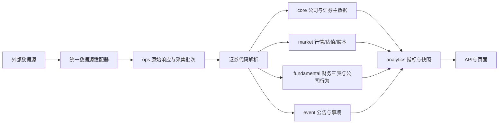

# 证券数据架构、自动任务与 API 调用保护专项整改方案

> 初版日期：2026-08-15
> 统一修订：2026-09-01
> 范围：股票与可转债主数据、外部代码映射、股票行情与财务三表、持久化调度器、Tushare/腾讯/汇率/公告等外部数据源
> 当前状态（2026-09-01执行批次）：任务契约、预算等待语义、Python Guard 默认开启（含探测租约）、核心分区表、运行时代码映射、共享收盘采集和全A股股票标准行情分区已落地；迁移119～124已完成股息率单位修复、分区水位初始化、历史股票类型/公司关系归一，并将 Node/Python 预算扣减统一到数据库原子函数。财务三表的持续增量已复用现有标准层，历史证券 ID 的安全组已完成可回滚迁移，人工冲突项保留审批。
> 前一阶段生产授权执行记录（2026-09-01）：已部署提交 `c989bfb`（版本 `0.7.0.0`），部署前数据库备份为 `/var/backups/portfolio_before_0_7_0_0_20260901_191425.dump`（SHA-256：`ef153e23cf879f5d803c4923e2e428553b626b2c56849b614357e91932d38836`）。生产权限探测共 48 项：18 项可用或空结果可接受，30 项受限；主 Token 的 24 项探测均未发出上游请求（多数因统一 Guard 当日预算保护，接口项受既有熔断状态拦截），备用 Token 的标准接口可用/空结果可接受 18 项，4 个 `_vip` 接口无权限，`cb_price_chg` 与 `top10_cb_holders` 受限。该阶段维护窗口已将 139 条可直接规范化的裸股票代码更新为标准代码，并完成 4,789 组候选审计（名称一致 4,624 组、需人工核对 165 组、受影响引用 9,350 行）；后续安全组迁移见下一条记录。旧 `test_guard` 熔断记录为 0。影子对账尚未完成：部署前最后一次共享收盘任务（2026-09-01）记录 281 次 Tushare 调用，新版本需从下一交易日起连续观察 3 个交易日后再下结论。
> 生产维护窗口执行记录（2026-09-01，版本 `0.7.0.1`、提交 `a56eb12`）：备份 `/var/backups/portfolio_before_id_partition_0_7_0_1_20260901_201106.dump`（SHA-256：`e50c32ea9f3856be91d0807e2410d3bd0cc95c32303eda8319ea08c2ac3ad72d`）。历史 ID 安全组迁移 4,537 个旧主档，更新 217 条外键引用，去重 4,537 条确定重复公司关系；旧主档保留并标记 `merged`，未删除，生产中剩余 169 条候选待处理（165 条人工冲突、4 条无明确标准目标），迁移后旧 ID 外键引用为 0。17 个非核心数据集已按白名单回填 `ops.dataset_partitions`，发布 17/17，生产共 23 个数据集分区且空发布 0。Web、Worker、健康检查定时器均 active/enabled，`/health` 返回 `0.7.0.1`；影子对账仍需连续 3 个交易日观察。
> 后续观察安排（2026-09-01）：已建立每日低峰监测，从 2026-09-02 起按 `market.trade_calendar` 顺延识别上海交易日，连续记录 3 个交易日共享采集影子对账；主 Token 权限探测只在首个符合条件的自然日执行一次，命令限定 `--roles=primary`，所有调用必须经过 Guard 与数据库预算，禁止绕过预算、切备用或循环重试。
> 阅读规则：第 1～10 节是 2026-08-15 的历史诊断归档，只用于解释问题来源，不得作为当前研发任务或运行规则；第 11 节起才是现行整改方案。

## （历史归档）1. 结论

可转债不是孤立问题。生产库证明，调度器上线初期曾有多类任务出现“业务执行成功，但同一计划实例继续执行到 4 次”。

- 近 45 天有 16 类任务出现 `attempt_count > 1`。
- 其中 12 类至少有一次已成功仍继续重跑：可转债安全评分、可转债/港股/LOF-ETF 收盘、港币汇率、净值快照、指数补齐、可转债行情、股市波动指标、个股分析、港股每手股数、可转债估值。
- A 股收盘和打新日报的部分记录是真实失败后按 5/15/45 分钟重试，不属于“成功重跑”，但仍需受 API 限额保护。
- 新股历史和休市日历曾出现调度尝试次数异常，但业务内部的当日新鲜度门禁阻止了大部分重复联网。

2026-08-14 下午修复日期规则后，除当时尚未配置“前一交易日”的可转债估值外，其余后续 14 个定时任务均只执行 1 次。这说明旧版日期判断是大面积重复的直接诱因，但通用调度缺陷仍未消除。

## （历史归档）2. 已确认的根因

### 2.1 成功状态和数据新鲜度混用

`completeSlot()` 在业务任务返回成功后，继续查询业务数据日期。如果日期不符合预期，会把计划实例改为 `degraded`。

`listDueSlots()` 又直接把 `degraded` 当作待执行状态，而 `degraded` 没有 `next_attempt_at`。结果是 Worker 下一轮扫描就重新执行整个任务，直到 `maxAttempts=4`。

这条路径绕过了正常失败的 5/15/45 分钟退避，因此才会出现约 1—2 分钟一次的成功重跑。

### 2.2 日期口径曾配置错误

旧版曾把 PostgreSQL `date` 对象当字符串处理，又默认所有任务必须产出当天数据。实际上：

- 早盘任务可能只有前一交易日数据；
- 估值任务明确使用前一交易日；
- 解析、配置类任务没有可比较的业务日期。

这部分已有局部修复，但仍应用统一任务契约取代分散特判。

### 2.3 估值任务重复调用上游同步

`convertible_bond_valuation_refresh` 已声明依赖 `convertible_bond_universe_refresh`，但它的任务入口仍先调用 `syncConvertibleBondUniverseWithBackfill()`。

因此估值每重跑一次，都会重新执行可转债主档、行情、正股行情、估值、缺口检查等多个外部请求。

### 2.4 所有任务共用同一重试策略

当前默认是最多 4 次，退避 5/15/45 分钟。本地计算任务和高额度 API 任务没有区分，也无法区分网络抖动、空数据、权限错误、限额和 429。

Tushare 客户端当前对所有错误都返回 `null`，调度器无法做准确分类。

### 2.5 补跑窗口会创建多个等价的历史任务

打新日报的补跑窗口是 4200 分钟。Worker 上线时会为多个过去日期生成计划实例，但任务本身生成的是同一份最新日报。这会对同一数据集重复调用 API。

### 2.6 任务内部重试和调度器重试叠加

- 个股分析会在一次任务内立即强制补跑失败股票，外层调度器失败后又可能重跑全部股票。
- 收盘行情每个代码内部请求 2 次，整体任务失败后还会进入外层重试。
- 股市波动指标由多个数据源组成，任一子源失败时重跕会再次拉取已成功子源。

## （历史归档）3. 任务风险分类

| 类别 | 任务 | 整改重点 |
|---|---|---|
| 高额度/多请求 | 可转债行情、可转债安全评分、个股分析、股市波动指标、打新日报、新股历史 | 成功幂等、按数据集增量、低频退避、限额熔断 |
| 行情/公开源 | A 股/港股/可转债/LOF-ETF 收盘、港币汇率、指数补齐、港股每手股数、套利公告、休市日历 | 仅补缺失分区/代码，禁止成功后整体重跑 |
| 本地计算 | 净值快照、整改后的可转债估值 | 仅读 PostgreSQL，不得在计算任务中调用外部 API |

当前 `mayConsumeQuota` 标记不完整：收盘行情、港币汇率、指数补齐、港股每手股数、套利公告和休市日历也会联网，必须纳入统一保护。

## （历史归档）4. 目标状态机

### 4.1 执行状态和验证状态分开

1. 任务返回成功后，本次计划实例终止，不得因数据日期校验再次调用业务任务。
2. 数据日期不符合预期时保留 `degraded` 用于展示和告警，但 `degraded` 不再进入业务执行队列。
3. 由 `syncScheduleSlots()/reconcileSlot()` 只读数据库重新验证。数据达标后将 `degraded` 改为 `succeeded`，校验过程不联网。
4. `blocked` 只在依赖任务成功后改回 `pending`，不能直接当作可执行状态。
5. 可执行状态只保留 `pending` 和到达 `next_attempt_at` 的 `failed`。

### 4.2 统一任务返回契约

所有自动任务统一返回：

```js
{
  ok: true,
  status: 'succeeded' | 'fresh' | 'partial',
  dataAsOf: 'YYYY-MM-DD' | null,
  externalCalls: 0,
  datasets: [{ code, dataAsOf, status }]
}
```

- `fresh` 表示数据库已有当期成功数据，本次外部请求数必须为 0。
- `partial` 不能被当成整体成功，只能补跑失败子集。
- 调度器优先使用任务返回的 `dataAsOf`，再用数据库查询交叉验证。

## （历史归档）5. 重试和 API 保护规则

| 失败类型 | 处理 |
|---|---|
| 网络超时/5xx | 仅重试失败数据集；15 分钟、60 分钟；当日最多 3 次 |
| 429/频率限制/配额耗尽 | 历史做法为立即熔断并停止当日请求，该规则已经废止；现行规则以第 17.4 节为准 |
| Token/权限/参数错误 | 不自动重试，直接失败并告警 |
| 上游返回空数据 | 保留旧数据，30 分钟后最多重试 1 次 |
| 本地计算/数据库短暂错误 | 5/15/45 分钟，可保留 4 次 |
| 数据水位落后 | 只做本地重新验证和告警，不自动重跑外部任务 |

任务定义补充：

- `externalSources`：真实使用的外部数据源；
- `retryPolicy`：`local` / `external` / `no_retry`；
- `catchupMode`：`per_business_date` / `latest_only`；
- `dataDatePolicy`：`same_day` / `previous_trading_day` / `latest_available` / `none`。

## （历史归档）6. 幂等与增量要求

1. 调用外部 API 前，必须查询现有业务表和 `ops.sync_cursors`。已有当期成功数据则返回 `fresh`。
2. 使用 PostgreSQL 咨询锁保证“数据源 + 数据集 + 业务日期”同时只有一个请求者。
3. 手动执行默认也要遵守新鲜度门禁；只有管理员显式选择“强制重拉”才能绕过，并记入审计日志。
4. 原始数据首次入库，后续只根据游标补增量。重试不得清空或覆盖上一份有效数据。

## （历史归档）7. 各任务定向整改

### P0：必须先完成

1. **调度状态机**
   - `listDueSlots()` 不再返回 `degraded` 和未解除的 `blocked`。
   - `failed` 必须有未来的 `next_attempt_at`才能被领取。
   - 成功运行记录不得在同一计划实例内再次运行。

2. **可转债任务拆分**
   - `convertible_bond_universe_refresh` 只负责联网同步并入库。
   - `convertible_bond_valuation_refresh` 只读 PostgreSQL 并执行估值/预警，删除对 `syncConvertibleBondUniverseWithBackfill()` 的调用。
   - 依赖不新鲜时进入 `blocked`，不得在估债任务里自行拉取上游。

3. **外部任务新鲜度前置门禁**
   - 先查本地游标，再决定是否联网。
   - 可转债行情、安全评分、打新日报、个股分析、股市波动指标等任务当日已成功时返回 `fresh`。

4. **补跑去重**
   - 打新日报、休市日历、港股每手股数等“最新状态”任务使用 `latest_only`，无论漏了几天都只生成一个补跑实例。
   - 收盘价等按日分区数据保留 `per_business_date`，但只抓取当日缺失代码。

### P1：紧随 P0

1. Tushare 客户端返回可分类错误，保留响应码、业务错误码和数据集名，不再统一吞成 `null`。
2. 个股分析外层重试只携带失败股票列表，已成功股票不再拉取。
3. 股市波动指标按子数据源记录成功水位，重试只执行失败数据源。
4. 收盘行情保留现有“按缺失代码补齐”，但内层和外层重试总次数必须受同一个请求预算限制。
5. 收敛调度观察器与执行器内的重复 `syncScheduleSlots()` 轮询，保留一个状态同步入口。

### P2：监控与防再犯

1. `job_runs` 记录 `external_call_count`、数据源、数据集和错误类型。
2. 同一 `job_code + business_date` 出现第 2 条成功记录时告警，但不自动再次执行。
3. 按数据源设每分钟/每日请求预算，接近上限时停止非必要同步。
4. 后台任务详情分别展示“业务执行结果”和“数据新鲜度校验”，避免将成功误解为失败。

## （历史归档）8. 研发修改边界

| 文件 | 修改内容 |
|---|---|
| `server/services/jobScheduleSlots.js` | 状态机、待执行筛选、阻塞解除、降级只读重验 |
| `server/services/jobOrchestrator.js` | 统一任务契约、错误分类、退避和请求预算 |
| `server/services/jobDefinitions.js` | 数据日期、外部源、补跑模式和重试策略 |
| `server/services/jobRunners.js` | 估值改为只执行本地计算 |
| `server/jobs/convertibleBondRefresh.js` | 拆除估值与行情同步的嵌套调用 |
| `server/services/tushare.js` | 可分类错误与 429/配额熔断 |
| 各 `server/jobs/*` 入口 | 联网前新鲜度门禁，失败子集补跑 |
| `server/test/job-orchestration-regression.test.js` 及 PostgreSQL 集成测试 | 成功不重跑、API 预算、补跑去重、多 Worker 幂等 |

禁止在本次整改中重写业务公式、数据表口径、页面样式或金融数据字段。

## （历史归档）9. 必须通过的验收

### 9.1 自动测试

1. 任务返回成功但数据水位落后：计划实例可显示 `degraded`，但业务 Runner 只被调用 1 次。
2. 同一计划实例执行成功后，连续运行 10 次调度扫描，外部 API mock 调用数仍为 1。
3. 同一业务日期同时创建定时和手动实例，非强制模式只有一个实例调用外部 API。
4. 两个 Worker 同时领取，只有一个执行并写入。
5. 429/权限错误不进入分钟级重试；网络超时按配置退避。
6. 可转债估值 Runner 不得引用或调用可转债行情同步函数。
7. `latest_only` 任务启动补跑时，即使缺 3 天也只产生 1 个可执行实例。
8. 本机 PostgreSQL 回归、全量测试和 CI 必须全部通过。

### 9.2 生产验收

部署后在下一个完整交易日核对：

```sql
SELECT slot_id, job, COUNT(*) FILTER (WHERE status='done') AS success_runs
FROM job_runs
WHERE started_at >= CURRENT_DATE
GROUP BY slot_id, job
HAVING COUNT(*) FILTER (WHERE status='done') > 1;
```

验收结果必须为 0 行。真实失败后成功允许 `attempt_count > 1`，但不允许同一计划实例出现两条成功运行记录。

同时必须确认：

- 可转债行情定时同步只有 1 次；
- 可转债估值记录不再夹带可转债行情记录；
- 任务被标记为 `degraded` 后，只产生校验和告警，不产生新的外部请求；
- 所有失败重试的起始时间符合任务定义的退避时间。

## （历史归档）10. 实施顺序

1. 先修调度状态机和测试，立即切断“成功重跑”通路。
2. 再拆分可转债估值与行情同步。
3. 完成所有外部任务的新鲜度门禁和补跑去重。
4. 补错误分类、限额熔断和子集重试。
5. 本机 PostgreSQL 回归通过后部署，连续观察一个完整交易日，再闭环验收。

## 11. 2026-08-31 二次核查结论

### 11.1 核查范围和边界

本轮核查覆盖当前工作区代码、本机 PostgreSQL、任务定义、任务运行记录、Tushare/腾讯调用入口和现有架构文档。没有修改生产数据，也没有据本地结果推断生产库当前数量；上线前仍须执行生产只读审计。

本轮确认的核心问题不是某一个接口或某一只转债，而是以下四类能力尚未真正统一：

1. 同一证券在不同数据源和不同代码格式下没有稳定收敛到同一个内部身份。
2. 股票基础资料、行情、估值、股本、财务三表和实时行情虽然已有标准表，但写入者和资产类型仍不统一。
3. 多个业务任务分别获取同一份全市场数据，导致请求数量和熔断次数被放大。
4. 现有限速器达到本系统预算时直接报错和熔断，没有先平滑排队，主 Token 的压力还会被立即转移到备用 Token。

### 11.2 本地数据实测基线

| 检查项 | 2026-08-31 实测 | 结论 |
| --- | ---: | --- |
| `core.instruments` 可转债记录 | 1,162 | 主档包含大量历史、退市和非标准记录 |
| 最新可转债行情 | 312 只 | 当前有效行情集合远小于主档 |
| 最新可转债对应正股 | 309 只 | 312 只当前转债均已有正股代码和 `stock_instrument_id` |
| 标记上市但无正股关联的可转债 | 30 条 | 主要为遗留或非标准代码，主档状态治理不完整 |
| `asset_class=stock` | 10,248 条 | 同时混有裸代码和带后缀代码 |
| `asset_class=equity` | 2,798 条 | 不同写入者使用了不同资产类型 |
| 裸代码/标准代码逻辑重复 | 4,547 组 | 同一股票被当作两只证券 |
| 最新股票估值分区 | 945 只 | 全市场数据被拉取后只保存了转债正股子集 |
| 公司与证券正式关联 | 12 只证券 | 全市场证券主档与公司财务层尚未贯通 |
| 标准实时行情 `market.latest_quotes` | 23 条 | 主行情仍主要留在旧缓存中 |
| 旧实时行情缓存 | 6,370 条 | 新旧行情链路未完成切换 |
| 最新估值中 `dividend_yield_ttm > 1` | 380 条 | 同一字段混入小数和百分数两种单位 |

当前可转债行情和正股行情在最新交易日的映射完整，但下游结果水位不一致：

| 数据集 | 最新日期 |
| --- | --- |
| 可转债行情 | 2026-08-28 |
| 可转债周期 | 2026-08-28 |
| 强赎结果 | 2026-08-24 |
| 下修结果 | 2026-08-28 |
| 安全评分 | 2026-08-18 |
| 上市列表指标 | 2026-08-19 |

因此“行情任务成功”不能继续等价为“可转债完整数据已经发布”。

### 11.3 任务与熔断实测（整改前基线）

当前 `JOB_DEFINITIONS` 共 23 个任务定义，其中 20 个定时任务、3 个人工任务。`externalSources`、`retryPolicy`、`catchupMode`、`dataDatePolicy` 已通过默认契约覆盖全部定义，`job-execution-protection.test.js` 已遍历现役定义，并强制校验接口归属、单次调用预算和计算任务零外部调用。旧调度注册表曾经存在的测试盲区已经补上，不得把这部分重复列为待开发。

本地任务记录显示：

| 任务 | 外部调用数 | 说明 |
| --- | ---: | --- |
| `bond_safety_refresh` | 188 | 约 13 秒内完成，形成瞬间突发 |
| `stock_analysis_refresh` | 192 | 按股票重复获取行情和财务数据 |
| `convertible_bond_universe_refresh` | 363 | 包含主档、行情、正股和历史补缺 |
| A股/港股/转债/ETF收盘任务 | 34/21/13/7 | 四组分别调用腾讯行情 |

2026-08-18 的记录中，安全评分任务完成后，可转债主档任务立即因备用 Token 达到 60 次/分钟而失败。这证明当前问题同时包含请求重复和突发流量控制错误。

以上调用量和预算是整改前基线，不代表当前运行配置。当前实现按任务声明执行单次预算，Tushare 自动任务采用 120 次/分钟、100 次/日的保守内部硬上限；达到内部预算进入 `BUDGET_WAIT`，不再把正常限速写成熔断。6,000 积分接口的真实可用性仍以权限探测结果为准。

另外，历史本地业务库仍留有 185 条 `test_guard_*` 熔断记录；它们与真实来源隔离，不会直接熔断 Tushare，但会污染旧统计。本批已统一使用独立 `portfolio_test` 数据库，`server/test/run-all.js` 在每轮测试前后自动清理 `test_guard_*`/`cninfo-test` 测试专属记录，后续测试不再写入业务库；业务库中的历史记录不在未授权情况下删除，待维护窗口按备份后清理。

### 11.4 当前完成度

| 能力 | 代码现状 | 本专项目标 | 完成度 |
| --- | --- | --- | --- |
| 任务定义契约 | 23 个定义均已有四类契约字段，20 个定时、3 个人工 | 保留现有实现，增加接口归属和调用预算断言 | 已落地，补验收 |
| 调度状态机 | `degraded` 不再直接进入执行队列，外部等待使用 `waiting_external` | 保持“执行结果”和“数据水位”分离 | 已落地 |
| 收盘日次日调度 | `afterTradingDay` 已进入定义、槽位判断和回归测试 | 保持现有实现 | 已落地 |
| 数据集并发锁 | Node/Python 均使用 PostgreSQL 数据集咨询锁 | 扩展到共享采集任务的逻辑分区键 | 部分落地 |
| Node/Python 调用计数 | Python 与 Node 共用 `ops.consume_external_call_budget()` 原子入口，由函数统一更新 `ops.external_call_budgets`；未配置时 Guard 默认开启，生产环境不能显式关闭 | 消除两套策略语义漂移，并禁止生产脚本无保护运行 | 已落地，本地并发验收通过 |
| Token＋接口熔断 | Node/Python 均按 Token 指纹和接口记录，并使用所有者、一次性令牌和5分钟探测租约 | 两端共用同一原子策略和半开规则 | 已落地，待生产观测 |
| 平滑限速 | 达到内部分钟/日预算返回 `BUDGET_WAIT`，计划实例进入持久化 `waiting_external` 队列，按 `next_attempt_at` 自动接管；首期不引入 MQ | 达到安全速率后排队，不记业务失败、不熔断 | 已落地（数据库持久化队列；公平调度和 MQ 不在本专项范围） |
| 数据分区发布 | 已建立 `ops.dataset_partitions`；核心链路及 `datasetPartitionRegistry` 均发布任务产出分区，17 个非核心数据集已完成一次性回填，任务成功后自动登记最新数据日期 | `ops.dataset_partitions` 统一验证和发布 | 已落地，生产 23/23 个任务产出数据集有发布分区 |
| 共享采集 | `convertible_bond_universe_refresh` 作为 `shared_cn_market_eod` 承载一次 `stock_basic`、`daily`、`daily_basic`、`adj_factor`，并集中拉取 `suspend_d`；未新增平行定时任务 | 一次采集、多任务只读复用 | 已落地，待3个交易日影子对账 |
| 文档防漂移 | 已由 `scripts/generate-job-matrix.js` 从 `JOB_DEFINITIONS` 生成矩阵，并接入 `check:knowledge --check` | 从 `JOB_DEFINITIONS` 生成矩阵并由 `check:knowledge` 校验 | 已落地 |
| 证券身份服务 | 已改造现有 `securityIdentity.js`，增加统一解析、派生、缓存和指数身份种子；历史重复 ID 未合并 | 扩展现有服务为唯一身份入口 | 部分落地 |
| 代码映射运行时读取 | 已接入 tencentQuote、market、stockAnalysis（F10/股吧/雪球）、Python IPO/转债数据层、前端指数代码及主采集写入；统一入口使用5,000条/10分钟有界缓存 | 所有正反向转换经统一解析入口和有上限内存缓存 | 已落地，持续扫描门禁 |
| 股票标准层 | 共享收盘批次从完整 `stock_basic` 建立全A股 `core.instruments`，按交易日写入 `market.daily_bars`、`market.daily_valuations`、`market.adjustment_factors` 并发布分区；迁移122/123已将历史 `equity` 归一为 `stock` 并补齐可识别的公司关系；财务三表继续由 `financialDataArchitecture.js` 按公司/报告期版本化保存 | 统一股票类型、写入边界和全市场分区 | 已落地；6条历史空名称证券保留质量例外 |
| 历史证券 ID 审计 | 迁移118建立 `core.instrument_merge_candidates`；生产执行 `migrateInstrumentMerges.js` 完成4,537个安全旧主档的外键迁移和4,537条确定重复关系去重，旧ID保留并标记 `merged`；剩余169条候选（165条人工冲突、4条无明确标准目标）待审批 | dry-run → 映射 → 分表迁移 → 5日对账 | 安全组迁移已落地，旧ID删除和人工冲突处理仍禁止自动执行 |

### 11.5 整改范围拆分

本专项保留一份文档，但研发必须拆成两条相互独立的工作线，不能把急诊与历史大迁移一次上线：

| 工作线 | 目的 | 可独立上线的结果 |
| --- | --- | --- |
| A：采集止血 | 先消除重复调用、错误熔断和不可见的旧数据 | 每日调用量可验收，任务不再因限速反复失败，页面能看到真实数据日期 |
| B：数据架构治理 | 逐步统一证券身份、股票标准层和财务三表 | 新数据只写统一身份和标准表，旧重复 ID 最后再迁移 |

A 线不得等待 4,547 组历史证券合并完成；B 线也不得在没有调用预算和分区门禁时启动大规模历史回填。

## 12. 外部项目参考与采用原则

### 12.1 参考项目

| 项目 | 借鉴点 | 本项目采用方式 |
| --- | --- | --- |
| [OpenBB](https://github.com/OpenBB-finance/OpenBB/blob/develop/openbb_platform/providers/fmp/openbb_fmp/models/income_statement.py) | 数据源适配器执行“请求转换→原始提取→标准模型转换” | 每个外部接口只能通过统一适配器写标准模型，业务层不直接使用上游字段 |
| [Microsoft Qlib](https://github.com/microsoft/qlib/blob/main/docs/component/data.rst) | 分离交易日历、证券集合、原始特征、处理器和计算缓存 | 原始数据、标准事实、指标和页面快照继续分层，所有日数据按交易日历发布分区 |
| [QuantConnect LEAN](https://github.com/QuantConnect/Lean/blob/master/Common/Symbol.cs) | 永久证券 ID 不随当前代码变化 | `instrument_id` 是关联主键，外部代码和当前简称只是带有效期的标识 |
| [vn.py](https://github.com/vnpy/vnpy_mysql/blob/main/vnpy_mysql/mysql_database.py) | 行情唯一身份包含代码、交易所、周期和时间 | 标准行情按 `instrument_id + trade_date + source_id` 唯一，接口裸代码不能单独作为身份 |
| [Bottleneck](https://github.com/SGrondin/bottleneck) | `minTime`、并发上限和令牌池用于平滑限速 | 限速达到阈值时排队，不把正常流量治理误判为接口故障 |
| [Opossum](https://github.com/nodeshift/opossum) | 按滚动失败率、最小样本和半开探测控制熔断 | 网络/5xx连续失败才熔断，恢复时只放一个探测请求 |

### 12.2 明确不采用

- 不引入微服务、Kafka、ClickHouse或新的大数据平台。
- 不因为参考开源项目而照搬其文件存储或量化训练体系。
- 不新增第二套业务任务调度器；继续使用现有 Worker、PostgreSQL 计划实例和 Redis。
- 不让页面请求直接触发Tushare财报或全市场行情同步。

## 13. 统一证券身份与代码映射

### 13.1 身份模型

```text
公司 company_id
  ├─ A股证券 instrument_id → A股行情/估值/股本
  ├─ H股证券 instrument_id → 港股行情/估值/股本
  └─ 可转债 instrument_id → stock_instrument_id → 对应A股证券

外部接口代码
  → core.instrument_identifiers
  → instrument_id
  → 标准事实表
```

财务三表、行业和实际控制人属于公司；价格、成交、估值和交易状态属于证券。可转债必须关联具体正股证券，不能按公司名或正股简称关联。

### 13.2 `core.instruments`

每只证券只允许一条现役主记录，继续使用内部 `instrument_id` 关联。建议统一规则：

- A股：`asset_class='stock'`，标准代码为 `000001.SZ`、`600000.SH`、`430xxx.BJ`。
- 港股：`asset_class='stock'`，标准代码保留五位并加 `.HK`。
- 可转债：`asset_class='convertible_bond'`。
- `canonical_code` 用于标准展示和唯一性校验，不作为外部接口请求的唯一依据。

不新建第二套身份服务，直接改造现有代码：

1. 扩展 `server/services/securityIdentity.js`，在现有 `resolveAmbiguousSecurity()` 基础上增加 `resolveInstrument()` 和 `ensureInstrument()`，作为唯一证券身份读写入口。
2. `server/services/financialDataArchitecture.js` 保留标准事实落库职责，但删除自身 `ensureMaster()` 中创建证券的逻辑，改为调用 `securityIdentity.js`；同时把现有 `asset_class='equity'` 改为统一的 `stock`。
3. `convertibleBondAnalysis.js`、`convertibleBondCycleService.js`、`market.js`、`tradeLot.js`、`arbitrageAnnouncementSync.js` 和 Python `bond_data_layer.py` 分批改为调用同一身份规则或同一数据库写入函数。
4. `arbitrageParser.js` 现有按名称解析只允许用于公告人工核对；正式证券关系必须由代码映射唯一确定。

在全部写入者切换完成前，先增加数据库约束/审计，冻结新的裸代码、`equity` 和重复主档写入；禁止另建平行的 `securityMasterService` 再造一套规则。

### 13.3 `core.instrument_identifiers`

同一证券可同时保存：

| 标识类型 | 示例 |
| --- | --- |
| 标准展示代码 | `600000.SH` |
| Tushare | `600000.SH` |
| 腾讯 | `sh600000` |
| 东方财富 | `1.600000` |
| 交易所代码 | `600000 + SSE` |
| 历史代码 | 原代码及有效起止日期 |

关键字段：

- `instrument_id`
- `source_id`
- `identifier_type`
- `identifier_value`
- `exchange_code`
- `asset_class`
- `valid_from`、`valid_to`
- `is_primary`

当前有效映射的唯一范围至少包含“数据源＋代码类型＋代码值＋交易所＋证券类型”。裸六位代码存在歧义时必须拒绝自动写入并登记质量问题；名称只允许人工核对。

#### 13.3.1 运行时强制读映射

历史核查确认 `core.instrument_identifiers` 曾只有写入、没有运行时 `SELECT/JOIN`，属于“有写无读”。本批已在腾讯行情适配器、行情路由、股票控制人/股吧/雪球、指数 K 线和 Python IPO/转债数据层接入统一读取；剩余业务模块仍需按 P2 扫描收敛，因此代码映射必须单独立项，不能只建表：

1. 在现有 `securityIdentity.js` 增加 `resolveSourceIdentifier()` 和 `resolveInstrumentByIdentifier()`，所有“内部证券→外部代码”和“外部代码→内部证券”的转换只能调用这两个入口。
2. 运行时按 `instrument_id + source_id + identifier_type + as_of_date` 读取有效映射；禁止业务模块继续根据代码前缀拼接 `sh/sz`、`0./1.` 或交易所后缀。
3. 增加有上限的进程内缓存，当前实现最多5,000条、有效期10分钟；映射写入后主动清理本进程对应缓存。首期不为缓存再引入新中间件，跨进程一致性依靠短有效期和数据库有效期约束。空结果不缓存，避免新映射写入后被旧空值遮蔽。
4. 映射缺失时，只有统一身份服务可以按明确市场规则生成候选值；候选必须先落 `instrument_identifiers` 并通过唯一性校验，再返回业务调用方。存在歧义时拒绝猜测。
5. 前端只传 `instrument_id`、标准代码或受控的指数代码，不传供应商专用代码；供应商代码只在服务端解析。

首批必须收敛的散落逻辑：

| 位置 | 当前问题 | 目标改法 |
| --- | --- | --- |
| `public/js/code-classify.js` | 根据前缀直接生成东方财富 `secids` 候选 | 只保留证券分类和标准代码，不再生成供应商代码 |
| `public/shared/core-returns.js` | `/api/kline` 传入东方财富格式 `secid` | 改传标准指数代码或 `instrument_id` |
| `server/routes/market.js` | 接收 `secid` 后手工转Tushare代码，并把同一值传给新浪 | 通过映射分别取得 `tushare:ts_code`、`sina:symbol`、`tencent:quote_symbol` |
| `server/services/stockAnalysis.js` | 东方财富 F10/股吧及雪球代码由交易所前缀和六位代码现场拼接 | 分别通过 `eastmoney:f10_code`、`eastmoney:guba_code`、`xueqiu:symbol` 映射取得 |
| Python数据脚本 | 各脚本可能独立拼接东方财富、腾讯、交易所代码 | 复用同一数据库解析函数，不复制JS前缀规则 |

迁移期可以保留统一身份服务内部的受控派生兜底，但业务文件中不得继续出现新增的供应商代码拼接。自动测试应扫描上述目录，并对允许的适配器白名单之外的 `secid/sh/sz/0./1.` 组装逻辑直接失败。

### 13.4 可转债正股关系

`fundamental.convertible_bond_profiles.stock_instrument_id` 是唯一正式关系：

1. 从 `cb_basic.stk_code` 取得 Tushare 正股代码。
2. 通过 `instrument_identifiers` 解析为正股 `instrument_id`。
3. 验证目标证券 `asset_class='stock'`。
4. 更新转债档案中的 `stock_instrument_id`。
5. 不能唯一匹配时不发布该只转债，并写入 `ops.data_quality_issues`。

`bondSafety`、上市列表、强赎、下修、估值和详情全部按正股 ID/代码读取。安全评分快照增加 `stock_instrument_id` 和 `stock_code`；`stock_name` 仅保存为展示快照。安全性评级索引运行时以 `identity_key`/`stock_instrument_id`/`company_id` 为键，只有历史输入缺少标准身份时才使用名称兼容键；同名但不同身份的正股不会互相覆盖。
安全性刷新服务入口另设身份硬门槛：外部公司/债券数据必须至少带正股代码、`stock_instrument_id` 或 `company_id`，缺失时拒绝刷新并保留上一份快照，名称兼容键不再进入生产刷新链路。

## 14. 股票统一数据架构

### 14.1 数据流



不支持 Mermaid 的阅读器按下表理解同一链路：

| 顺序 | 输入 | 处理 | 输出 |
| ---: | --- | --- | --- |
| 1 | Tushare、腾讯、交易所等外部响应 | 保存采集批次和原始响应 | `ops` 可追溯原始层 |
| 2 | 外部证券代码 | 统一代码解析和身份确认 | `core` 公司、证券及代码映射 |
| 3 | 已确认的 `instrument_id/company_id` | 字段、日期、币种和单位标准化 | `market/fundamental/event` 事实层 |
| 4 | 已发布事实分区 | 本地计算及版本化 | `analytics` 指标和快照 |
| 5 | 已发布快照 | API 返回数据日期和质量状态 | 页面展示 |

### 14.2 基础资料层 `core`

| 表 | 职责 |
| --- | --- |
| `core.companies` | 公司法人主体 |
| `core.instruments` | 股票、可转债、基金等证券身份 |
| `core.company_instruments` | 一家公司与A股、H股、转债的关系 |
| `core.instrument_identifiers` | Tushare、腾讯、东方财富及历史代码映射 |
| `core.instrument_name_history` | 股票简称、ST/XD等名称变化历史 |
| `core.company_industry_memberships` | 带行业体系和有效期的行业归属 |
| `core.company_controllers` | 实际控制人历史 |

`stock_basic`只负责主档和上市状态。上市、暂停、退市等状态均要同步，不能只保留 `list_status='L'`。

### 14.3 行情与估值层 `market`

| 表 | 内容 | 唯一键/原则 |
| --- | --- | --- |
| `market.trade_calendar` | 开市日及前一交易日 | 统一驱动所有日分区任务 |
| `market.daily_bars` | 未复权OHLCV和成交额 | `(instrument_id, trade_date, source_id)` |
| `market.adjustment_factors` | 复权因子 | 不用复权价覆盖原始价格 |
| `market.daily_valuations` | PE、PB、股息率和市值 | 与日线分表，比例存小数、市值存元 |
| `market.share_capital_history` | 总股本、流通和自由流通股本 | 只在变化时新增有效记录 |
| `market.latest_quotes` | 腾讯等最新有效行情 | `(instrument_id, source_id)`，保留行情时间与抓取时间 |
| `market.fx_rates` | 港币等汇率 | 按币种对、日期和来源唯一 |

Tushare `daily_basic.total_mv/circ_mv` 的上游单位为万元，标准层统一转为元；`dv_ttm` 上游为百分比点，适配器入口统一除以 100 后保存。现有混合单位历史数据不能直接整列除以 100，必须按交易日从原始记录或Tushare重建临时分区，核对后原子替换。

股息率历史修复必须按来源批次处理，禁止只用“值大于 1”判断单位：

1. 优先按 `raw_record_id/ingestion_run/trade_date/source_id` 找到同批原始值并重新转换。
2. 原始记录缺失时，定点重拉该交易日的 `daily_basic` 到临时分区，不直接覆盖正式表。
3. 上游历史也无法重取时，按同一写入批次分析中位数、分位数和相邻交易日变化，并至少抽样 20 只证券与可靠来源核对；样本确认率达到 95% 才允许整批转换。
4. 不能证明单位的记录保留原值但标记 `suspect_unit`，不进入新发布分区；极端高股息率允许保留，不能因单值大于 1 被误改。

### 14.4 财务三表层 `fundamental`

财务数据按 `company_id` 保存，不按股票代码保存。一家公司同时有A股和H股时共享公司财报，但两只证券拥有独立行情和市值。

#### `fundamental.financial_reports`

每个报表类型、报告期和版本一条记录，至少包含：

- `company_id`
- `period_end`
- `statement_type`：`income`、`balancesheet`、`cashflow`、`indicator`
- `statement_scope`：合并或母公司
- `report_type`、`comp_type`
- `announced_at`、`f_ann_date`
- `update_flag`
- `source_id`、`source_version`
- `is_current_version`
- `raw_record_id`

同报告期更正和重述必须新增版本，不覆盖旧版本。历史时点查询只允许使用当时已经公告的版本。

#### `fundamental.financial_facts`

按 `report_id + metric_code` 保存标准财务科目，并记录：

- 原始字段名；
- 数值、单位和币种；
- 是否上游原值或本地计算值；
- 数据来源。

#### `fundamental.financial_period_summary`

保存页面高频字段，例如营收、归母净利润、总资产、总负债、净资产、货币资金、经营现金流、商誉、ROE、ROA和资产负债率。它是可重建查询缓存，不是原始事实。

### 14.5 公司行为、公告与分析层

- `fundamental.corporate_actions`：分红、送转、配股、增发、回购。
- `fundamental.earnings_guidance`：业绩预告和快报。
- `event.documents`：公告原文和来源。
- `event.company_events`、`event.instrument_events`：结构化公司和证券事项。
- `analytics.metric_values`：带公式版本的指标结果。
- `analytics.analysis_snapshots`：页面快照。
- `analytics.stock_overview_latest`：页面最新概览缓存。

页面和计算任务只读取标准层或已发布快照，不直接访问外部接口。

## 15. 数据源适配器和数据集发布

### 15.1 统一适配器契约

每个外部接口必须实现同一条处理链：

```text
内部数据需求
  → 由代码映射生成上游请求参数
  → 外部请求
  → 原始响应落 ops.raw_records
  → 字段、日期、单位标准化
  → 行数/唯一键/完整度校验
  → 标准事实表
  → 发布数据分区
```

适配器必须声明：

- 数据源和接口名称；
- 所需权限和积分；
- 输入分区方式；
- 返回行数上限；
- 上游更新时间；
- 字段和单位映射；
- 是否允许正常空结果；
- 唯一键、增量游标和重叠窗口；
- 失败保留和补漏方式。

### 15.2 接口写入边界

| 接口 | 唯一写入位置 |
| --- | --- |
| `stock_basic` | 股票主档、公司证券关系、Tushare代码映射 |
| `daily` | `market.daily_bars` |
| `daily_basic` | `market.daily_valuations`，必要股本字段进入股本历史 |
| `adj_factor` | `market.adjustment_factors` |
| `income/income_vip` | 利润表版本和财务事实 |
| `balancesheet/balancesheet_vip` | 资产负债表版本和财务事实 |
| `cashflow/cashflow_vip` | 现金流量表版本和财务事实 |
| `fina_indicator/fina_indicator_vip` | 财务指标事实 |
| `dividend` | `fundamental.corporate_actions` |
| `forecast/express` | `fundamental.earnings_guidance` |
| `cb_basic` | 转债档案和正股关联 |
| `cb_daily` | 转债日行情和派生基础事实 |
| 腾讯行情 | `market.latest_quotes` |
| 交易所/巨潮公告 | `ops.raw_records`、`event.documents`和结构化事件 |

### 15.3 `ops.dataset_partitions`

新增统一数据分区发布记录：

- `dataset_code`
- `partition_key`：交易日、报告期或公告窗口
- `source_id`
- `run_id`
- `expected_count`
- `actual_count`
- `valid_count`
- `coverage_ratio`
- `status`：`collecting/validated/published/rejected`
- `watermark`
- `published_at`
- `diagnostics`

下游只能读取 `published` 分区。数量明显不足、返回行数达到上限疑似截断、单位异常或关键字段覆盖不足时标记 `rejected`，保留上一份完整数据。

所有读取已发布分区的 API 必须同时返回：

- `data_as_of`：实际数据日期；
- `published_at`：该分区发布时间；
- `is_stale`：是否沿用旧分区；
- `stale_reason`：新分区被拒绝、上游失败或尚未发布等原因。

页面必须在现有更新时间位置明确显示“数据截至 YYYY-MM-DD”；`is_stale=true` 时显示“当前沿用上一份完整数据”。这属于投资数据口径披露，不新增页面样式体系，也不能只在后台告警中体现。

## 16. 6,000 积分 Tushare 采集方案

### 16.1 权限事实

用户已确认主 Tushare 为 6,000 积分。按当前官方说明：

- 5,000 积分以上常规接口通常为 500 次/分钟，常规数据无每日总量上限；
- `stock_basic` 等接口仍有独立频率限制，不能统一按 500 次处理；
- `income_vip`、`balancesheet_vip`、`cashflow_vip`、`fina_indicator_vip` 可按报告期批量获取全市场数据；
- 分钟、公告和特色数据仍可能需要独立权限，不能仅凭积分推断。

备用 Token 的积分和接口权限必须单独登记、单独探测，禁止继承主 Token 配置。

### 16.2 全量与增量策略

| 数据集 | 首次全量 | 日常增量 |
| --- | --- | --- |
| 股票主档 | 分上市状态拉取完整证券范围 | 每日同步当前状态，定期复核退市/暂停范围 |
| 日行情/估值/复权 | 按交易日分区回填需要的历史范围 | 每个交易日各接口一次全市场分区 |
| 财务三表 | 按报告期使用四个VIP接口批量回填 | 只同步近期披露期和发生更正的报告期 |
| 财务指标 | `fina_indicator_vip`按报告期批量回填 | 与财务披露期同步 |
| 分红/预告/快报 | 首次历史回填 | 按公告日期短重叠窗口增量 |
| 可转债主档 | `cb_basic/cb_issue`全量对账 | 主档低频对账、发行数据按公告增量 |
| 日行情 | `daily/daily_basic/cb_daily`按日 | 每日只采一次，缺口按日期或代码补齐 |
| 腾讯实时行情 | 无历史全量 | 全站代码去重，缓存未命中或过期才批量请求 |

财务VIP请求按“报告期＋公司类型＋报表类型”拆分；返回数量达到上游上限时必须视为可能截断，继续使用接口明确支持的条件拆分，禁止假造 `offset`。

单股票标准财务接口只用于明确缺口修复和人工定点刷新，不再作为每日全市场主路径。

### 16.3 权限实测清单

积分只决定可能具备的权限，真正启用前必须实测。复用现有 `server/services/externalApiConfig.js` 的 Token 测试能力，不另写绕过统一保护的 HTTP 客户端：

1. 将现有 `trade_cal`、`rt_min`、`new_share`、`cb_daily` 四个探测项扩展为本专项实际使用的接口清单。
2. 对主、备 Token 分别执行最小结果集请求，输出 `available/permission_denied/rate_limited/empty_but_accepted/error`。
3. 把探测时间、Token 指纹、接口名和状态写入接口能力配置；任何日志和页面不得返回原 Token。
4. 财务VIP、持有人、质押、公告和特色接口未通过探测前不得进入自动任务。
5. 权限探测本身计入调用预算，批量探测只能人工执行或在低峰期按周执行。

## 17. 限速、熔断和主备控制

### 17.1 三种状态必须分离

| 状态 | 含义 | 系统行为 |
| --- | --- | --- |
| 限速等待 | 正常流量达到安全速率 | 计算 `next_allowed_at`，计划实例等待后继续，不记业务失败 |
| 数据降级 | 上游暂缺或分区不完整 | 不发布新分区，保留旧数据并告警 |
| 服务熔断 | 上游持续网络/5xx、Token失效或接口无权限 | 阻止同范围新请求，进入半开探测 |

达到本系统分钟预算不再调用 `openExternalCircuit()`。限速器负责“什么时候可以发”，熔断器只负责“当前接口是否值得继续尝试”。

### 17.2 `ops.source_endpoint_policies`

新增或等价实现每个接口的运行配置：

- `source_id`
- `credential_profile`：主/备及不可逆Token指纹
- `api_name`
- `points_required`、`permission_mode`
- `max_per_minute`、`daily_limit`
- `safe_per_minute`
- `max_concurrency`、`min_interval_ms`
- `row_limit`
- `timeout_ms`
- `empty_policy`
- `retry_policy`
- `priority_lane`
- `enabled`、`last_verified_at`

生产初始安全速率取官方接口上限的70%～80%，给后台测试、人工补数和上游波动留出余量；具体以每个接口官方规则和实际探测为准，不在所有接口上硬编码同一个数字。

### 17.3 平滑限速

统一网关按以下顺序放行：

1. 读取主/备Token的接口权限和当前熔断状态。
2. 读取数据集新鲜度，已有完整分区则直接返回 `fresh`，外部调用数为0。
3. 使用逻辑请求键去重：`source + dataset_code + partition_key`。
4. 取得数据集咨询锁，防止Worker、人工任务和Python子进程重复采集。
5. 按接口 `min_interval_ms` 和 `max_concurrency` 平滑发送。
6. 达到安全速率时让计划实例进入可恢复等待，不抛出熔断错误。
7. 请求成功后落原始记录、标准事实和调用统计。

首期不引入BullMQ或新的消息系统；复用现有持久化计划实例、`ops.external_call_budgets`、PostgreSQL锁和Redis协调。

Python 侧现有 `ipo-report/external_call_guard.py` 不是完全独立计数：当 Node 子进程设置 `EXTERNAL_CALL_GUARD=1` 时，它已经与 Node 共用 `ops.external_call_budgets`，并通过 `ops.consume_external_call_budget()` 内的 `external_budget:{source}` PostgreSQL 咨询锁原子扣减，因此不能把现状描述为“两边各数各的、额度天然翻倍”。本批已将 Guard 改为默认开启（opt-out），生产环境显式关闭也会被强制改回开启；两份实现的内部预算达到上限时统一返回 `BUDGET_WAIT`，进入 `ops.job_schedule_slots.waiting_external` 持久化等待，不再误开 Token/接口熔断。首期不引入 BullMQ 或新的消息系统，现有数据库计划队列已经满足断点续跑和跨进程接管；公平调度、优先级队列和 MQ 属于后续独立需求。

P0 的具体改法是把预算原子扣减下沉为唯一数据库入口 `ops.consume_external_call_budget()`（迁移124幂等创建），Node `externalCallGuard.js` 和 Python `external_call_guard.py` 都只调用该入口；熔断/探测状态仍由两端 Guard 以同一张表和同一租约规则维护，HTTP 封装和错误翻译可分别保留。验收必须启动 Node/Python 并发请求，证明两端合计不超过同一 Token、同一接口的配置值。

Python Guard 改为默认开启（opt-out）：

- `EXTERNAL_CALL_GUARD` 未配置时按开启处理，只有显式设置为 `0` 才关闭；生产环境即使设置为 `0` 仍保持开启。
- Node 启动的生产 Python 子进程继续显式传入 `EXTERNAL_CALL_GUARD=1`，作为双重保护。
- 生产定时任务检测到 `EXTERNAL_CALL_GUARD=0` 时直接拒绝运行；只有本地测试或人工离线诊断允许显式关闭，并且不得访问真实外部 Token。
- 单元测试继续显式设置 `EXTERNAL_CALL_GUARD=0`，避免测试联网；必须增加“环境变量缺失时默认开启”的回归测试。

### 17.4 熔断判定

建议网络类熔断至少满足：滚动窗口内有效样本不少于10次，超时/5xx失败率超过50%。熔断后按30秒、60秒、300秒逐级冷却，半开状态只允许一个探测请求。

| 错误类型 | 重试 | 熔断范围 | 数据处理 |
| --- | --- | --- | --- |
| 本系统安全速率达到上限 | 排队 | 不熔断 | 不改数据 |
| 上游429/频率限制 | 等下一窗口并降低速率 | Token＋接口冷却 | 不改数据 |
| 上游单接口当日额度 | 次日恢复 | Token＋接口 | 不改数据 |
| Token无效 | 不自动重试 | 整个Token | 不改数据，配置变化后再测 |
| 接口无权限 | 不自动重试 | Token＋接口 | 不静默换语义不同的接口 |
| 参数错误 | 不重试 | 不熔断 | 作为代码错误告警 |
| 网络超时/5xx | 仅短重试失败请求 | 达失败率后接口熔断 | 保留旧数据 |
| 正常空结果 | 不重试或按接口规则复查 | 不熔断 | 记录已核验空结果 |
| 全市场异常空结果 | 有限回看最近开市日 | 不因一次空结果熔断 | 拒绝发布新分区 |
| 返回达到行数上限 | 拆分请求 | 不熔断 | 未证明完整前不发布 |

### 17.5 主备Token

- 主Token限速时优先排队，不把剩余请求瞬间倾倒到备用Token。
- 只有主Token失效、无权限或持续故障时，且备用Token已验证具备该接口权限，才允许切换。
- 主备分别限速、分别计数、分别熔断。
- 备用请求成功后才发送“主→备”通知。
- 主Token恢复时先半开探测，再恢复正常流量，禁止主备来回抖动。
- 增加备用 Token 用量告警：单日首次使用、达到备用日预算 50% 和 80% 时分别记录并告警，避免长期静默消耗。
- 自动切到备用后，每周在低峰期对主 Token 的失败接口执行一次最小探测；只有探测成功才恢复主 Token，权限错误不得高频复测。

## 18. 共享采集任务与定时任务收敛

### 18.1 相同接口的当前重复来源

| 接口/来源 | 当前重复调用方 |
| --- | --- |
| `trade_cal` | 转债安全、转债全量、转债补数、市场波动、节假日、IPO |
| `stock_basic` | 转债安全、转债全量、股票分析、IPO |
| `daily` | 转债安全、转债全量、补数、股票分析、行情兜底 |
| `daily_basic` | 转债安全、转债全量、市场波动、IPO、股票分析 |
| `cb_basic/cb_daily` | 转债安全、转债全量、IPO和历史补数 |
| 财务三表 | 转债安全独立缓存与股票标准财务链分别获取 |
| 腾讯行情 | A股、港股、转债、ETF收盘及页面路由分别请求 |
| 官方可转债公告 | 下修、强赎分别查询相同市场和日期窗口 |

### 18.2 目标共享采集任务

#### `security_master_sync`

- 统一获取 `stock_basic`、`cb_basic` 和增量 `cb_issue`。
- 维护公司、证券、代码映射、上市状态和转债正股关系。
- 所有业务模块禁止自行创建证券主档。

#### `cn_market_eod_sync`

- 由 `market.trade_calendar` 确定目标日。
- 对目标交易日各执行一次 `daily`、`daily_basic`、`adj_factor`、`cb_daily`。
- 保存全市场数据，不再只保存转债正股。
- 数据通过完整度门禁后统一发布。

#### `company_financial_incremental_sync`

- 6,000积分主Token优先使用财务VIP接口按报告期批量同步。
- 服务持仓股票、自选股票、可转债正股和IPO候选，结果统一写 `fundamental`。
- 转债安全的独立财务缓存在新链路验证后改只读并退出运行链路。

#### `latest_quote_sync`

- 汇总全站需要的股票、港股、转债、基金代码后去重。
- 腾讯每批不超过80个代码。
- 只写 `market.latest_quotes`，失败保留最近成功值和行情时间。
- A股、港股、转债、ETF收盘任务读取同一批结果，不再分别抓取。

#### `convertible_bond_announcement_sync`

- 上交所、深交所、巨潮公告按市场和日期窗口统一采集一次。
- 原始公告落库后，在本地分类为下修、强赎、转股价变化等事件。
- 不再为每个可转债功能重复查询相同公告窗口。

### 18.3 计算任务

以下任务只允许读取数据库：

- 可转债安全评分；
- 可转债周期、强赎、下修和动机评分；
- 上市列表指标；
- 可转债估值和预警；
- 股票分析；
- 市场波动指标中的A股市值计算。

缺数据时登记补数需求或阻塞于上游数据集，禁止在计算函数内部临时调用外部接口。本批已移除 `server/jobs/convertibleBondRefresh.js` 估值链中的 `syncConvertibleBondSuspensions()`，并将 `suspend_d` 集中到可转债主采集链路（后续正式拆分为 `cn_market_eod_sync` 时保持同一实现），写入 `market.stock_suspend_calendar` 并发布停牌日分区；估值、强赎等计算任务只读数据库。正式共享收盘采集任务和全链路零调用验收仍属于 P1。

### 18.4 建议执行顺序

| 时间 | 任务 | 外部接口 |
| --- | --- | --- |
| 06:10 | 证券主档和上一交易日完整行情同步 | 主档、日行情、估值、复权、转债行情、停牌日 |
| 06:30 | 公司财务增量 | 仅近期报告期和缺口 |
| 07:20 | 下修动机专用持有人/质押输入 | 仅专用接口 |
| 07:40 | 可转债公告统一同步 | 交易所/巨潮 |
| 08:15 | 转债安全、周期、强赎、下修、列表、估值串行计算 | 0次外部调用 |
| 18:00 | IPO专用增量 | `new_share`等独有数据 |
| 18:45 | 市场波动计算 | A股市值只读已发布日分区；仅获取独有宏观/指数数据 |
| 20:30 | 股票分析计算 | 0次外部调用 |
| 各市场收盘后 | 腾讯统一行情批次及账户净值 | 一次去重批量行情 |

具体时间以Tushare真实发布时间和连续观测为准；任务依赖以已发布数据分区为准，不只依赖固定时钟。

### 18.5 每交易日 Tushare 调用预算

计量口径为“实际向 Tushare 发出一次 HTTP 请求计 1 次”，包含失败和重试，不以任务启动次数或返回证券行数计算。常规自动任务与人工回填共用同一 Token 总账，但预算分车道管理。

| 调用车道 | 接口/计算方式 | 常规交易日上限 |
| --- | --- | ---: |
| 证券主档 | `stock_basic` 三种上市状态 3 次＋`cb_basic` 1 次＋`cb_issue` 1 次 | 5 |
| 全市场收盘分区 | `daily`、`daily_basic`、`adj_factor`、`cb_daily`、`suspend_d` 各 1 次 | 5 |
| 财务增量 | 四个财务VIP接口，最多 6 个“报告期/公司类型/报表类型”有效切片 | 24 |
| 下修动机专用输入 | `top10_cb_holders`、`pledge_stat` 只补未核验对象 | 20 |
| IPO及新股历史 | `new_share` 等独有接口 | 5 |
| 宏观、指数和市场周期 | `cn_m`、指数及收益率等独有接口 | 8 |
| 港股规则和月度日历折算 | `hk_basic`、`trade_cal`；已有本地日历时不日更 | 2 |
| 自动重试和定点补缺预留 | 只重试失败分区/对象 | 11 |
| **自动任务合计** | 上述所有 Node 与 Python 请求合计 | **目标不超过 80 次/交易日** |

验收红线：

- 自动任务常规目标不超过 80 次/交易日，硬上限为 100 次/交易日；超过 80 次产生预警，达到 100 次后只允许安全等待，不允许自动转移到备用 Token。
- 首次历史全量、人工权限探测和经授权的专项补数不纳入“80 次常规目标”，但必须单独建批次、单独设 `batch_max_calls` 和停止线。它们不能调高常规调度器的100次硬上限，只能在自动任务窗口结束后使用独立人工车道，并继续遵守同一接口的分钟速率。
- 财务披露高峰若 24 次无法完成，只发布已经完整验证的切片，其余顺延；不能为赶当天完成突破总预算。
- `bond_safety_refresh`、`stock_analysis_refresh`、`convertible_bond_valuation_refresh` 等计算任务的目标为 0 次；原 `convertible_bond_universe_refresh` 的 363 次拆为共享主档与收盘分区，连同 `suspend_d` 后核心公共接口合计固定为10次。
- 每日验收同时核对 `ops.external_call_budgets` 总数、`job_runs.external_call_count` 分任务汇总和原始采集批次；三者差异必须为 0，否则视为存在绕过 Guard 的请求。

### 18.6 任务和接口矩阵防漂移

任务清单、接口归属和预算不能继续在代码与文档中各维护一份：

1. `server/services/jobDefinitions.js` 继续作为任务唯一事实来源；每个任务补充机器可读的 `externalApis`、`producesDatasets`、`consumesDatasets` 和 `maxExternalCallsPerRun`。
2. 新增文档生成脚本，从 `JOB_DEFINITIONS` 生成“任务清单、接口→唯一采集任务、生产/消费数据集、单次预算”矩阵。生成结果写入带“自动生成、禁止手改”标记的文档区块或 `docs/generated/自动任务与接口矩阵.md`。
3. `scripts/check-knowledge.js` 调用生成器的 `--check` 模式；生成结果与仓库文档不一致时直接失败。
4. 门禁同时断言：任务总数、定时/人工数量一致；外部接口必须声明唯一采集任务；计算任务 `externalApis=[]`；所有常规定时任务预算合计不超过第18.5节80次目标。
5. 主专项方案只解释原则和当前基线，不再手工复制完整任务清单。任务增删、接口归属或预算变化必须先改代码定义，再重新生成矩阵。

## 19. 数据迁移与研发实施计划

每个批次必须可单独上线、单独验收、单独回滚。前一批未达到停止线，不进入下一批。

### P0-A：调用止血（不依赖证券历史迁移）

1. 保留已经落地的任务契约、调度状态机、`waiting_external` 和 `afterTradingDay`，只补现役定义及接口归属测试，不重复开发。
2. 将主 Tushare 能力档案改为6,000积分，主/备分别执行权限探测并登记能力矩阵。
3. 将 Node/Python 的预算扣减收敛为 `ops.consume_external_call_budget()` 数据库原子入口，熔断/探测共用同一状态表和租约；Python Guard 改为默认开启，生产定时任务禁止关闭；达到内部安全速率改为等待，不再开熔断。
4. 落实“80次目标、100次硬上限”，按任务和接口生成每日对账报表。
5. 测试统一迁到 `portfolio_test`，测试启动时禁止连接业务库；`server/test/run-all.js` 在每轮前后清理测试库中的 `test_guard_*`/`cninfo-test` 专属记录，业务库历史污染待维护窗口处理。
6. 在股息率单位修复前阻止新的错误单位继续写入，建立证券重复、转债关系和调用量基线。
7. 从 `JOB_DEFINITIONS` 生成任务/接口矩阵，并把一致性检查接入 `check:knowledge`。

**独立收益：** 即使后续数据架构暂缓，也能立即减少熔断、重复请求和测试污染。

### P0-B：最小数据分区发布门禁

1. 提前建立 `ops.dataset_partitions`，首批覆盖 `daily`、`daily_basic`、`adj_factor`、`cb_daily` 以及 `suspend_d` 对应的五个核心日分区；安全评分和估值快照单独发布。
2. 完成行数、唯一键、关键字段、上游行数上限和单位检查后才标记 `published`。
3. 计算任务只读取同一交易日的已发布分区；拒绝分区时沿用上一份完整数据。
4. API 和页面返回实际 `data_as_of/is_stale/stale_reason`，用户能够看到沿用的是哪一天的数据。

**独立收益：** 先解决“任务成功但数据没有完整发布”，不等待财务三表和身份大迁移。

### P1：共享采集替代重复接口

1. 现有 `convertible_bond_universe_refresh` 已标记为 `collectorRole=shared_cn_market_eod`，承担共享收盘采集职责；在不增加定时任务的前提下，核心公共 Tushare 接口按交易日固定批量请求并控制在每日10次以内。
2. 本批已将 `convertibleBondRefresh.js:140` 的 `suspend_d` 移出估值链并集中到共享主采集链路，写入并发布 `market.stock_suspend_calendar` 对应分区；后续仅需影子对账，不再另建同接口定时任务。
3. 将可转债安全、股票分析、转债估值等计算任务切为仅读数据库，缺数时登记补数需求。
4. 合并腾讯行情和可转债公告的重复采集，同一窗口只采一次、本地分发。
5. 影子运行至少3个交易日；新旧结果一致且每日自动 Tushare 请求不超过80次后，停用旧任务中的重复外部调用。

**独立收益：** 不合并一条历史证券 ID，也能先把 188/192/363 次调用降下来。

### P2：统一新增证券身份（先冻结新增错误，不碰历史ID）

1. 改造现有 `securityIdentity.js` 为唯一身份入口，`financialDataArchitecture.js` 等写入者停止各自创建证券。
2. 新写入股票只允许 `asset_class='stock'` 和标准代码；裸代码、`equity` 或歧义代码直接进入质量问题，不再新增重复记录。
3. 补齐 Tushare、腾讯、交易所和历史代码映射；按 `cb_basic.stk_code` 维护新发生的转债正股关系。
4. 转债安全、强赎、下修、估值和列表逐步改为按 `stock_instrument_id` 读取，名称只作展示。
5. 完成第13.3.1节运行时读映射改造：前端不再传供应商代码，东财、新浪、腾讯、Tushare代码均由服务端映射入口和内存缓存取得。

**独立收益：** 从上线日起停止继续产生脏身份；4,547组存量重复可以后办。

### P3：股票标准层与公司财务增量

1. 保存全A股日行情、估值和复权因子，不再只保存转债正股子集；共享收盘批次已完成统一主档和三类市场事实写入。
2. 复用并改造 `financialDataArchitecture.js`，按公司/报告期/公告日保存三表版本和指标；6,000积分权限以 `probeTusharePermissions.js` 实测结果为准，禁止未经探测直接启用 `_vip`。
3. 按第14.3节流程修复股息率混合单位；无法证明单位的记录隔离，不猜测修复。
4. 将腾讯缓存逐步迁移到 `market.latest_quotes`。
5. 转债安全财务缓存与标准 `fundamental` 双读核对后停止新增旧缓存。

### P4：历史ID合并与旧链清理（高风险、最后执行）

1. 已生成并持久化候选；生产 dry-run 后按名称一致、唯一标准目标和唯一键检查建立 `old_instrument_id → canonical_instrument_id` 映射。
2. 生产已按表在事务中迁移 4,537 个安全旧主档，更新 217 条外键引用；`core.company_instruments` 中 4,537 条确定重复关系先去重，事务失败会整体回滚。
3. 迁移后核对旧 ID 外键引用为 0，旧主档保留并标记 `status='merged'`；165 条人工冲突和 4 条无明确目标仍不自动处理。
4. 影子双读和页面结果继续观察至少 5 个交易日；只有观察通过且再次明确授权后，才考虑归档或删除旧 ID。

不同证券即使名称相同也禁止合并。数据库和生产数据同步、历史重建、删除及部署必须按项目流程另行取得明确授权。

### 19.1 可延期项与批次停止线

| 批次 | 本批必须完成 | 可以延期 | 停止线 |
| --- | --- | --- | --- |
| P0-A | 预算等待语义、80/100次预算定义、Python Guard 默认开启、`ops.consume_external_call_budget()` 原子入口、任务矩阵生成门禁 | 完整权限探测、测试库历史污染清理 | Node/Python合计超预算、限速仍熔断或生成矩阵与代码不一致 |
| P0-B | `ops.dataset_partitions` 表及可转债主采集四类分区发布 | 全采集器接入、旧数据日期 API/页面透传 | 任一缺失分区仍被当成当天完整数据 |
| P1 | 共享收盘采集（现有任务承担 `shared_cn_market_eod`）、`suspend_d` 集中采集、计算任务0调用 | 股票历史全量、旧表清理 | 连续3日任一计算任务仍联网或每日调用超过80次 |
| P2 | 冻结新增重复身份、转债按ID关联、运行时强制读映射、主采集补齐供应商标识 | 4,538组存量物理合并、其余业务模块扫描 | 新增裸代码/`equity`/名称关联，或业务模块继续手工拼供应商代码 |
| P3 | 当前股票标准分区、财务三表增量、单位治理 | 全历史财务和实时缓存一次性迁移 | 新数据单位、公司/证券归属或分区不一致 |
| P4 | dry-run、候选持久化、映射、分表迁移和5日对账 | 删除旧ID和旧表 | 唯一键冲突、行数不守恒或页面结果不一致 |

## 20. 验收标准

### 20.1 证券身份

- 同一市场、证券类型和有效期内不存在裸代码与带后缀代码两条现役主记录。
- 所有现役股票统一为 `asset_class='stock'`。
- 当前有效可转债口径为“最新已发布 `bond_daily` 分区中、非定向/非私募、未到期且未退市”的公共分析集合；该集合100%具有 `stock_instrument_id`，且目标资产类型为股票。历史无行情或非公开债券档案保留在主档，但不得进入公共分析集合，也不得用名称猜测正股。
- 运行代码中不存在按正股名称关联可转债的逻辑。
- 运行时供应商代码转换100%经过 `instrument_identifiers` 解析入口；前端和业务服务不再手工生成东方财富、腾讯、新浪或Tushare代码。
- 映射缓存命中与未命中结果可观测，映射更新后最长10分钟内所有进程读取一致。
- XD、ST、名称空格、改名和转板不影响证券关系。

### 20.2 股票数据

- `stock_basic`有效证券数、上游日行情数、标准表有效行数和异常差异均可追溯，不使用固定“5,000只”作为硬编码门槛。
- 全市场数据不会在保存时被裁剪成转债正股子集。
- 行情、估值、复权和股本日期口径一致。
- 市值统一为元、股本统一为股、比例统一为小数。
- 股息率抽样与Tushare原值换算一致，不再出现100倍错误。
- 财务三表可按公司、报告期、公告日、报表类型和版本追溯。

### 20.3 采集和熔断

- 每个业务日期的 `daily`、`daily_basic`、`adj_factor`、`cb_daily`只有一个正常采集批次；缺口修复单独留痕。
- 计算任务外部调用数为0。
- 自动任务 Tushare 调用量常规不超过80次/交易日、硬上限100次；核心主档、收盘和停牌分区固定不超过10次。
- Node 与 Python 的请求合并计数，调用预算、任务汇总和采集批次三方对账差异为0。
- 达到本系统安全速率只产生等待，不产生熔断。
- 主Token限速不会自动把整批请求倾倒给备用Token。
- 参数错误和正常空结果不会打开来源级熔断。
- 网络熔断只影响对应Token和接口，半开探测只有一个执行者。
- 测试库运行后不向业务库残留 `test_guard_*` 记录。

### 20.4 数据发布

- 下游使用同一个已发布交易日分区，不混用“每只证券最新日期”。
- 可转债行情、安全、周期、强赎、下修、列表和估值水位可在后台统一查看。
- 分区数量不足、疑似截断或单位异常时拒绝发布，上一份完整快照保持可用。
- 所有使用旧分区的相关 API 和页面明确显示实际数据日期、陈旧状态和原因。
- 原始响应、标准事实、计算版本和页面快照能够完整追溯。

### 20.5 自动测试

必须新增或修正：

1. 保留现有 `JOB_DEFINITIONS` 全量契约测试，新增接口唯一写入者、单任务预算和计算任务零调用测试。
2. Tushare 6,000积分接口能力矩阵、主备不同权限和限速排队测试。
3. Node/Python并发合计预算、限速不熔断、滚动失败率熔断和半开单探测测试。
4. 多数据源代码映射、内存缓存、反向解析、歧义拒绝及供应商代码拼接白名单扫描测试。
5. `stock/equity`统一和重复证券迁移测试。
6. 财务VIP按报告期批量同步、版本保留和公告时点测试。
7. `daily_basic`市值和股息率单位测试。
8. 转债正股按ID关联，覆盖XD/ST/空格/改名测试。
9. 数据分区完整度、异常空结果、行数截断及陈旧日期透传测试。
10. 测试数据库名保护和 `test_guard_*` 用例结束清理测试。
11. ID迁移 dry-run 行数守恒、唯一键冲突和事务回滚测试。
12. `JOB_DEFINITIONS` 任务数、接口唯一归属、数据集依赖和调用预算的文档生成一致性测试。

## 21. 上线、回滚与修改边界

### 21.1 上线原则

- 数据库迁移必须版本化、幂等并可重复验证。
- 先在本地和同结构测试库执行全量迁移演练。
- 生产先做只读审计和备份，再停止相关采集任务。
- 代码、数据库迁移和任务定义必须作为同一版本发布。
- 先启动Web并验证只读接口，再启动Worker。
- 至少观察一个完整交易日，并完成5个交易日影子对账后再退出旧链路。

### 21.2 回滚原则

- 迁移未提交时直接回滚事务。
- 已提交后必须同时回滚数据库与应用，禁止只回滚代码。
- 新分区发布失败时继续使用上一份已发布数据。
- 旧表在稳定期内保持只读可恢复，不允许运行期偷偷双写两套事实。

### 21.3 本专项不包含

- 不修改股票、转债评分或估值公式本身。
- 不调整前端页面样式体系和业务交互；但必须在现有更新时间区域补充实际数据日期和陈旧状态，这是数据口径披露。
- 不新增与当前目标无关的数据源或特色指标。
- 不在未取得授权时执行生产历史回填、数据删除或部署。
- 不为本次整改引入新的微服务、消息队列或数据库产品。

## 22. 最终研发交付物

1. 已落地/部分落地/未落地状态清单，防止重复开发现有任务契约和调度能力。
2. 主、备 Token 的接口权限实测矩阵；复用 `externalApiConfig.js` 扩展探测，不另建无保护客户端。
3. Node/Python 共用的预算原子入口、接口策略、平滑限速、接口级熔断和备用用量告警。
4. 每日80次目标、100次硬上限的调用预算报表及三方对账。
5. `ops.dataset_partitions` 最小发布门禁，以及 API/页面实际数据日期和陈旧状态。
6. 统一数据源适配器、共享采集任务和计算任务零外部调用改造。
7. 基于现有 `securityIdentity.js` 的唯一身份入口、运行时代码映射与内存缓存，以及新增错误身份冻结机制。
8. 6,000积分Tushare财务VIP同步链路和股票标准数据层。
9. 股息率来源批次修复工具，以及无法证明单位时的隔离报告。
10. 证券ID迁移 dry-run、旧新ID映射、分表迁移和回滚工具；默认不删除旧ID。
11. 独立 `portfolio_test` 数据库保护及覆盖身份、单位、版本、限速、熔断、调度和分区发布的自动测试。
12. 从 `JOB_DEFINITIONS` 自动生成的任务/接口/数据集/预算矩阵，以及 `check:knowledge` 防漂移门禁。
13. 同步更新 `docs/技术架构.md`、知识索引、生产部署说明和变更记录。
14. 只读验收入口 `npm.cmd run check:data-architecture`（`--json` 可导出机器可读结果），固定核查迁移、原子预算函数、供应商映射唯一性、有效转债正股关联、已发布分区、持久化任务队列和每日预算；影子对账、人工冲突审批与旧 ID 归档/删除仍以受控待办单独列示。

## 23. IPO共享采集与数据依赖收敛（2026-09-01，生产已部署）

本节补齐第18节中尚未真正收敛的IPO链路；与早期IPO描述冲突时以本节为准。

1. 保留现有任务代码，不新增平行任务：`ipo_history_sync` 对外名称调整为“IPO事实同步”，18:00运行核心事实阶段，19:30复用同一任务代码运行 `enrichment` 补全阶段。
2. `new_share` 的唯一采集者是 `ipo_history_sync`。核心阶段预算1次，晚间补全阶段预算15次，生成矩阵按两个阶段分别计入每日总账；`ipo_calendar_refresh` 调整为18:05，外部接口清单为空、单次外部调用预算为0。新股申购日、上市日、名称和代码读 `ipo_history`，交易日读 `market.trade_calendar`，新债事件读现有标准事件表。
3. 18:05任务同时依赖同业务日、早于自身计划时刻的 `ipo_history_sync` 成功实例，以及业务日 `ipo_history/GLOBAL` 分区处于 `published`、非陈旧且 `diagnostics.quality_status=passed`。19:30补全实例不会反向阻塞18:05任务，也不发布核心日期分区。
4. 18:00核心阶段记录采集批次，并在发布分区前校验目标日期、申购/上市数量、证券代码集合与哈希、采集批次、历史上市日缺失总数、上游已给出但事实表仍为空的上市日数量。接口目标日集合与入库目标日集合、代码和名称任一不一致即失败，不推进成功水位、不发布分区。
5. 日报发布前按目标日重新读取标准事实，对申购股票、申购新债、上市股票、上市新债四个集合逐项对账；任一集合不完全一致即拒绝写入 `ipo_reports` 和新报告文件，统一任务保留上一份有效日报并告警。
6. 19:30阶段仅补行业、行业PE、主营业务、首日表现等非紧急字段。申购日和上市日只由18:00核心阶段承担，日报脚本和旧日历刷新/上限回填入口不再调用 `new_share`。

版本 `0.7.0.2`、提交 `54fdf89` 已部署生产，Web、Worker、健康检查定时器和IPO只读接口验收正常。部署当日 Tushare 自动任务已达到100次硬上限，18:00核心阶段进入 `waiting_external`，18:05日报按依赖门禁阻断并保留旧结果，19:30非紧急补全成功；没有人工绕过预算或执行生产补数。核心分区成功发布及最终日报集合仍须在外部预算恢复后的首个完整交易日继续核对。
