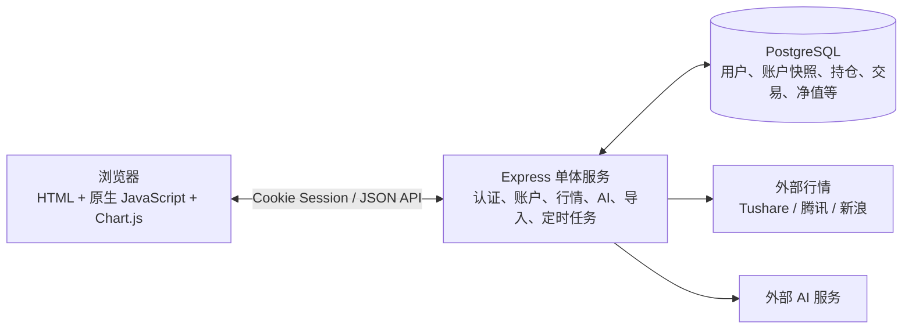

# 持仓管理系统综合整改报告

> ⚠️ **Docker 已废弃**：本项目生产环境使用腾讯云裸机 + pm2 + Nginx，**当前不支持 Docker 部署**。Dockerfile / docker-compose.yml / .dockerignore 已删除，文中涉及 Docker 的内容仅供历史参考。

> 审查日期：2026-07-11  
> 审查方式：静态代码与配置审查；未修改业务代码、配置或数据。  
> 范围：`server.js`、`server/db.js`、`public/`、导入脚本、Docker/PM2/Nginx 部署配置、现有测试与文档。

---

## 1. 执行结论

系统已经具备多用户、账户隔离、持仓/交易/现金流管理、行情查询、净值与收益统计、Excel 导入导出、AI 识别和部署脚本等完整能力。当前技术方案可以支撑**小规模、低频、单实例**的使用场景，但不适合直接按“多人生产系统”继续扩大：安全边界、数据写入原子性、可测试性和模块边界仍不够成熟。

建议按以下顺序整改：

1. **上线前必须完成**：修复 XSS、CSRF、AI 接口 SSRF、账户全量保存的非事务写入。
2. **短期完成**：服务端数据校验、账户归属约束、Redis 会话/限流、上传治理、生产数据库与备份治理。
3. **中期完成**：拆分单体模块、收敛数据真相源、将定时任务独立、建设测试与监控。

现有 `核查报告.md` 中提到的“删除持仓连带删除交易”“收益图按钮失效”等问题，已在当前代码和 `CHANGELOG.md` 中确认修复，**不再作为当前待整改项**。旧报告中有关“SQLite 仍为现行数据库”的描述也已过期；当前实现使用 PostgreSQL。

---

## 2. 现状架构与技术选型评估



| 维度 | 当前选择 | 评价 | 整改建议 |
|---|---|---|---|
| 架构 | Node.js + Express 单体 | 对当前业务规模简单直接，部署成本低；但一个服务文件同时承载多种职责，维护风险高。 | 保留单体部署形态，先进行模块化拆分，而非立即上微服务。 |
| 前端 | 原生 HTML/CSS/JavaScript，全局函数和全局状态 | 无构建门槛，页面性能足够；但 `core.js` 约 3000 行，状态、渲染、接口和业务计算混杂。 | 先以 ES Module 分域拆分；复杂度继续增长时再评估 Vue/React。 |
| 后端语言 | JavaScript / Node.js | 与前端统一语言，适合 I/O 密集型 API 和第三方服务代理。 | 保持 Node.js；引入 TypeScript 或至少 JSDoc + 运行时 schema 校验，降低动态类型造成的入库错误。 |
| 数据库 | PostgreSQL + `pg` | **选择正确**。相较 SQLite，更适合多用户、并发、备份、权限与后续分析查询。 | 保留 PostgreSQL；重点修正当前应用层“先删后插”策略，不需要更换数据库。 |
| 数据模型 | 结构化表 + `account_data.data` JSON 快照 | 迁移期可兼容历史数据，但形成双真相源，字段容易漂移。 | 明确每个领域字段唯一存储位置，迁移验收后移除 JSON 回退与重复写入。 |
| 会话 | `express-session` 默认内存 Store | 单进程能用；重启丢失、无法多实例，官方也不建议生产使用。 | 迁至 Redis 或 PostgreSQL session store。 |
| 部署 | Docker/Compose、Nginx、PM2 | 有基础交付材料和进程守护。 | 生产与本地 Compose 分离；使用密钥管理、健康检查、备份监控与发布回滚。 |

### 对“是否需要换框架/换语言/换数据库”的结论

- **不建议为了整改而迁移到微服务、Java、Go 或其他数据库。** 当前最主要问题在边界和实现方式，不在 Express、JavaScript 或 PostgreSQL 本身。
- **前端不必立刻重写为 Vue/React。** 首先拆分 `core.js`、移除内联事件、建立状态和 API 边界；若团队协作、页面数量和复用需求继续增加，再进行渐进式迁移。
- **PostgreSQL 应继续作为主数据库。** 它已足以覆盖未来几十名用户和更复杂的报表需求；应增加迁移工具、事务、索引和备份恢复流程。

---

## 3. 关键业务链路与主要结构问题

### 3.1 账户保存链路：全量快照覆盖

前端每次保存把整个账户对象 PUT 到 `/api/data/:name`；服务端对该账户的持仓、交易、净值和现金流逐表 `DELETE`，再逐条 `INSERT`。

- 优点：前端实现简单，单个浏览器内有保存串行化与重试。
- 问题：不是事务；单次插入失败会留下半成品数据；多个页面或设备编辑仍会“后写覆盖先写”；一次误传空数组就会清空对应数据。
- 整改：第一阶段将整套删除/插入/快照更新包进一个数据库事务；第二阶段改为资源级 API（持仓、交易、现金流、净值分别增删改），加 `version` 乐观锁与冲突提示。

### 3.2 数据模型：迁移期双轨尚未收尾

`positions`、`trades`、`nav_history`、`cash_flows` 已结构化，但 `account_data.data` 又保留同类 JSON 内容，并在读路径作兜底。短期可兼容历史数据，长期会造成：

- 同一数据存在两份，排障时难判断哪份可信；
- JSON 结构没有约束，字段改名或缺失难以及时发现；
- 数据分析、索引、审计与局部更新都受到限制。

整改目标是：账户元数据独立表；持仓、交易、现金流、净值、指数历史全部以结构化表为唯一真相源；迁移脚本一次性验证并可回滚；JSON 仅作为经过脱敏的导出格式。

### 3.3 运行模型：Web 进程兼任任务调度器

每日收盘价记录和启动时指数回填在 Web 进程内用 `setTimeout` 运行。进程重启、部署重叠、多实例或执行时间过长都可能造成漏跑、重复跑或无法追踪。后续应把任务移动到独立 worker/cron，使用数据库任务表或队列保证幂等、重试和执行记录。

---

## 4. 问题清单与整改建议

### P0：上线前必须处理

| 问题 | 现状与影响 | 整改要求 |
|---|---|---|
| 持久型 XSS | 持仓名称、代码、备注、类型等来自用户或 AI/导入的数据，被直接拼入 `innerHTML`。恶意内容可在任意登录用户查看页面时执行脚本，并借同源 Cookie 调用接口。 | 动态数据统一使用 `textContent`/DOM API；若必须拼模板，对全部动态字段按上下文编码；移除内联 `onclick`。补充 XSS 回归测试。 |
| CSRF 校验不严格 | 写请求没有 `Origin/Referer` 时可放行；白名单采用字符串 `includes`，可能错误接受伪造域名。 | 严格解析 Origin，精确比对 scheme + host + port；缺失来源的浏览器写请求拒绝；增加 CSRF token；保持 Cookie `SameSite` 与 HTTPS。 |
| AI 调用可被任意指定 URL | 已登录用户可传入任意 `apiUrl`，服务端将向该 URL 发起请求，构成 SSRF 风险；客户端传入 API Key 也使密钥边界模糊。 | 取消客户端自定义 endpoint，或实施 HTTPS + 域名/IP 白名单及私网地址拒绝；密钥只从服务端密钥管理读取；记录调用审计并设置配额。 |
| 保存非事务 | 删除旧数据后再逐条插入，任何异常、断连或约束失败都可能造成账户数据部分丢失。 | 用单连接事务实现全成功或全回滚；增加请求幂等键、版本号与冲突处理。 |

### P1：短期整改

| 问题 | 现状与影响 | 整改要求 |
|---|---|---|
| 缺少服务端 schema 校验 | 账户列表、持仓/交易/现金流/指数点等请求体大多直接进入持久层。 | 使用 Zod/Joi/Ajv 等校验：字符长度、数组数量、日期、金额、枚举、证券代码、ID 唯一性与嵌套对象结构。 |
| 账户归属未建模 | 任意账户名可在当前用户名下读写，未确认它属于用户账户列表，可能形成孤儿数据。 | 建立 `accounts` 表，使用 `(account_id, user_id)` 关系与外键；每个账户 API 都做归属校验。 |
| Session/限流为内存状态 | 重启后 Session 与登录失败计数失效；不支持多实例；Map 也缺少完整的容量治理。 | Redis/数据库 session store；Redis 限流（用户名、IP、邮箱维度）；统一过期和审计。 |
| 上传通道治理不足 | 二维码 token 是纯 bearer token；Base64 图片放在内存，不检查图片真实格式、尺寸、像素或单次使用。 | token 绑定创建用户、一次性消费；限制 MIME/文件大小/像素；对象存储或受控临时文件；病毒/内容检测视部署环境启用。 |
| 生产 Compose 不安全 | Compose 使用固定 `postgres/postgres` 且映射主机 5432 端口。 | 生产环境移除数据库端口映射，使用随机密码/Secret，最小权限数据库账户，开启备份和恢复演练。 |
| 缺少基础安全响应头 | 未见 CSP、HSTS、`X-Content-Type-Options` 等集中安全策略。 | 使用 `helmet` 并制定 CSP；仅 HTTPS 部署；Nginx 与应用层共同限制请求大小和超时。 |

### P2：中期整改

| 问题 | 现状与影响 | 整改要求 |
|---|---|---|
| 单文件与全局变量耦合 | `server.js` 集中路由、行情、AI、导入和任务；`core.js` 集中 UI、状态、图表与业务规则。 | 后端按 `routes / services / repositories / jobs / middleware` 拆分；前端按 `api / store / domain / views / components` 拆分。 |
| 外部行情可靠性不足 | 多来源逻辑和大量空 `catch` 会把异常表现为“无数据”；缓存和限流策略仅在进程内。 | 抽象 provider 接口，设置超时、重试、熔断、指标和明确错误码；Redis 缓存；明确行情延迟与数据来源标识。 |
| 定时任务不具备可观测性 | 收盘记录逐用户、逐账户、逐持仓串行获取；任务失败大量静默。 | 独立 worker、任务表、执行日志、重试/告警、并发上限和批量行情查询。 |
| 数据库索引与约束不足 | 目前主要依赖复合主键；数据量增长后日期、账户、证券维度查询会变慢。 | 基于真实查询添加索引，如 `trades(username, account_name, date)`、`nav_history(username, account_name, date)`；增加外键、检查约束。 |
| 错误处理和日志不足 | 多处空 catch，缺统一错误中间件和请求关联 ID。 | 统一错误模型、结构化日志、请求 ID、健康检查 `/health`、数据库/外部服务指标和告警。 |
| 测试不可作为 CI 基线 | 现有测试依赖本机服务、固定账户、外部行情，并会写入真实数据。 | 使用临时 PostgreSQL/容器、fixture、mock 行情与 AI；覆盖鉴权、事务回滚、校验、XSS/CSRF、并发覆盖和迁移。 |

### P3：工程质量与文档治理

- 根目录与子项目都有 Node 依赖痕迹，建议确定唯一项目根、唯一锁文件与统一启动入口。
- 当前工作目录未检测到 Git 仓库；应建立版本控制、分支保护、代码审查与 CI。
- Chart.js 通过 CDN 直接加载，建议使用锁定版本的本地资源或加入 SRI 与本地降级策略。
- 文档存在迁移历史残留：例如部分文档仍描述 SQLite 迁移过程，而现行系统已是 PostgreSQL。应将“历史交接文档”和“当前运行手册”分开，并校验文档引用的文件真实存在。
- Python 导入脚本与 JavaScript 后端重复维护证券分类规则。应将分类规则沉淀为共享、带版本的规则定义和测试样例。

---

## 5. 推荐目标架构（渐进式，不推倒重来）

```text
portfolio-server/
  src/
    app.ts|js                 # 组装中间件与路由
    routes/                   # auth、accounts、portfolio、market、import
    services/                 # 行情、AI、净值、导入、权限
    repositories/             # PostgreSQL 访问与事务
    jobs/                     # 收盘价格、指数回填
    schemas/                  # 请求/领域数据校验
    middleware/               # 鉴权、CSRF、错误、日志、限流
  web/
    api/ store/ domain/ views/ components/
  migrations/                 # 可版本化数据库迁移
  tests/                      # unit、integration、e2e
```

这仍然是单体应用：一个 API 服务、一个数据库、必要时一个 worker。它能明显降低耦合并满足未来规模，避免过早引入微服务的运维成本。

---

## 6. 分阶段实施计划与验收标准

### 第一阶段：安全与数据底线（建议 1–2 周）

1. 修复所有动态 HTML 的未转义插值，完成 XSS 回归用例。
2. 改造 CSRF 与 Origin 策略，关闭“无来源放行”。
3. 固化 AI 服务端白名单与服务端密钥；拒绝私网/回环网段。
4. 将账户保存改为事务；新增版本字段并返回冲突错误。

验收：恶意 HTML 无法执行；跨站写请求 403；任意私网 AI URL 被拒绝；模拟插入失败后账户数据保持原样。

### 第二阶段：模型、会话和部署（建议 2–4 周）

1. 增加账户表、外键和全部请求 schema。
2. 接入 Redis session/限流；补登录、邮件验证码和 AI 调用审计。
3. 完成生产 Docker/数据库 Secret、最小权限、每日备份与恢复演练。
4. 上传链路改为安全临时对象存储或受控临时文件。

验收：越权账户名不可读写；重启后会话策略符合预期；可以从备份恢复到隔离环境；上传超限/伪造格式会被拒绝。

### 第三阶段：可维护性与稳定性（建议 1–2 个月）

1. 按目标架构拆分后端和前端模块，保持现有 API 兼容。
2. 收敛 JSON 双轨，补齐迁移、回滚与数据核对工具。
3. 拆出任务 worker，引入日志、监控、健康检查和告警。
4. 建立可重复的 PostgreSQL 集成测试和 CI。

验收：核心模块有明确边界；定时任务有可查询执行记录；CI 在隔离环境自动通过；任意发布均可回滚。

---

## 7. 本次审查限制

- 已完成静态代码、配置和语法检查。
- 未启动服务或运行现有集成测试：该测试依赖真实 PostgreSQL、固定账户和外部行情，并可能注册或写入数据；为遵守“只分析、不改动代码和数据”的范围，本次未执行。
- 未进行联网漏洞库扫描或生产环境渗透测试；正式上线前仍应在隔离环境补做依赖漏洞扫描、权限测试和备份恢复演练。

